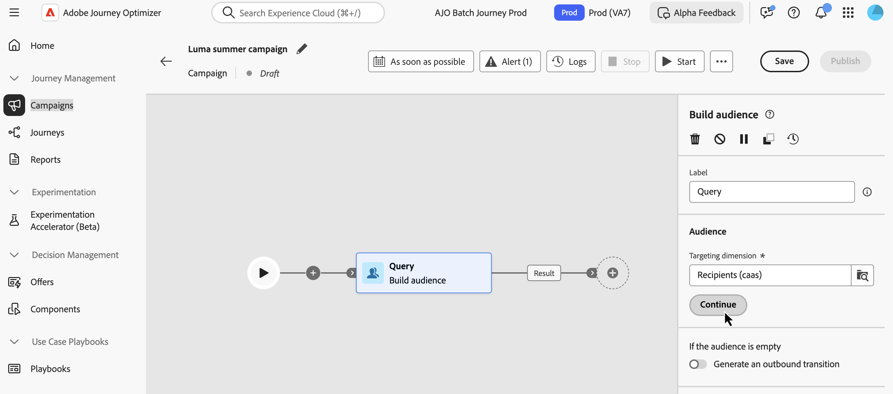
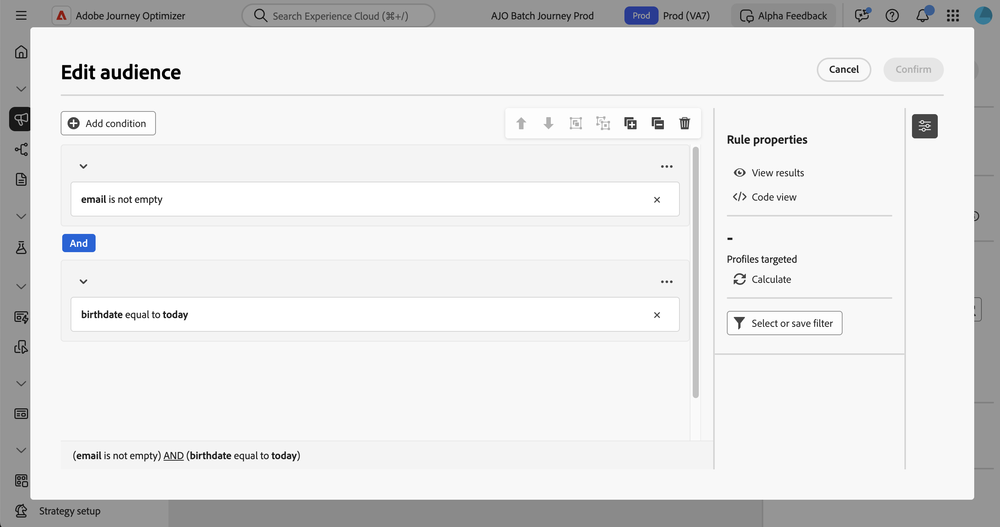

# Work with the rule builder {#orchestrated-rule-builder}

Orchestrated campaigns comes with a rule builder that simplifies the process of filtering the database based on various criteria. The rule builder manages very complex and long queries efficiently, offering enhanced flexibility and precision.

It also supports predefined filters within conditions, empowering users to refine queries with ease while utilizing advanced expressions and operators for comprehensive audience targeting and segmentation strategies.

## Access the rule builder

The rule builder is available when building a query in a **[!UICONTROL Build audience]** activity to target an audience. It allows you to specify the population you want to target, and effortlessly create new audiences tailored to your needs.

## Rule builder interface {#interface}

The rule builder provides a central canvas where you build your query and a properties pane that provides information on the rule.

*  The **central canvas** is where you add and combine the different components to build your rule. [Learn how to build a rule](../orchestrated/build-query.md)

* The **[!UICONTROL Rule properties]** pane provides information on your rule. It allows you to perform various operations to check the rule and ensure it suits your needs.

    This pane displays when building a query to create an audience. [Learn how to check and validate your query](build-query.md#check-and-validate-your-query)
