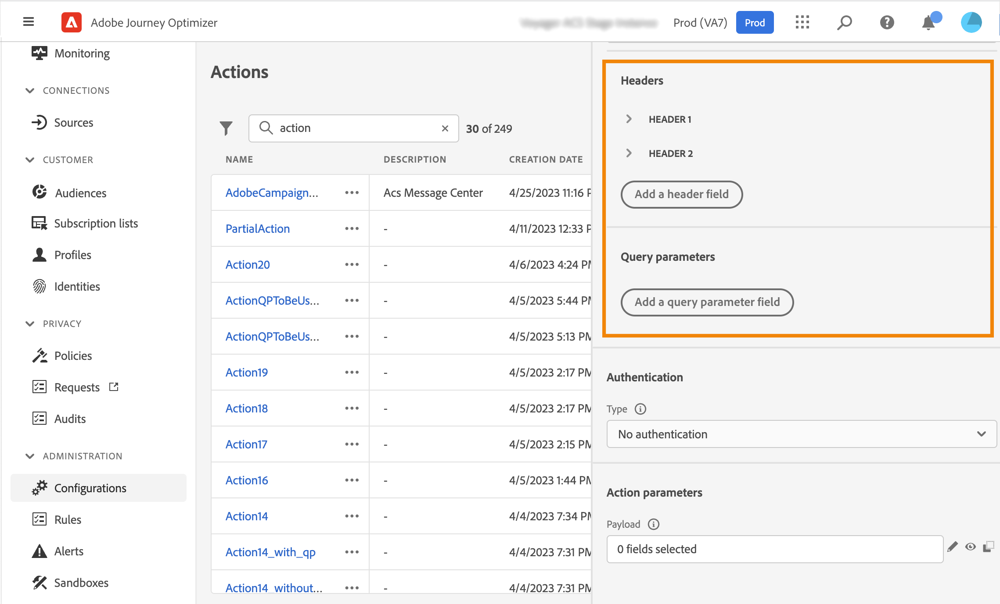
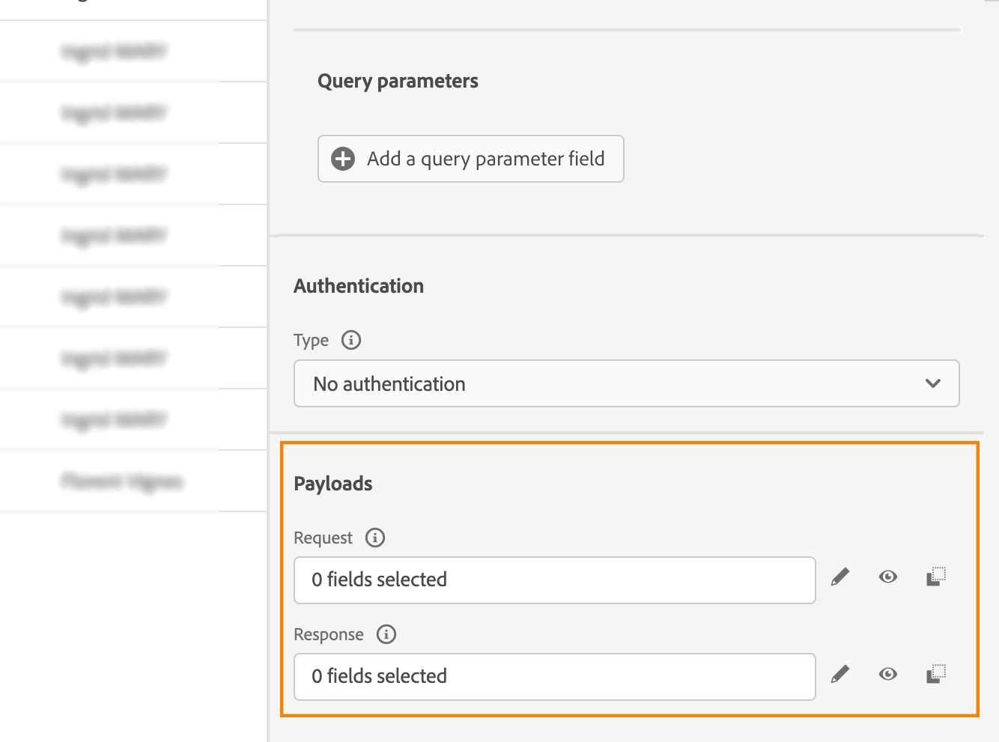

# Configure a custom action {#configure-an-action}

>[!CONTEXTUALHELP]
>id="ajo_journey_action_custom_configuration"
>title="Custom actions"
>abstract="If you are using a third-party system to send messages or if you want journeys to send API calls to a third-party system, use custom actions to configure its connection to your journey. For example you can connect to the following systems with custom actions: Epsilon, Slack, [Adobe Developer](https://developer.adobe.com), Firebase, etc." 

If you are using a third-party system to send messages or if you want journeys to send API calls to a third-party system, use custom actions to configure its connection to your journey. For example you can connect to the following systems with custom actions: Epsilon, Slack, [Adobe Developer](https://developer.adobe.com){target="_blank"}, Firebase, etc.

Custom actions are additional actions defined by technical users and made available to marketers. Once configured, they appear in the left palette of your journey, in the **[!UICONTROL Action]** category. Learn more in [this page](../building-journeys/about-journey-activities.md#action-activities). 

## Limitations{#custom-actions-limitations}

Custom actions come with a few limitations listed in [this page](../start/guardrails.md).

In custom action parameters, you can pass a simple collection, as well as a collection of objects. Learn more about collection limitations in [this page](../building-journeys/collections.md#limitations). 

Also note that the custom actions parameters have an expected format (example: string, decimal, etc.). You must be careful to respect these expected formats. Learn more in this [use case](../building-journeys/collections.md).

Custom actions support JSON format only when using [request](../action/about-custom-action-configuration.md#define-the-message-parameters) or [response payloads](../action/action-response.md). 

## Best practices{#custom-action-enhancements-best-practices}

When choosing an endpoint to target using a custom action, be sure that:

* This endpoint can support journey's throughput, using configurations from the [Throttling API](../configuration/throttling.md) or [Capping API](../configuration/capping.md) to limit it. Be cautious that a throttling configuration cannot go below 200 TPS. Any endpoint targeted will need to support at least 200 TPS.
* This endpoint needs to have a response time as low as possible. Depending of your expected throughput, having a high response time could impact the actual throughput.

A capping limit of 300,000 calls over one minute is defined for all custom actions. In addition, the default capping is performed per host and per sandbox. For example, on a sandbox, if you have two endpoints with the same host (eg: `https://www.adobe.com/endpoint1` and `https://www.adobe.com/endpoint2`), the capping will apply for all endpoints under the adobe.com host. "endpoint1" and "endpoint2" will share the same capping configuration and having one endpoint reach the limit will have an impact on the other endpoint.

This limit has been set based on customers usage, to protect external endpoints targeted by custom actions. You need to take this into account in your audience-based journeys by defining an appropriate reading rate (5000 profiles/s when custom actions are used). If needed, you can override this setting by defining a greater capping or throttling limit through our Capping/Throttling APIs. See [this page](../configuration/external-systems.md).

You should not target public endpoints with custom actions for various reasons:

* Without proper capping or throttling, there is a risk of sending too many calls to a public endpoint that may not support such volume.
* Profile data can be sent through custom actions, so targeting a public endpoint could lead to inadvertently sharing personal information externally.
* You have no control on the data being returned by public endpoints. If an endpoint changes its API or starts sending incorrect information, those will be made available in communications sent, with potential negative impacts.

## Consent and data governance {#privacy}

In Journey Optimizer, you can apply data governance and consent policies to your custom actions to prevent specific fields from being exported to third-party systems or exclude customers who have not consented to receive email, push or SMS communication. For more information, refer to the following pages:

* [Data governance](../action/action-privacy.md).
* [Consent](../action/action-privacy.md).


## Configuration steps {#configuration-steps}

Here are the main steps required to configure a custom action:

1. In the ADMINISTRATION menu section, select **[!UICONTROL Configurations]**. In the  **[!UICONTROL Actions]** section, click **[!UICONTROL Manage]**. Click **[!UICONTROL Create Action]** to create a new action. The action configuration pane opens on the right side of the screen.

    

1. Enter a name for your action.

    >[!NOTE]
    >
    >Only alphanumeric characters and underscores are allowed. The maximum length is 30 characters.

1. Add a description to your action. This step is optional.
1. The number of journeys that use this action is displayed in the **[!UICONTROL Used in]** field. You can click the **[!UICONTROL View journeys]** button to display the list of  journeys using this action.
1. Define the different **[!UICONTROL URL Configuration]** parameters. See [this page](../action/about-custom-action-configuration.md#url-configuration).
1. Configure the **[!UICONTROL Authentication]** section. This configuration is the same as for data sources.  See [this section](../datasource/external-data-sources.md#custom-authentication-mode).
1. Define the **[!UICONTROL Action parameters]**. See [this page](../action/about-custom-action-configuration.md#define-the-message-parameters).
1. Click **[!UICONTROL Save]**.

    The custom action is now configured and ready to be used in your journeys. See [this page](../building-journeys/about-journey-activities.md#action-activities).

    >[!NOTE]
    >
    >When a custom action is used in a journey, most parameters are read-only. You can only modify the **[!UICONTROL Name]**, **[!UICONTROL Description]**, **[!UICONTROL URL]** fields and the **[!UICONTROL Authentication]** section.

## Endpoint configuration {#url-configuration}

When configuring a custom action, you need to define the following **[!UICONTROL Endpoint Configuration]** parameters:

{width="70%" align="left"}

1. In the **[!UICONTROL URL]** field, specify the URL of the external service:

    * If the URL is static, enter the URL in this field.

    * If the URL includes a dynamic path, enter only the static part of the URL, that is, the scheme, the host, the port, and, optionally, a static part of the path.

        Example: `https://xxx.yyy.com/somethingstatic/`

        You will specify the dynamic path of the URL when adding the custom action to a journey. [Learn more](../building-journeys/using-custom-actions.md).

    >[!NOTE]
    >
    >For security reasons, we strongly recommend that you use the HTTPS scheme for the URL. We don't allow the use of Adobe addresses that are not public and the use of IP addresses.
    >
    >Only the default ports are allowed when defining a custom action: 80 for http and 443 for https.

1. Select the call **[!UICONTROL Method]**: it can be either **[!UICONTROL POST]**, **[!UICONTROL GET]** or **[!UICONTROL PUT]**.

    >[!NOTE]
    >
    > The **DELETE** method is not supported. If you need to update an existing resource, select the **PUT** method.

1. Define the headers and query parameters:

   * In the **[!UICONTROL Headers]** section, click **[!UICONTROL Add a header field]** to define the HTTP headers of the request message to be sent to the external service. The **[!UICONTROL Content-Type]** and **[!UICONTROL Charset]** header fields are set by default. You cannot delete these fields. Only the **[!UICONTROL Content-Type]** header can by modified. Its value should respect the JSON format. Here is the default value:

    

   * In the **[!UICONTROL Query parameters]** section, click **[!UICONTROL Add a Query parameter field]** to define the parameters you want to add in the URL.

    

1. Enter the label or name of the field.

1. Select the type: **[!UICONTROL Constant]** or **[!UICONTROL Variable]**. If you have selected **[!UICONTROL Constant]**, then enter the constant value in the **[!UICONTROL Value]** field. If you have selected **[!UICONTROL Variable]**, then you will specify this variable when adding the custom action to a journey. [Learn more](../building-journeys/using-custom-actions.md).

    

    >[!NOTE]
    >
    >After you have added the custom action to a journey, you can still add header or query parameters fields to it if the journey is in draft status. If you do not want the journey to be affected by configuration changes, duplicate the custom action and add the fields to the new custom action.
    >
    >Headers are validated according to field parsing rules. Learn more in [this documentation](https://tools.ietf.org/html/rfc7230#section-3.2.4){_blank}.

## Define the payload parameters {#define-the-message-parameters}

1. In the **[!UICONTROL Request]** section, paste an example of the JSON payload to send to the external service. This field is optional and only available for POST and PUT calling methods.

1. In the **[!UICONTROL Response]** section, paste an example of the payload returned by the call. This field is optional and available for all calling methods. For detailed information on how to leverage API call responses in custom actions, refer to [this page](../action/action-response.md).

>[!NOTE]
>
>The response capability is currently available in beta.

{width="70%" align="left"}

>[!NOTE]
>
>The payload example cannot contain null values. Field names in the payload cannot contain a "." character. They cannot start with a "$" character.

You will be able to define the parameter type (e.g.: string, integer, etc.).

You will also have a choice between specifying if a parameter is a constant or a variable:

* **Constant** means that the value of the parameter is defined in the action configuration pane by a technical persona. The value will be always the same across journeys. It will not vary and the marketer won't see it when using the custom action in the journey. It could be for example an ID the third-party system expects. In that case, the field on the right of the toggle constant/variable is the value passed.
* **Variable** means the value of the parameter will vary. Marketers using this custom action in a journey will be free to pass the value they wants or to specify where to retrieve the value for this parameter (e.g. from the event, from Adobe Experience Platform, etc.). In that case, the field on the right of the toggle constant/variable is the label marketers will see in the journey to name this parameter.


## mTLS protocol support {#mtls-protocol-support}

You can now use Mutual Transport Layer Security (mTLS) to ensure enhanced security in outbound connections to HTTP API destinations and Adobe Journey Optimizer custom actions. mTLS is an end-to-end security method for mutual authentication that ensures that both parties sharing information are who they claim to be before data is shared. mTLS includes an additional step compared to TLS, in which the server also asks for the client's certificate and verifies it at their end.

In Adobe Journey Optimizer, mTLS is used in conjunction with custom actions. No additional configuration for Adobe Journey Optimizer custom actions is required on your part to enable mTLS. When the endpoint for a custom action is mTLS-enabled, the system fetches the certificate from the Adobe Experience Platform keystore and automatically provides it to the endpoint (as is required for mTLS connections).

If you want to use mTLS with these Adobe Journey Optimizer and Experience Platform HTTP API destination workflows, the server address you put into the Adobe Journey Optimizer customer action UI or the Destinations UI must have TLS protocols disabled and only mTLS enabled. If the TLS 1.2 protocol is still enabled on that endpoint, no certificate is sent for the client authentication. This means that to use mTLS with these workflows, your "receiving" server endpoint must be an mTLS **only** enabled connection endpoint.

>[!IMPORTANT]
>
>No additional configuration is required in your Adobe Journey Optimizer custom action or journey to activate mTLS; this process occurs automatically when an mTLS-enabled endpoint is detected. The Common Name (CN) and Subject Alternative Names (SAN) for each certificate are available in the documentation as part of the certificate and can be used as an additional layer of ownership validation if you wish to do so.
>
>RFC 2818, published in May 2000, deprecates the use of the Common Name (CN) field in HTTPS certificates for subject name verification. Instead, it recommends using the "Subject Alternative Name" extension (SAN) of the "dns name" type.

If you want to check the CN or SAN to do additional third-party validation, can can download the relevant certificates here:

```
Prod:
{
    "serviceName": "AJO Journeys",
    "publicCertificate": "-----BEGIN CERTIFICATE-----
MIIG9TCCBd2gAwIBAgIQBX+pDP5hB0gqDzFKyq5wLjANBgkqhkiG9w0BAQsFADBZ
MQswCQYDVQQGEwJVUzEVMBMGA1UEChMMRGlnaUNlcnQgSW5jMTMwMQYDVQQDEypE
aWdpQ2VydCBHbG9iYWwgRzIgVExTIFJTQSBTSEEyNTYgMjAyMCBDQTEwHhcNMjQw
NTA5MDAwMDAwWhcNMjUwNjA5MjM1OTU5WjB0MQswCQYDVQQGEwJVUzETMBEGA1UE
CBMKQ2FsaWZvcm5pYTERMA8GA1UEBxMIU2FuIEpvc2UxEzARBgNVBAoTCkFkb2Jl
IEluYy4xKDAmBgNVBAMTH2Fqby1qb3VybmV5cy5hZXAtbXRscy5hZG9iZS5jb20w
ggEiMA0GCSqGSIb3DQEBAQUAA4IBDwAwggEKAoIBAQDaI8HZHzbmPEgTy9O7cYmq
ZVX5283Gw7j7v4/O810jZXItBDmsSiWotvTgAT0s2oZMZZ6tGPbQB7hL+xJJ+yu2
HxFl1WzB4UGHJ+UbrL94hI930xQs0FVgSOGgIarj5HucF2ZxwHIkVHY5whrOq9t4
UxFBG0siUPQrTzV9GfA0wREElugpTbwaM8CTWwOQ9ekroOD2C5zAcLTycXFtSMiU
B4L4u38S9hGoBByzzKv9GnUMQudvt/s5zsGykZgEEYeN6IitfVO6BOD9jT94Aytx
/O3XH5w8v4KNTn+An99bXFmyg3JRUFSYZFxha8s1f6uu0XbdToQ+ao0WkE06nMmV
AgMBAAGjggOcMIIDmDAfBgNVHSMEGDAWgBR0hYDAZsffN97PvSk3qgMdvu3NFzAd
BgNVHQ4EFgQUn8OqtzccNdrsb+fbRnTHmtTZxLMwKgYDVR0RBCMwIYIfYWpvLWpv
dXJuZXlzLmFlcC1tdGxzLmFkb2JlLmNvbTA+BgNVHSAENzA1MDMGBmeBDAECAjAp
MCcGCCsGAQUFBwIBFhtodHRwOi8vd3d3LmRpZ2ljZXJ0LmNvbS9DUFMwDgYDVR0P
AQH/BAQDAgWgMB0GA1UdJQQWMBQGCCsGAQUFBwMBBggrBgEFBQcDAjCBnwYDVR0f
BIGXMIGUMEigRqBEhkJodHRwOi8vY3JsMy5kaWdpY2VydC5jb20vRGlnaUNlcnRH
bG9iYWxHMlRMU1JTQVNIQTI1NjIwMjBDQTEtMS5jcmwwSKBGoESGQmh0dHA6Ly9j
cmw0LmRpZ2ljZXJ0LmNvbS9EaWdpQ2VydEdsb2JhbEcyVExTUlNBU0hBMjU2MjAy
MENBMS0xLmNybDCBhwYIKwYBBQUHAQEEezB5MCQGCCsGAQUFBzABhhhodHRwOi8v
b2NzcC5kaWdpY2VydC5jb20wUQYIKwYBBQUHMAKGRWh0dHA6Ly9jYWNlcnRzLmRp
Z2ljZXJ0LmNvbS9EaWdpQ2VydEdsb2JhbEcyVExTUlNBU0hBMjU2MjAyMENBMS0x
LmNydDAMBgNVHRMBAf8EAjAAMIIBfwYKKwYBBAHWeQIEAgSCAW8EggFrAWkAdwBO
daMnXJoQwzhbbNTfP1LrHfDgjhuNacCx+mSxYpo53wAAAY9ecsWsAAAEAwBIMEYC
IQDQclgq89ZVlwdYBJFEIs8q4WIcZ9Siw+jb9OgCrz+wjwIhALQLnC1WyT+dHjvY
FvZjc99WkjnEwhIevj/Rz7r0EzhmAHUAfVkeEuF4KnscYWd8Xv340IdcFKBOlZ65
Ay/ZDowuebgAAAGPXnLF5AAABAMARjBEAiBy9cNT3CnmSMOdJe+JbG8f7ha1UGgN
TdDlaR9x9fKmKQIgNmGjz5AzP1evB2G1TTvVLkHfWQw0864c4F23WSV+6TsAdwDP
EVbu1S58r/OHW9lpLpvpGnFnSrAX7KwB0lt3zsw7CAAAAY9ecsYnAAAEAwBIMEYC
IQCTcB7s1xDP8Olif3jj4X8jHgVxv5C3bTvG6wDYBByfcQIhAOt8PhR6tWSLtF1V
HB8r7dns7Oth1+QT7WMonQZsP/3WMA0GCSqGSIb3DQEBCwUAA4IBAQAjTy45fbQV
aVTZ71wcIyHnkJfq/8SSc/UNT5//6AMiV6kb3YsFW1+EaQ1wPHZS0Qfjs7aIsXi5
f2TCGps8onELNpOfFfptrOCMfcYGMvV1wPCBy+kuoGY/YRZlsdNUTTzQAGztfRev
79w+XIDzioCrY+sfyUkkw+N/F7/RIjzMKjP6onSfuD+5WjqVKq9kFE0fCyJixedV
BPoPM4Cktgvc9SsK17JmLWkg+V2yH1eDzmjF3sR0/dcmoAM0qgV/CDuhIIqX2o7m
3/aQSNsPUpgBVbkz+SjEtchmw8DXW/Kro8QVulsXdbkiLTOj4JopxdOzrbKgWMwr
pIw7KKJoktDk
-----END CERTIFICATE-----
-----BEGIN CERTIFICATE-----
MIIEyDCCA7CgAwIBAgIQDPW9BitWAvR6uFAsI8zwZjANBgkqhkiG9w0BAQsFADBh
MQswCQYDVQQGEwJVUzEVMBMGA1UEChMMRGlnaUNlcnQgSW5jMRkwFwYDVQQLExB3
d3cuZGlnaWNlcnQuY29tMSAwHgYDVQQDExdEaWdpQ2VydCBHbG9iYWwgUm9vdCBH
MjAeFw0yMTAzMzAwMDAwMDBaFw0zMTAzMjkyMzU5NTlaMFkxCzAJBgNVBAYTAlVT
MRUwEwYDVQQKEwxEaWdpQ2VydCBJbmMxMzAxBgNVBAMTKkRpZ2lDZXJ0IEdsb2Jh
bCBHMiBUTFMgUlNBIFNIQTI1NiAyMDIwIENBMTCCASIwDQYJKoZIhvcNAQEBBQAD
ggEPADCCAQoCggEBAMz3EGJPprtjb+2QUlbFbSd7ehJWivH0+dbn4Y+9lavyYEEV
cNsSAPonCrVXOFt9slGTcZUOakGUWzUb+nv6u8W+JDD+Vu/E832X4xT1FE3LpxDy
FuqrIvAxIhFhaZAmunjZlx/jfWardUSVc8is/+9dCopZQ+GssjoP80j812s3wWPc
3kbW20X+fSP9kOhRBx5Ro1/tSUZUfyyIxfQTnJcVPAPooTncaQwywa8WV0yUR0J8
osicfebUTVSvQpmowQTCd5zWSOTOEeAqgJnwQ3DPP3Zr0UxJqyRewg2C/Uaoq2yT
zGJSQnWS+Jr6Xl6ysGHlHx+5fwmY6D36g39HaaECAwEAAaOCAYIwggF+MBIGA1Ud
EwEB/wQIMAYBAf8CAQAwHQYDVR0OBBYEFHSFgMBmx9833s+9KTeqAx2+7c0XMB8G
A1UdIwQYMBaAFE4iVCAYlebjbuYP+vq5Eu0GF485MA4GA1UdDwEB/wQEAwIBhjAd
BgNVHSUEFjAUBggrBgEFBQcDAQYIKwYBBQUHAwIwdgYIKwYBBQUHAQEEajBoMCQG
CCsGAQUFBzABhhhodHRwOi8vb2NzcC5kaWdpY2VydC5jb20wQAYIKwYBBQUHMAKG
NGh0dHA6Ly9jYWNlcnRzLmRpZ2ljZXJ0LmNvbS9EaWdpQ2VydEdsb2JhbFJvb3RH
Mi5jcnQwQgYDVR0fBDswOTA3oDWgM4YxaHR0cDovL2NybDMuZGlnaWNlcnQuY29t
L0RpZ2lDZXJ0R2xvYmFsUm9vdEcyLmNybDA9BgNVHSAENjA0MAsGCWCGSAGG/WwC
ATAHBgVngQwBATAIBgZngQwBAgEwCAYGZ4EMAQICMAgGBmeBDAECAzANBgkqhkiG
9w0BAQsFAAOCAQEAkPFwyyiXaZd8dP3A+iZ7U6utzWX9upwGnIrXWkOH7U1MVl+t
wcW1BSAuWdH/SvWgKtiwla3JLko716f2b4gp/DA/JIS7w7d7kwcsr4drdjPtAFVS
slme5LnQ89/nD/7d+MS5EHKBCQRfz5eeLjJ1js+aWNJXMX43AYGyZm0pGrFmCW3R
bpD0ufovARTFXFZkAdl9h6g4U5+LXUZtXMYnhIHUfoyMo5tS58aI7Dd8KvvwVVo4
chDYABPPTHPbqjc1qCmBaZx2vN4Ye5DUys/vZwP9BFohFrH/6j/f3IL16/RZkiMN
JCqVJUzKoZHm1Lesh3Sz8W2jmdv51b2EQJ8HmA==
-----END CERTIFICATE-----
-----BEGIN CERTIFICATE-----
MIIDjjCCAnagAwIBAgIQAzrx5qcRqaC7KGSxHQn65TANBgkqhkiG9w0BAQsFADBh
MQswCQYDVQQGEwJVUzEVMBMGA1UEChMMRGlnaUNlcnQgSW5jMRkwFwYDVQQLExB3
d3cuZGlnaWNlcnQuY29tMSAwHgYDVQQDExdEaWdpQ2VydCBHbG9iYWwgUm9vdCBH
MjAeFw0xMzA4MDExMjAwMDBaFw0zODAxMTUxMjAwMDBaMGExCzAJBgNVBAYTAlVT
MRUwEwYDVQQKEwxEaWdpQ2VydCBJbmMxGTAXBgNVBAsTEHd3dy5kaWdpY2VydC5j
b20xIDAeBgNVBAMTF0RpZ2lDZXJ0IEdsb2JhbCBSb290IEcyMIIBIjANBgkqhkiG
9w0BAQEFAAOCAQ8AMIIBCgKCAQEAuzfNNNx7a8myaJCtSnX/RrohCgiN9RlUyfuI
2/Ou8jqJkTx65qsGGmvPrC3oXgkkRLpimn7Wo6h+4FR1IAWsULecYxpsMNzaHxmx
1x7e/dfgy5SDN67sH0NO3Xss0r0upS/kqbitOtSZpLYl6ZtrAGCSYP9PIUkY92eQ
q2EGnI/yuum06ZIya7XzV+hdG82MHauVBJVJ8zUtluNJbd134/tJS7SsVQepj5Wz
tCO7TG1F8PapspUwtP1MVYwnSlcUfIKdzXOS0xZKBgyMUNGPHgm+F6HmIcr9g+UQ
vIOlCsRnKPZzFBQ9RnbDhxSJITRNrw9FDKZJobq7nMWxM4MphQIDAQABo0IwQDAP
BgNVHRMBAf8EBTADAQH/MA4GA1UdDwEB/wQEAwIBhjAdBgNVHQ4EFgQUTiJUIBiV
5uNu5g/6+rkS7QYXjzkwDQYJKoZIhvcNAQELBQADggEBAGBnKJRvDkhj6zHd6mcY
1Yl9PMWLSn/pvtsrF9+wX3N3KjITOYFnQoQj8kVnNeyIv/iPsGEMNKSuIEyExtv4
NeF22d+mQrvHRAiGfzZ0JFrabA0UWTW98kndth/Jsw1HKj2ZL7tcu7XUIOGZX1NG
Fdtom/DzMNU+MeKNhJ7jitralj41E6Vf8PlwUHBHQRFXGU7Aj64GxJUTFy8bJZ91
8rGOmaFvE7FBcf6IKshPECBV1/MUReXgRPTqh5Uykw7+U0b6LJ3/iyK5S9kJRaTe
pLiaWN0bfVKfjllDiIGknibVb63dDcY3fe0Dkhvld1927jyNxF1WW6LZZm6zNTfl
MrY=
-----END CERTIFICATE-----",
    "expiryDate": "2025-06-09T23:59:59Z"
}
```

