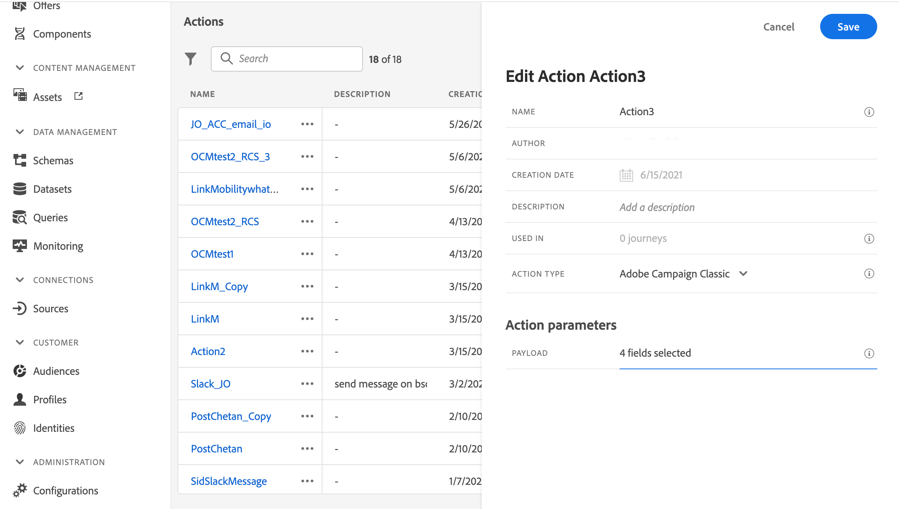

# Integrate with Adobe Campaign v7/v8 {#integrating-with-adobe-campaign-v7-v8}

>[!CONTEXTUALHELP]
>id="ajo_journey_action_acc"
>title="Adobe Campaign v7/v8 actions"
>abstract="This integration is available for Adobe Campaign v7 and v8. It allows you to send emails, push notifications and SMS using Adobe Campaign Transactional Messaging capabilities. The connection between the Journey Optimizer and Campaign instances is setup by Adobe at provisioning time." 

If you have Adobe Campaign Classic v7 or Campaign v8, a specific custom action is available in your journeys to integrate Adobe Journey Optimizer and Adobe Campaign. This integration allows you to send emails, push notifications and SMS using Adobe Campaign Transactional Messaging capabilities. Learn more in this [end-to-end use case](../building-journeys/ajo-ac.md).

For each action configured, a [Campaign action activity](../building-journeys/using-adobe-campaign-v7-v8.md) is available in the journey designer palette.

## Activation {#access}

When requested, the connection between the Journey Optimizer and Adobe Campaign environments is setup by Adobe at provisioning time. If you have not requested the connection at provisioning time, contact Adobe Journey Optimizer support to request the activation. You must provide the following details:

>[!BEGINTABS]

>[!TAB For Adobe Journey Optimizer]

* Organisation ID (Adobe OrgID)
* Sandbox Name

>[!TAB For Adobe Campaign]

* Campaign Server URL
* Real-Time Server URL
* Your Adobe Campaign version

>[!ENDTABS]


## Guardrails and limitations {#important-notes}

* There is no throttling of messages. The system caps the number of messages that can be sent over to 4,000 per 5 minutes, based on the current Campaign SLA. For this reason, Journey Optimizer should only be used in unitary use cases (individual events, not audiences).

* You must configure one action on the canvas per template to use. You need to configure one action in Journey Optimizer for each template you wish to use from Adobe Campaign.

* We recommend that you use a dedicated Message Center hosted or Managed Services instance for this integration to avoid impacting any other Campaign operations that you may have going on. The marketing server can be hosted or on-premise.<!--The build required is 21.1 Release Candidate or greater. -->

* There is no validation that the payload or Campaign message is correct.

* You cannot use a Campaign action with an audience qualification event.

## Prerequisites {#prerequisites}

In Adobe Campaign, you must create and publish a transactional message and its associated event. Refer to the [Adobe Campaign documentation](https://experienceleague.adobe.com/en/docs/campaign/campaign-v8/send/real-time/transactional){target="_blank"}.

You can build your JSON payload corresponding to each message following the pattern below. You will then paste this payload when configuring the action in Journey Optimizer (see below).

+++ Example

```json
{
    "channel": "email",
    "eventType": "welcome",
    "email": "Email address",
    "ctx": {
        "firstName": "First name"
    }
}
```

* **channel**: the channel defined for your Campaign transactional template
* **eventType**: the internal name of your Campaign event
* **ctx**: variable based on the personalization you have in your message

+++

## Configure the action {#configure-action}

In Journey Optimizer, you must configure one action per transactional message. 

To create a Campaign action, follow these steps:

1. Create a new action. [Learn how to create custom actions](../action/action.md).
1. Enter a name and description.
1. In the **[!UICONTROL Action type]** field, select **[!UICONTROL Adobe Campaign Classic]**.
    
1. Click in the **[!UICONTROL Payload]** field and paste an example of the JSON payload corresponding to the Campaign message. Contact Adobe to get this payload.
1. Set each field as either static or variable based on whether you want it to be mapped on the Journey canvas. For example, fields like email channel parameters and personalization fields (`ctx`) should typically be set as variables so they can dynamically adapt within the journey.
1. Click **[!UICONTROL Save]**.

## Update an existing action {#update-action}

If you need to update an existing Campaign v7/v8 custom action, for example when the Real-Time (RT) endpoint changes after initial setup, follow these steps:

1. From the **[!UICONTROL Administration]** menu, select **[!UICONTROL Configurations]**, then go to **[!UICONTROL Actions]**.
1. Locate and select the Campaign action you want to update from the actions list.
1. Click **[!UICONTROL Edit]** to open the action configuration.
1. Update the **[!UICONTROL URL]** field with the new RT endpoint URL. Ensure the endpoint format is correct and reachable.
1. If needed, update the **[!UICONTROL Payload]** configuration to match any changes in the Campaign transactional message structure.
1. Click **[!UICONTROL Test]** to validate the connection to the new endpoint. Verify that the test returns a successful response before proceeding.
1. Once validated, click **[!UICONTROL Save]** to apply your changes.

>[!NOTE]
>
>Any journeys that use this action will automatically use the updated configuration. If you have live journeys using this action, monitor them closely after updating the endpoint to ensure proper message delivery.

