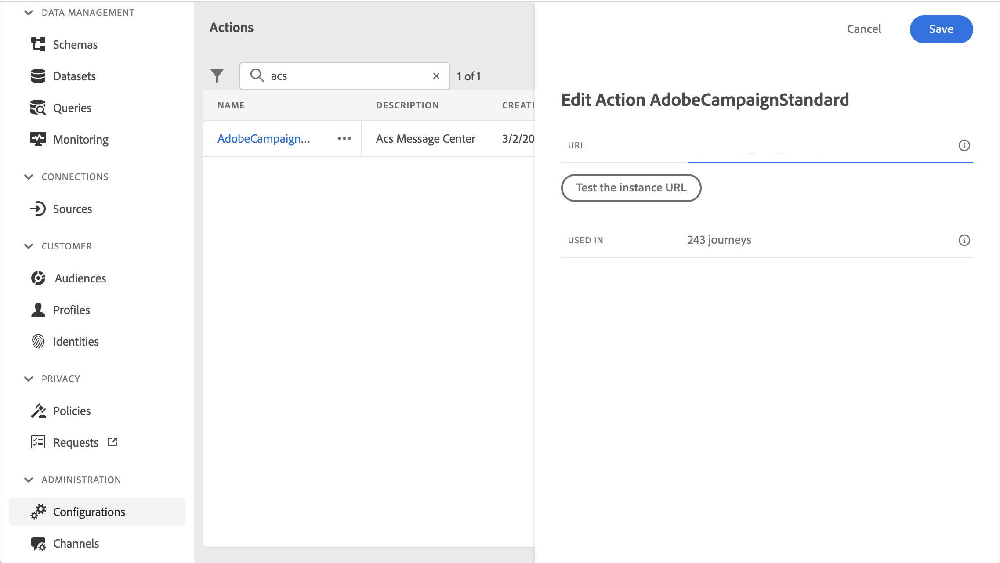
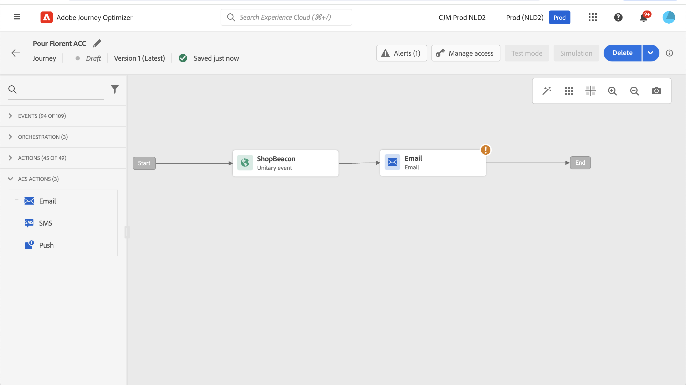

# Integrate with Adobe Campaign Standard {#using_adobe_campaign_standard}

If you have Adobe Campaign Standard, a built-in action is available to allow the connection to Adobe Campaign Standard. You can send emails, push notifications and SMS using the Adobe Campaign Standard's Transactional Messaging capabilities.

The Campaign Standard transactional message and its associated event must be published in order to be used in Journey Optimizer. If the event is published but the message is not, it will not be visible in the Journey Optimizer interface. If the message is published but its associated event is not, it will be visible in the Journey Optimizer interface but it will not be usable.

## Guardrails and limitations {#important-notes}

* A capping rule of 4,000 calls per 5 minutes is automatically defined for Adobe Campaign Standard actions. Read more about transactional messaging SLAs in [Adobe Campaign Standard Product Description](https://helpx.adobe.com/legal/product-descriptions/campaign-standard.html){target="_blank"}.

* Adobe Campaign Standard integration is set up through a dedicated built-in action in the action list. This must be configured for each sandbox.

* You cannot use a Campaign Standard action with an Audience qualification or Read audience activity.

* A journey cannot use both [built-in channel actions](../building-journeys/journey-action.md) and [Campaign Standard actions](../building-journeys/using-adobe-campaign-standard.md).

## Configure the action {#configure-action}

In Journey Optimizer, you must configure one action per transactional message. 

To configure a Campaign Standard action, follow these steps:

1. Select **[!UICONTROL Configurations]** in the ADMINISTRATION menu section. 

1. In the  **[!UICONTROL Actions]** section, click **[!UICONTROL Manage]**. The list of actions is displayed.

1. Select the built-in **[!UICONTROL AdobeCampaignStandard]** action. The action configuration pane opens on the right side of the screen.

    

1. Copy your Adobe Campaign Standard instance URL and paste it in the **[!UICONTROL URL]** field.

1. Click the **[!UICONTROL Test the instance URL]** to test the validity of the instance.

    >[!NOTE]
    >
    >This test verifies that:
    >
    >* The host is ".campaign.adobe.com", ".campaign-sandbox.adobe.com", ".campaign-demo.adobe.com", ".ats.adobe.com" or ".adls.adobe.com"
    >
    >* The URL starts with https
    >
    >* The Organization associated with this Adobe Campaign Standard instance is the same as the Journey Optimizer Organization

Once this configuration is done, three actions are available in the **[!UICONTROL Action]** category when designing a journey: **[!UICONTROL Email]**, **[!UICONTROL Push]**, **[!UICONTROL SMS]**. [Learn how to use them](../building-journeys/using-adobe-campaign-standard.md). 

Use a **Reactions** event to react to tracking data related to a Campaign Standard message sent within the same journey:

* For push notifications, journeys can react to clicked, sent or failed messages.

* For SMS messages, journeys can react to sent or failed messages. 

* For emails, journeys can react to clicked, sent, opened or failed messages. [Learn more about reactions events](../building-journeys/reaction-events.md).

When using a third-party system to send messages, you must add and configure a custom action. [Learn more about custom action configuration](../action/about-custom-action-configuration.md).