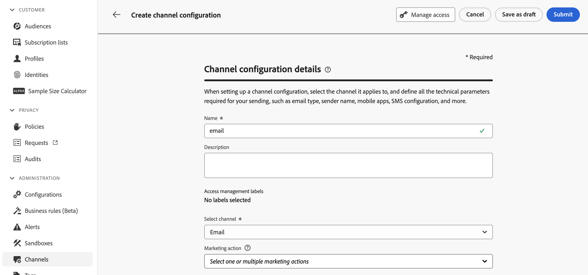
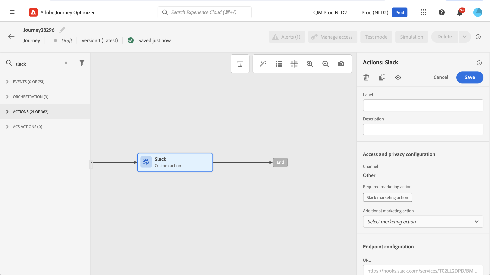

# Data Governance {#restrict-fields}

>[!CONTEXTUALHELP]
>id="ajo_data_governance_policy_violation"
>title="Data Governance policy violation"
>abstract="If the system identifies a restricted field in a journey/campaign, or a custom action, an error is displayed preventing you from publishing it. Use the data lineage diagram in this dialog to understand what other configuration changes need to be made before you can activate your journey or campaign."

>[!AVAILABILITY]
>
>This page includes information related to improvements that are currently restricted to selected customers.

## Get started with data governance policies {#gs}

With its [Data Usage Labelling and Enforcement(DULE) governance](https://experienceleague.adobe.com/docs/experience-platform/data-governance/home.html){_blank} framework, Adobe Experience Platform allows you to manage and enforce data governance policies across your channels by **labelling your fields** and creating **marketing actions** for each channel.

Once labels and marketing actions are defined, you can create **data governance policies** that link these two elements. For example, you can set up a policy that associates an "ePHI" label with an "email targeting" marketing action, ensuring that fields labeled as "ePHI" are not used to personalize email messages. [Learn how to create data governance policies](#governance-policies) 

After you have created the governance policies, you can apply the marketing actions to your journeys/campaigns and journeys custom actions.
[Learn how to apply marketing actions in Journey Optimizer](#apply-marketing-actions)

When building a journey or campaign, after selecting a channel configuration or adding a custom action, the system verifies if the marketing action in the message channel configuration or the custom action is part of a data governance policy. If so, the systems checks whether any fields from the targeted audience or message personalization are labeled and restricted by the policy. If such a label is detected, publishing the journey or campaign is blocked. [Learn how to detect data governance policy violation](#violation)

## Create labels and marketing actions {#labels-marketing-actions}

The first step to enforce data governance policy is to create label and attach them to fields for which you want to restrict usage, and marketing actions for each of your channels.

1. In the left menu, under **Privacy**, click **Policies**.

1. Select the **Labels** tab and click **Create label**.

1. Define a name and friendly name for your label. For example, _ePHI1_.

1. In the left menu, under **Data management**, click **Schemas**, and click the **Apply access and data governance labels** button. Select your schema and field (for example "blood type") and select the label previously created, _ePHI1_ in our example.

    

1. Go back to the **Policies** menu, select the **Marketing action** tab and click **Create marketing action**. We recommend that you create one marketing action for each channel and each third-party custom action used in your journeys. For example, let's create a _Slack marketing action_ which will be used for your Slack custom action.

    

## Create a data governance policy {#policy}

Now that labels and marketing actions have been created, you can link them together into data governance policies. To do so, select the **Browse** tab, click **Create policy** and select **Data governance policy**. Select your label (_ePHI1_) and marketing action (_Slack marketing action_).

When you will use, in a journey, your Slack custom action configured with the _Slack marketing action_, the associated policy will be leveraged. 

## Apply marketing actions in Journey Optimizer {#apply-marketing-actions}

In order for data governance policies to be enforced in Journey Optimizer, you need to apply marketing actions to your journeys, campaigns, or custom actions.

### Apply marketing actions to journeys and campaigns {#journeys-campaigns}

After you have created governance policies, you must apply the relevant marketing actions within your Journey Optimizer **channel configurations**. To do this, follow these steps:

1. Access the **[!UICONTROL Channels]** > **[!UICONTROL General settings]** > **[!UICONTROL Channel configurations]** menu.

1. Open an existing channel configuration or create a new one.

1. In the **[!UICONTROL Marketing action]** field, select the marketing action(s) to associate to the journeys/campaigns using this configuration. All consent and data governance policies associated with the marketing action are leveraged in order to respect the preferences of your customers and the restrictions set up for sensitive fields. [Learn more](../action/consent.md#surface-marketing-actions)

    

1. Complete the channel configuration setup then save it. [Learn how to set up channel configuration](../configuration/channel-surfaces.md).

1. When creating a message in your journey or campaign, select the relevant channel configuration. Complete the configuration of your journey or campaign and save it.

Before activating the journey or campaign, the system verifies if the marketing action in the selected channel configuration is part of a data governance policy. If so, the systems checks whether any fields from the targeted audience or message personalization are labeled and restricted by the policy. 

If the system identifies a restricted field, an error is displayed preventing you from publishing the journey or the campaign. [Learn how to detect governance policy violation](#violation)

{zoomable="yes"}

*Policy violation analysis steps for journeys and campaigns*

### Apply marketing action to custom actions {#custom-actions}

>[!NOTE]
>
>Campaign v7/v8 and Campaign Standard journeys actions are not supported.

Let's take the example of the blood type field that you need to restrict from being exported to a third-party using custom actions. To do so, you need to apply the marketing action to your custom action, and then build your journey and add your custom action in it.

1. In the left menu, under **Administration**, click **Configurations** and select **Actions**.

1. Open your Slack custom action. When configuring a custom action, two fields can be used for data governance.

    

    * The **Channel** field allows you to select the channel related to this custom action. It prefills the **Required marketing action** field with the default marketing action for the selected channel. If you select **other**, no marketing action will be defined by default. In our example, we select the channel **other**.

    * The **Required marketing action** allows you to define the marketing action related to your custom action. For example, if you use that custom action to send emails using a third-party, you can select **Email targeting**. In our example, we select the _Slack marketing action_. The governance policies associated to that marketing action are retrieved and leveraged.

    The other steps for configuring a custom action are detailed in [this section](../action/about-custom-action-configuration.md#consent-management).  

1. In the left menu, under **Journey management**, click **Journeys**.

1. Create your journey and add your custom action. When adding the custom action in a journey, several options allow you to manage data governance. Click the **Show read-only fields** to display all parameters.

    

    * The **Channel** and **Required marketing action**, defined when configuring the custom action, are displayed at the top of the screen. You cannot modify these fields.

    * You can define an **Additional marketing action** to set the type of custom action. This allows you to define the purpose of the custom action in this journey. In addition to the required marketing action, which is usually specific to a channel, you can define an additional marketing action which will be specific to the custom action in this particular journey. For example: a workout communication, a newsletter, a fitness communication, etc. Both the required marketing action and the additional marketing action will apply. In our example, we do not use an additional marketing action.

If one of the fields labelled _ePHI1_ (the blood type field in our example) are detected in the action parameters, an error is displayed, preventing you from publishing the journey. [Learn how to detect governance policy violation](#violation)

{zoomable="yes"}

*Policy violation analysis steps for journeys custom actions*

## Detect policy violation {#violation}

If the system identifies a restricted field in a journey/campaign, or a custom action, an error is displayed preventing you from publishing it.

Errors are visible from the **[!UICONTROL Alerts]** button. Click on the error to display detailed information on the data governance policy violation that happened.

This dialog indicates that the current journey/campaign configuration violates an existing data governance policy. Use the data lineage diagram to understand what other configuration changes need to be made before you can activate your journey or campaign.

Detailed information is available in the [data usage policy violation documentation](https://experienceleague.adobe.com/en/docs/experience-platform/data-governance/enforcement/auto-enforcement#data-usage-violation){_blank}.
