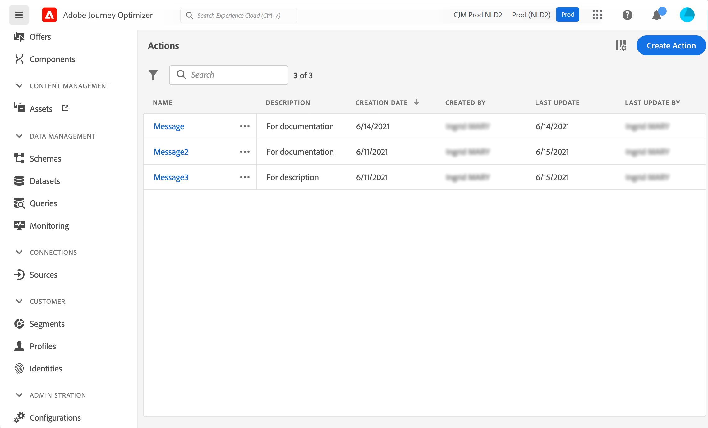

# Get started with custom actions {#about_actions}

>[!CONTEXTUALHELP]
>id="ajo_journey_action_list"
>title="Custom actions"
>abstract="Actions are connections through which you deliver personalized, real-time experiences to customers such as push notifications, email, SMS, or any other means of digital engagement you use in your business."

Actions are connections through which you deliver personalized, real-time experiences to customers such as push notifications, email, SMS, or any other means of digital engagement you use in your business.

➡️ [Discover this feature in video](#video)

[!DNL Journey Optimizer] comes with built-in message capability. Custom actions enable you to configure connection of a third-party system to send messages or API calls. An action can be configured with any service from any provider that can be called through a REST API with a JSON-formatted payload.

* If you are using Adobe Campaign v7 or v8, an integration is available upon request. Refer to [this page](../action/acc-action.md).

* If you are using a third-party system to send messages such as Epsilon, Facebook, Adobe Developer, Firebase, etc, you need to create and configure a custom action. Refer to [this page](../action/about-custom-action-configuration.md).

>[!CAUTION]
>
>The configuration of custom actions must be performed by a **technical user**.

Custom actions are additional actions defined by technical users and made available to marketers: once configured, they appear in the left palette of your journey, in the **[!UICONTROL Action]** category. Learn more on [this page](../building-journeys/about-journey-activities.md#action-activities). 

To view the action list or configure a new action, select **[!UICONTROL Configurations]** in the ADMINISTRATION menu section. In the  **[!UICONTROL Actions]** section, click **[!UICONTROL Manage]**. The list of actions is displayed. See [this page](../start/user-interface.md) for more information on the interface.

Learn how to troubleshoot a custom action [on this dedicated page](../action/troubleshoot-custom-action.md).

## How-to video {#video}

Learn how to configure custom actions.

>[!VIDEO](https://video.tv.adobe.com/v/3428396?quality=12)

## Additional resources

Browse the sections below to learn more about configuring and using your custom actions:

* [Configure your custom actions](../action/about-custom-action-configuration.md) - Learn how to create and configure a custom action
* [Use custom actions](../building-journeys/using-custom-actions.md) - Learn how to use custom actions in your journeys
* [Pass collections into custom action parameters](../building-journeys/collections.md) - Learn how to pass a collection in custom action parameters that is dynamically populated at runtime
* [Custom action troubleshooting](../action/troubleshoot-custom-action.md) - Learn how to troubleshoot a custom action

