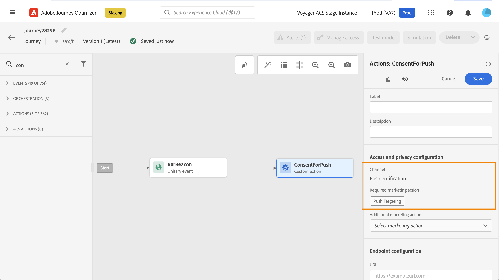

# Work with consent policies {#consent-management}

>[!AVAILABILITY]
>
>This page includes information related to improvements that are currently restricted to selected customers.

Your data may be subject to usage restrictions defined by your organization or by legal regulations. It is therefore important to ensure that your data operations within Journey Optimizer are compliant with [data usage policies](https://experienceleague.adobe.com/docs/experience-platform/data-governance/policies/overview.html){target="_blank"}. These policies are Adobe Experience Platform rules defining which marketing actions you are allowed to perform on data.

By default, if a profile has opted out from receiving communications from you, the corresponding profile is excluded from subsequent deliveries. You can create a **consent policy** that overrides this default logic. For example, you can create consent policies in Experience Platform to exclude customers who have not consented to receive communication for a given channel. In the absence of a custom policy, the default policy applies.

>[!IMPORTANT]
>
>Consent policies are currently only available for organizations that have purchased the Adobe **Healthcare Shield** or **Privacy and Security Shield** add-on offerings.

The main steps to apply consent policies are as follows:

1. Create a consent policy in Adobe Experience Platform with an associated marketing action. [Learn how to create a consent policy](https://experienceleague.adobe.com/docs/experience-platform/data-governance/policies/user-guide.html#consent-policy){target="_blank"} 

2. Apply consent policies in Adobe Journey Optimizer using channel configurations or journeys  custom actions.

    * Create a channel configuration with an associated marketing action. When creating a communication using the channel configuration, it will inherit the marketing action that has been associated and apply the corresponding consent policies defined in Adobe Experience Platform. [Learn how to leverage consent policies through channel configurations](#surface-marketing-actions)

    * At journey level, you can either:

        * Associate a channel and a marketing action to a custom action when configuring it. [Learn how to leverage consent policies when configuring a custom action](#consent-custom-action)
        * Define an additional marketing action when adding a custom action in a journey. [Learn how to leverage consent policies when adding a custom action in a journey](#consent-journey)

## Leverage consent policies through channel configurations {#surface-marketing-actions}

In [!DNL Journey Optimizer], consent is handled by the Experience Platform [Consent schema](https://experienceleague.adobe.com/docs/experience-platform/xdm/field-groups/profile/consents.html){target="_blank"}. By default, the value for the consent field is empty and treated as consent to receive your communications. You can modify this default value while onboarding to one of the possible values listed [here](https://experienceleague.adobe.com/docs/experience-platform/xdm/data-types/consents.html#choice-values){target="_blank"}.

To modify the consent field value, you can create a custom consent policy in which you define a marketing action and the conditions under which that action is performed. [Learn more on marketing actions](https://experienceleague.adobe.com/docs/experience-platform/data-governance/policies/overview.html#marketing-actions){target="_blank"}

For example, if you want to create a consent policy to target only profiles who have consented to receive email communications, follow the steps below.

1. Make sure your organization has purchased the Adobe **Healthcare Shield** or **Privacy and Security Shield** add-on offerings. [Learn more](https://experienceleague.adobe.com/docs/events/customer-data-management-voices-recordings/governance/healthcare-shield.html){target="_blank"}

1. In Adobe Experience Platform, create a custom policy (from the **[!UICONTROL Privacy]** > **[!UICONTROL Policies]** menu). [Learn how](https://experienceleague.adobe.com/docs/experience-platform/data-governance/policies/user-guide.html#create-policy){target="_blank"}

    <!---->

1. Choose the **[!UICONTROL Consent policy]** type and configure a condition as follows. [Learn how to configure consent policies](https://experienceleague.adobe.com/docs/experience-platform/data-governance/policies/user-guide.html#consent-policy){target="_blank"}

    1. Under the **[!UICONTROL If]** section, select the **[!UICONTROL Email Targeting]** default marketing action.

        <!---->

        >[!NOTE]
        >
        >The core marketing actions provided out-of-the-box by Adobe are listed in [this table](https://experienceleague.adobe.com/docs/experience-platform/data-governance/policies/overview.html?lang=en#core-actions){target="_blank"}. The steps to create a custom marketing action are listed in [this section](https://experienceleague.adobe.com/docs/experience-platform/data-governance/policies/user-guide.html#create-marketing-action){target="_blank"}.

    1. Select what happens when the marketing action applies. In this example, select **[!UICONTROL Email Marketing Consent]**.

    

1. Save and [enable](https://experienceleague.adobe.com/docs/experience-platform/data-governance/policies/user-guide.html#enable){target="_blank"} this policy.

1. In Journey Optimizer, create an email surface. [Learn how](../configuration/channel-surfaces.md#create-channel-surface)

1. In the email configuration details, select the **[!UICONTROL Email Targeting]** marketing action.

    

All consent policies associated with that marketing action are automatically leveraged in order to respect the preferences of your customers.

Therefore, in this example, any [email](../email/create-email.md) using that configuration in a campaign or a journey is only sent to the profiles who have consented to receive emails from you. Profiles who have not consented to receive email communications are excluded.

## Leverage consent policies through custom actions {#journey-custom-actions}

### Important notes {#important-notes}

In Journey Optimizer, consent can also be leveraged in custom actions. If you want to use it with the build-in message capabilities, you need to use a condition activity to filter customers in your journey.

With consent management, two journey activities are analyzed: 

* Read audience: the retrieved audience is taken into account.
* Custom action: consent management takes into account the attributes used ([action parameters](../action/about-custom-action-configuration.md#define-the-message-parameters)) as well as the  marketing action(s) defined (required marketing action and additional marketing action).
* Attributes that are part of a field group using the out-of-the-box Union Schema are not supported. These attributes will be hidden from the interface. You need to create another field group using a different schema.
* Consent policies only apply when a marketing action (required or additional) is set at the custom action level. 

All other activities used in a journey are not taken into account. If you start your journey with an Audience qualification, the audience is not taken into account.

In a journey, if a profile is excluded by a consent policy in a custom action, the message is not sent to him, but he continues the journey. The profile does not go to the timeout and error path when using a condition.

Before refreshing policies in a custom action positioned in a journey, make sure your journey has no error. 

<!--
There are two types of latency regarding the use of consent policies:

* **User latency**: the delay from the time a profile changes a consent settings to the moment it is applied in Experience Platform. This can take up to 48h. 
* **Consent policy latency**: the delay from the time a consent policy is created or updated to the moment it is applied. This can take up to 6 hours
-->

### Leverage consent policies when configuring a custom action{#consent-custom-action}

When configuring a custom action, two fields can be used for consent management.

The **Channel** field allows you to select the channel related to this custom action. It prefills the **Required marketing action** field with the default marketing action for the selected channel. If you select **other**, no marketing action is defined by default. 

The **Required marketing action** allows you to define the marketing action related to your custom action. For example, if you use that custom action to send emails, you can select **Email targeting**. When used in a journey, all consent policies associated with that marketing action are retrieved and leveraged. A default marketing action is selected, but you can click the down arrow to select any available marketing actions from the list.

For certain types of important communications, for example a transactional message sent to reset the client's password, you may not want to apply a consent policy. You will then select **None** in the **Required marketing action** field.

The other steps for configuring a custom action are detailed in [this section](../action/about-custom-action-configuration.md#consent-management).  

### Leverage consent policies when adding a custom action in a journey {#consent-journey}

When adding the custom action in a journey, several options allow you to manage consent. Click the **Show read-only fields** to display all parameters.

The **Channel** and **Required marketing action**, defined when configuring the custom action, are displayed at the top of the screen. You cannot modify these fields. 

You can define an **Additional marketing action** to set the type of custom action. This allows you to define the purpose of the custom action in this journey. In addition to the required marketing action, which is usually specific to a channel, you can define an additional marketing action which is specific to the custom action in this particular journey. For example: a workout communication, a newsletter, a fitness communication, etc. Both the required marketing action and the additional marketing action apply.

Click the **Refresh policies** button, at the bottom of the screen, to update and check the list of policies taken into consideration for this custom action. This is for information purpose only, while building a journey. With live journeys, consent policies are retrieved and updated automatically every 6 hours.

<!--
The following data is taken into account for consent:

* marketing actions and additional marketing actions defined in the custom action
* action parameters defined in the custom action, see this [section](../action/about-custom-action-configuration.md#define-the-message-parameters) 
* attributes used as criteria in a segment when the journey starts with a Read segment, see this [section](../building-journeys/read-audience.md) 

>[!NOTE]
>
>Please note that there can be a latency when updating the list of policies applied, refer to this [this section](../action/consent.md#important-notes).
-->

The other steps for configuring a custom action in a journey are detailed in [this section](../building-journeys/using-custom-actions.md).
