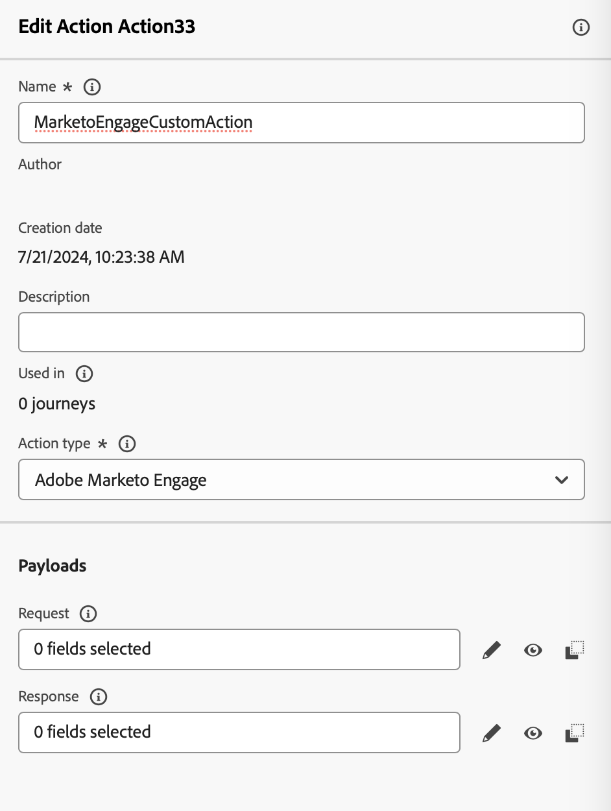
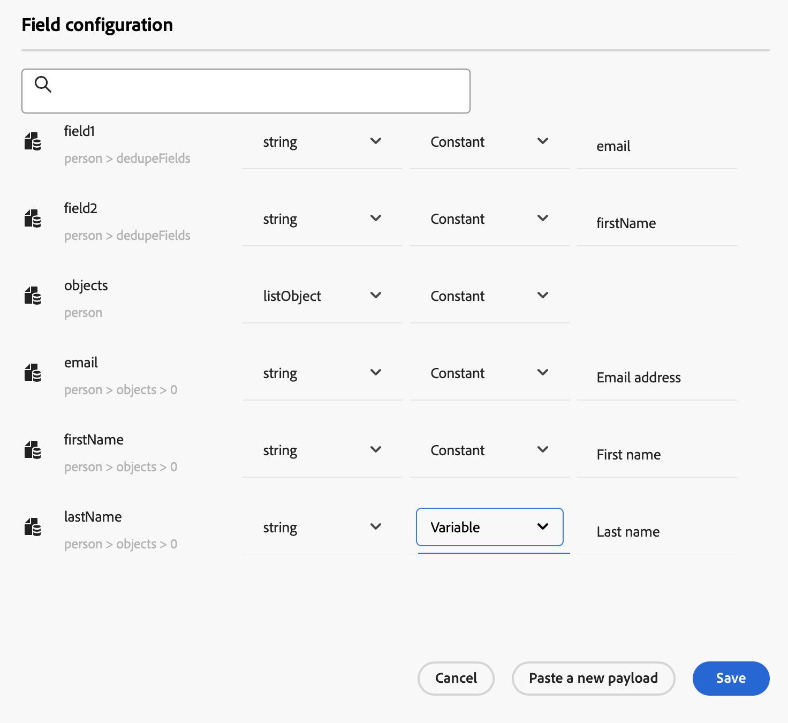
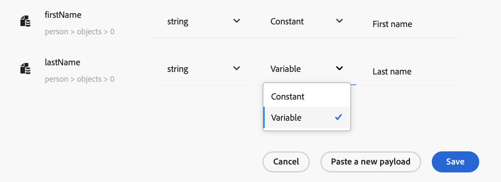
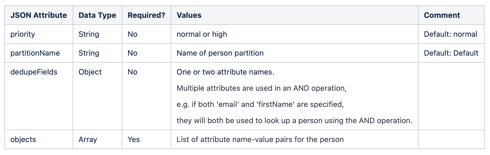
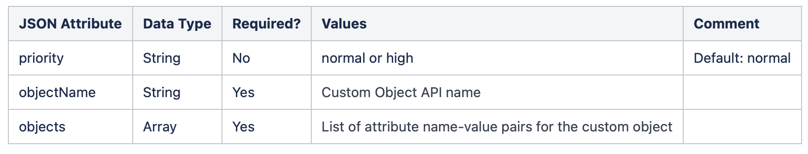
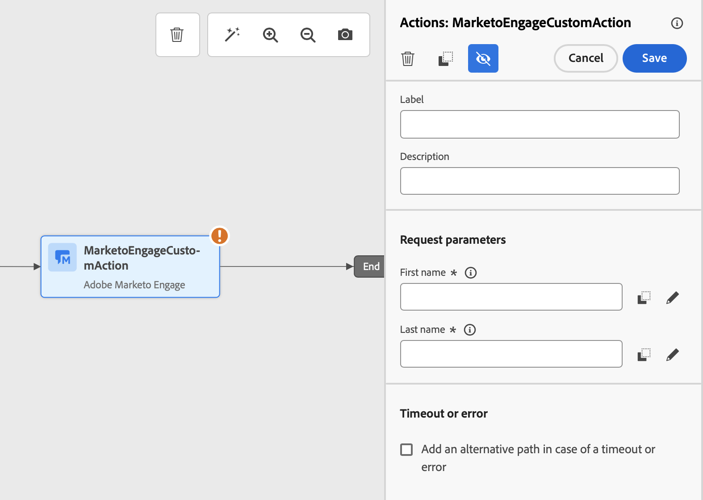

# Integrate with Marketo Engage {#integrating-with-marketo-engage}

Embark on a journey of seamless data integration with Marketo Engage. A specific custom action is available in your journeys to integrate Adobe Journey Optimizer and Marketo Engage. This custom action supports the ingestion of two key data types:

* **Persons** (Profiles): Marketo transforms profiles into actionable insights.
* **Custom Objects**: Tailor your data with custom objects, such as products, for a personalized marketing approach.

## Prerequisites {#prerequisites}

The following prerequisites apply to this integration:

* The customer instance of Marketo Engage must be IMS-enabled
* Marketo Engage instance and Adobe Experience Platform/Journey Optimizer instance must be in the same organization
* The customer must be provisioned with **MktoSync: Ingestion Service access**

## Configure the action {#configure-marketo-action}


In Journey Optimizer, you must configure a custom action for Marketo Engage. Follow these steps:

1. Select **[!UICONTROL Configurations]** in the ADMINISTRATION menu section. 
1. In the  **[!UICONTROL Actions]** section, click **[!UICONTROL Create Action]**. The action configuration pane opens on the right side of the screen.
1. Enter Name, Description, and select **Adobe Marketo Engage** as **Action type**

  {width="40%" align="left"}

1. Click the **Edit payload** icon for your **Request** and **Response** payloads.
1. For both, compose your payload and paste it in the dedicated popup.
  
  {width="70%" align="left"}
  
1. Inspect and configure payload values

  Note: To pass values dynamically, for each field change **Constant** to **Variable**.
  
  {width="70%" align="left"}

1. Click **Save** in the Field configuration screen, then **Save** your custom action.

  You can now use your custom action on your journey canvas.

## Payload syntax {#payload-syntax}

### Person



### CustomObject




**Payload Example for Person**

```json
{
   "munchkinID": "388-KKG-245",  
   "person": {
    "priority": "normal",
    "partitionName": "XYZ",
    "dedupeFields": {
      "field1": "email",
      "field2": "firstName"
    },
    "objects": [
      {
        "email": "Email address",
        "firstName": "First name",
        "lastName": "Last name"
      }
    ]
  }
}
```

**Payload Example for Custom Object**

```json
{
  "munchkinID": "388-KKG-245", 
  "customObject": {
    "priority": "normal",
    "objectName": "products",
    "objects": [
      {
        "email": "Email Address",
        "productName": "Product Name",
        "productQty": "Product Quantity",
        "priceTotal": "Price Total"
      }
    ]
  }
}
```


## Use the action {#engage-using}

For each action configured, a Marketo Engage action activity is available in the journey designer palette.

To use it, follow these steps:

1. Drag the custom action onto the journey canvas.

1. Enter the label and the description of this action.

1. In the **Request parameters** section, click the **Edit** icon for each of the parameters and sekect the dynamic values that you have configured in the payload.

  {width="70%" align="left"}
