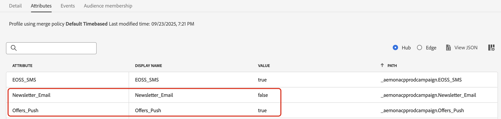
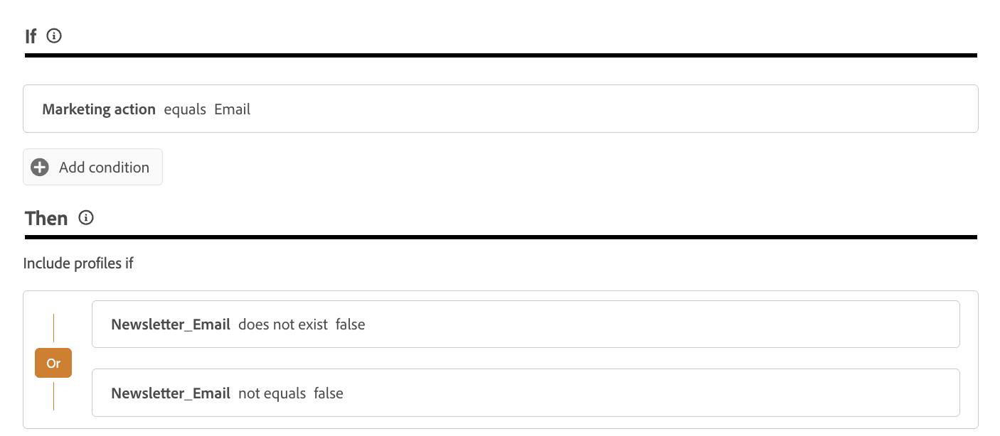

# Manage your customers' preferences {#preference-center}

>[!AVAILABILITY]
>
>This capability is currently only available for organizations that have purchased the Adobe **Healthcare Shield** or **Privacy and Security Shield** add-on offerings.

In a modern marketing automation ecosystem, brands engage with customers accross various touchpoints, facing the risk of irrelevant or excessive communication, leading to disengagement, spam complaints, and compliance risks. This is why they need to manage their customers' preferences in order to gain real-time insights over their audience and deliver personalized, respectful communication.

With [!DNL Adobe Journey Optimizer], through the use of [consent policies](consent.md), you can honor your customers' preferences<!-- in terms of **channels** and **topics**-->. This ensures that [!DNL Journey Optimizer] only targets customers based on their choices<!-- their preferred channels and on the subscription topics-->, while respecting their consent.

To manage your users' preferences with [!DNL Journey Optimizer], you can:

* Retrieve your customers's consent to opt in/out for any native outbound channel. For example, create a consent policy in [!DNL Experience Platform] to exclude customers who have not consented to receive communication for a given channel. Then apply this consent policy in [!DNL Journey Optimizer] using an email channel configuration. [Learn how](consent.md#surface-marketing-actions)

    >[!NOTE]
    >
    >The supported channels are Email, Push, SMS and InApp.<!--To check-->

* Ask your customers which topics they whish to subscribe to (such as the type of communications they agree to receive or not). [Learn how](#manage-preferences)

>[!IMPORTANT]
>
>Consent takes precedence over preferences. For example, one of your customers indicated that their preferred channel is email and that they agreed to receive newsletters<!-- they are interested in yoga-->; however, if they opted out from receving any communications from you, they cannot be targeted by an email newsletter that you are sending<!-- on yoga-->.

## Record and honor preferences {#manage-preferences}

With consent policies in [!DNL Journey Optimizer], you can manage your customers'preferences centrally. This allows you to make sure you only target customers based on the topics they selected while respecting their consent choices. To do this, follow the steps below.

Let's say you want to target your customers through journeys and campaigns based on their communication preferences across multiple subscription topics (*Newsletters*, *Offers*, and *New Product Launches*).

1. Define preference attributes with the Boolean operator at the profile level<!--how??-->. For example, you can specify:

    * *Newsletter_Email* - Boolean (true/false)
    * *Offers_Push* - Boolean (True/False)
    * *New Product Launches* - Boolean (True/False)

    These attributes are captured in the schema of a Profile-enabled [dataset](../data/get-started-datasets.md) and mapped to the [unified customer profile](../audience/get-started-profiles.md).

    >[!NOTE]
    >
    >Customer consent and contact preferences are complex topics. To learn how consent and context preferences can be collected, processed, and filtered in [!DNL Experience Platform], you are recommended to read the following documents:
    >
    >* To learn about the schema field groups required to collect consent data, refer to [this page](https://experienceleague.adobe.com/en/docs/experience-platform/landing/governance-privacy-security/consent/adobe/overview){target="_blank"}. It details how to process consent data you have collected from your customers and integrate it into your stored customer profiles.
    >* To learn more on the Consent and Preference field group, refer to [this page](https://experienceleague.adobe.com/en/docs/experience-platform/xdm/field-groups/profile/consents#ingest){target="_blank"}.
    >* To add custom preference fields to the schema, follow the steps in [this section](https://experienceleague.adobe.com/en/docs/experience-platform/landing/governance-privacy-security/consent/adobe/dataset#custom-consent){target="_blank"}.

1. Create a page to capture you customers' preferences. Use either one of the following methods:

    * Create a web page to record your customers' preferences using the [Adobe Experience Platform Web SDK](https://experienceleague.adobe.com/en/docs/experience-platform/web-sdk/home){target="_blank"}.

    * Use a [!DNL Journey Optimizer] [landing page](../landing-pages/create-lp.md) that includes forms to capture your customers' preferences through profile data.  [Learn more on forms](../landing-pages/lp-forms.md) <!--Forms not released/announced yet - TBC-->

        >[!NOTE]
        >
        >Make sure that the domain of the landing page being used belongs to the upper brand and not to a sub-brand. Indeed, the preferences collected are stored in the profile data which is at the upper-brand level.

1. On this page, customers can update their preferences, such as topic-wise subscriptions, by selecting or deselecting checkboxes.

    Each action triggers a consent event that is saved against the corresponding profile attributes (`true` for opted-in, `false` for opted-out) by ingesting the data into the Profile-enabled dataset schema<!-- that contains the corresponding preference fields-->.

    <!--Record your users' preferences through the web page or landing page that you created. The data is saved against the corresponding profile, meaning that the preference data is ingested into a Profile-enabled dataset whose schema contains consent/preference fields.-->

    For example, a user <!--whose email address is john.black@lumamail.com--> agreed to receive push offers but doesn't want to receive email newsletters. The corresponding profile is updated as follows:

    {width=80%}

<!--The corresponding profile dataset is updated as follows:

|Attribute = Email id | Attribute = Offers_Push | Attribute = Newsletters_Email |
|---------|----------|---------|
| john.black@lumamail.com | Y | N |-->

    >[!NOTE]
    >
    >The incoming consent events feed into the customer profile, ensuring real-time updates. Each profile reflects their most recent choices across the subscription preferences.

1. In Adobe Experience Platform, create a custom policy (from the **[!UICONTROL Privacy]** > **[!UICONTROL Policies]** menu). [Learn how](https://experienceleague.adobe.com/docs/experience-platform/data-governance/policies/user-guide.html#create-policy){target="_blank"}

    >[!AVAILABILITY]
    >
    >Consent policies are currently only available for organizations that have purchased the Adobe **Healthcare Shield** or **Privacy and Security Shield** add-on offerings. [Learn more on consent policies](consent.md)

    To make use of consent policies, preference attributes must be present in the profile data. This is why you must define these attributes at the profile level (as described in step 1).

1. Choose the **[!UICONTROL Consent policy]** type and configure a condition as follows. [Learn how to configure consent policies](https://experienceleague.adobe.com/docs/experience-platform/data-governance/policies/user-guide.html#consent-policy){target="_blank"}

<!--Consent policies are comprised of two logical components:

* **If**: The condition that will trigger the policy check, based on a certain marketing action (email, SMS, push, custom action, etc.) being performed, the presence of certain data usage labels, or a combination of the two.

* **Then**: The consent attribute must be present for a profile to be included in the action that triggered the policy. More than one field can also be selected.-->

    For example, to send communications only to your customers who have not opted out from receiving email newsletters, create a custom policy and define the following condition:

    * If **[!UICONTROL Marketing action]** equals **[!UICONTROL Email]**

    * Then **[!UICONTROL Newsletter_Email]** does not exist **[!UICONTROL false]** Or **[!UICONTROL Newsletter_Email]** not equals **[!UICONTROL false]**

    {width=80%}

    >[!TIP]
    >
    >The Profile-enabled dataset must include the profile attribute **[!UICONTROL Newsletter_Email]** with the value set to `true` (such as described in step 1.)

1. Once you created the consent policy, leverage it in [!DNL Journey Optimizer] using [channel configurations](consent.md#surface-marketing-actions) or [journey custom actions](consent.md#journey-custom-actions).

1. Now you can use these channel configurations or custom actions in your journeys and campaigns to make sure your <!--targeted--> customers' preferences are honoured.
