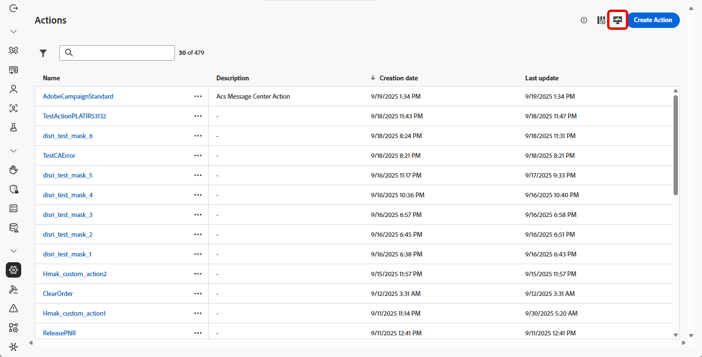
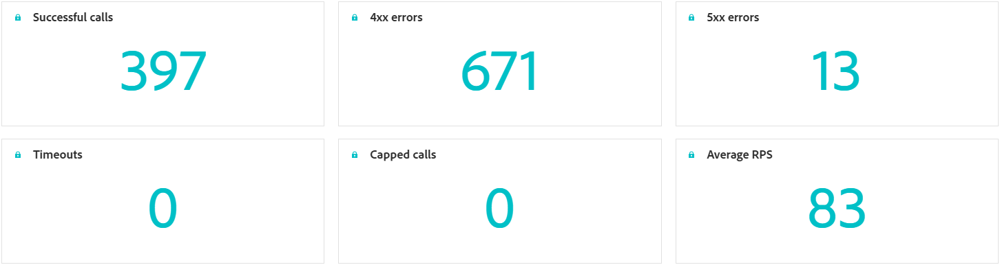
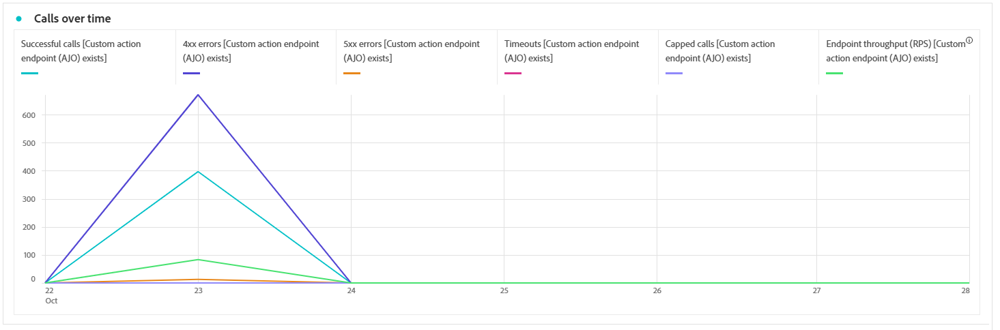
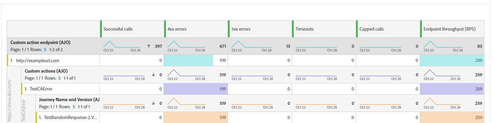

# Monitor your custom actions {#reporting}

>[!CONTEXTUALHELP]
>id="ajo_campaigns_custom_actions_monitor"
>title="Monitor your custom actions"
>abstract="The **[!UICONTROL Custom action]** reporting page lets you track the performance and reliability of API calls your journeys make to third-party systems."

>[!AVAILABILITY]
>
>Custom actions reporting is currently only available for a set of organizations (Limited Availability). 

The **[!UICONTROL Custom action]** reporting page allows you to monitor the reliability and performance of API calls made from your journeys to third-party systems. These reports help you quickly identify integration issues, latency bottlenecks, or throttling/capping limits that may impact delivery.

The Custom action reporting page functions like other All-time reports in Journey Optimizer. For details on dashboard functionalities, refer to [this documentation](../reports/report-cja-manage.md).

To access the **[!UICONTROL Custom action]** reporting page, click  from your **[!UICONTROL Actions]** homepage.

➡️ [Learn more on how to configure you Custom actions](../action/about-custom-action-configuration.md)

In addition to the **[!UICONTROL Custom action]** reporting page, you can use **[!DNL Adobe Experience Platform Query Service]** to build queries to report on custom action performance metrics. Query examples are available in [this section](../reports/query-examples.md).

## KPIs {#kpis}

The **[!UICONTROL Custom action]** Key Performance Indicators (KPIs) serve as a centralized dashboard, providing a consolidated view of the operational health and reliability of your custom action calls. These metrics allow you to evaluate performance, identify bottlenecks, and ensure stable integrations with external systems.

+++ Learn more about Custom action KPIs

* **[!UICONTROL Successful calls]**: Total number of HTTP calls that returned a valid response without error.

* **[!UICONTROL 4xx/5xx errors]**: Number of failed calls due to client-side (4xx) or server-side (5xx) errors, highlighting configuration issues or endpoint failures.

* **[!UICONTROL Timeouts]**: Number of calls that failed because they exceeded the maximum response time. This helps surface latency or performance issues with external endpoints.

* **[!UICONTROL Capped calls]**: Number of calls that were blocked due to capping limits, ensuring downstream systems are not overloaded.

* **[!UICONTROL Average RPS]**: Number of requests per second processed by the custom action over the selected time range.

+++

## Calls overtime {#calls}

The **[!UICONTROL Calls overtime]** graph shows the HTTP call KPI trend over the time period selected for the report. The granularity of the time series depends on the selected time range. For example:

* For a 7 day report, each data point will show the KPIs for one day. 
* If you select a 1-day time range, the graph will show the KPIs per hour.
* If you select a 1-hour time range, the graph will show the KPIs per minute.

➡️[See the KPIs section for a description of the HTTP call metrics](#kpis)

## Call breakdown {#breakdown}

The **[!UICONTROL Calls breakdown]** table provides a hierarchical breakdown of HTTP call metrics, from the overall metrics per endpoint at the top level to the metrics per Custom Action using each endpoint down to the journeys that rely on them at the bottom level.

➡️[See the KPIs section for a description of the HTTP call metrics](#kpis)

