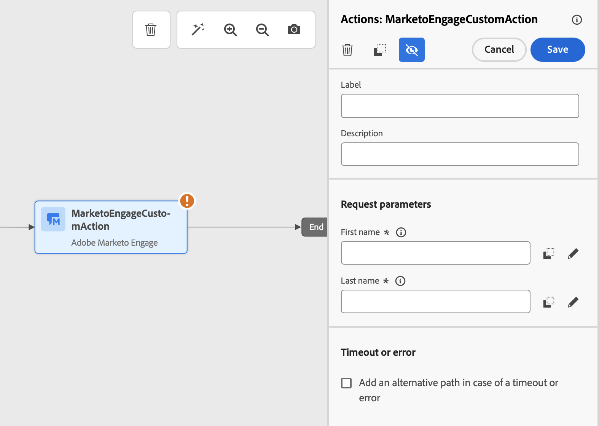

# Testing Custom Actions in Adobe Journey Optimizer {#testing-a-custom-action}

## Overview

The **Send Test Request** feature allows administrators to validate their custom action configurations by making real API calls directly from Adobe Journey Optimizer (AJO). This feature ensures that the request structure, headers, authentication, and payload are correctly formatted before being used in a journey.

{width="70%" align="left"}

## Prerequisites

- **Administrator Access Required:**
  - Users must have the **"Manage journeys events, data sources, and actions"** permission.
  - This permission is included in the *Journey Administrators* role.
  - The **"View journeys events..."** permission alone is not sufficient.
- A **Custom Action** must be pre-configured with a URL, headers, and authentication settings.

## How to Use the Send Test Request Feature

1. Navigate to the **Custom Actions** configuration screen.
1. Click on the **"Send Test Request"** button.
1. A pop-up window appears, allowing you to specify request parameters:
   - If the **custom action method is GET**, no payload is required.
   - If the **custom action method is POST**, you must provide a JSON payload.

        >[!NOTE]
        >
        >AJO will raise an error if the structure of this JSON is incorrect but will not do it if there's a mismatch with a data type. For instance, there will be no error if an integer parameter is used for what should be a string.

   - If authentication is defined, you will be prompted to enter authentication details.

1. Click **Send** to execute the request.
1. The response from the API, including headers and status codes, will be displayed in the interface.

## Authentication Handling

When a custom action includes authentication, AJO requires the user to input authentication details for each test request:

- **Basic Authentication:** The user must provide the *password*.
- **API Key Authentication:** The user must enter the API key *value*.
- **Custom Authentication:** The user must supply the authentication parameters in the request *bodyParam*. Two sections to complete are added in this case: **Authentication request** and **Authentication response**.

## Key Differences from External Testing Tools (e.g., Postman)

- The test request is executed by **AJO Journey**, meaning:
  - The exact request structure (including AJO-specific headers) is used.
  - The source IP and headers match those used in live journeys.
- Can be used for troubleshooting **live journeys** where the custom action is already deployed.
- Eliminates the need to manually copy configuration details between tools, reducing the risk of errors.

## Troubleshooting

- If the request fails, verify:
  - The authentication credentials entered in the test.
  - The request method (GET vs. POST) and corresponding payload.
  - The API endpoint and headers defined in the custom action.
- Use the response data to identify potential misconfigurations.

This feature streamlines the testing and validation process, ensuring that custom actions function correctly in live AJO journeys.

