# Attribute-based access control {#attribute-based-access}

The attribute-based access control capability allows you to define authorizations to manage data access for specific teams or groups of users. Its purpose is to protect sensitive digital assets from unauthorized users, providing further protection of personal data.

Use the attribute-based access control in Adobe Journey Optimizer to protect data and grant specific access to specific field elements including Experience Data Model (XDM) schemas, Profile attributes, and audiences.

For a more detailed list of the terminology used with attribute-based access control, refer to [Adobe Experience Platform documentation](https://experienceleague.adobe.com/docs/experience-platform/access-control/abac/overview.html){target="_blank"}.

In this example, a label is added to the **Nationality** schema field to restrict unauthorized users from using it. For this to work, perform the following steps:

1. Create a new  **[!UICONTROL Role]** and assign it with the corresponding  **[!UICONTROL Label]** for users to be able to access and use the schema field.

1. Assign a  **[!UICONTROL Label]** to the **Nationality** schema field in Adobe Experience Platform.

1. Use the  **[!UICONTROL Schema field]** in Adobe Journey Optimizer.

Note that **[!UICONTROL Roles]**, **[!UICONTROL Policies]**, and **[!UICONTROL Products]** can also be accessed with the attribute-based access control API. For more information, refer to this [documentation](https://experienceleague.adobe.com/docs/experience-platform/access-control/abac/abac-api/overview.html){target="_blank"}.

## Create a role and assign labels {#assign-role}

>[!IMPORTANT]
>
>>Before managing permissions for a role, create a policy. For more information, refer to [Adobe Experience Platform documentation](https://experienceleague.adobe.com/docs/experience-platform/access-control/abac/permissions-ui/policies.html){target="_blank"}.

**[!UICONTROL Roles]** are a set of users that share the same permissions, labels, and sandboxes within your organization. Each user belonging to a **[!UICONTROL Role]** is entitled to the Adobe apps and services contained in the product. You can also create your own **[!UICONTROL Roles]** to fine-tune users' access to certain functionalities or objects in the interface.

To grant selected users access to the **Nationality** field labeled C2, create a new **[!UICONTROL Role]** with a specific set of users and grant them the label C2, allowing them to use the **Nationality** details in a **[!UICONTROL Journey]**.

1. From the [!DNL Permissions] product, select **[!UICONTROL Role]** from the left pane menu and click **[!UICONTROL Create role]**. Note that you can also add **[!UICONTROL Label]** to built-in roles.

    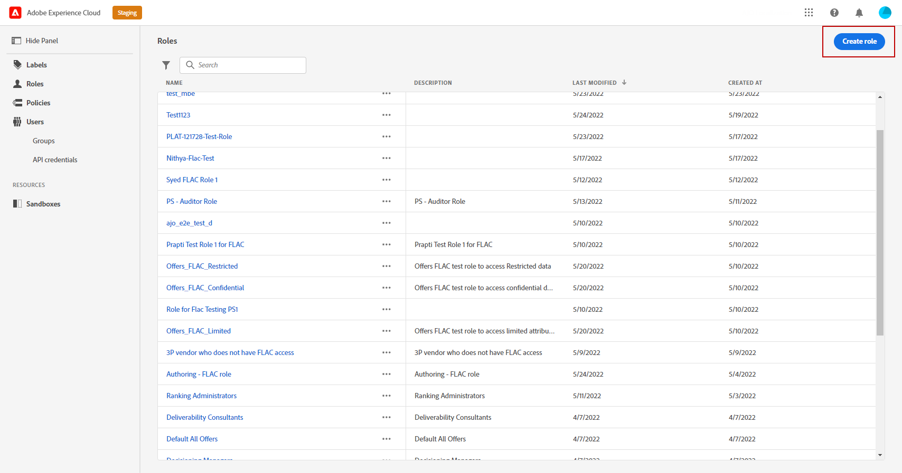

1. Add a **[!UICONTROL Name]** and **[!UICONTROL Description]** to your new **[!UICONTROL Role]**, here: Restricted role demographic.

1. From the drop-down, select your **[!UICONTROL Sandbox]**.

    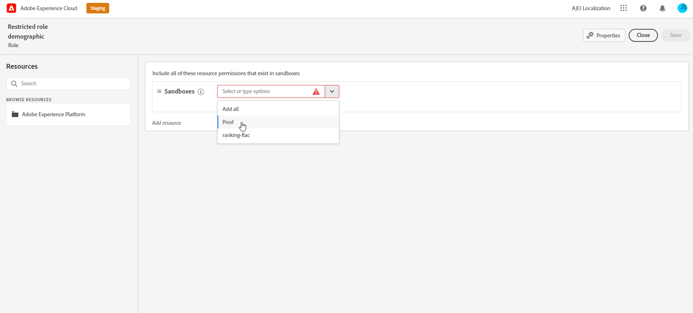

1. From the **[!UICONTROL Resources]** menu, click **[!UICONTROL Adobe Experience Platform]** to open the different capabilities. Here, we select **[!UICONTROL Journeys]**.

    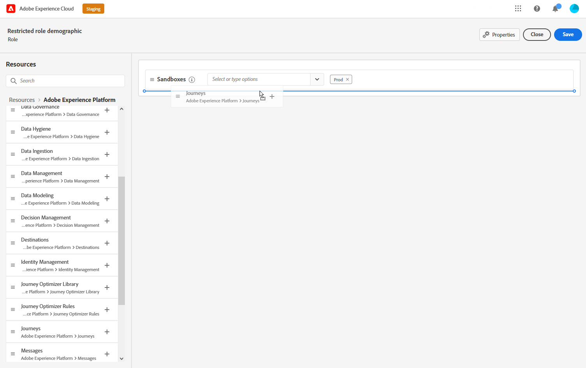

1. From the drop down, select the **[!UICONTROL Permissions]** linked to the selected feature such as **[!UICONTROL View journeys]** or **[!UICONTROL Publish journeys]**.

    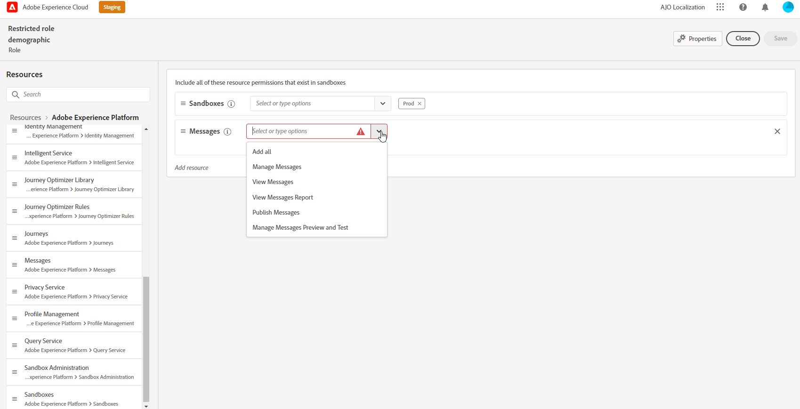

1. After saving your newly created **[!UICONTROL Role]**, click **[!UICONTROL Properties]** to further configure access to your role.

    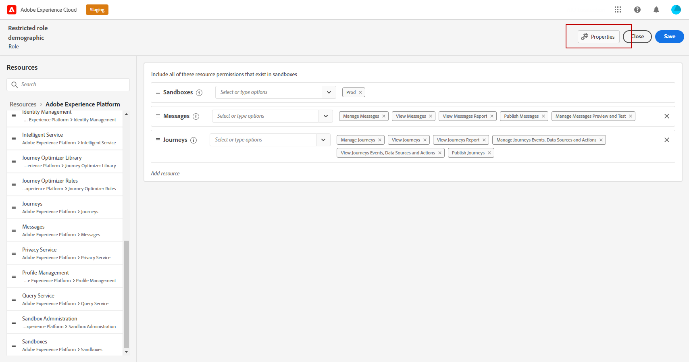

1. From the **[!UICONTROL Users]** tab, click **[!UICONTROL Add users]**.

    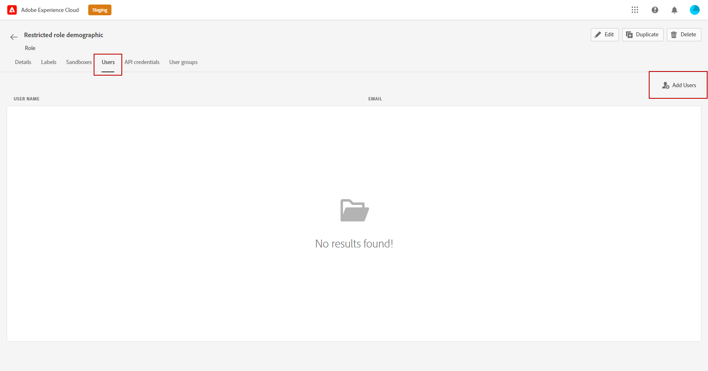

1. From the **[!UICONTROL Labels]** tab, select **[!UICONTROL Add label]**. 

    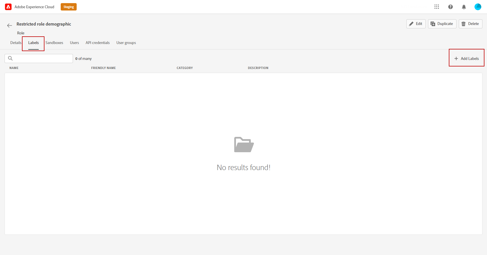

1. Select the **[!UICONTROL Labels]** you want to add to your role and click **[!UICONTROL Save]**. For this example, grant the label C2 for users to access the previously restricted schema's field.

    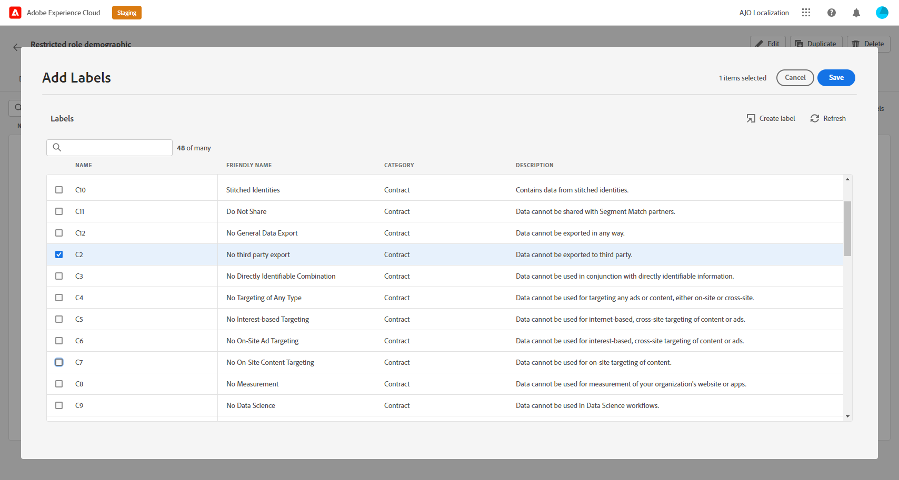

The users in the **Restricted role demographic** role now have access to the C2-labeled objects.

## Assign labels to an object in Adobe Experience Platform {#assign-label}

>[!WARNING]
>
>Incorrect label usage can break access for people and trigger policy violations.

**[!UICONTROL Labels]** can be used to assign specific feature areas using attribute-based access control. In this example, access to the **Nationality** field is restricted. This field will only be accessible to users with the corresponding **[!UICONTROL Label]** assigned to their **[!UICONTROL Role]**.

Note that you can also add  **[!UICONTROL Label]** to  **[!UICONTROL Schema]**,  **[!UICONTROL Datasets]** and  **[!UICONTROL Audiences]**.

1. Create your **[!UICONTROL Schema]**. For more information, refer to [this documentation](https://experienceleague.adobe.com/docs/experience-platform/xdm/schema/composition.html){target="_blank"}.

    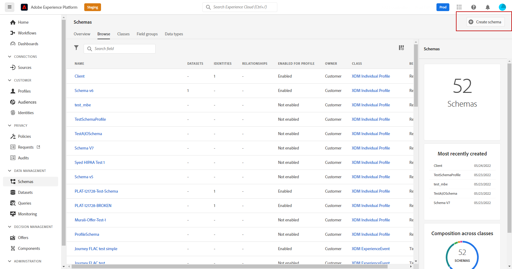

1. In the newly created **[!UICONTROL Schema]**, we first add the **[!UICONTROL Demographic details]** field group that contains the **Nationality** field.

    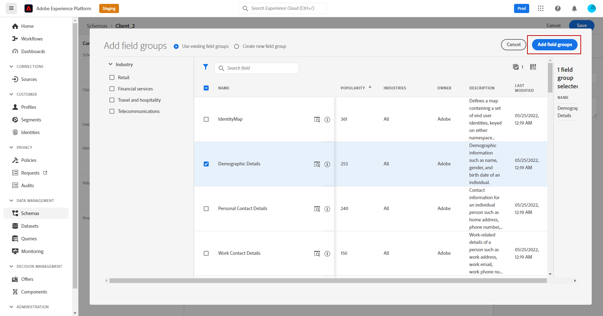

1. From the **[!UICONTROL Labels]** tab, check the restricted field name, here **Nationality**. Then, from the right pane menu, select **[!UICONTROL Edit governance labels]**.

    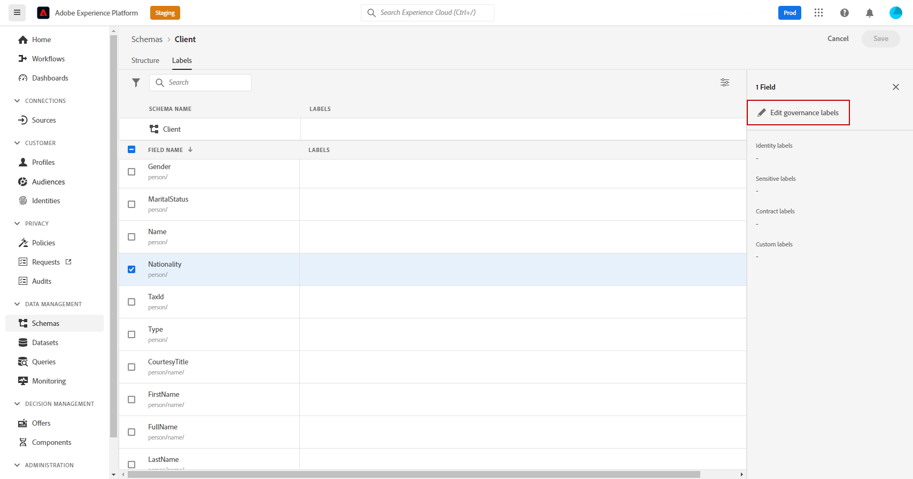

1. Select the corresponding **[!UICONTROL Label]**, in this case, the C2 - Data cannot be exported to a third-party. For the detailed list of available labels, refer to [this page](https://experienceleague.adobe.com/docs/experience-platform/data-governance/labels/reference.html#contract-labels){target="_blank"}.

    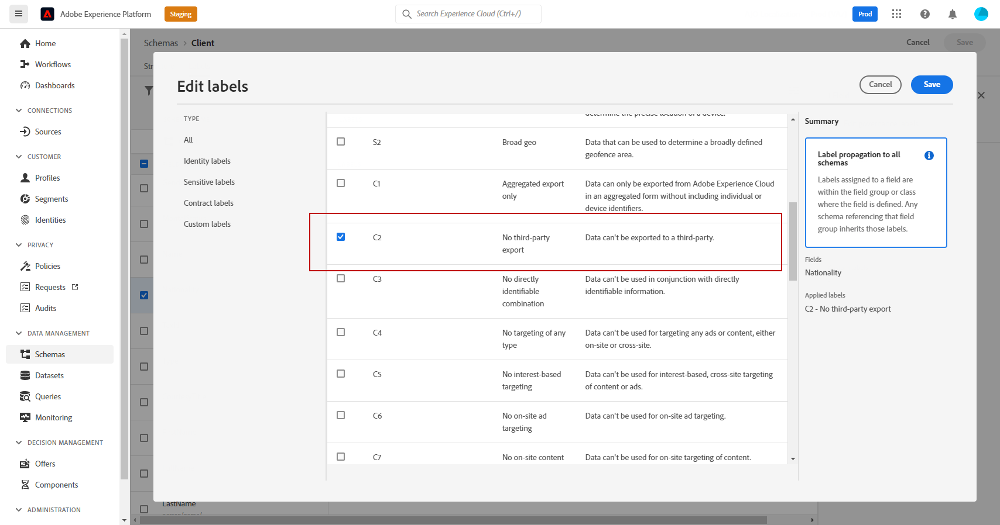

1. Further personalize your schema if needed, then enable it. For detailed steps on how to enable your schema, refer to this [page](https://experienceleague.adobe.com/docs/experience-platform/xdm/ui/resources/schemas.html#profile){target="_blank"}.

Your schema's field will now only be visible and usable by users who are part of a role set with the C2 label. By applying a **[!UICONTROL Label]** to your **[!UICONTROL Field name]**, the **[!UICONTROL Label]** will automatically apply to the **Nationality** field in every created schema.

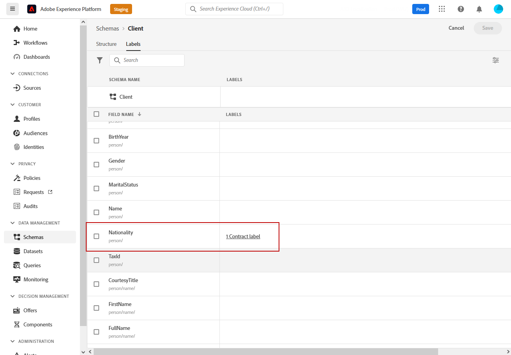

## Access labeled objects in Adobe Journey Optimizer {#attribute-access-ajo}

After labeling the **Nationality** field name in a new schema and role, the impact of this restriction can be observed in Adobe Journey Optimizer. For this example:

* User X, with access to objects labeled C2, creates a journey with a condition targeting the restricted **[!UICONTROL Field name]**.
* User Y, without access to objects labeled C2, attempts to publish the journey.

1. From Adobe Journey Optimizer, configure the **[!UICONTROL Data source]** with your new schema.

    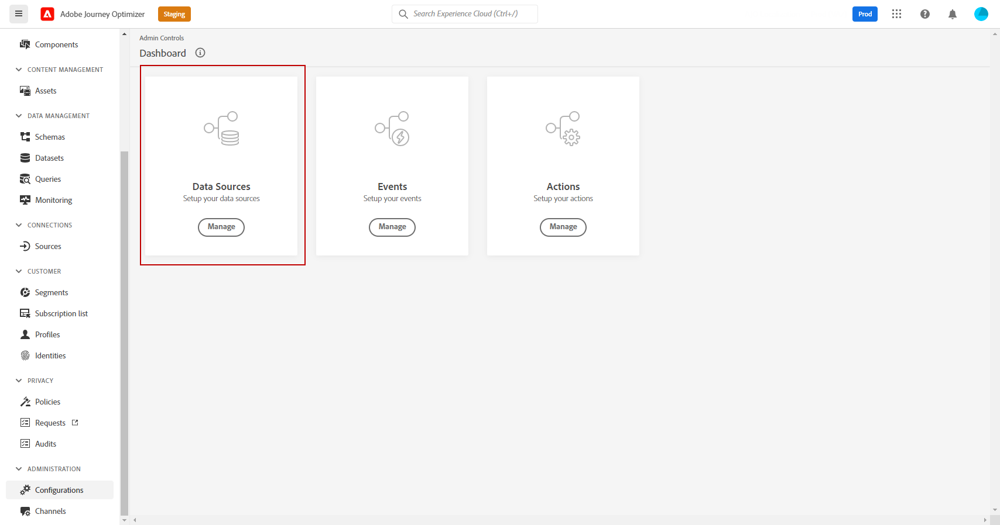

1. Add a new **[!UICONTROL Field group]** of your newly created **[!UICONTROL Schema]** to the built-in **[!UICONTROL Data source]**. You can also create a new external **[!UICONTROL data source]** and associated **[!UICONTROL Field groups]**.

    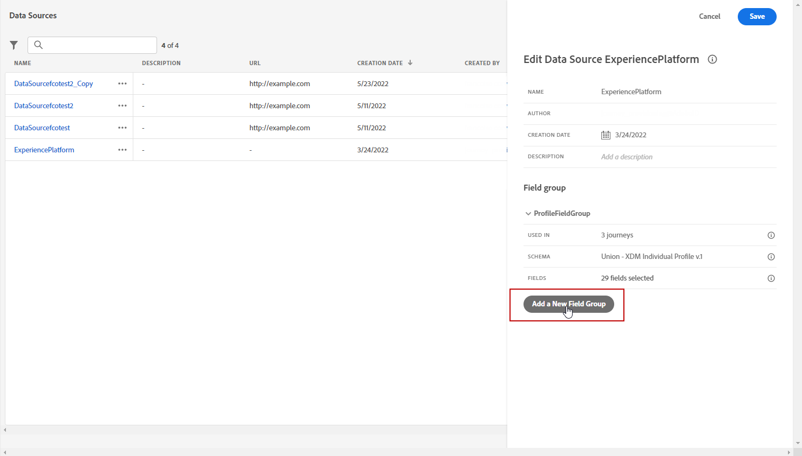

1. After selecting your previously created **[!UICONTROL Schema]**, click **[!UICONTROL Edit]** from the **[!UICONTROL Fields]** category.

    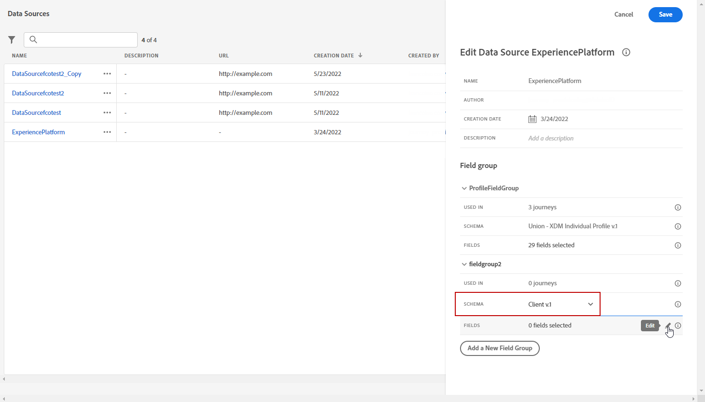

1. Select the **[!UICONTROL Field name]** you want to target. Here we select the restricted **Nationality** field.

    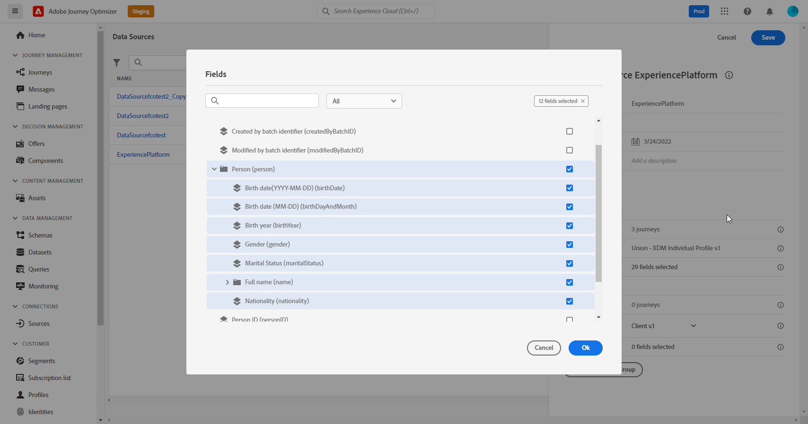

1. Create a journey that sends an email to users with a specific nationality. Add an **[!UICONTROL Event]** and a **[!UICONTROL Condition]**.

    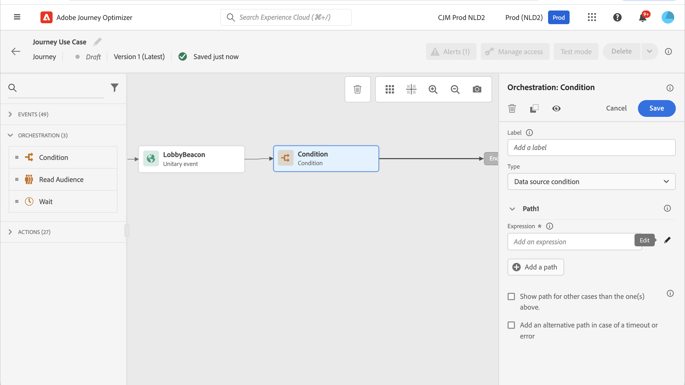

1. Select the restricted **Nationality** field to start building your expression.

    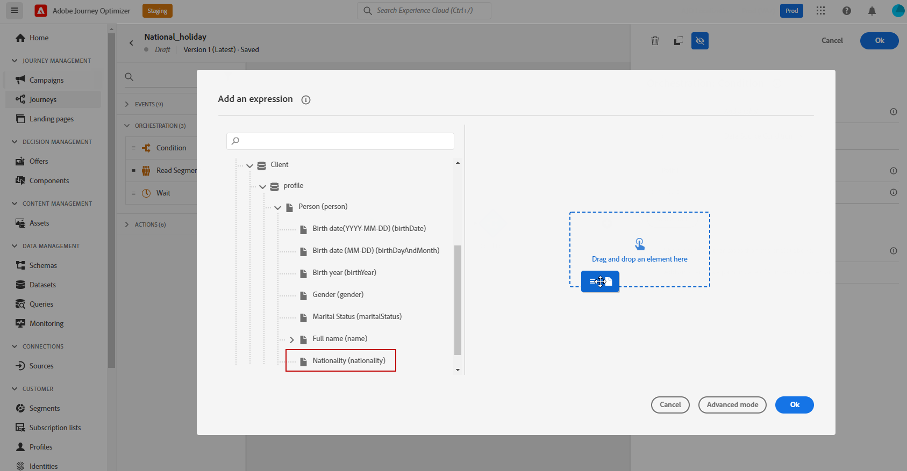

1. Edit your **[!UICONTROL Condition]** to target a specific population with the restricted **Nationality** field. 

    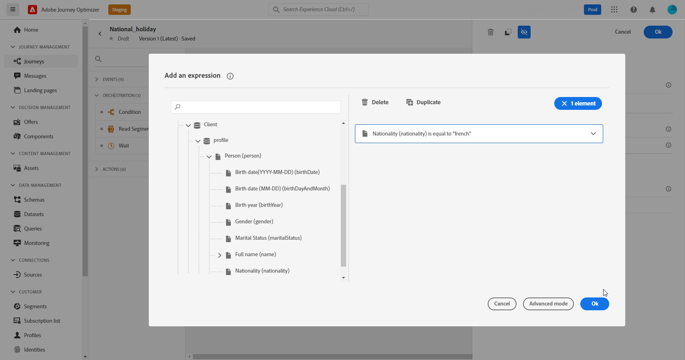

1. Personalize your journey as needed, here we add an **[!UICONTROL Email]** action.

    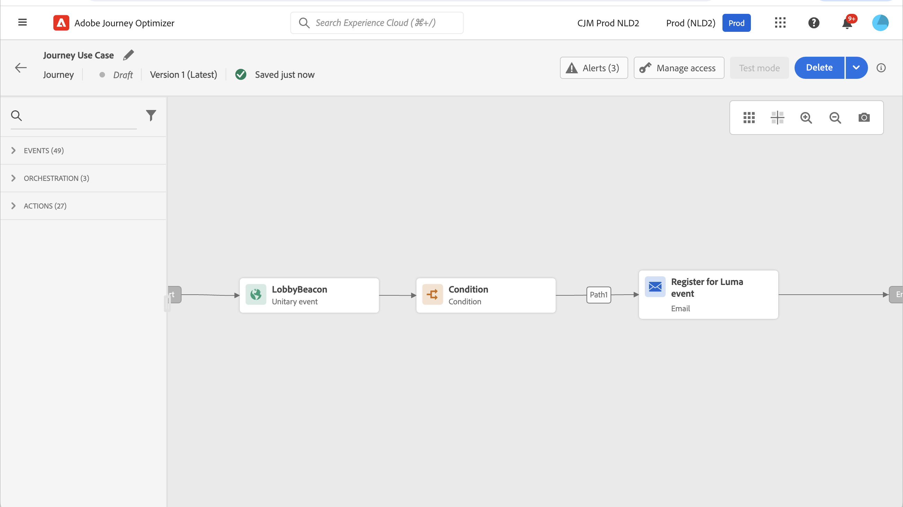

If User Y, without access to label C2 objects, needs to access this journey with the restricted field:

* User Y will not be able to use the restricted field name since it will not be visible.
* User Y will not be able to edit the expression with the restricted field name in advanced mode. The following error will appear: `The expression is invalid. Field is no longer available or you do not have enough permission to see it`.
* User Y can delete the expression.
* User Y will not be able to test the journey.
* User Y will not be able to publish the journey.