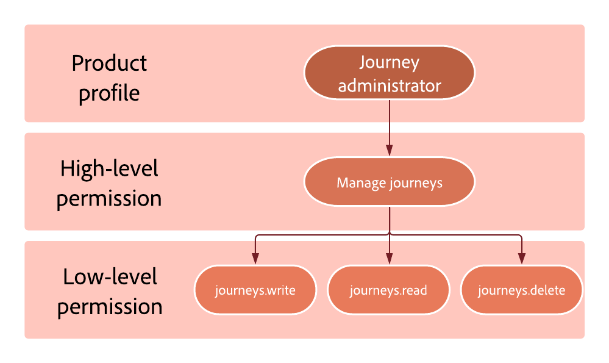

# Permission levels {#high-low-permissions}

>[!BEGINSHADEBOX]

**On this page:** Understand how high-level permissions group the underlying low-level permissions for each resource, so you can grant roles exactly the feature access your users need.

>[!ENDSHADEBOX]

Each role is composed of permissions allowing users to access the different features. 

They can be divided into two types:

* **High-level permission**: represents the different permissions that can be assigned to **[!UICONTROL Role]**, such as **[!DNL Publish journeys]** and **[!DNL Manage subdomains delegation]**. High-level permissions encompass low-level permissions. High-level permissions are detailed on [this page](ootb-permissions.md).

* **Low-level permission**: represents the different permissions that come from the high-level permission.

For example, the **[!DNL Journey administrator]** role is assigned the **[!DNL Manage journeys]** permission. From this permission results the low-level permissions which will allow the Journey administrator to write, read and delete journeys.

{width="70%"}

## Journey resource {#journey-capability}

* **[!DNL Manage journeys]** high-level permission allows users to create new and edit/delete/stop/pause existing Journeys, as well as access to the objects that are used in the journey canvas to build the journey flow.

  +++ This permission includes the following low-level permissions:  

    * Journey Optimizer specific:

      * journeys.read
      * journeys.write
      * journeys.delete
      * messages.read

    * Adobe Experience Platform specific:

      * segments.read
      * profiles.read
      * datasets.read
      * schemas.read

  +++

* **[!DNL Publish journeys]** high-level permission allows users to publish journeys.

  +++ This permission includes the following low-level permissions:  
    * Journey Optimizer specific:
      * journeys.publish
      * journeys.read

  +++

* **[!DNL View journeys]** high-level permission allows users to browse and view journeys.

  +++ This permission includes the following low-level permissions:  

    * Journey Optimizer specific:
      * journeys.read

    * Adobe Experience Platform specific:
      * segments.read
      * profiles.read

  +++

* **[!DNL Manage journeys events, data sources and actions]** high-level permission allows users to configure event and data configurations.

  +++ This permission includes the following low-level permissions:  

  * Journey Optimizer specific:
    * journeys_events.read
    * journeys_events.write
    * journeys_events.delete
    * journeys_data_sources.read
    * journeys_data_sources.write
    * journeys_data_sources.delete 
    * journeys_actions.read
    * journeys_actions.write
    * journeys_actions.delete

  * Adobe Experience Platform specific:
    * schemas.read
    * datasets.read
    * identity_namespace.read

  +++

* **[!DNL View journeys events, data sources and actions]** high-level permission allows users to use event and data in the journey flow.

  +++ This permission includes the following low-level permissions:  

  * Journey Optimizer specific: 
    * journeys_events.read
    * journeys_data_sources.read
    * journeys_actions.read

  * Adobe Experience Platform specific:
    *  schemas.read
    * datasets.read
    * identity_namespace.read

  +++

* **[!DNL View journeys report]** high-level permission allows users to read-only journey report.

  +++ This permission includes the following low-level permissions:  

  * Journey Optimizer specific: 
    * journeys_report.read
    * messages_report.read

  * Adobe Experience Platform specific:
    * datasets.read
    * queries.read
    * queries.write
    * queries.delete

  +++

## Journey Optimizer rules resource {#journey-rules-capability}

* **[!DNL Manage frequency rules]** high-level permission allows users to read, create, edit, delete and activate/deactivate frequency rules.

  +++ This permission includes the following low-level permissions:  

  * Journey Optimizer specific: 
    * frequency_rules.read
    * frequency_rules.write
    * frequency_rules.delete

  +++

* **[!DNL View frequency rules]** high-level permission allows users to view frequency rules. 

  +++ This permission includes the following low-level permissions:  

  * Journey Optimizer specific: 
    * frequency_rules.read

  +++

## Campaign resource {#campaign-capability}

* **[!DNL Export suppression list]** high-level permission allows users to download the suppression list as a CSV file.

  +++ This permission includes the following low-level permissions: 

  * Journey Optimizer specific: 
    * suppression_list.export

  * Adobe Experience Platform specific:
    * profiles.read
    * datasets.read

  +++

* **[!DNL Manage campaigns]** high-level permission allows users to create new and edit/delete Campaigns

  +++ This permission includes the following low-level permissions:  

    * Journey Optimizer specific:

      * campaign.read
      * campaign.write
      * campaign.delete
      <!--
      * experiments.read
      * experiments.write
      * experiments.delete
      -->

  +++

* **[!DNL Publish campaigns]** high-level permission allows users to publish campaigns.

  +++ This permission includes the following low-level permissions:

    * Journey Optimizer specific:

      * campaign-read
      * campaign-publish
      <!--
      * experiments.activate    
      -->

  +++

* **[!DNL View campaigns report]** high-level permission allows users to read and edit campaigns report.

  +++ This permission includes the following low-level permissions:  

    * Journey Optimizer specific:
      * campaign.read
      * campaign-report.read
      <!--
      * experiments.read
      * experiments_report.read
      -->

  +++

## Decision management resource {#decisions-permissions}

* **[!DNL Manage decisions]** high-level permission allows users to create new and edit/delete existing **[!DNL Activity entities]**, as well as manage the objects that are used in those activities to make the decisions.

  +++ This permission includes the following low-level permissions:  

  * Decision management specific:
    * activities.read
    * activities.write
    * activities.delete
    * offers.read
    * offers.write
    * offers.delete
    * placements.read
    * placements.write
    * placements.delete
    * ranking_strategy.read

  * Adobe Experience Platform specific:
    * datasets.read
    * datasets.write
    * datasets.delete
    * schemas.read
    * profile.read
    * segments.read

  +++

* **[!DNL View decisions]** high-level permission allows users to use an existing Activity and related business objects to make the decisions. 

  +++ This permission includes the following low-level permissions:  

  * Decision management specific: 
    * activities.read
    * offers.read
    * placements.read
    * ranking_strategy.read

  * Adobe Experience Platform specific:
    * schemas.read
    * segment.read
    * datasets.read

  +++

* **[!DNL Manage offers]** high-level permission allows users to create, edit and delete all offers, components, read decisions and collections.

  +++ This permission includes the following low-level permissions:  

  * Decision management specific:
    * offers_activity.read
    * offers.read
    * offers.Write
    * offers.Delete
    * placements.Read
    * placements.Write
    * placements.Delete
    * ranking_strategy.read

  * Adobe Experience Platform specific:
    * schemas.read
    * segment.read 
    * datasets.read
    * profiles.read

  +++

* **[!DNL Manage ranking strategies]** high-level permission allows users to read, create, edit, and delete ranking strategies.

  +++ This permission includes the following low-level permissions:  

  * Decision management specific:
    * ranking_strategy.read
    * ranking_strategy.write
    * ranking_strategy.delete
    * activities.read
    * offers.read
    * placements.read

  +++

## Channel configurations resource {#administration-permissions} 

<!--
* **[!DNL Manage Experience decisions]** high-level permission allows users to read, create, edit, and delete Decisioning entities.

  +++ This permission includes the following low-level permissions:  

  * Experience decisions specific:
    * ranking_strategy.read
    * offeritem.read
    * offeritem.write
    * offeritem.delete
    * itemCollection.read
    * itemCollection.write
    * itemCollection.delete
    * SelectionStrategy.read
    * SelectionStrategy.write
    * SelectionStrategy.delete
    * Decisionpolicy.read
    * Decisionpolicy.write
    * Decisionpolicy.delete
  +++
-->

* **[!DNL Manage file routing]** high-level permission allows users to create, edit and delete file routing configurations.

  +++ This permission includes the following low-level permissions:  
  * Journey Optimizer specific: 

    * file_routing.read
    * file_routing.write
    * file_routing.delete

  +++

* **[!DNL Manage IP pools]** high-level permission allows users to create, edit and delete the affinity definition.

  +++ This permission includes the following low-level permissions:  
  * Journey Optimizer specific: 
    * IP_pools.read
    * IP_pools.write
    * IP_pools.delete

  +++

* **[!DNL Manage key registry]** high-level permission allows users to view, create, rotate, and revoke keys in the key registry.

  +++ This permission includes the following low-level permissions:  

  * Journey Optimizer specific: 
    * key-registry.read
    * key-registry.write

  +++

* **[!DNL Manage landing page settings]** high-level permission allows users to read, create and edit landing page subdomains and preset settings.

  +++ This permission includes the following low-level permissions: 

  * Journey Optimizer specific:

    * landing_page_subdomain.read
    * landing_page_subdomain.write
    * landing_page_subdomain.delete
    * landing_page_preset.read
    * landing_page_preset.write
    * landing_page_preset.delete

  +++

* **[!DNL Manage messages general settings]** high-level permission allows users to create, edit and delete global settings at the sandbox level.

  +++ This permission includes the following low-level permissions:  

  * Journey Optimizer specific: 
    * messages_general_settings.read
    * messages_general_settings.write
    * messages_general_settings.delete

  * Adobe Experience Platform specific:
    * schemas.read

  +++

* **[!DNL Manage messages presets]** high-level permission allows users to read, create, edit, and delete channel configurations across channels at the sandbox level.

  +++ This permission includes the following low-level permissions: 

  * Journey Optimizer specific: 
    * messages_presets.read
    * messages_presets.write
    * messages_presets.delete
    * subdomains_delegation.read
    * IP_pools.read

  * Data Collection specific:
    * Mobile_setting.read <!--(from Adobe Experience Platform Launch)-->

  +++

* **[!DNL Manage PTR records]** high-level permission allows users to read and edit PTR records that have been configured based on the subdomain.

  +++ This permission includes the following low-level permissions: 

  * Journey Optimizer specific: 
    * PTR_records.read
    * PTR_records.write
    * subdomains_delegation.read

  +++

* **[!DNL Manage seed lists]** high-level permission allows users to read, create, edit and delete seed lists.

  +++ This permission includes the following low-level permissions: 

  * Journey Optimizer specific: 
    * seedlist.read
    * seedlist.write
    * seedlist.delete

  +++

* **[!DNL Manage SMS subdomains]** high-level permission allows users to read, create, edit and delete SMS subdomains.

  +++ This permission includes the following low-level permissions: 

  * Journey Optimizer specific: 
    * sms_subdomains.read
    * sms_subdomains.write
    * sms_subdomains.delete

  +++

* **[!DNL Manage subdomains delegations]** high-level permission allows users to create, edit and delete subdomain delegations (including IP pool).

  +++ This permission includes the following low-level permissions:  
  * Journey Optimizer specific: 

    * subdomains_delegation.read
    * subdomains_delegation.write
    * subdomains_delegation.delete

  +++

* **[!DNL Manage suppression]** high-level permission allows users to define the number of bounces before an email address is added to the suppression list, as well as to add and delete entries to/from the suppression list.

  +++ This permission includes the following low-level permissions:  
  * Journey Optimizer specific: 
    * suppression_rules.read
    * suppression_rules.write
    * suppression_rules.delete
    * suppression_list.write
    * suppression_list.delete

  +++

* **[!DNL View file routing]** high-level permission allows users to view file routing configurations.

  +++ This permission includes the following low-level permissions:  
  * Journey Optimizer specific: 

    * file_routing.read

  +++

* **[!DNL View key registry]** high-level permission allows users to view the key registry listing and key details.

  +++ This permission includes the following low-level permissions:  

  * Journey Optimizer specific: 
    * key-registry.read

  +++

* **[!DNL View messages general settings]** high-level permission allows users to view messages general settings such as the execution address.

  +++ This permission includes the following low-level permissions: 

  * Journey Optimizer specific: 
    * messages_general_settings.read

  * Adobe Experience Platform specific: 
    * schemas.read

  +++

* **[!DNL View messages presets]** high-level permission allows users to view messages presets.

  +++ This permission includes the following low-level permissions: 

  * Journey Optimizer specific: 
    * messages_presets.read
    * subdomains_delegation.read
    * IP_pools.read

  * Data Collection specific:
    * Mobile_setting.read

  +++

* **[!DNL View PTR records]** high-level permission allows users to view PTR records that have been configured based on the subdomain.

  +++ This permission includes the following low-level permissions: 
  * Journey Optimizer specific: 

    * PTR_records.read
    * subdomains_delegation.read

  +++

<!--
### [!DNL View channel configuration] permission {#view-channel-surface}

The **[!DNL View channel configuration]** high-level permission allows users to view channel configurations in order to know which channel configurations to use. 
  +++ This permission includes the following low-level permissions:  

* messages_presets.read
* subdomains_delegation.read
* IP_pools.read
* mobile_setting.read (from Adobe Experience Platform Data Collection)
-->

* **[!DNL View suppression list]** high-level permission allows users to view the suppression list content and settings.

  +++ This permission includes the following low-level permissions:  

  * Journey Optimizer specific: 
    * suppression_list.view

  * Adobe Experience Platform specific:
    * profiles.read
    * datasets.read

  +++

<!--
### Manage web subdomain permission {#web-subdomain}

The **[!DNL Manage web subdomain]** high-level permission allows users to read, create, edit, and delete web subdomains.

  +++ This permission includes the following low-level permissions: 
-->

## AI assistance resource {#ai-permissions} 

* **[!DNL Generate content]** high-level permission allows users to access to AI Assistant in Journey Optimizer.

  +++ It includes the following low-level permission:  

  * Journey Optimizer specific: 
    * ai-assistant-generated-content.generate

  +++

## Orchestrated campaign resource {#ai-orchestrated-campaign} 

* **[!DNL Manage orchestrated campaigns]** high-level permission allows users to create new and edit/delete Orchestrated campaigns.

  +++ This permission includes the following low-level permissions:  

    * Journey Optimizer specific:

      * orchestrated_campaigns.read
      * orchestrated_campaigns.write
      * orchestrated_campaigns.delete
      * cjm-web-subdomain.read
      * cjm-message.read
      * cjm-message.write
      * cjm-message.delete
      * cjm-library-item.read
      * cjm-message-general-setting.read
      * cjm-message-preset.read
      * cjm-message-preview-test.write
      * experiment.read
      * experiment.write
      * experiment.delete

    * Adobe Experience Platform specific:

      * identity-graph.read
      * segments.read
      * profiles.read
      * datasets.read
      * schemas.read
      * sandboxes.view

  +++

* **[!DNL Manage orchestrated campaigns admin]** high-level permission allows users to create new and edit/delete links and reconciliations between Adobe Experience Platform Profiles and Relational store entities.

  +++ This permission includes the following low-level permissions:  

    * Journey Optimizer specific:

      * cjm-orchestrated-campaign-admin.read
      * cjm-orchestrated-campaign-admin.write
      * cjm-orchestrated-campaign-admin.delete

  +++

* **[!DNL Publish orchestrated campaigns]** high-level permission allows users to publish Orchestrated campaigns.

  +++ This permission includes the following low-level permissions:

    * Journey Optimizer specific:

      * cjm-orchestrated-campaign.read
      * cjm-orchestrated-campaign.publish
      * cjm-web-subdomain.read
      * cjm-message.read
      * cjm-message.publish
      * cjm-library-item.read

    * Adobe Experience Platform specific:

      * sandboxes.view

  +++

* **[!DNL View orchestrated campaigns]** high-level permission allows users to view Orchestrated campaign and its content.

  +++ This permission includes the following low-level permissions:  

    * Journey Optimizer specific:

      * cjm-orchestrated-campaign.read
      * cjm-message.read
      * cjm-library-item.read
      * cjm-message-general-setting.read
      * cjm-message-preset.read
      * experiment.read

    * Adobe Experience Platform specific:

      * sandboxes.view
      * segments.read
      * profiles.read

  +++

* **[!DNL View orchestrated campaigns admin]** high-level permission allows users to view the admin settings but can not edit settings.

  +++ This permission includes the following low-level permissions:  

    * Journey Optimizer specific:

      * cjm-orchestrated-campaign-admin.read

  +++

* **[!DNL View orchestrated campaigns report]** high-level permission allows users to view orchestrated campaign performances in both live and business report.

  +++ This permission includes the following low-level permissions:  

    * Journey Optimizer specific:
  
      * cjm-orchestrated-campaign-reports.read
      * cjm-message-report.read
      * cjm-channel-report.read
      * cjm-orchestrated-campaign.read
      * cjm-message.read
      * cjm-library-item.read
      * experiment.read
      * experiment-report.read

    * Adobe Experience Platform specific:

      * sandboxes.view
      * datasets.read 
      * queries.read
      * queries.write
      * queries.delete

  +++

+++ AI Knowledge Reference

This section contains structured knowledge intended to support interpretation, retrieval, and question answering related to this topic.

For complete understanding, this information should be combined with the documentation on this page. Neither source is intended to stand alone; the page describes the feature, while this section provides additional context that helps disambiguate terminology, intent, applicability, and constraints.

* **TL;DR:** Journey Optimizer roles are built from high-level permissions, each of which bundles the specific low-level API rights users need to read, write, publish, or delete resources across journeys, campaigns, decisions, channel configurations, and more.

**Intents:**

* Understand the distinction between high-level and low-level permissions
* Identify which low-level permissions are granted by each high-level permission
* Configure roles precisely for journeys, campaigns, decision management, channel configurations, and orchestrated campaigns
* Grant AI Assistant access for content generation
* Understand what the Publish journeys permission allows compared to the Manage journeys permission

**Glossary:**

* **High-level permission**: A named permission assigned to a role (e.g., Manage journeys, Publish journeys) that encompasses one or more low-level permissions *(product-specific)*
* **Low-level permission**: A granular API-level right (e.g., journeys.read, journeys.write) derived from and included within a high-level permission *(product-specific)*
* **Role**: A collection of users sharing the same permissions and sandboxes within the organization *(product-specific)*

**Terminology:**

* Do not confuse: "High-level permission" (named right assignable to a role) ≠ "Low-level permission" (underlying granular API right, not directly assignable)
* Do not confuse: "Manage journeys" (allows create, edit, delete, stop — including live, test mode, and dry run) ≠ "Publish journeys" (allows publish, start test mode, start dry run, pause, and resume journeys)
* Do not confuse: "Manage journeys events, data sources and actions" (full CRUD on events, sources, actions) ≠ "View journeys events, data sources and actions" (read-only access to those objects)
* Do not confuse: "Generate content" (access to AI Assistant in Journey Optimizer) ≠ other journey or campaign permissions
* Do not confuse: "Test mode" (referenced in Publish journeys and Manage journeys as a journey execution mode that can be started or stopped) ≠ "Dry run" (a separate journey execution mode also referenced in those same permissions)

**FAQ:**

* **Q: Does the Manage journeys permission allow a user to publish journeys?** — No; publishing journeys requires the separate Publish journeys high-level permission.
* **Q: What does the Generate content permission grant?** — Access to AI Assistant in Journey Optimizer.
* **Q: Can a user configure journey events without the Manage journeys permission?** — Yes; Manage journeys events, data sources and actions is a separate high-level permission covering event, data source, and action configuration.
* **Q: What low-level permissions are included in View journeys report?** — journeys_report.read and messages_report.read, plus datasets.read, queries.read, queries.write, and queries.delete from Adobe Experience Platform.

+++
<!-- ai-accordion-version: 1 | source-hash: d1d9ebf9 -->
