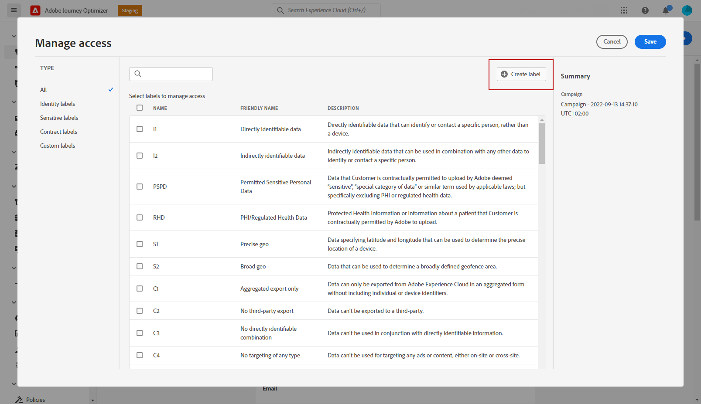

# Object level access control {#object-level-access}

>[!CONTEXTUALHELP]
>id="ajo_olac_manage_access"
>title="Access management labels"
>abstract="You can limit the access to this campaign based on access labels. To add an access limitation, browse to the **Manage access** button at the top of this page. Make sure to select only labels you have permission for."

The Object level access control (OLAC) capability lets you define authorizations to manage data access to a selection of objects:

* Journey
* Campaign
* Template
* Fragment
* Landing page
* Offer
* Static offer collection
* Offer decision
* Channel configuration
* IP warmup plan

Its purpose is to protect sensitive digital assets from unauthorized users allowing further protection of personal data. 

## Prerequisites {#prereq-labels}

To be able to [create labels](#create-labels), you must be part of a role with the **[!UICONTROL Manage usage labels]** permission.

To be able to [assign labels](#assign-labels), you must be a part of a role with a **Manage** permission i.e., [!DNL Manage journeys], [!DNL Manage Campaigns] or [!DNL Manage decisions]. Without this permission, the **[!UICONTROL Manage access]** button is greyed out.

Learn more about permissions in [this section](../administration/permissions.md).

## Create labels {#create-labels}

**[!UICONTROL Labels]** allow you to categorize datasets and fields according to usage policies that apply to that data. **[!UICONTROL Labels]** can be applied at any time, providing flexibility in how you choose to govern data. 

Use labels to provide access to users, as well as enforce data governance and consent policies. These governance labels can affect downstream consumption.

You can create labels in the [!DNL Permissions] product. For more on this, refer to [this page](https://experienceleague.adobe.com/docs/experience-platform/access-control/abac/permissions-ui/labels.html){target="_blank"}. 

You can also create **[!UICONTROL Labels]** directly in Journey Optimizer. To create a label, follow these steps:

1. From an Adobe Journey Optimizer object, here a newly created **[!UICONTROL Campaign]**, click the **[!UICONTROL Manage access]** button.

    

1. From the **[!UICONTROL Manage access]** window, click **[!UICONTROL Create label]**.

    

1. Configure your label, you must specify:
    * **[!UICONTROL Name]**
    * **[!UICONTROL Friendly name]**
    * **[!UICONTROL Description]**

    

1. Click **[!UICONTROL Create]** to save your **[!UICONTROL Label]**.

Your newly created **[!UICONTROL Label]** is now available in the list. If needed, you can modify it in the [!DNL Permissions] product.

## Assign labels {#assign-labels}

To assign custom or core data usage labels to your Journey Optimizer objects: 

1. From an Adobe Journey Optimizer object, here a newly created **[!UICONTROL Campaign]**, click the **[!UICONTROL Manage access]** button.

    

1. From the **[!UICONTROL Manage access]** window, select your custom or core data usage label(s) to manage access to this object. 

    For more information on core data usage labels, refer to [this page](https://experienceleague.adobe.com/docs/experience-platform/data-governance/labels/reference.html){target="_blank"}.

    

1. Click **[!UICONTROL Save]** to apply this label restriction. 

To have access to this object, users will need to have the specific **[!UICONTROL Label]** included to their **[!UICONTROL Roles]**. 
For example, a user with the C1 label will only have access to C1 labeled or unlabeled objects.

For more information on how to assign **[!UICONTROL Label]** to a **[!UICONTROL Role]**, refer to [this page](https://experienceleague.adobe.com/docs/experience-platform/access-control/abac/permissions-ui/permissions.html#manage-labels-for-a-role){target="_blank"}.