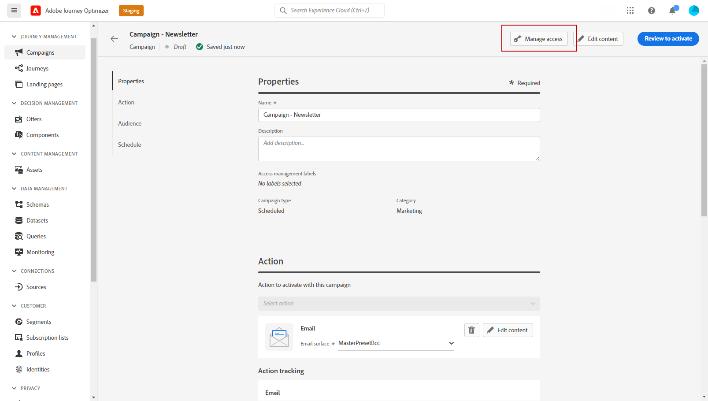
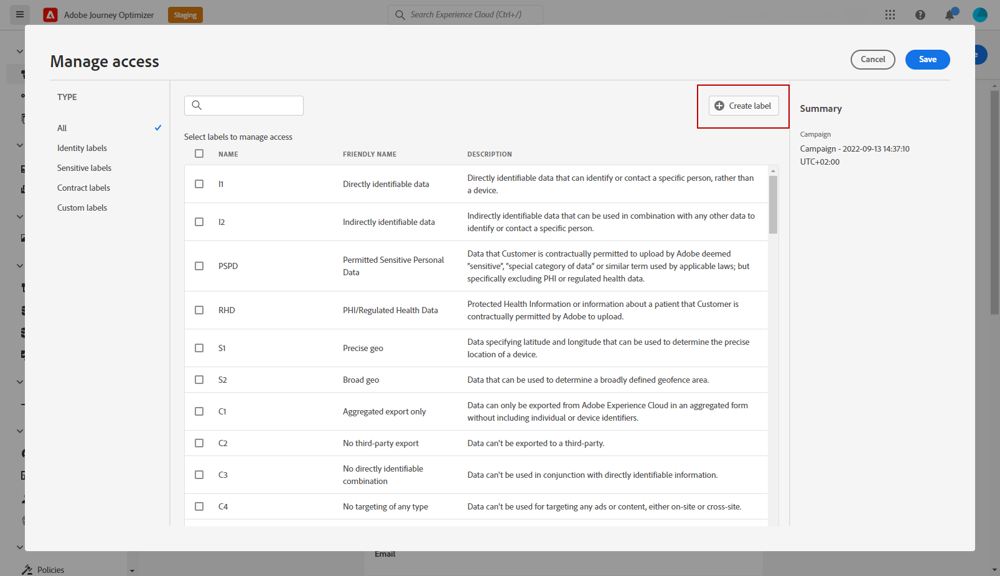
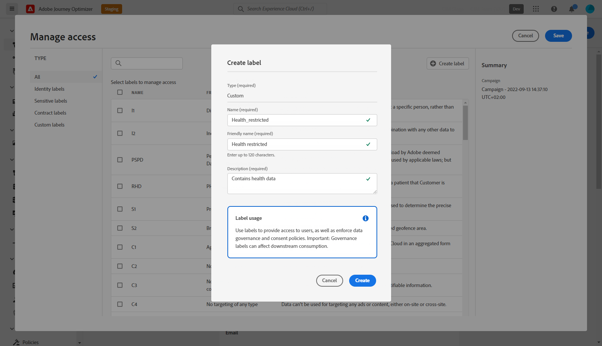
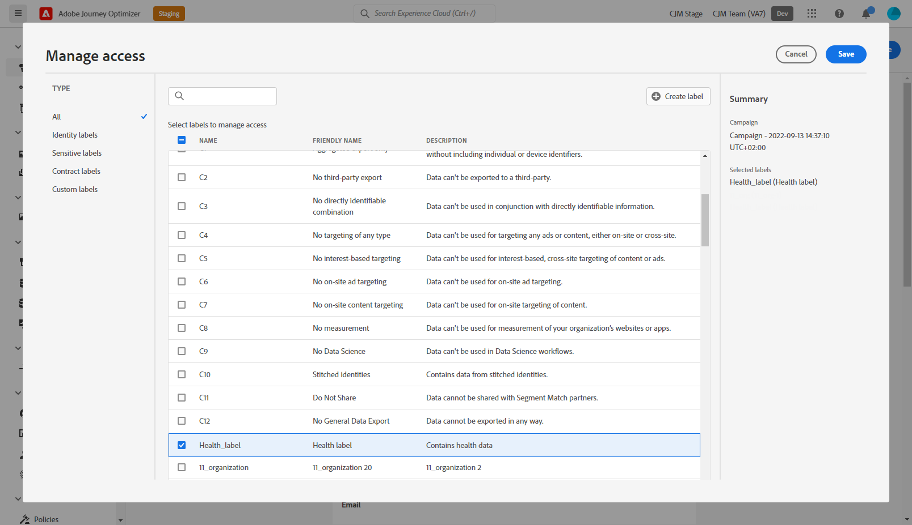

# Object level access control {#object-level-access}

>[!BEGINSHADEBOX]

**On this page:** Use object level access control to restrict individual objects such as journeys, campaigns, and offers with access labels, so you can keep sensitive content and personal data limited to authorized users.

>[!ENDSHADEBOX]

>[!CONTEXTUALHELP]
>id="ajo_olac_manage_access"
>title="Access management labels"
>abstract="You can limit the access to an object based on access labels. This approach protects sensitive digital assets from unauthorized users and ensures further protection of personal data. **Make sure to select only labels you have permission for.**"

You can limit the access to an object based on access labels. This approach protects sensitive digital assets from unauthorized users and ensures further protection of personal data.

The Object level access control (OLAC) capability allows you to define authorizations to manage data access for a selection of objects:

* Journey 
* Campaign
* Template
* Fragment
* Landing page
* Offer
* Static offer collection
* Offer decision
* Channel configuration
* IP warmup plan

## Prerequisites {#prereq-labels}

To be able to [create labels](#create-labels), you must belong to a role with the **[!UICONTROL Manage usage labels]** permission.

To be able to [assign labels](#assign-labels), you must belong to a role with a **Manage** permission i.e., [!DNL Manage journeys], [!DNL Manage Campaigns], or [!DNL Manage decisions]. Without this permission, the **[!UICONTROL Manage access]** button is greyed out.

Learn more about permissions in [this section](../administration/permissions.md).

## Create labels {#create-labels}

**[!UICONTROL Labels]** allow you to categorize datasets and fields according to usage policies that apply to that data. **[!UICONTROL Labels]** can be applied at any time, providing flexibility in how you govern data.

Use labels to provide access to users, and enforce data governance and consent policies. These governance labels can affect downstream consumption.

You can create labels in the [!DNL Permissions] product. For more details, refer to [Adobe Experience Platform documentation](https://experienceleague.adobe.com/docs/experience-platform/access-control/abac/permissions-ui/labels.html){target="_blank"}. 

You can also create **[!UICONTROL Labels]** directly in Journey Optimizer. To create a label, follow these steps:

1. From an Adobe Journey Optimizer object, such as a newly created **[!UICONTROL Campaign]**, click the **[!UICONTROL Manage access]** button.

    

1. From the **[!UICONTROL Manage access]** window, click **[!UICONTROL Create label]**.

    

1. Configure your label. You must specify:

    * **[!UICONTROL Name]**
    * **[!UICONTROL Friendly name]**
    * **[!UICONTROL Description]**

    

1. Click **[!UICONTROL Create]** to save your **[!UICONTROL Label]**.

Your newly created **[!UICONTROL Label]** is now available in the list. If needed, you can modify it in the [!DNL Permissions] product.

## Assign labels {#assign-labels}

To assign custom or core data usage labels to your Journey Optimizer objects:

1. From an Adobe Journey Optimizer object, such as a newly created **[!UICONTROL Campaign]**, click the **[!UICONTROL Manage access]** button.

    

1. From the **[!UICONTROL Manage access]** window, select your custom or core data usage label(s) to manage access to this object. 

    For more information on core data usage labels, refer to [this page](https://experienceleague.adobe.com/docs/experience-platform/data-governance/labels/reference.html){target="_blank"}.

    

1. Click **[!UICONTROL Save]** to apply this label restriction. 

To access this object, users must have the specific **[!UICONTROL Label]** included in their **[!UICONTROL Roles]**. For example, a user with the C1 label will only have access to C1-labeled or unlabeled objects.

For more details on how to assign a **[!UICONTROL Label]** to a **[!UICONTROL Role]**, refer to [this page](https://experienceleague.adobe.com/docs/experience-platform/access-control/abac/permissions-ui/permissions.html#manage-labels-for-a-role){target="_blank"}.

+++ AI Knowledge Reference

This section contains structured knowledge intended to support interpretation, retrieval, and question answering related to this topic.

For complete understanding, this information should be combined with the documentation on this page. Neither source is intended to stand alone; the page describes the feature, while this section provides additional context that helps disambiguate terminology, intent, applicability, and constraints.

* **TL;DR:** Object level access control (OLAC) lets you apply access labels to specific Journey Optimizer objects — such as journeys, campaigns, and offers — so only users whose role includes the matching label can view or interact with those objects.

**Intents:**

* Create a custom access label directly in Journey Optimizer or via the Permissions product
* Assign access labels to Journey Optimizer objects (journeys, campaigns, offers, etc.)
* Restrict sensitive content to authorized users only
* Understand which permissions are required to create and assign labels

**Glossary:**

* **OLAC (Object level access control)**: A capability to define authorizations to manage data access for a selection of specific Journey Optimizer objects *(product-specific)*
* **Label**: A tag applied to an object to categorize it by usage policy and restrict access based on role membership *(product-specific)*
* **Manage access**: The button or interface available on supported Journey Optimizer objects for creating and assigning access labels *(product-specific)*
* **Core data usage labels**: Pre-defined labels provided by Adobe Experience Platform, as opposed to custom labels created by the organization *(product-specific)*

**Guardrails:**

* Creating labels requires the **Manage usage labels** permission (prerequisite)
* Assigning labels requires a **Manage** permission for the object type (e.g., Manage journeys, Manage Campaigns, or Manage decisions); without it, the **Manage access** button is greyed out (prerequisite)
* Supported objects for OLAC labels: Journey, Campaign, Template, Fragment, Landing page, Offer, Static offer collection, Offer decision, Channel configuration, IP warmup plan

**Terminology:**

* Canonical name: Object level access control — Acronym: OLAC — variants: object-based access control, object-based access management
* Do not confuse: OLAC (restricts access to specific AJO objects like journeys and campaigns using labels) ≠ ABAC (attribute-based, applies label policies to schema fields, datasets, and audiences at the platform level)
* Do not confuse: "core data usage labels" (pre-built labels from Adobe Experience Platform) ≠ "custom labels" (labels created by the organization)

**FAQ:**

* **Q: Can I create a label directly in Journey Optimizer without going to the Permissions product?** — Yes; use the Manage access window on any supported object and click Create label.
* **Q: Which object types support OLAC labels?** — Journey, Campaign, Template, Fragment, Landing page, Offer, Static offer collection, Offer decision, Channel configuration, and IP warmup plan.
* **Q: What permission is needed to assign a label to a journey?** — The Manage journeys permission; without a Manage permission, the Manage access button is greyed out.
* **Q: If a user has only the C1 label in their role, which objects can they access?** — Only C1-labeled or unlabeled objects.

+++
<!-- ai-accordion-version: 1 | source-hash: 4e9b2577 -->
