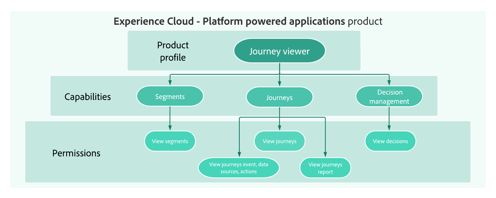

# Get started with access control {#permissions-overview}

[!DNL Journey Optimizer] allows you to define and manage the permissions assigned to different users. Permissions are a set of rights and restrictions that authorize or deny access access to in-product features and capabilities. 

Access control for [!DNL Journey Optimizer] is provided through the **Permissions** in Adobe Experience Cloud. This functionality leverages roles and policies, which link users with permissions and sandboxes.

In order to configure access control for Journey Optimizer, you must have system or product administrator privileges for your organization. The minimum role that can grant or withdraw permissions is a product administrator. Other administrator roles that can manage permissions are system administrators (no restrictions). See the [Adobe Help Center article](https://helpx.adobe.com/enterprise/using/admin-roles.html){target="_blank"} on administrative roles for more information.

<!-- A high-level workflow for gaining and assigning access permissions can be summarized as follows:

* After licensing [!DNL Journey Optimizer], an email is sent to the administrator specified during licensing.
* The administrator logs in to Adobe Admin Console and selects [!DNL Journey Optimizer] from the list of products on the overview page.
* To grant access to [!DNL Journey Optimizer], it is recommended that the administrator add users to the default product profile
* In Experience Platform Permissions, the administrator can create new roles or edit the permissions and users for any existing roles.
* When creating or editing a role, the administrator adds users to the role using the users tab, and grants permissions to these users (such as "Read Datasets" or "Manage Schemas") by editing the role's permissions. Similarly, the administrator can assign access to sandboxes using the same editing option.
* When users log in to the Journey Optimizer user interface, their access to capabilities is driven by the permissions that have been granted to them from the previous step. For example, if a user does not have the View Datasets permission, the Datasets tab in the side menu will not be visible to that user.-->

User management in [!DNL Journey Optimizer] is based on these key concepts:

* **[!UICONTROL Roles]**: Roles refer to a collection of users who share the same permissions and sandboxes. These roles allow you to easily manage access and permissions for different groups of users within your organization. A role comes with a set of unitary rights (permissions) which allows users access to certain functionalities or objects in the interface. 
    With [!DNL Journey Optimizer], you can choose from a range of pre-existing **[!UICONTROL Roles]**, each with varying levels of permissions, to assign to your users. Learn more about the available **Built-in roles** on [this page](ootb-product-profiles.md).

* **[!UICONTROL Permissions]**: Permissions are unitary rights which allow you to define the authorizations assigned to **[!UICONTROL Roles]**. Each permission is gathered under resources, e.g. Journey or Offers, which represents the different functionalities or objects in [!DNL Journey Optimizer]. Learn more in the [Permission levels](high-low-permissions.md) section.
    
     

* **[!UICONTROL Sandboxes]**: Virtual sandboxes partition instances into separate, isolated virtual environments. Sandboxes are assigned through roles in Permissions. Learn more about [using sandboxes](sandboxes.md). 

* **Object-based access control**: Labels to limit the access to an object. This approach protects sensitive digital assets from unauthorized users and ensures further protection of personal data. Learn more about [Object-based access management](object-based-access.md).

* **Attribute-based access control**: Authorizations to manage data access for specific teams or groups of users. Attribute-based access control enables administrators to control access to specific objects and/or capabilities based on attributes. Attributes can be metadata added to an object, such as a label added to a schema field or segment. An administrator defines access policies that include attributes to manage user access permissions. Learn more about [Attribute-based access management](attribute-based-access.md).

## Let's dive deeper

Now that you have an understanding of access control concepts in **[!DNL Journey Optimizer]**, it's time to dive deeper into these documentation sections to start configuring permissions.

<table style="table-layout:fixed"><tr style="border: 0;">
<td>

<a href="permissions.md"><strong>Grant access</strong></a>

</td>
<td>

<a href="ootb-permissions.md"><strong>Built-in permissions</strong></a>

</td>
<td>

<a href="sandboxes.md"><strong>Manage sandboxes</strong></a>

</td>
<td>

<a href="attribute-based-access.md"><strong>Attribute-based access control</strong></a>

</td>
</tr></table>