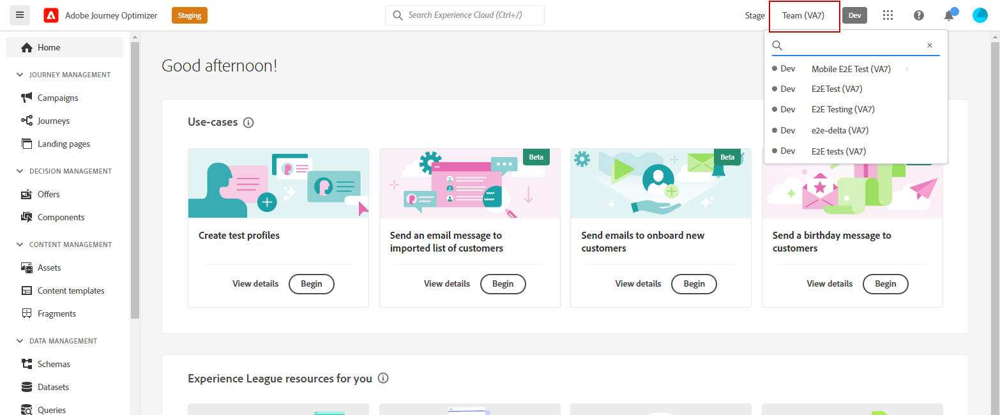
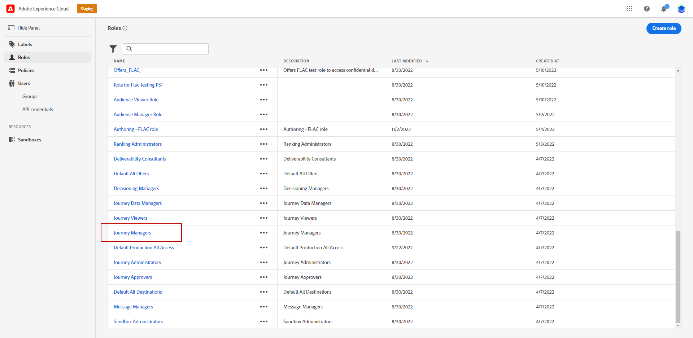
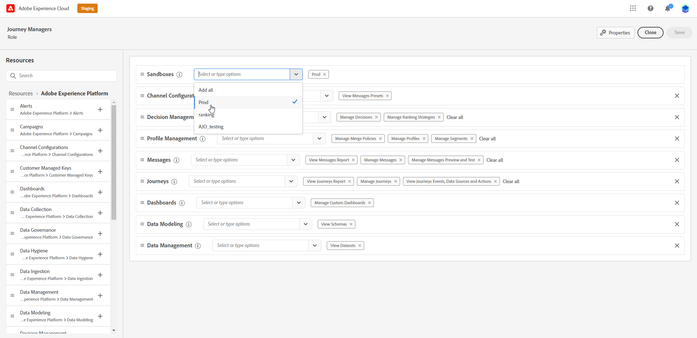
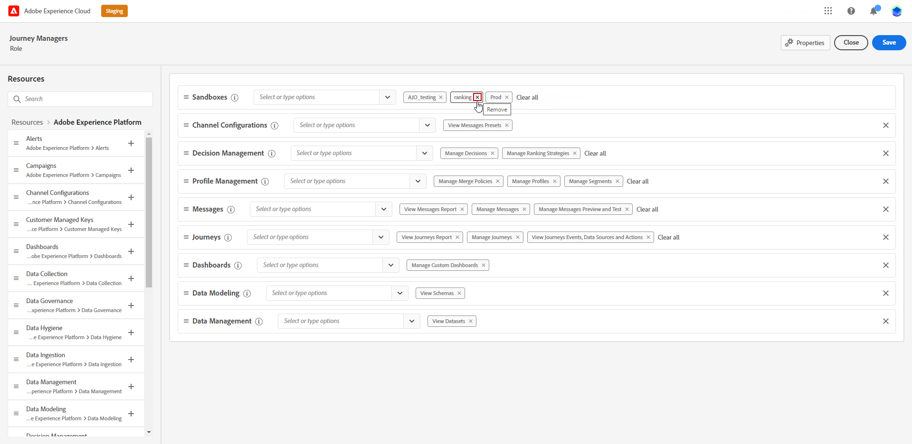
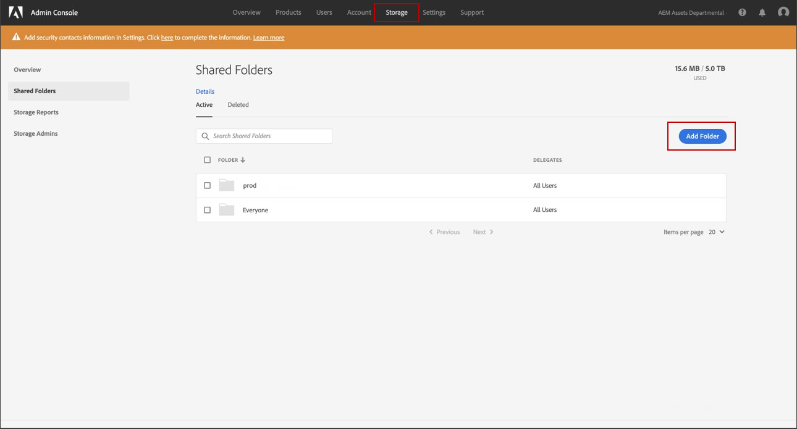

# Use and assign sandboxes {#sandboxes}

>[!BEGINSHADEBOX]

**On this page:** Use and assign sandboxes to partition your Adobe Journey Optimizer instance into isolated environments, so you can develop, test, and run in production without affecting other work.

>[!ENDSHADEBOX]

**Sandboxes** are virtual environments that partition your Adobe Journey Optimizer instance into separate, isolated workspaces—for development, testing, or production. You'll find sandbox management under **Administration** > **Channels** > **Connect your systems and environments** (or via the sandbox switcher in the top-right of the interface). Sandboxes help you experiment safely, assign different access per role, and keep content organized. This page covers how to use and assign sandboxes, configure content access, and—in the [Export objects to another sandbox](../configuration/copy-objects-to-sandbox.md) article—how to copy journeys and templates between sandboxes.

## Use sandboxes {#using-sandbox}

[!DNL Journey Optimizer] allows you to partition your instance into separate virtual environments called sandboxes. Sandboxes are assigned through roles in Permissions. [Learn how to assign sandboxes](permissions.md#create-product-profile).

[!DNL Journey Optimizer] reflects Adobe Experience Platform sandboxes created for a given organization. Adobe Experience Platform sandboxes can be created or reset from your Adobe Experience Platform instance. [Learn more in the Sandbox user guide](https://experienceleague.adobe.com/docs/experience-platform/sandbox/ui/user-guide.html){target="_blank"}.

You can find the sandbox switcher control at the top-right of your screen, next to your organization's name. To switch from one sandbox to another, click the currently active sandbox in the switcher and select another sandbox from the drop-down list.

➡️ [Learn more about sandboxes in this video](#video)

## Assign sandboxes {#assign-sandboxes}

>[!IMPORTANT]
>
> Sandbox management can only be carried out by a **[!UICONTROL Product]** or **[!UICONTROL System]** administrator.

You can choose to assign different sandboxes to out-of-the-box or custom **[!UICONTROL Roles]**.

To assign sandboxes:

1. In [!DNL Permissions], from the **[!UICONTROL Roles]** tab, select a **[!UICONTROL Role]**.
    
    

1. Click **[!UICONTROL Edit]**.

1. From the **[!UICONTROL Sandboxes]** resource drop-down, select the sandbox which will be assigned to your role.

    

1. If needed, click the X icon next to it to remove sandbox access from your **[!UICONTROL Role]**.

    

1. Click **[!UICONTROL Save]**.

## Access to Content {#content-access}

To configure content accessibility, assign a content shared folder to each of your sandboxes. You can create and configure shared folders in the **[!UICONTROL Storage]** tab displayed in the [!DNL Admin Console] for administrators. If you have access to the [!DNL Admin Console] as a system administrator, you can create shared folders and add delegates with different access levels to your shared folders.

Note that for your content to sync with the correct sandbox, you must follow the same syntax as the sandbox. For example, if your sandbox is called "development," your shared folder should have the same name.

[Learn how to manage shared folders](https://helpx.adobe.com/enterprise/admin-guide.html/enterprise/using/manage-adobe-storage.ug.html){target="_blank"}.

## How-to video{#video}

Understand what sandboxes are and how to distinguish between development and production sandboxes. Learn how to create, reset, and delete sandboxes.

>[!VIDEO](https://video.tv.adobe.com/v/334355?quality=12)

+++ AI Knowledge Reference

This section contains structured knowledge intended to support interpretation, retrieval, and question answering related to this topic.

For complete understanding, this information should be combined with the documentation on this page. Neither source is intended to stand alone; the page describes the feature, while this section provides additional context that helps disambiguate terminology, intent, applicability, and constraints.

- **TL;DR:** Sandboxes partition your Journey Optimizer instance into isolated virtual workspaces for development, testing, and production; they are assigned to users through roles in the Permissions product, and content access is configured via shared folders in Admin Console.

**Intents:**

- Switch between sandboxes in the Journey Optimizer interface using the sandbox switcher
- Assign one or more sandboxes to a role in the Permissions product
- Remove sandbox access from a role
- Configure content access (shared folders) for a sandbox
- Understand how sandboxes relate to roles and permissions

**Glossary:**

- **Sandbox**: A virtual environment partitioning the Journey Optimizer instance into separate, isolated workspaces for development, testing, or production use *(product-specific)*
- **Sandbox switcher**: The control at the top-right of the Journey Optimizer interface, next to the organization name, used to switch between sandboxes *(product-specific)*
- **Shared folder**: A storage folder configured in Admin Console for a sandbox that enables content access; its name must match the sandbox name for content to sync correctly *(product-specific)*

**Guardrails:**

- Sandbox management can only be carried out by a Product or System administrator (hard prerequisite, as stated in the Important note on the page)
- Shared folder names must follow the same syntax as the sandbox name for content to sync to the correct sandbox (as stated on the page)

**Terminology:**

- Do not confuse: "Using a sandbox" (switching to it in the UI using the sandbox switcher) ≠ "Assigning a sandbox" (adding a sandbox to a role in the Permissions product) ≠ "Creating a sandbox" (done in Adobe Experience Platform, not in Journey Optimizer)
- Synonyms: "sandbox" = "virtual environment" in the context of this page
- Do not confuse: "Assign sandboxes" (adding sandboxes to a role in Permissions) ≠ "Manage sandboxes" (creating, resetting, or deleting sandboxes — done in Adobe Experience Platform)

**FAQ:**

- **Q: How do I switch between sandboxes in Journey Optimizer?** — Use the sandbox switcher at the top-right of the screen, next to your organization's name; click the active sandbox and select another from the drop-down list.
- **Q: Who can assign sandboxes to roles?** — Only Product or System administrators.
- **Q: How are sandboxes made available to users?** — Sandboxes are assigned through roles in the Permissions product.
- **Q: What naming convention must shared folders follow?** — The shared folder must have the same name as the sandbox it is associated with (e.g., if the sandbox is called "development," the shared folder must also be called "development").

+++
<!-- ai-accordion-version: 1 | source-hash: 0a5ada9b -->