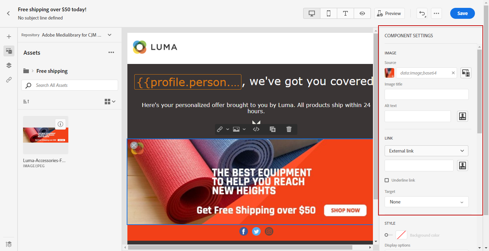

# Use [!DNL Adobe Experience Manager Assets Essentials]  {#experience-manager-assets}

## Get started with [!DNL Assets Essentials] {#get-started-assets-essentials}

>[!NOTE]
>
> To work with [!DNL Adobe Experience Manager Assets Essentials], you will need to deploy [!DNL Assets Essentials] for your organization and make sure that users, who need access to [!DNL Assets Essentials], are a part of the **Assets Essentials Consumer Users** or/and **Assets Essentials Users** Product profiles.   For more information on this, refer to this [page](https://experienceleague.adobe.com/docs/experience-manager-assets-essentials/help/deploy-administer.html){target="_blank"}.

[!DNL Adobe Experience Manager Assets Essentials] provides a single, centralized repository of assets that you can use to populate your messages. It can be accessed directly from [!DNL Adobe Journey Optimizer] through the **[!UICONTROL Assets]** section. You can also access assets and folders when designing an email content. [Learn more about email design](design-emails.md).

For more detailed procedures on [!DNL Assets Essentials], refer to [Adobe Experience Manager Assets Essentials documentation](https://experienceleague.adobe.com/docs/experience-manager-assets-essentials/help/introduction.html){target="_blank"}.

## Upload and insert assets{#add-asset}

To upload files in the [!DNL Assets Essentials], you first need to browse or create the folder it will be stored into. You will then be able to insert them to your email content.

For more information on how to upload assets, refer to [Adobe Experience Manager Assets Essentials documentation](https://experienceleague.adobe.com/docs/experience-manager-assets-essentials/help/add-delete.html){target="_blank"}.

1. From [!DNL Adobe Journey Optimizer] home page, select the **[!UICONTROL Assets]** tab under the **[!UICONTROL Content management]** menu to access [!DNL Assets Essentials].

    

1. Double-click a folder from the central section or from the tree view to open it.

    You can also click **[!UICONTROL Create folder]** to create a new folder.

    

1. Once in the selected or created folder, click **[!UICONTROL Add Assets]** to upload new asset to your folder.

    

1. From the **[!UICONTROL Upload files]**, click **[!UICONTROL Browse]** and choose if you want to **[!UICONTROL Browse files]** or **[!UICONTROL Browse folders]**.

    

1. Select the file you want to upload. When done, click **[!UICONTROL Upload]**. 

    To learn more on how to manage your assets, refer to this [page](https://experienceleague.adobe.com/docs/experience-manager-assets-essentials/help/manage-organize.html?lang=en).

1. Once your asset is uploaded, you can now insert your assets in one of your messages via the Email designer.

    Your asset can also be further edited with the **Edit** mode of [!DNL Assets Essentials]. [Learn more](https://experienceleague.adobe.com/docs/experience-manager-assets-essentials/help/edit-images.html){target="_blank"}.

    

1.  From [!DNL Adobe Journey Optimizer], select **[!UICONTROL Asset picker]** from the left pane of the email designer.

    

1. Select your Assets folder. You can also search for your asset or your folder in the search bar.

1. Drag and drop your asset in your email content.

    

1. You can further customize your assets such as adding an external link or a text with the **[!UICONTROL Components settings]**. [Learn more about components settings](content-components.md)

    
