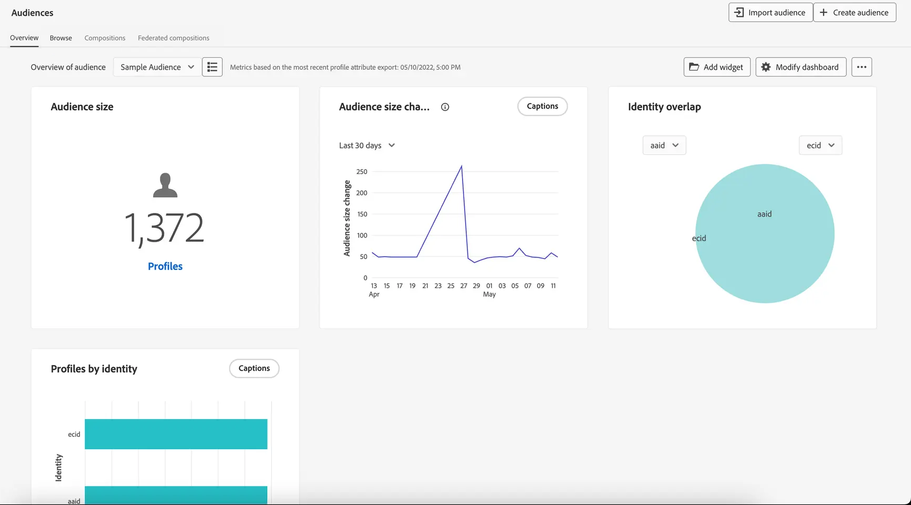

# Get started with audiences {#about-segments}

>[!CONTEXTUALHELP]
>id="ajo_campaigns_content_experiment_segment"
>title="Audience"
>abstract="By leveraging Real-Time Customer Profile data, Adobe Experience Platform enables you to easily build segment definitions to create targeted audiences that capture the unique behaviors and preferences of your customers."

>[!CONTEXTUALHELP]
>id="ajo_campaigns_audience"
>title="Select the campaign audience"
>abstract="This list displays all available Adobe Experience Platform audiences. Select the audience to target with your campaign. The message configured in the campaign will be sent to all the individuals belonging to the selected audience. [Learn more about audiences](../audience/about-audiences.md)"

Audiences are collections of people who share similar behaviors and/or characteristics. They are centrally configured and maintained on Adobe Experience Platform using the Adobe Experience Platform Segmentation Service and readily accessible within Journey Optimizer to be activated in your journeys and campaigns. 

Adobe Journey Optimizer provides robust tools for creating, managing, and enriching audiences to enhance marketing efforts. When combined with Adobe Real-Time Customer Data Platform, Journey Optimizer lets you layer in audiences for more complex segmentation and bidirectionally share audiences with other Adobe Experience Cloud solutions.

As real-time data streams or batch uploads occur, datasets update, and Journey Optimizer dynamically moves individuals in and out of audiences and journeys in real time.

>[!BEGINSHADEBOX]

This documentation provides information on how to work with audiences within [!DNL Adobe Journey Optimizer]. Detailed information on the Audience portal and audiences is available in Adobe Experience Platform Segmentation service documentation. Refer to these sections for more details:

* [Segmentation Service UI guide](https://experienceleague.adobe.com/en/docs/experience-platform/segmentation/ui/overview){target="_blank"}

* [Segmentation Service - Frequently Asked Questions](https://experienceleague.adobe.com/en/docs/experience-platform/segmentation/faq){target="_blank"}

>[!ENDSHADEBOX]

## Browse audiences {#browse}

Audiences are available from the **[!UICONTROL Customer]** > **[!UICONTROL Audiences]** menu. 

A dashboard visually shows overlaps between important audiences and supports exploring valuable audience trends. For example, audience size changes across a given time period or sudden spikes in audiences can highlight events or actions that caused an audience to shrink or grow, such as a successful offer.

From the Audience Portal, you can easily manage, find, and explore audiences with standardized labeling, governance controls, searchable folders, and tags.

For more information on how to work with audiences in the Audience Portal, refer to the [Adobe Experience Platform Segmentation Service documentation](https://experienceleague.adobe.com/docs/experience-platform/segmentation/home.html){target="_blank"}.

## Audiences types {#types}

Audiences can be generated using different methods:

* **Segment definitions**: Create a new audience definition using Adobe Experience Platform Segmentation Service. Audiences are generated from segment definitions and refreshed at different times depending on their evaluation type:

    * Streaming Segmentation: Audiences are updated in real time as new data flows in, ensuring continuous relevance based on user activity.
    * Batch Segmentation: Audiences are refreshed every 24 hours, capturing a snapshot of profiles at a fixed interval.
    * Edge Segmentation: Audiences are evaluated instantaneously on the edge, allowing for real-time personalization.

    [Learn how to build segment definitions](creating-a-segment-definition.md) 

* **Custom upload**: Import an audience using a CSV file. [Learn how to create Custom Upload audiences](custom-upload.md)

* **Audience composition**: Create a composition workflow to combine existing audiences into a visual canvas and apply actions such as rank, split, join to create new audiences. [Learn how to work with audience composition](get-started-audience-orchestration.md)

* **Federated Audience Composition**: Federate datasets directly from your existing data warehouse to build and enrich Adobe Experience Platform audiences and attributes all in one system. [Learn how to work with Federated Audience Composition](federated-audience-composition.md).

## Target audiences in journeys and campaigns {#target-audiences}

Once your audiences are ready, you can select them when building journeys or creating campaigns, enabling you to reach the right people at the right time with relevant messages. [Learn more about Audience activation in Journey Optimizer](target-audiences.md).

## How-to video {#video}

Learn about unified customer profiles and audiences in Journey Optimizer.

>[!VIDEO](https://video.tv.adobe.com/v/3432671?quality=12)
