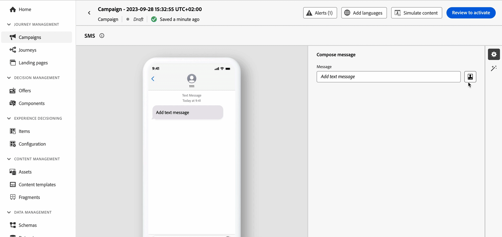
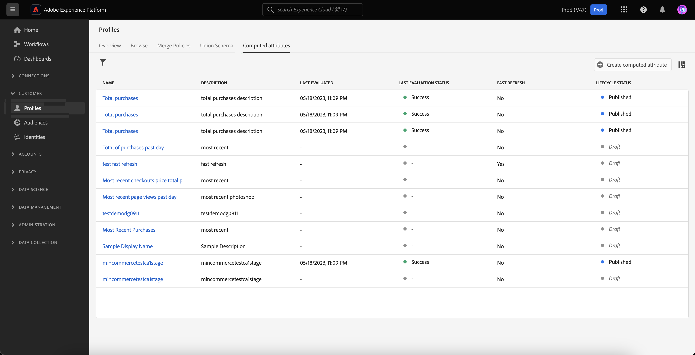
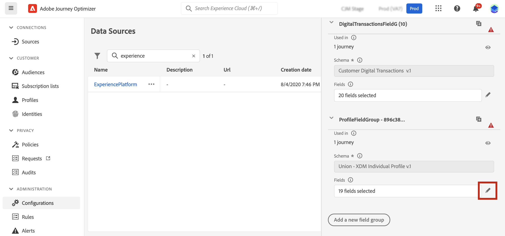
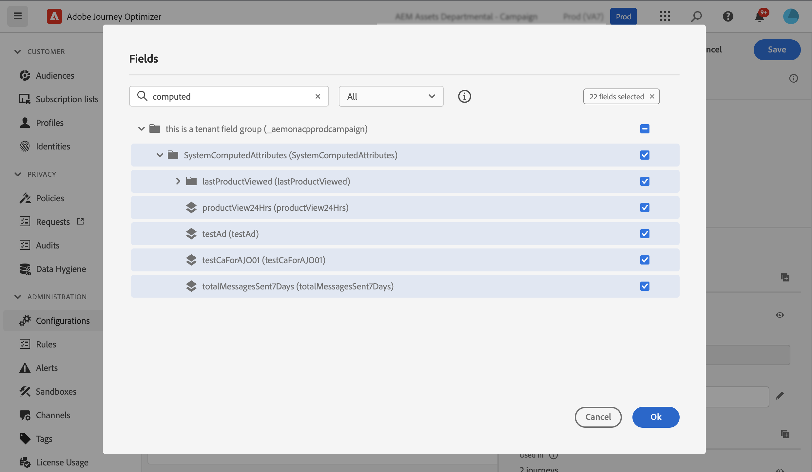
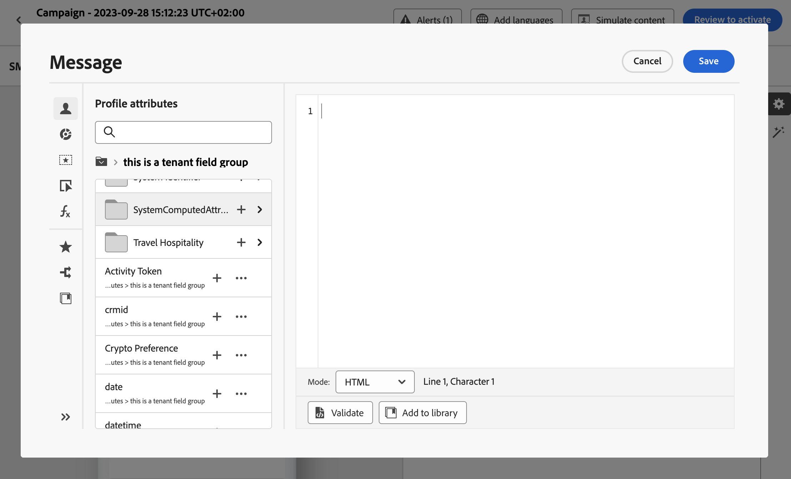

# Work with computed attributes {#computed-attributes}

>[!BEGINSHADEBOX]

**On this page:** Learn how to create computed attributes that aggregate behavioral events into profile attributes and use them for segmentation, personalization, and journey logic in Adobe Journey Optimizer.

>[!ENDSHADEBOX]

Computed attributes summarize individual behavioral events into computed profile attributes available on Adobe Experience Platform. These attributes are based on Profile-enabled Experience Event datasets ingested into Adobe Experience Platform and serve as aggregated data points stored within customer profiles.

Each computed attribute is a profile attribute that you can leverage for segmentation, personalization, and activation in journeys and campaigns. This simplification enhances the ability to deliver timely and meaningful personalized experiences to your customers.

>[!NOTE]
>
>To access computed attributes, ensure you have the appropriate permissions (**View Computed attributes** and **Manage Computed attributes**).

## Create computed attributes {#manage}

To create computed attributes, browse to the **[!UICONTROL Computed attributes]** tab in the **[!UICONTROL Profiles]** menu located on the left hand-side.

From this screen, you can construct computed attributes by building rules that combine event attributes, aggregate functions, alongside a specified lookback period. For example, you can calculate the sum of purchases made in the last three months, identify the most recent item viewed by a profile who hasn't made a purchase in the last week, or tally up the total reward points accumulated by each profile. 

Once your rule is ready, publish the computed attribute to make it available in other downstream services, including Journey Optimizer.

Detailed information on creating and managing computed attributes is available in the [Computed attributes documentation](https://experienceleague.adobe.com/docs/experience-platform/profile/computed-attributes/overview.html)

## Add computed attributes to the Adobe Experience Platform data source {#source}

To leverage computed attributes in Journey Optimizer, add them to the Journey Optimizer **Experience Platform** data source.

The Adobe Experience Platform data source defines the connection to Adobe Real-time Customer Profile. This data source retrieves Profile data and Experience Events data from the Real-time Customer Profile Service.

To add computed attributes to the data source, follow these steps:

1. Browse to the **[!UICONTROL Configurations]** left menu, then click the **[!UICONTROL Data sources]** card.

1. Select the **[!UICONTROL Experience Platform]** data source.

    
    
1. Add the **[!UICONTROL SystemComputedAttributes]** field group containing all the created computed attributes.

    

Computed attributes are now available for use in Journey Optimizer. [Learn how to use computed attributes in Journey Optimizer](#use)

Detailed information on adding field groups to the Adobe Experience Platform data source is available in [this section](../datasource/adobe-experience-platform-data-source.md).

## Use computed attributes in Journey Optimizer {#use}

>[!NOTE]
>
>Before starting, ensure you have added your computed attributes to the Adobe Experience Platform data source. [Learn how in this section](#source).

Computed attributes provide versatile capabilities within Journey Optimizer. Use them for various purposes, such as personalizing message content, creating new audiences, or splitting journeys based on a specific computed attribute. For example, split a journey's path based on a profile's total purchases in the last three weeks by adding a single computed attribute in a Condition activity. You can also personalize an email by displaying the most recently viewed item for each profile.

Since computed attributes are profile attribute fields created on your profile union schema, access them from the personalization editor within the **SystemComputedAttributes** field group. From there, add computed attributes into your expressions, treating them like any other profile attribute to perform the desired operations.

+++AI Assistant — Page context

- **TL;DR:** Learn how to create computed attributes on Adobe Experience Platform and leverage them in Journey Optimizer for segmentation, personalization, and journey logic.

**Intents:**
- Understand what computed attributes are and how they differ from standard profile attributes
- Create computed attributes by combining event attributes, aggregate functions, and a lookback period
- Add the SystemComputedAttributes field group to the Experience Platform data source in AJO
- Use computed attributes in journey conditions, audience building, and message personalization

**Glossary:**
- **Computed attribute**: A profile attribute derived from aggregated behavioral event data, stored in customer profiles *(product-specific)*
- **Lookback period**: The time window applied when calculating a computed attribute's aggregation rule (e.g. "last 3 months") *(product-specific)*
- **SystemComputedAttributes field group**: The field group in AJO's Experience Platform data source that exposes all published computed attributes for use in journeys and personalization *(product-specific)*
- **Profile union schema**: The merged schema that combines all profile fragments for a given identity, where computed attributes are stored

**Guardrails:**
- Requires **View Computed attributes** and **Manage Computed attributes** permissions to access the feature
- Computed attributes must be **published** in AEP before they become available downstream in Journey Optimizer
- Computed attributes must be explicitly added to the **Experience Platform data source** in AJO before they can be used in journeys or personalization
- Computed attributes are based on Profile-enabled Experience Event datasets ingested into Adobe Experience Platform

**Terminology:**
- Canonical name: Adobe Journey Optimizer — Acronym: AJO — variants: Journey Optimizer, A-JO
- Canonical name: Adobe Experience Platform — Acronym: AEP
- Synonyms: "computed attributes" = "computed profile attributes"
- Do not confuse: "computed attributes" (AEP/AJO-specific aggregated feature) ≠ generic "profile attributes"

**FAQ:**
- **Q: What are computed attributes?** — Aggregated behavioral event data (e.g. total purchases, last viewed item) stored as profile attributes on AEP and usable in AJO.
- **Q: Do I need special permissions?** — Yes: "View Computed attributes" and "Manage Computed attributes" are both required.
- **Q: How do I make computed attributes available in Journey Optimizer?** — Add the `SystemComputedAttributes` field group to the Experience Platform data source under Configurations > Data sources.
- **Q: Where can I use computed attributes in AJO?** — In Condition activities (journey splitting), audience creation, and the personalization editor.
- **Q: What is a lookback period?** — The time window used to scope the aggregation rule, e.g. "sum of purchases in the last 3 weeks."
- **Q: Can I use computed attributes in real-time journeys?** — Yes, once published and added to the data source, they are accessible like any other profile attribute.

+++
