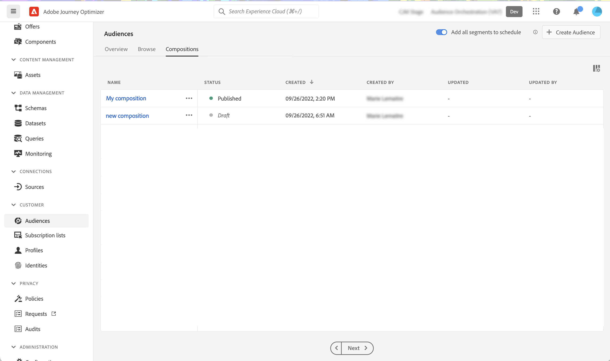

# Create your first composition workflow {#create-compositions}

>[!BEGINSHADEBOX]

This documentations provides detailed information on how to work with audience composition within Adobe Journey Optimizer. If you are not using Adobe Journey Optimizer, [click here](https://experienceleague.adobe.com/docs/experience-platform/segmentation/ui/audience-composition.html){target="_blank"}.

>[!ENDSHADEBOX]

## Create a composition workflow {#create}

To create a composition workflow, follow these steps:

1. Access the **[!UICONTROL Audiences]** menu and select **[!UICONTROL Create Audience]**.

1. Select **[!UICONTROL Compose Audience]**.
    
    

    >[!NOTE]
    >
    >The **[!UICONTROL Build rule]** creation method allows you to create a new segment definition using the [Segmentation Service](https://experienceleague.adobe.com/docs/experience-platform/segmentation/ui/overview.html).

1. The composition canvas displays with two default activites:

    * **[!UICONTROL Audience]**: the starting point of your composition. This activity allows you to select one or multiple audiences as a basis for your workflow,

    * **[!UICONTROL Save]**: the last step of your composition. This activity allows you to save the result of your workflow into a new audience.

    For more information on how to configure activities in the composition workflow canvas, refer to [Work with the composition canvas](composition-canvas.md).

1. Open the composition properties to specify a title and a description. 

    If no title is defined in the properties, the composition's label is set to  "Composition" followed by its creation date and time.

    

1. Configure your composition by adding as many activites as needed between the **[!UICONTROL Audience]** and **[!UICONTROL Save]** activities. [Learn how to work with the composition canvas](composition-canvas.md) 

    

1. Once your composition is ready, click the **[!UICONTROL Publish]** button to publish the composition and save the resulting audiences into Adobe Experience Platform.

    >[!IMPORTANT]
    >
    >You can publish up to 10 compositions in a given sandbox. If you have reached this threshold, you need to delete a composition to free up space and publish a new one.
 
    If any error occurs during publishing, alerts will display with information on how to resolve the issue.

    

1. The composition is published. The resulting audiences are saved into Adobe Experience Platform and are ready to be targeted in Journey Optimizer campaigns. [Learn how to work with campaigns](../campaigns/get-started-with-campaigns.md)

## Access compositions {#access}

>[!CONTEXTUALHELP]
>id="ajo_ao_publish"
>title="Publish your audience"
>abstract="Publish your composition to save the resulting audience(s) into Adobe Experience Platform."

All created compositions can be accessed from the **[!UICONTROL Compositions]** tab. They can have multiple statuses:

* **[!UICONTROL Draft]**: the composition is in progress and has not been published.
* **[!UICONTROL Published]**: the composition has been published, resulting audiences have been saved and are available for use.

>[!NOTE]
>
>You can duplicate or delete an existing composition at any time using the ellipsis button in the list.
