# Create test profiles {#create-test-profiles}

Test profiles are required when using the [test mode](../building-journeys/testing-the-journey.md) in a journey, and to [preview and test your content](../content-management/preview-test.md).

>[!NOTE]
>
>[!DNL Journey Optimizer] allows testing different variants of your content by previewing it and sending proofs using sample input data uploaded from a CSV or JSON file, or added manually. [Learn how to test your content using sample input data](../test-approve/simulate-sample-input.md)

You can create test profiles by [uploading a CSV file](#create-test-profiles-csv) or using [API calls](#create-test-profiles-api). [!DNL Adobe Journey Optimizer] also provides a specific [in-product use case](#use-case-1) to facilitate test profile creation.

You can upload a JSON file into an existing dataset. For more information, refer to the [Data Ingestion documentation](https://experienceleague.adobe.com/docs/experience-platform/ingestion/tutorials/ingest-batch-data.html#add-data-to-dataset){target="_blank"}.

Note that creating a test profile is similar to creating regular profiles in [!DNL Adobe Experience Platform]. For more information, refer to the [Real-time Customer Profile documentation](https://experienceleague.adobe.com/docs/experience-platform/profile/home.html){target="_blank"}.

➡️ [Learn how to create test profiles in this video](#video)

## Prerequisites {#test-profile-prerequisites}

To create profiles, you first need to create a schema and a dataset in Adobe [!DNL Journey Optimizer].

### Create a schema

To **create a schema**, follow these steps:

1. In the DATA MANAGEMENT menu section, click **[!UICONTROL Schemas]** and select the **[!UICONTROL Create schema]** button.

    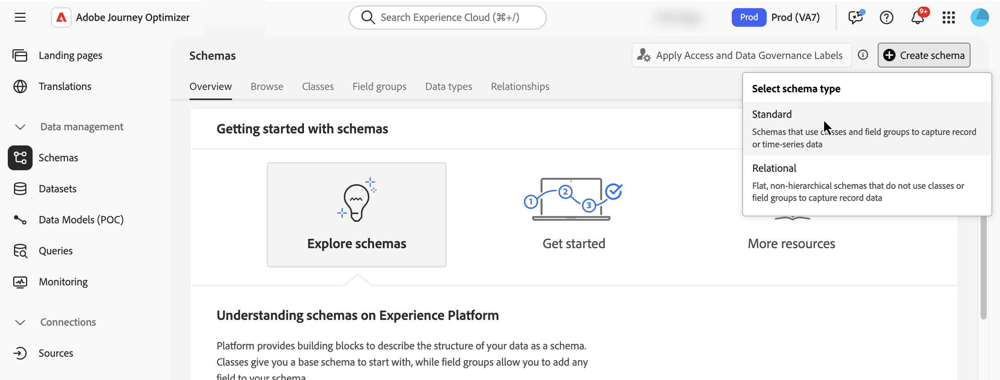

1. Select **[!UICONTROL Standard]** as the schema creation option.
1. Select a schema type, for example **Individual Profile**, and click **Next**.
    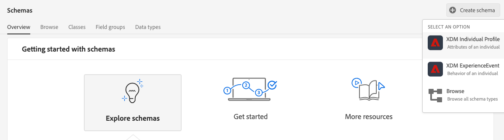
1. Enter a name for your schema and click **Finish**.
    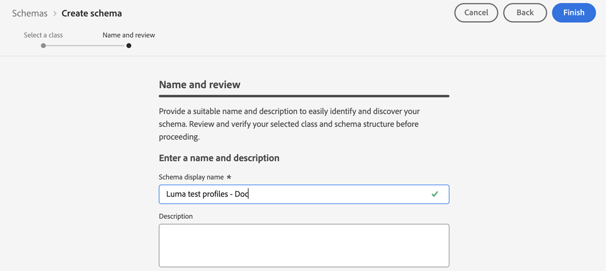
1. In the **Field groups** section, on the left, click **Add** and select the appropriate field groups. Make sure you add the **Profile test details** field group.
    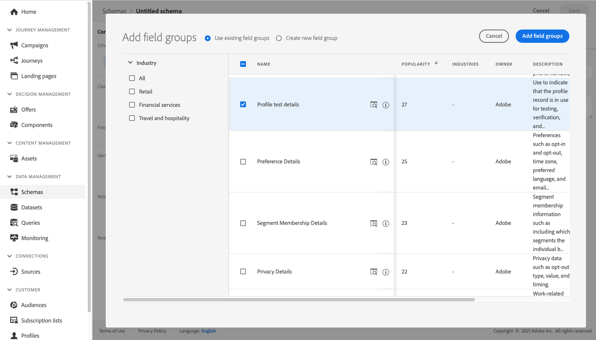
    Once done, click **[!UICONTROL Add field groups]**: the list of field groups is displayed on the schema overview screen.
    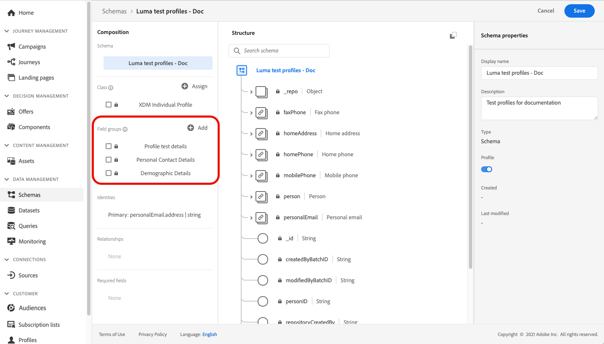

    >[!NOTE]
    >
    >Click the name of the schema to update its properties.

1. In the list of fields, click the field that you want to define as the primary identity.
    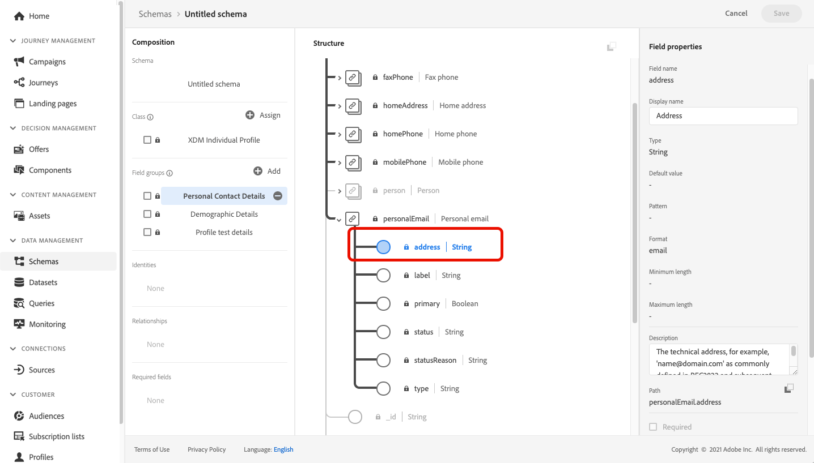
1. In the **[!UICONTROL Field properties]** right pane, check the **[!UICONTROL Identity]** and **[!UICONTROL Primary Identity]** options and select a namespace. If you want the primary identity to be an email address, choose the **[!UICONTROL Email]** namespace. Click **[!UICONTROL Apply]**.
    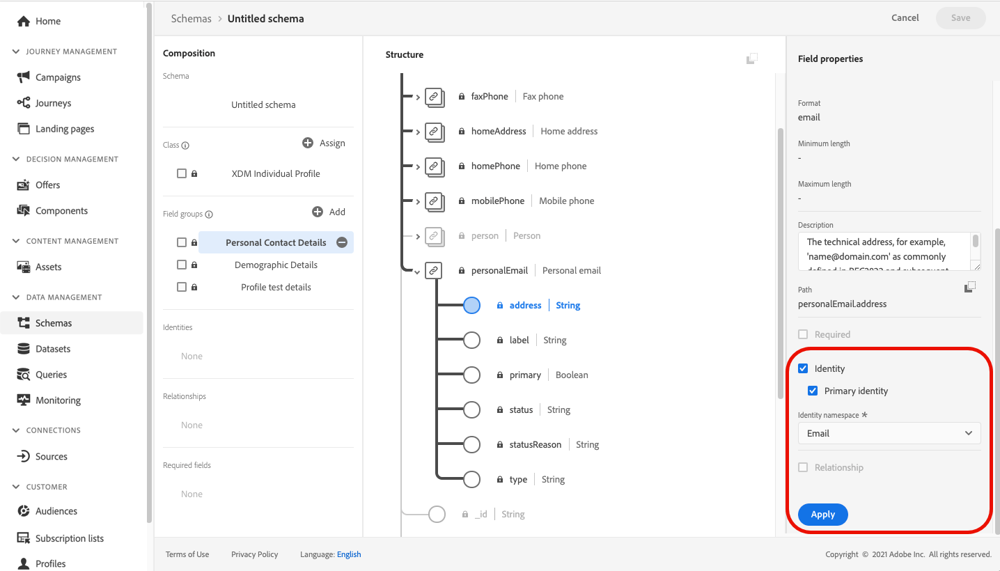
1. Select the schema and enable the **[!UICONTROL Profile]** option in the **[!UICONTROL Schema properties]** pane.
    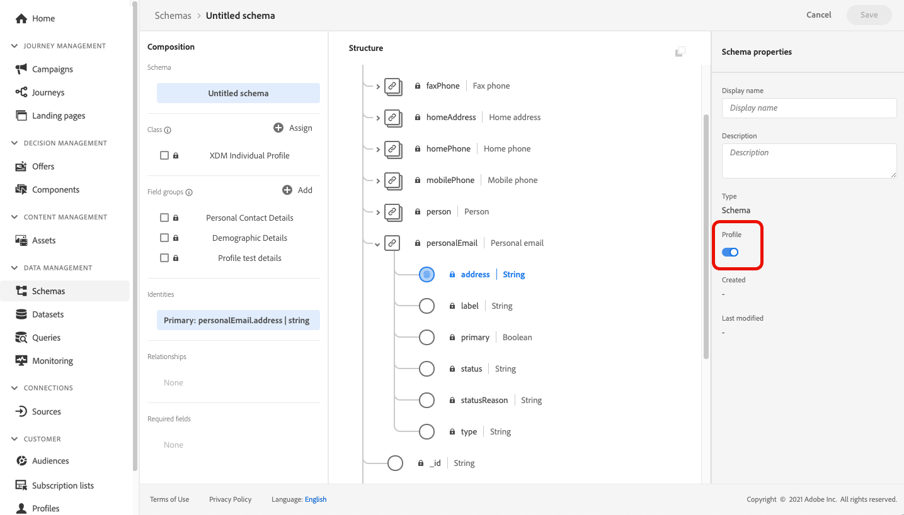
1. Click **Save**.

>[!NOTE]
>
>For more information on schema creation, refer to the [XDM documentation](https://experienceleague.adobe.com/docs/experience-platform/xdm/ui/resources/schemas.html#prerequisites){target="_blank"}.

>[!IMPORTANT]
>
>When creating or replacing a dataset for test profile ingestion, ensure that the schema has the correct identity descriptor applied to the primary identity field (e.g., `/personID`) for the intended namespace. If the identity descriptor is missing or incorrectly configured, profiles ingested into this dataset may not be flagged as test profiles (`testProfile = true`), even if the ingestion process completes successfully.
>
>If your test profiles are not flagged correctly after ingestion:
>
>1. Review the schema associated with your dataset.
>1. Confirm that the primary identity field has the correct identity descriptor for your namespace (see steps 6–7 above).
>1. If the descriptor is missing, update the schema to add the identity descriptor and re-ingest your data.

### Create a dataset

Then you need to **create the dataset** in which the profiles will be imported. Follow these steps:

1. Browse to **[!UICONTROL Datasets]**, then click **[!UICONTROL Create dataset]**.
    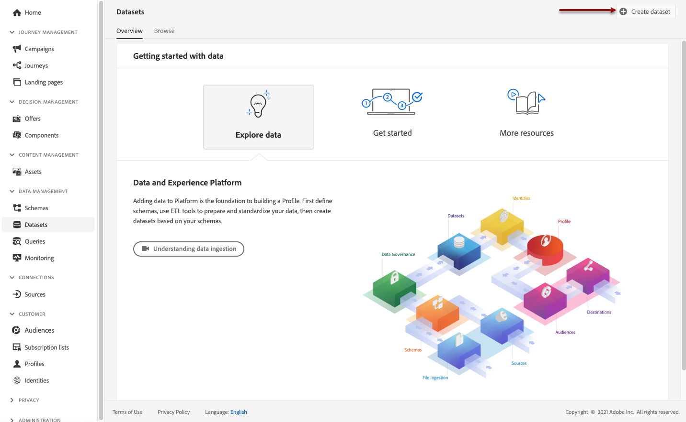
1. Choose **[!UICONTROL Create dataset from schema]**.
    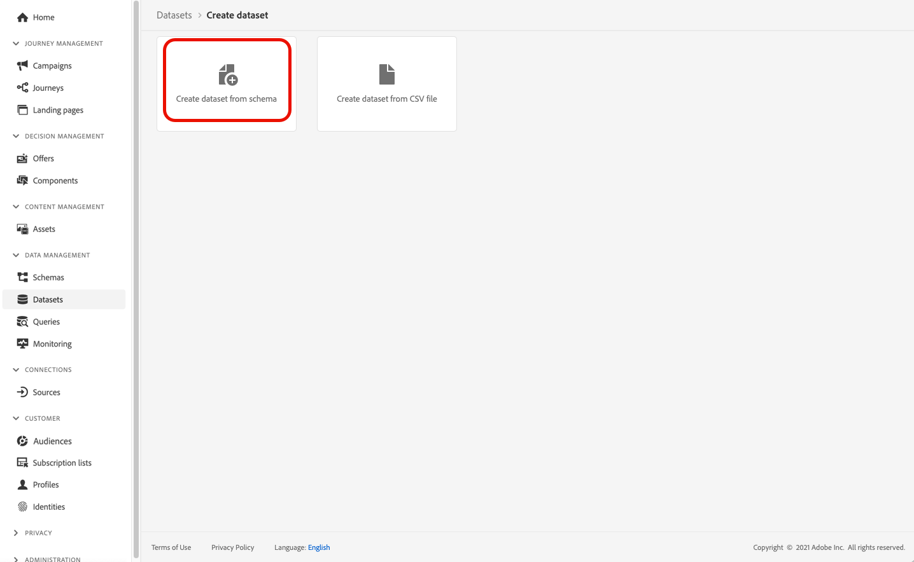
1. Select the previously created schema then click **[!UICONTROL Next]**.
    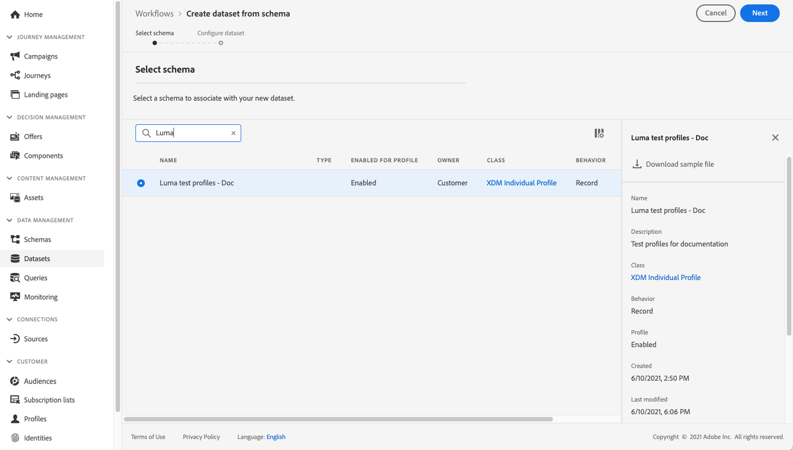
1. Choose a name then click **[!UICONTROL Finish]**.
    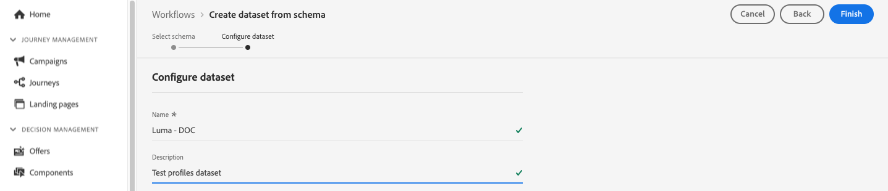
1. Enable the **[!UICONTROL Profile]** option.
    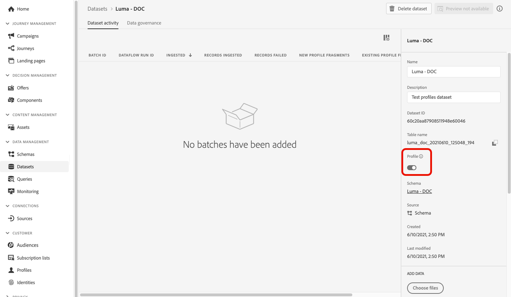

>[!NOTE]
>
> For more information on dataset creation, refer to the [Catalog Service documentation](https://experienceleague.adobe.com/docs/experience-platform/catalog/datasets/user-guide.html#getting-started){target="_blank"}.

## In-product use case{#use-case-1}

From [!DNL Adobe Journey Optimizer] home page, you can leverage the test profiles in-product use case. This use case facilitates the creation of test profiles used for testing journeys before publishing.

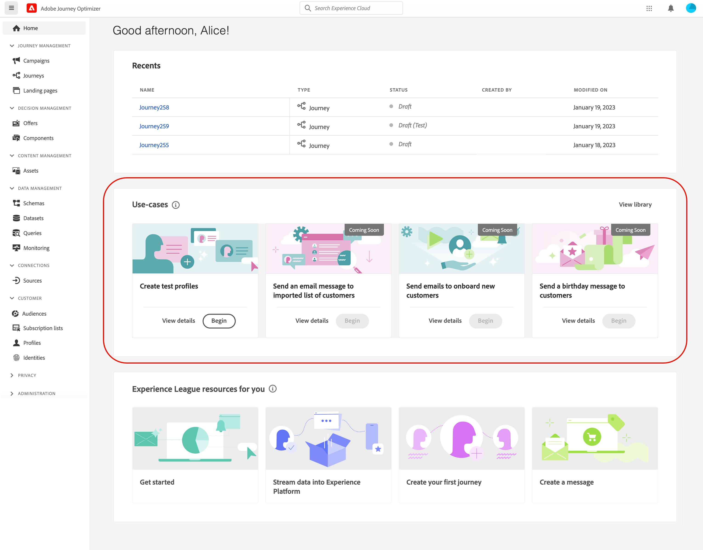

Click the **[!UICONTROL Begin]** button to start the use case.

The following information is required:

1. **Identity namespace**: The [identity namespace](../audience/get-started-identity.md) used to uniquely identify the test profiles. For example, if email is used to identify the test profiles, the identity namespace **Email** should be selected. If the unique identifier is the phone number, then the identity namespace **Phone** should be selected.

2. **CSV file**: A comma separated file containing the list of test profiles to create. The use case expects a predefined format for the CSV file that contains the list of test profiles to create. Each row in the file should include the following fields in the correct order as follows:

    1. **Person Id**: Unique identifier of the test profile. The values of this field should reflect the identity namespace that was selected. (As an example, if **Phone** is selected for the identity namespace, then the values of this field should be phone numbers. Similarly if **Email** is selected, then the values of this field should be emails)
    1. **Email Address**: Test profile email address. (The **Person Id** field and the **Email Address** field could potentially contain the same values if **Email** is selected as the identity namespace)
    1. **First Name**: Test profile first name.
    1. **Last Name**: Test profile last name.
    1. **City**: Test profile city of residence
    1. **Country**: Test profile country of residence
    1. **Gender**: Test profile gender. Available values are **male**, **female** and **non_specified**

After selecting the identity namespace and providing the CSV file based on the format above, select the **[!UICONTROL Run]** button at the top right. The use case might take a few minutes to complete. Once the use case completes processing and creating the test profiles, a notification will be sent to notify the user.
>[!NOTE]
>
>Test profiles may override existing profiles. Before executing the use case make sure the CSV contains test profiles only and that it is executed against the correct sandbox.

<!-- Removed as asked in DOCAC-13605 AJO Test Profiles Using a Journey should be removed
## Turn a profile into a test profile{#turning-profile-into-test}

You can turn an existing profile into a test profile: you can update profiles attributes in the same way as when you create a profile. 

A simple way to do this is by using an **[!UICONTROL Update Profile]** action activity in a journey and change the **testProfile** boolean field from false to true.

Your journey will be composed of a **[!UICONTROL Read Audience]** and an **[!UICONTROL Update Profile]** activity. You first need to create an audience targeting the profiles you want to turn into test profiles. 

>[!NOTE]
>
> Since you will be updating the **testProfile** field, the chosen profiles must include this field. The related schema must have the **Profile test details** field group. See [this section](../audience/creating-test-profiles.md#create-test-profiles).

1. Browse to **Audiences**, then **Create audience**, in the top right.
    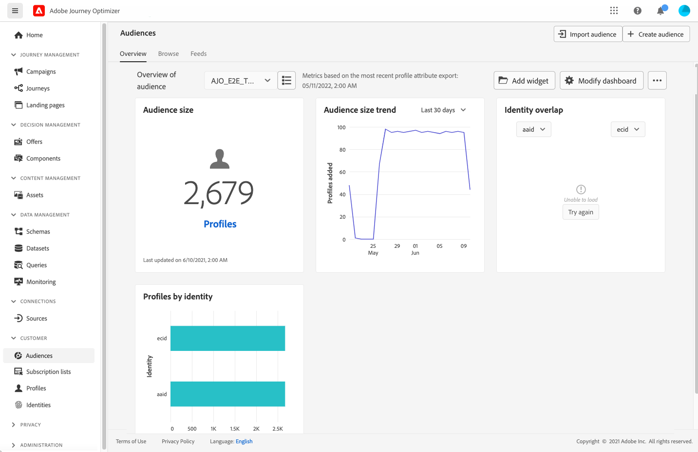 
1. Define a name for your audience and build the audience: choose the field(s) and value(s) to target the profiles you want.
    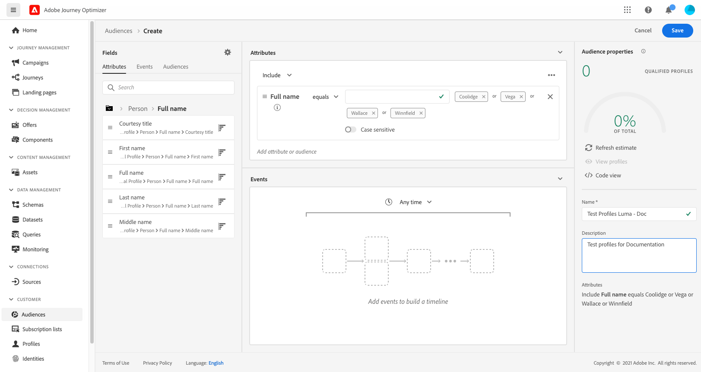 
1. Click **Save** and check that the profiles are correctly targeted by the audience.
    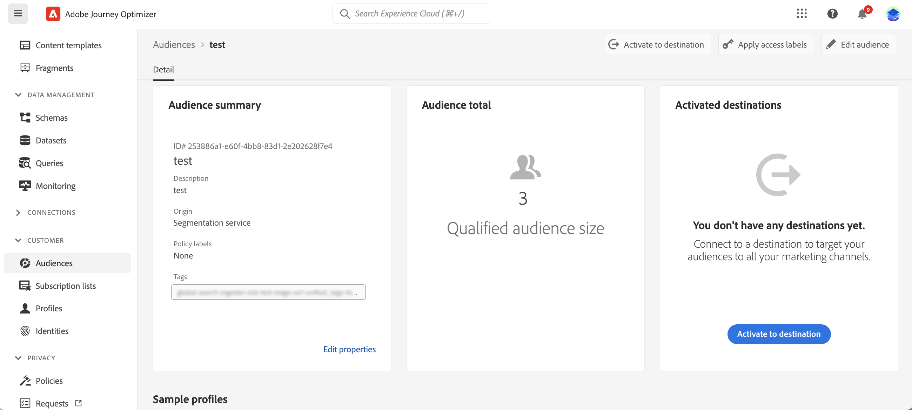 

    >[!NOTE]
    >
    > Audience calculation can take some time. Learn more about audiences in [this section](../audience/about-audiences.md).

1. Now create a new journey and start with a **[!UICONTROL Read Audience]** orchestration activity.
1. Choose the previously created audience and the namespace that your profiles use.
    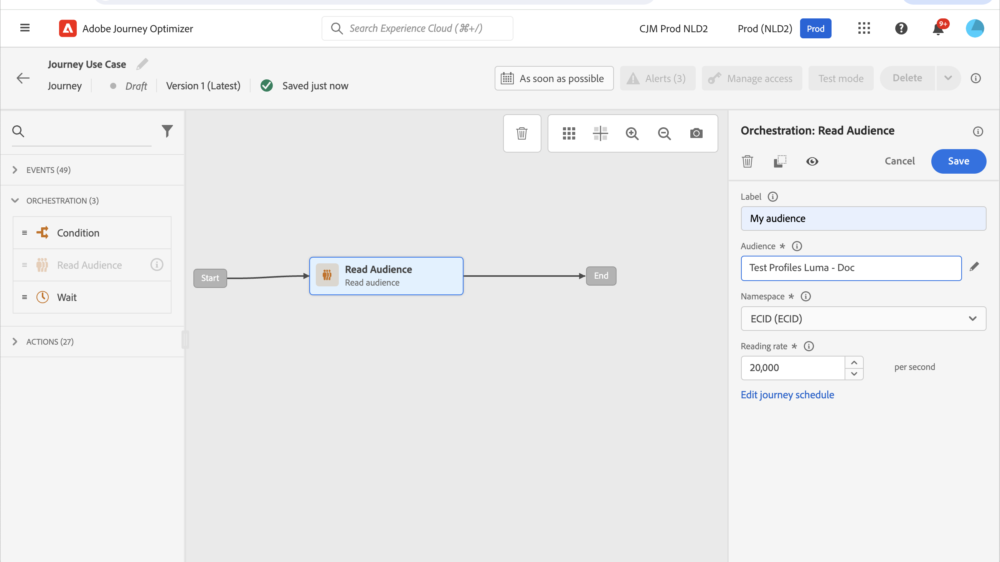
1. Add an **[!UICONTROL Update Profile]** action activity. 
1. Select the schema, the **testProfiles** field, the dataset and set the value to **True**. To perform this, in the **[!UICONTROL VALUE]** field, click the **Pen** icon on the right, select **[!UICONTROL Advanced mode]** and enter **true**.
    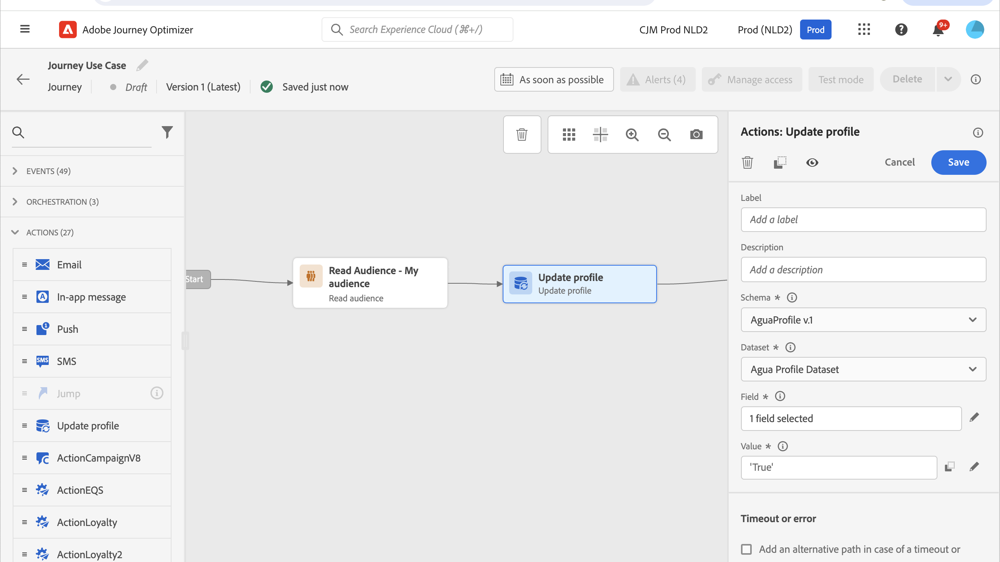
1. Click **[!UICONTROL Publish]**.
1. In the **[!UICONTROL Audiences]** section, check that the profiles have been correctly updated.
    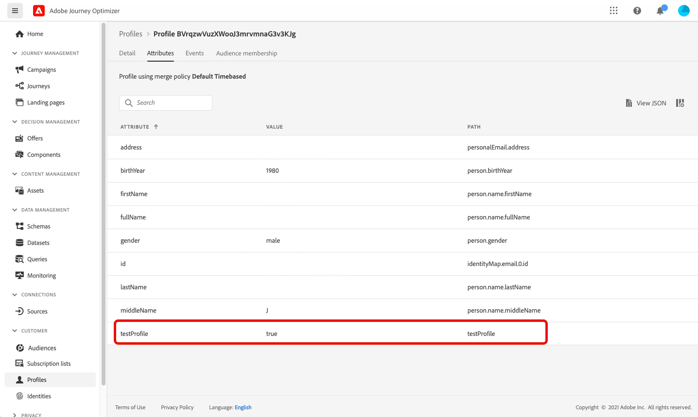

    >[!NOTE]
    >
    > For more information on the **[!UICONTROL Update Profile]** activity, refer to [this section](../building-journeys/update-profiles.md).
-->

## Create a test profile using a csv file{#create-test-profiles-csv}

In [!DNL Adobe Experience Platform], you can create profiles by uploading a csv file containing the different profile fields into your dataset. This is the easiest method.

1. Create a simple csv file using a spreadsheet software.
1. Add one column for each required field. Make sure you add the primary identity field ("personID" in our example above) and the "testProfile" field set to "true".
    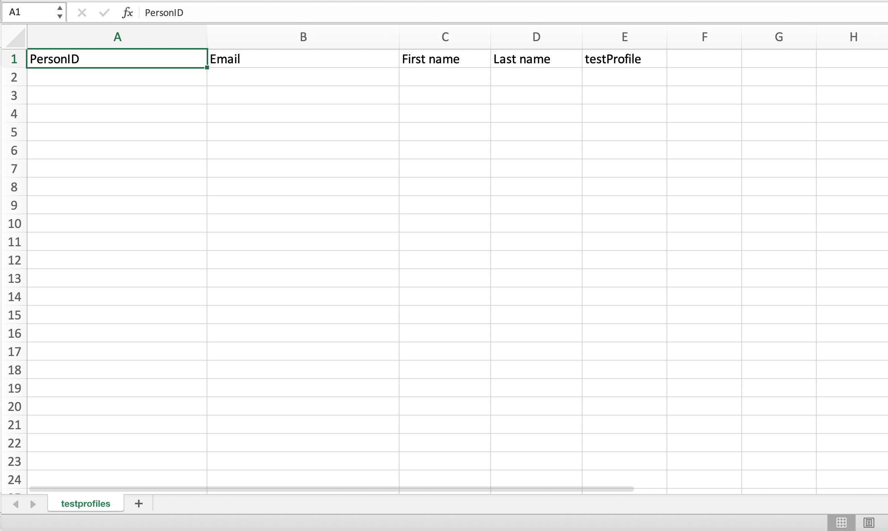
1. Add one line per profile and fill in the values for each field.
    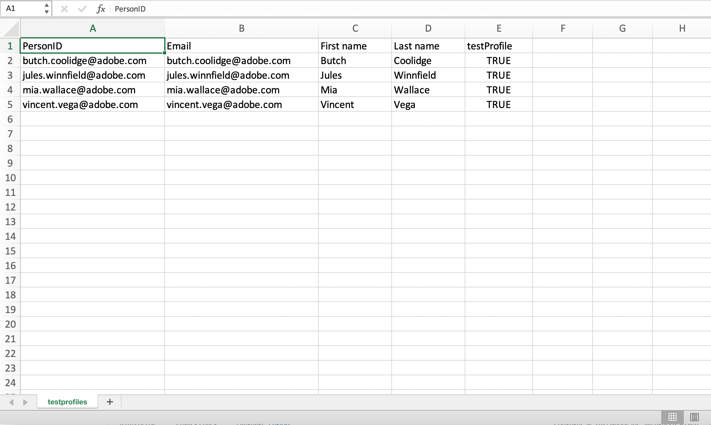
1. Save the spreadsheet as a csv file. Make sure commas are used as separators.
1. Browse to [!DNL Adobe Experience Platform] **Workflows**.
    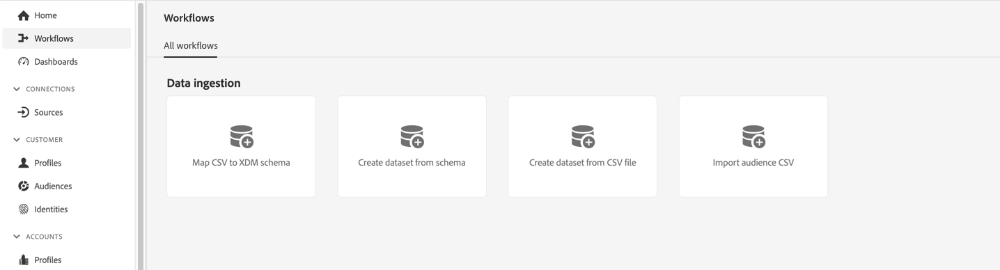
1. Choose **Map CSV to XDM schema**, then click **Launch**.
    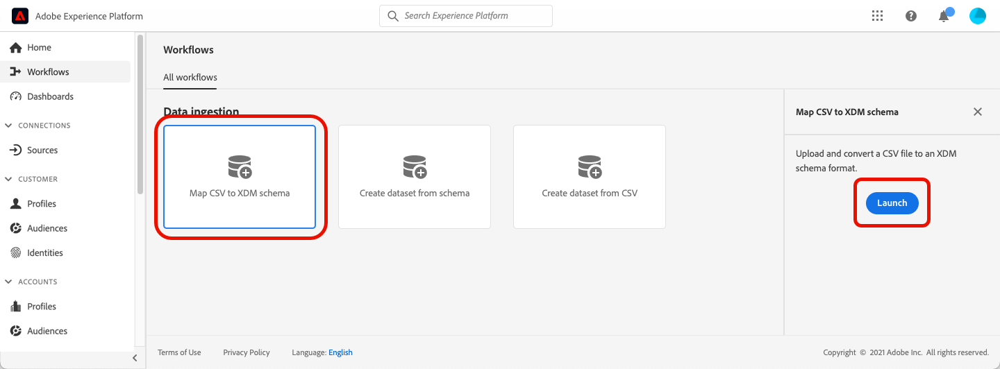
1. Select the dataset you want to import the profiles into. Click **Next**.
    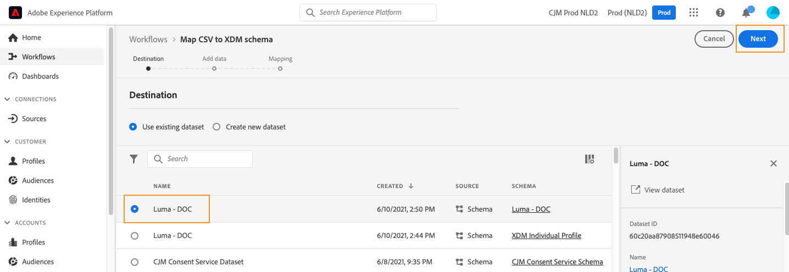
1. Click **Choose files** and select your csv file. When the file is uploaded, click **Next**.
    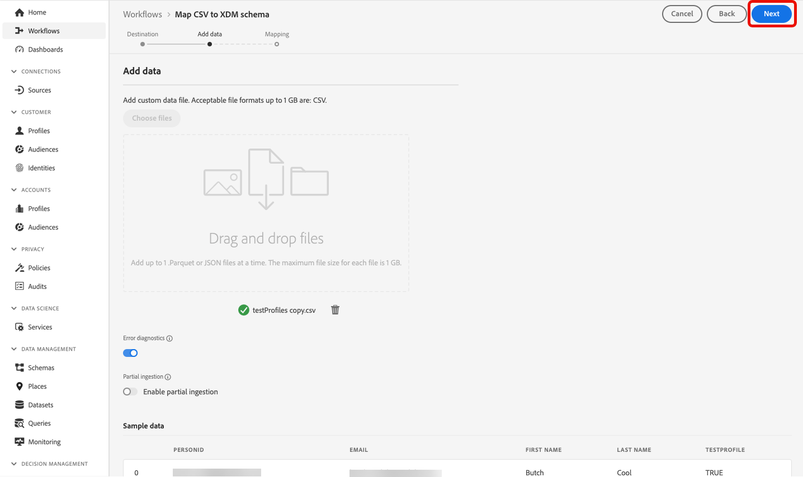
1. Map the source csv fields to the schema fields, then click **Finish**.
    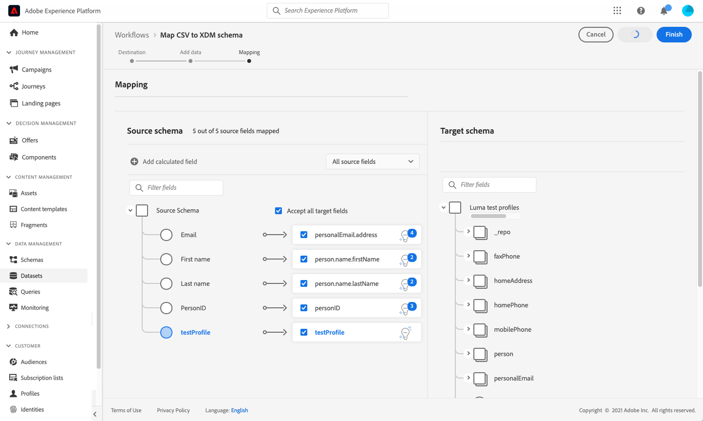
1. The data import begins. The status will move from **Processing** to **Success**. Click **Preview dataset**, in the top right.
    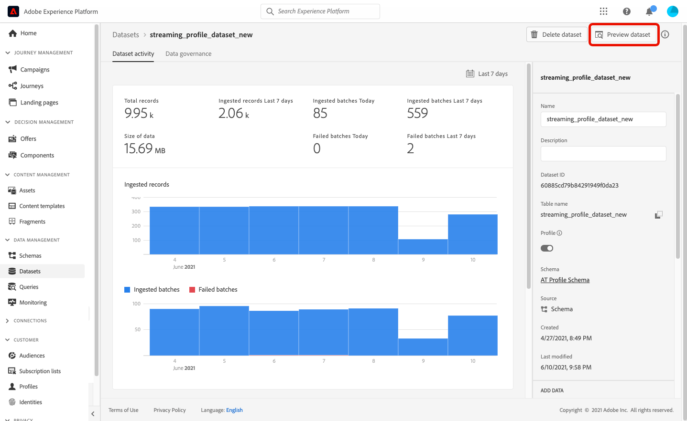
1. Check that the test profiles have been correctly added.
    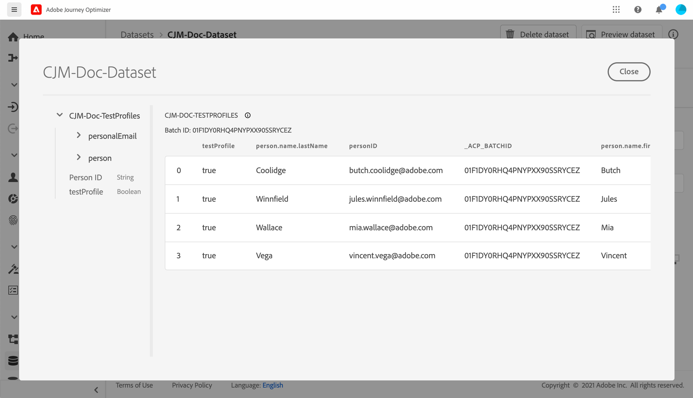

Your test profiles are added and can now be used when testing a journey. Refer to [this section](../building-journeys/testing-the-journey.md).

>[!NOTE]
>
>For more information on csv imports, refer to the [Data Ingestion documentation](https://experienceleague.adobe.com/docs/experience-platform/ingestion/tutorials/map-a-csv-file.html#tutorials){target="_blank"}.

## Create test profiles using API calls{#create-test-profiles-api}

You can also create test profiles via API calls. Learn more in [[!DNL Adobe Experience Platform] documentation](https://experienceleague.adobe.com/docs/experience-platform/profile/home.html){target="_blank"}.

You must use a Profile schema that contains the "Profile test details" field group. The testProfile flag is part of this field group.
When creating a profile, make sure you pass the value: testProfile = true.

Note that you can also update an existing profile to change its testProfile flag to "true".

Here is an example of an API call to create a test profile:

```bash
curl -X POST \
'https://dcs.adobedc.net/collection/xxxxxxxxxxxxxx' \
-H 'Cache-Control: no-cache' \
-H 'Content-Type: application/json' \
-H 'Postman-Token: xxxxx' \
-H 'cache-control: no-cache' \
-H 'x-api-key: xxxxx' \
-H 'x-gw-ims-org-id: xxxxx' \
-d '{
"header": {
"msgType": "xdmEntityCreate",
"msgId": "xxxxx",
"msgVersion": "xxxxx",
"xactionid":"xxxxx",
"datasetId": "xxxxx",
"imsOrgId": "xxxxx",
"source": {
"name": "Postman"
},
"schemaRef": {
"id": "https://example.adobe.com/mobile/schemas/xxxxx",
"contentType": "application/vnd.adobe.xed-full+json;version=1"
}
},
"body": {
"xdmMeta": {
"schemaRef": {
"contentType": "application/vnd.adobe.xed-full+json;version=1"
}
},
"xdmEntity": {
"_id": "xxxxx",
"_mobile":{
"ECID": "xxxxx"
},
"testProfile":true
}
}
}'
```

## How-to video {#video}

Learn how to create test profiles.

>[!VIDEO](https://video.tv.adobe.com/v/334236?quality=12)
