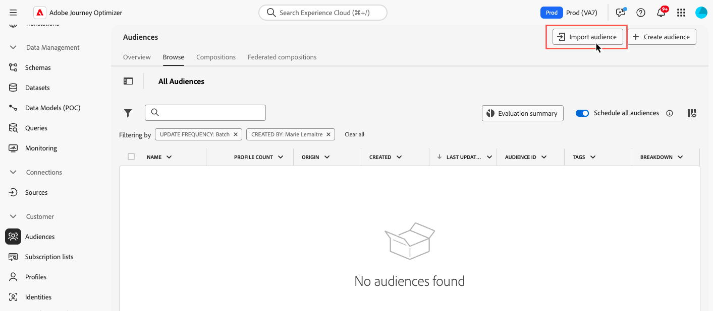

# Custom Upload {#custom-upload}

>[!BEGINSHADEBOX]

**On this page:** Learn how to import an audience from a CSV file using the Adobe Experience Platform Audience Portal and map its identity attribute to customer profiles.

>[!ENDSHADEBOX]

Adobe Experience Platform Audience Portal allows you to import an audience using a CSV file.

During the custom upload process, specify the CSV attribute to use as the identity and the profile identity it maps to. This establishes a link between the audience data and the profile. If the CSV file contains an identity value not found in the profile, a new profile is created with that identity value.

Detailed information on how to import audiences is available in Adobe Experience Platform [Segmentation Service documentation](https://experienceleague.adobe.com/en/docs/experience-platform/segmentation/ui/audience-portal#import-audience){target="_blank"}.

>[!NOTE]
>
>For custom upload audiences (CSV upload) and other external audiences, **[!UICONTROL Incremental read]** is not functionally supported today. On each recurrence, the **entire audience** is retrieved, regardless of the Incremental read toggle setting.

Learn how to upload audiences in CSV format in video:

>[!VIDEO](https://video.tv.adobe.com/v/3421714?quality=12)
