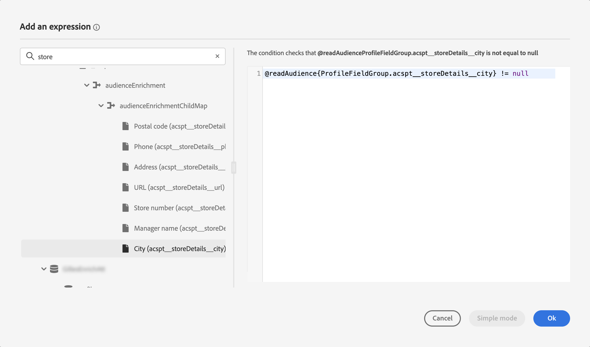
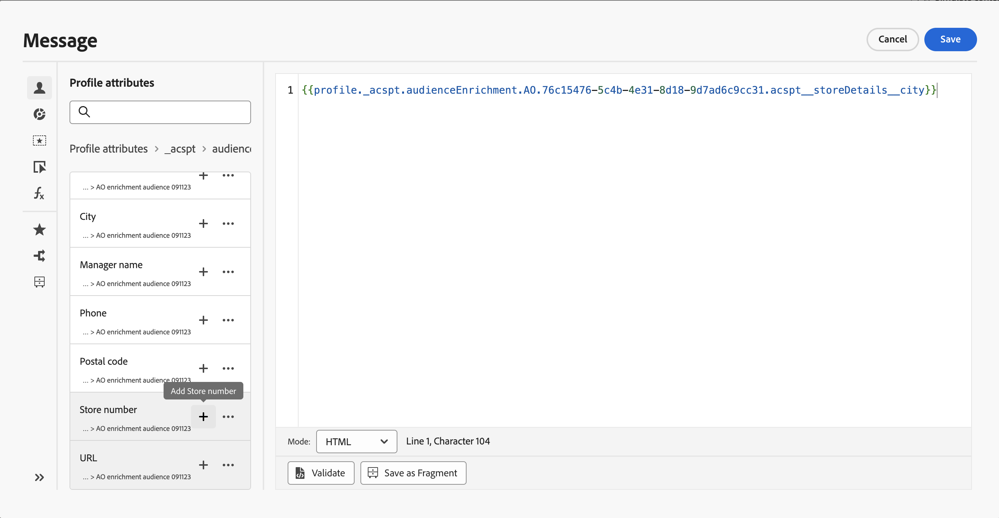

# Use audiences enrichment attributes {#enrichment}

When targeting an audience generated using composition workflows, custom (CSV file) audience, or Federated Audience Composition, you can use enrichment attributes from these audiences to build your journey and personalize your messages.

>[!NOTE]
>
>Audiences created through CSV file custom upload before October 1, 2024, are not eligible for personalization. To use attributes from these audiences and fully utilize this feature, please re-create and re-upload any external CSV audience imported before this date.
>
>Consent policies do not support enrichment attributes. Therefore, any consent policy rules should be based only on attributes found in the profile.

Here are the actions you can perform using audiences' enrichment attributes:

* **Create multiple paths in a journey** based on rules that leverage the targeted audience's enrichment attributes. To do this, target the audience using a [Read audience](../building-journeys/read-audience.md) activity then create rules in an [Optimize](../building-journeys/optimize.md) activity based on the audience's enrichment attributes.

    {width="70%" zoomable="yes"}

* **Personalize your messages** in journeys or campaigns by adding enrichment attributes from the targeted audience in the personalization editor. [Learn how to work with the personalization editor](../personalization/personalization-build-expressions.md)

    {width="70%" zoomable="yes"}

>[!IMPORTANT]
>
>To use enrichment attributes from audiences created using composition workflows, ensure that they are added to a Field Group within the "ExperiencePlatform" Data Source.
>
>+++ Learn how to add enrichment attributes to a Field Group
>
>1. Navigate to "Administration" > "Configuration" > "Data Sources". 
>1. Select "Experience Platform" and create or edit a Field Group.
>1. In the schema selector, select the appropriate schema. The name of the schema will follow this format: 'Schema for audienceId:' + the ID of the audience. You can find the ID of the audience on the audience details screen in the audience inventory.
>1. Open the field selector, find the enrichment attributes you want to add, and select the check box next to them.
>1. Save your changes.
>1. Once enrichment attributes are added to a Field Group, you can use them in Journey Optimizer at the locations listed above.
>
>Detailed information on data sources is available in these sections:
>
>* [Work with the Adobe Experience Platform data source](../datasource/adobe-experience-platform-data-source.md)
>* [Configure a data source](../datasource/configure-data-sources.md)
>
>+++

## Frequently asked questions {#faq-enrichment}

You will find below Frequently Asked Questions about enrichment attributes.

Need more details? Use the feedback options at the bottom of this page to raise your question, or connect with [Adobe Journey Optimizer community](https://experienceleaguecommunities.adobe.com/t5/adobe-journey-optimizer/ct-p/journey-optimizer?profile.language=en){target="_blank"}.

+++ What are enrichment attributes?

Enrichment attributes are additional attributes that are contextual and specific to an audience. They are not associated with the profile, and are typically used for personalization purposes. 

Enrichment attributes are linked to an audience through an Enrich activity in audience composition or the custom upload process.

+++

+++ Where can I use enrichment attributes within Journey Optimizer?

Enrichment attributes from audience composition can be leveraged in the following areas. [Learn how to use audiences enrichment attributes](#enrichment)

* Condition activity (Journeys)
* Custom action attributes (Journeys)
* Message personalization (Journeys and campaigns)

+++

+++ How do I enable enrichment attributes in Journeys?

To use enrichment attributes from audiences created using composition workflows, ensure they are added to a Field Group within the "ExperiencePlatform" Data Source. Information on how to add enrichment attributes to a Field Group is available in [this section](#enrichment)

+++

+++ Are enrichment attribute values updated after a journey starts?

Currently, no. Even after wait or event nodes, enrichment attribute values remain the same as they were when the journey started.

+++
