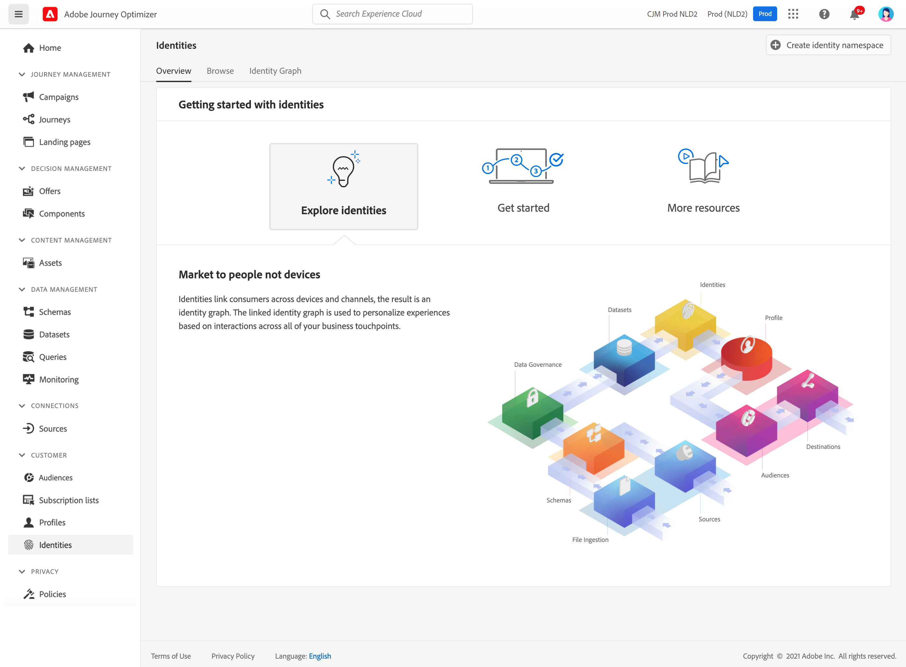

# Get Started with identities {#identities-gs}

An identity is data that is unique to an entity, typically a real-world object, such as an individual person, a hardware device, or a web browser. A fully qualified identity consists of two elements:

* The **identity namespace** serves as an indicator of the context to which an identity relates.
* The **identity value** is a string that represents an entity.

Let's take the phone number 555-555-1234. In this example, the string "555-555-1234" is an **identity value**, which could be categorized into a "Phone" **identity namespace**.

The **Identities** menu in [!DNL Adobe Journey Optimizer] allows you to efficiently browse through the various identifiers that make up the customers in your database.

It provides an **Identity Graph**, which is a map of relationships between different identities for a particular customer, providing you with a visual representation of how your customer interacts with your brand across different channels. All customer identity graphs are collectively managed and updated by Adobe Experience Platform Identity Service, in response to customer activity.

Detailed information on how to work with identities is available in the [Identity Service documentation](https://experienceleague.adobe.com/docs/experience-platform/identity/home.html){target="_blank"}.
