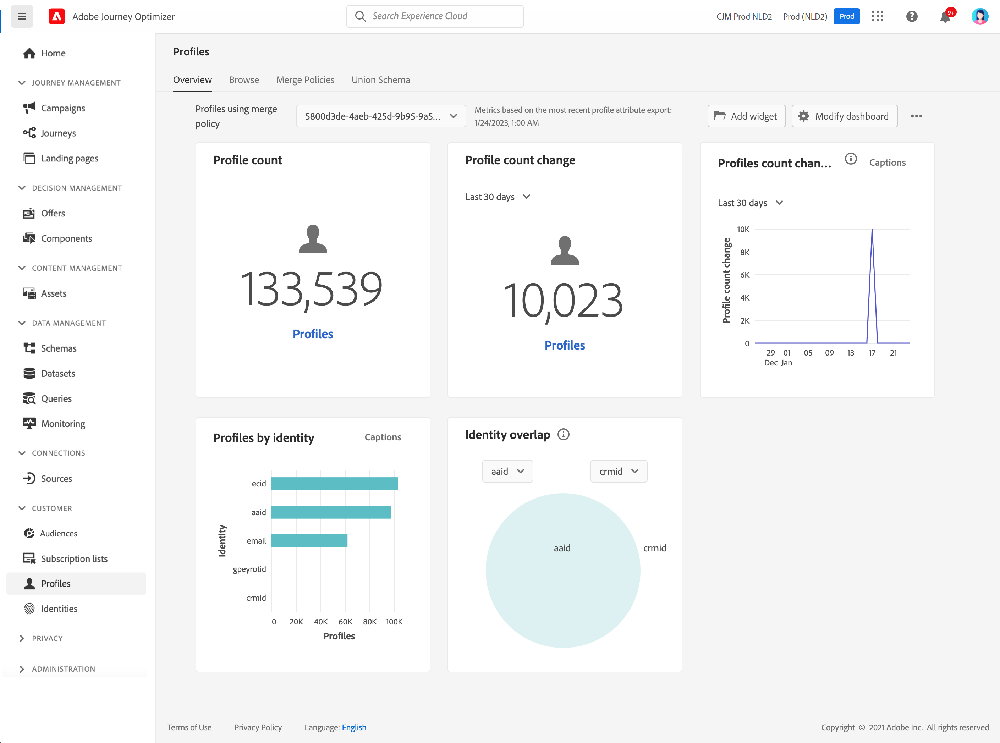

# Get Started with profiles {#profiles-gs}

## About profiles

Leverage Real-time Customer Profile in [!DNL Adobe Journey Optimizer] to see a holistic view of each individual customer by combining data from multiple channels, including online, offline, CRM, and third party. **Profiles** allows you to consolidate your customer data into a unified view offering an actionable, timestamped account of every customer interaction. 

➡️ [Discover this feature in video](#video) 

**Real-time Customer Profile ​**

Integrate customer attributes and events from online, offline, and pseudonymous sources into a single, unified profile. ​Use the profile to engage customers with personalized, real-time experiences across multiple touchpoints. ​

**Data Ingestion**

Connect to various data sources to ingest behavioral, transactional, financial, and operational data. Ingest data either in real-time or through batch uploads to keep profiles constantly updated. ​

**Identity Graph**

Combine data from different sources using customer identities, such as loyalty IDs or CRM system IDs. ​Create a comprehensive view of the customer by mapping relationships between different identities within a brand’s datasets. ​

**Customer Engagement**

Use the real-time customer profile to deliver contextual, personalized experiences, such as targeted offers and messages. ​Engage customers across various channels, including marketing campaigns, customer support, and transactional updates. ​

**Data Sharing**

Share customer profiles with top cloud storage providers like Amazon Web Services, Microsoft Azure, and Google Cloud. Use shared profiles for reporting, data archiving, or deeper analysis with business intelligence tools.

## Profiles dashboard

To access profiles, navigate to the **[!UICONTROL Customer]** / **[!UICONTROL Profiles]** menu in the left navigation pane.

>[!NOTE]
>
>If your organization is new to [!DNL Adobe Journey Optimizer] and does not yet have active Profile datasets or merge policies created, the **Profiles** dashboard is not visible. Instead, the **Overview** tab displays links to Adobe Experience Platform documentation to help you get started with Real-time Customer Profile. To learn how to work with the **Profile dashboard** and detailed information regarding the metrics displayed in the dashboard, refer to [this section](https://experienceleague.adobe.com/docs/experience-platform/profile/ui/user-guide.html){target="_blank"}.

You can bring data fragments together from multiple sources and combine them in order to see a complete view of each of your individual customers. When bringing this data together, merge policies are the rules used to determine how data will be prioritized and what data will be combined to create the unified view. Learn more about **Merge policies** in this [documentation](https://experienceleague.adobe.com/docs/experience-platform/profile/merge-policies/ui-guide.html){target="_blank"}.

>[!MORELIKETHIS]
>
>* [Real-time Customer Profile documentation](https://experienceleague.adobe.com/docs/experience-platform/query/home.html){target="_blank"}
>* [Real-time Customer Profile overview video](https://experienceleague.adobe.com/docs/experience-platform/profile/home.html){target="_blank"}

## How-to video {#video}

Learn how Adobe Experience Platform assembles and updates Real-Time Customer Profiles and how you can access and use these profiles.

>[!VIDEO](https://video.tv.adobe.com/v/27251?quality=12)
