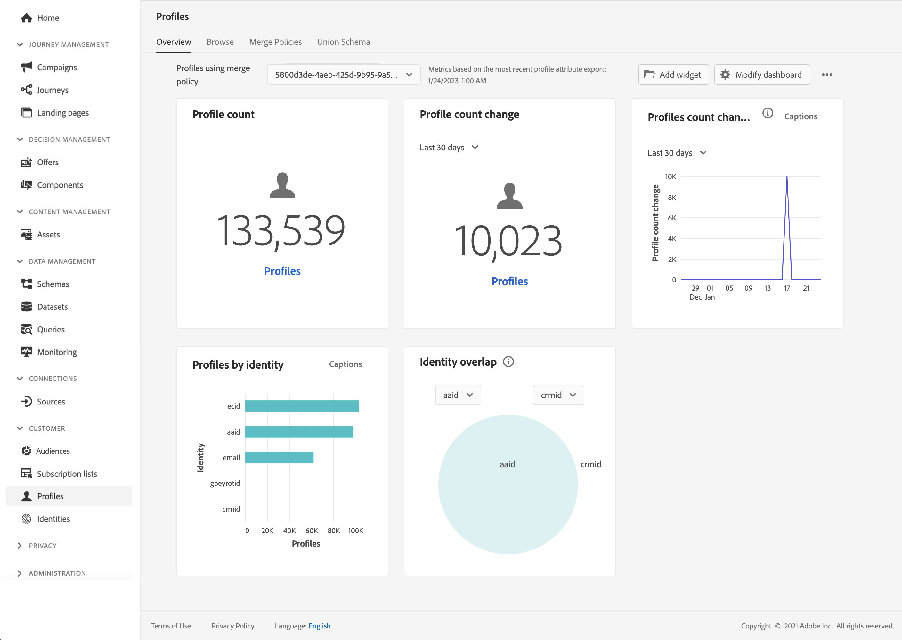

# Get Started with profiles {#profiles-gs}

>[!BEGINSHADEBOX]

**On this page:** Learn how Real-time Customer Profile in Adobe Journey Optimizer unifies customer data from online, offline, and third-party sources into a single view, and how to access the profiles dashboard.

>[!ENDSHADEBOX]

## About profiles

Leverage Real-time Customer Profile in [!DNL Adobe Journey Optimizer] to see a holistic view of each individual customer by combining data from multiple channels, including online, offline, CRM, and third party. **Profiles** allows you to consolidate your customer data into a unified view offering an actionable, timestamped account of every customer interaction. 

➡️ [Discover this feature in video](#video) 

**Real-time Customer Profile​** - Integrate customer attributes and events from online, offline, and pseudonymous sources into a single, unified profile. ​Use the profile to engage customers with personalized, real-time experiences across multiple touchpoints. ​

**Data Ingestion** - Connect to various data sources to ingest behavioral, transactional, financial, and operational data. Ingest data either in real-time or through batch uploads to keep profiles constantly updated. Profiles are not created directly within the [!DNL Journey Optimizer] interface — they are automatically created or updated in Adobe Experience Platform when data is ingested.

>[!NOTE]
>
>When ingesting data, emails are case-sensitive. It means that duplicate profiles may be created (for example, one profile for John.Greene@luma.com, another profile for john.greene@luma.com) and used when targeting the corresponding recipient in your [!DNL Journey Optimizer] journeys and campaigns.

**Identity Graph** - Combine data from different sources using customer identities, such as loyalty IDs or CRM system IDs. ​Create a comprehensive view of the customer by mapping relationships between different identities within a brand's datasets. ​

**Customer Engagement** - Use the real-time customer profile to deliver contextual, personalized experiences, such as targeted offers and messages. ​Engage customers across various channels, including marketing campaigns, customer support, and transactional updates. ​

**Data Sharing** - Share customer profiles with top cloud storage providers like Amazon Web Services, Microsoft Azure, and Google Cloud. Use shared profiles for reporting, data archiving, or deeper analysis with business intelligence tools.

## Engageable Profiles and license usage {#engageable-profiles}

An **Engageable Profile** is a record of information representing an individual that is stored in the Profile Service and has been engaged by journeys or campaigns. It is the key license metric for [!DNL Adobe Journey Optimizer].

Key characteristics:

* **12-month rolling window**: The count reflects unique profiles you have attempted to engage over the past 12 months using Journey Optimizer's authoring, decisioning, delivery, experimentation, or orchestration capabilities.
* **Counted once per sandbox**: A profile that enters multiple journeys or campaigns within a sandbox counts as a single Engageable Profile for that sandbox.
* **Based on your Addressable Audience**: Engageable Profiles are calculated from your Addressable Audience. The count represents the audience engaged in the past 12 months using any of Journey Optimizer's capabilities, out of your total Addressable Audience.
* **Metric behavior**: The Engageable Profiles count:
    * Can increase when new profiles are engaged through journeys or campaigns
    * Cannot decrease unless there is no engagement with certain profiles for over 12 months
    * Can decrease when pseudonymous profiles are stitched to known profiles

>[!TIP]
>
>When targeting pseudonymous profiles (unauthenticated visitors) with inbound channels such as web, in-app, or code-based experiences, consider setting a Time-To-Live (TTL) for automatic profile deletion to manage your Engageable Profiles count and associated costs. [Learn more about inbound channel guardrails](../start/guardrails.md#profile-management-inbound)

Monitor your organization's Engageable Profiles count at any time from **[!UICONTROL Administration]** > **[!UICONTROL License Usage]**. If you observe a sudden spike in the count, refer to the [Troubleshooting section](license-usage.md#troubleshooting-engageable-profiles) for detailed guidance. [Learn more about the License Usage dashboard](license-usage.md)

## Profiles dashboard

To access profiles, navigate to the **[!UICONTROL Customer]** / **[!UICONTROL Profiles]** menu in the left navigation pane.

>[!NOTE]
>
>If your organization is new to [!DNL Adobe Journey Optimizer] and does not yet have active Profile datasets or merge policies created, the **Profiles** dashboard is not visible. Instead, the **Overview** tab displays links to Adobe Experience Platform documentation to help you get started with Real-time Customer Profile. To learn how to work with the **Profile dashboard** and detailed information regarding the metrics displayed in the dashboard, refer to [this section](https://experienceleague.adobe.com/docs/experience-platform/profile/ui/user-guide.html){target="_blank"}.

You can bring data fragments together from multiple sources and combine them to see a complete view of each of your individual customers. When bringing this data together, merge policies are the rules used to determine how data is prioritized and what data is combined to create the unified view. Learn more about **Merge policies** in this [documentation](https://experienceleague.adobe.com/docs/experience-platform/profile/merge-policies/ui-guide.html){target="_blank"}.

## How-to video {#video}

Learn how Adobe Experience Platform assembles and updates Real-Time Customer Profiles and how you can access and use these profiles.

>[!VIDEO](https://video.tv.adobe.com/v/27251?quality=12)

>[!MORELIKETHIS]
>
>* [Get started with data management in Journey Optimizer](../data/gs-data.md)
>* [Real-time Customer Profile documentation](https://experienceleague.adobe.com/docs/experience-platform/query/home.html){target="_blank"}
>* [Default guardrails for Real-Time Customer Profile data and segmentation](https://experienceleague.adobe.com/en/docs/experience-platform/profile/guardrails){target="_blank"}
>* ​[Data Ingestion documentation](https://experienceleague.adobe.com/en/docs/experience-platform/ingestion/home){target="_blank"}
