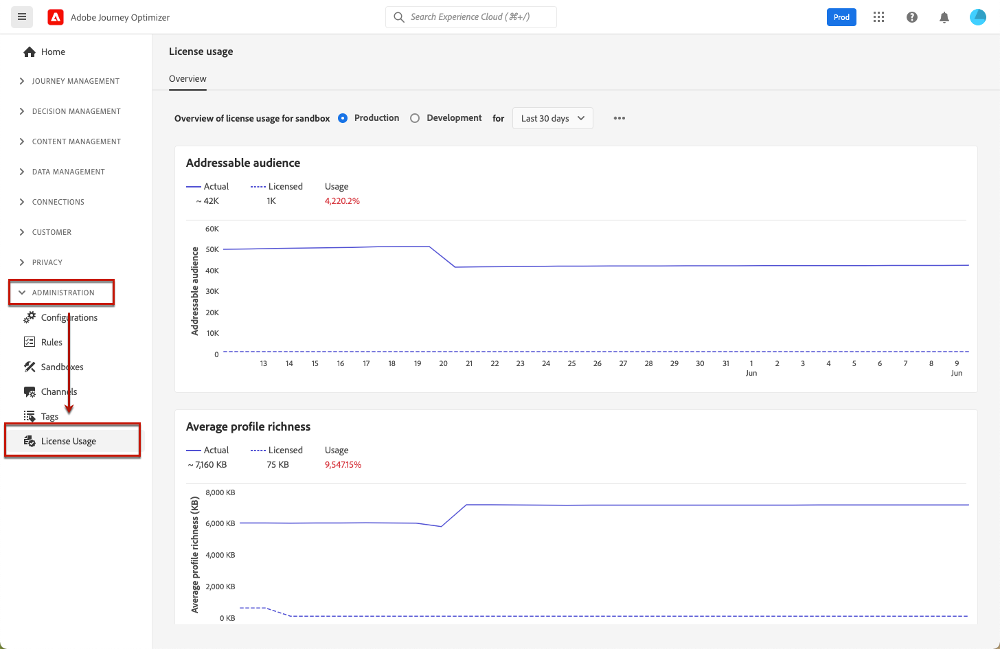

# License usage dashboard {#license-usage}

The [!DNL Adobe Journey Optimizer] [user interface](../start/user-interface.md) provides a dashboard that displays important information about your organization's license usage, as captured during a daily snapshot.

To access this dashboard, go to **[!UICONTROL Administration]** > **[!UICONTROL License Usage]**. This opens the **[!UICONTROL Overview]** tab, which displays the dashboard.

>[!NOTE]
>
>* To view the dashboard, you must have the [View License Usage Dashboard](https://experienceleague.adobe.com/docs/experience-platform/dashboards/permissions.html#available-permissions){target="_blank"} permission.
>
>* Certain metrics (e.g., compute hours, emails) are not displayed for development sandboxes, as indicated by `N/A` in the quota column. Only non-null values are displayed in the dashboard: when metrics are zero or close to zero, they are not populated.

For [!DNL Adobe Journey Optimizer], the dashboard allows you to check the number of **Engageable Profiles**. 

## What is an Engageable Profile? {#what-is-engageable-profile}

An **Engageable Profile** is a record of information representing an individual that is stored in the Profile Service and has been engaged by journeys or campaigns. 

Key characteristics of Engageable Profiles:

* **12-month rolling window**: Engageable Profiles are counted based on engagement over the past 12 months. This metric shows the number of unique profiles that you have attempted to engage with using Journey Optimizer's authoring, decisioning, delivery, experimentation, or orchestration capabilities.

* **Unique count per sandbox**: If a profile enters multiple journeys or campaigns within a sandbox, it is counted only once as a single Engageable Profile for that sandbox.

* **Based on Addressable Audience**: Engageable Profiles are calculated from your Addressable Audience. The count represents the audience engaged in the past 12 months using any of Journey Optimizer's capabilities, out of your total Addressable Audience.

* **Metric behavior**: The Engageable Profiles count:
    * Can increase when new profiles are engaged through journeys or campaigns
    * Cannot decrease unless there is no engagement with certain profiles for over 12 months
    * Can decrease when pseudonymous profiles are stitched to known profiles

>[!NOTE]
>
>If you observe a sudden spike in your Engageable Profiles count, refer to the [Troubleshooting section](#troubleshooting-engageable-profiles) below for detailed guidance on understanding and resolving the issue.

## Troubleshooting: Significant increase in Engageable Profiles count {#troubleshooting-engageable-profiles}

If you observe a sudden spike in the Engageable Profiles count (for example, profiles increasing from hundreds of thousands to millions within a day), this section provides guidance to understand and address the issue.

### Understanding the increase

The Engageable Profiles metric reflects the number of unique profiles engaged by journeys or campaigns over the past 12 months. A sudden increase may result from:

* Large audiences being targeted by new journeys or campaigns
* Changes in datasets enabled for Profile Service
* Batch processing of audiences that haven't been engaged recently

### Resolution steps

To address this issue, follow these steps:

1. **Understand profile counting logic:**

    * Engageable Profiles are calculated based on unique profiles engaged by journeys or campaigns over the past 12 months.
    * If a profile enters multiple journeys, it is counted as one Engageable Profile for that sandbox.
    * The metric cannot decrease unless there is no engagement with certain profiles for over 12 months or if pseudonymous profiles are stitched to known ones.
    * Engageable Profiles are calculated using a customer's Addressable Audience.
    * The audience engaged in the past 12 months using any of the Journey Optimizer's capabilities, out of the total Addressable Audience, determines the count of Engageable Profiles.

2. **Investigate journeys, campaigns and decisioning targeting large audiences:**

    * Review recent journeys and campaigns targeting large numbers of profiles using [insights queries or Query Service](https://experienceleague.adobe.com/en/docs/experience-platform/query/home){target="_blank"}.
    * Identify specific journey versions that contributed to the spike in profile counts.
    * Journeys, Campaigns and Decisioning involving new profiles are likely to lead to an increase in event counts in the Journeys datasets, contributing to the rise in the Engageable Profiles count.

3. **Filter audiences at journey and campaigns level:**

    * Apply filters at the audience level before initiating journeys or campaigns to prevent unnecessary increases in Engageable Profiles.
    * Ensure only relevant audiences are targeted during engagements.

4. **Reduce addressable audience size:**

    * Delete pseudonymous profiles if necessary. Note that this action affects both Journey Optimizer and Real-Time Customer Data Platform.
    * Learn more about [Pseudonymous Profile data expiration](https://experienceleague.adobe.com/en/docs/experience-platform/profile/pseudonymous-profiles){target="_blank"} in Real-Time Customer Profile Guide.
    * **Note:** Pseudonymous Profile data expiration cannot be configured through the Platform UI or APIs. You must contact support to enable this feature.

5. **Monitor dataset changes:**

    * Verify datasets enabled for profiling and ensure they do not contain excessive ECIDs (Experience Cloud IDs).
    * If needed, delete datasets with high ECID counts and recreate them with reduced records.

6. **Develop a long-term reduction strategy:**

    * The Engageable Profiles count will naturally decrease if certain profiles remain unengaged for more than 12 months.

See also the [Adobe Experience Platform Query Service overview](https://experienceleague.adobe.com/en/docs/experience-platform/query/home){target="_blank"}.

## Related documentation {#related-documentation}

Learn more in the Adobe Experience Platform documentation:

* [License usage dashboard overview](https://experienceleague.adobe.com/docs/experience-platform/dashboards/guides/license-usage.html){target="_blank"}
* [Exploring the license usage dashboard](https://experienceleague.adobe.com/docs/experience-platform/dashboards/guides/license-usage.html#exploring-the-license-usage-dashboard){target="_blank"}
* [Available metrics](https://experienceleague.adobe.com/docs/experience-platform/dashboards/guides/license-usage.html#available-metrics){target="_blank"}
* [Pseudonymous Profile data expiration](https://experienceleague.adobe.com/docs/experience-platform/profile/pseudonymous-profiles.html){target="_blank"}
