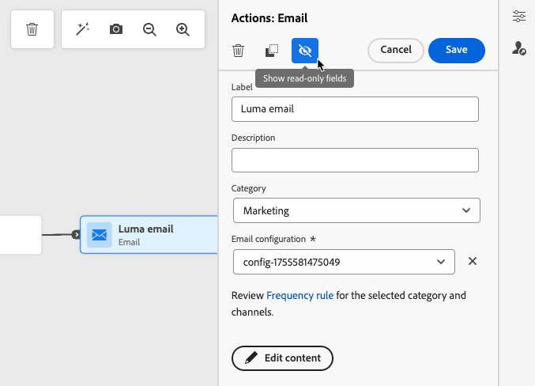

# Get started with journey activities {#about-journey-activities}

>[!BEGINSHADEBOX]

**On this page:** Learn how to combine event, orchestration, and action activities to build multi-step, cross-channel journeys, with best practices for labeling activities, managing parameters, and troubleshooting.

>[!ENDSHADEBOX]

Combine event, orchestration, and action activities to build multi-step, cross-channel scenarios.

## Event activities {#event-activities}

Personalized journeys start with events such as an online purchase. Once a profile enters a journey, it moves through it on its own. Each profile can take a different path and pace. When you start with an event, the journey triggers when the event arrives. Each profile then follows the steps defined in your journey.

Events configured by the technical user (see [this page](../event/about-events.md)) appear in the first category of the palette. This category is on the left side of the screen. The following event activities are available:

* [General events](../building-journeys/general-events.md)
* [Reaction](../building-journeys/reaction-events.md)
* [Audience Qualification](../building-journeys/audience-qualification-events.md)

To start your journey, drag and drop an event activity. You can also double-click on it.

## Orchestration activities {#orchestration-activities}

Orchestration activities are conditions that help determine the next step in the journey. These conditions can include whether the person has an open support case or completed a purchase. They can also include the local weather forecast or whether the person reached 10,000 loyalty points.

From the palette, on the left-hand side of the screen, the following orchestration activities are available:

* [Optimize](optimize.md)
* [Read Audience](read-audience.md)
* [Wait](wait-activity.md)
* [Journey Fragments](journey-fragments.md)
* [Content decision](content-decision.md)
* [Dataset lookup](dataset-lookup.md)

## Action activities {#action-activities}

Actions are what you want to happen as a result of some kind of trigger, like sending a message. It is the piece of the journey that the customer experiences.

From the palette on the left side of the screen, below **[!UICONTROL Events]** and **[!UICONTROL Orchestration]**, you can find the **[!UICONTROL Actions]** category. The following action activities are available:

* [Built-in channel actions](../building-journeys/journey-action.md) available from the **Action** activity
* [Custom actions](../building-journeys/using-custom-actions.md)
* [Jump](../building-journeys/jump.md)

These activities represent the different available communication channels. You can combine them to create a cross-channel scenario.

You can also set up specific actions to send messages:

* If you are using a third-party system to send messages, you can create a specific custom action. [Learn more](../action/action.md)

* If you are working with [!DNL Adobe Campaign] and [!DNL Adobe Journey Optimizer], refer to these sections:

   * [[!DNL Adobe Journey Optimizer] and [!DNL Adobe Campaign] v7/v8](../action/acc-action.md)
   * [[!DNL Adobe Journey Optimizer] and [!DNL Adobe Campaign] Standard](../action/acs-action.md)
   * [[!DNL Adobe Journey Optimizer] and [!DNL Adobe Marketo Engage]](../action/marketo-engage.md)

## Best practices {#best-practices}

Use these recommendations to keep journeys readable, consistent, and easy to troubleshoot.

### Add a label

Most activities allow you to define a **[!UICONTROL Label]**. This adds a suffix to the name that appears under your activity in the canvas. This is useful if you use the same activity several times in your journey and want to identify them more easily. It also makes debugging easier in case of errors and makes reports easier to read. You can also add an optional **[!UICONTROL Description]**.

>[!NOTE]
>
>For some activities, their ID is also visible in the pane. This ID can be used in reporting as a more stable key than the label, which can change.

### Manage the advanced parameters {#advanced-parameters}

Most activities display a number of advanced and/or technical parameters that you cannot modify.

For better readability, hide these parameters using the **[!UICONTROL Hide read-only fields]** button on top of the right pane.

In some particular contexts, you can override the values of these parameters for specific use. To force a value, click the **[!UICONTROL Enable parameter override]** icon to the right of the field. [Learn more](../configuration/primary-email-addresses.md#override-execution-address-journey)

>[!NOTE]
>
>If the advanced parameters are hidden, click the **[!UICONTROL Show read-only fields]** button
>
>{width=60%}

### Add an alternative path

When an error occurs in an action or a condition, the journey of an individual stops. The only way to make it continue is to check the box **[!UICONTROL Add an alternative path in case of a timeout or an error]**. See [this section](../building-journeys/using-the-journey-designer.md#paths)

## Troubleshooting {#troubleshooting}

Before testing and publishing your journey, verify that all the activities are properly configured. You cannot perform tests or publications if errors are still detected by the system.

Learn how to troubleshoot errors in activities and in the journey [on this page](troubleshooting.md).

See also [Monitoring & troubleshooting](../../rp_landing_pages/troubleshoot-journey-landing-page.md)

+++ AI Knowledge Reference

This section contains structured knowledge intended to support interpretation, retrieval, and question answering related to this topic.

For complete understanding, this information should be combined with the documentation on this page. Neither source is intended to stand alone; the page describes the feature, while this section provides additional context that helps disambiguate terminology, intent, applicability, and constraints.

* **TL;DR:** This page introduces the three categories of journey activities — events, orchestration, and actions — and explains best practices for labeling, managing parameters, and handling errors in Adobe Journey Optimizer journeys.

**Intents:**
* Identify and distinguish between event, orchestration, and action activities in a journey
* Add labels and descriptions to journey activities for easier identification and reporting
* Configure an alternative path to handle timeouts or errors in a journey activity
* Override advanced parameters on a specific journey activity
* Combine multiple activity types to build cross-channel journey scenarios
* Troubleshoot activity configuration errors before publishing a journey

**Glossary:**
* **Event activity**: A journey activity triggered by an incoming event (e.g., purchase, audience qualification) that starts or advances a profile through the journey *(product-specific)*
* **Orchestration activity**: A journey activity (e.g., Optimize, Read Audience, Wait) that controls the flow and branching logic of a journey *(product-specific)*
* **Action activity**: A journey activity that delivers a communication or calls an external system as the result of a trigger *(product-specific)*
* **Custom action**: A user-configured action that connects Journey Optimizer to a third-party system for sending messages or data *(product-specific)*
* **Alternative path**: A fallback branch added to an activity so the journey continues even when a timeout or error occurs *(product-specific)*

**Guardrails:**
* Tests and publications cannot be performed if configuration errors are still detected in any activity
* Advanced/technical parameters on most activities are read-only and cannot be modified without using the parameter override feature

**Terminology:**
* Canonical name: Journey Activity — Acronym: none — variants: activity, node, step
* Synonyms: "action activity" = "channel action" = "message action"
* Do not confuse: "Orchestration activity" ≠ "Action activity" (orchestration controls flow; actions deliver communications)

**FAQ:**
* **Q: What is the difference between event, orchestration, and action activities?** — Event activities trigger journey entry or progression; orchestration activities control branching and flow logic; action activities deliver messages or call external systems.
* **Q: How do I add a label to a journey activity?** — Open the activity properties pane and fill in the Label field; the label appears as a suffix under the activity node on the canvas.
* **Q: What happens when an error occurs in an action or condition activity?** — The profile's journey stops unless you check the "Add an alternative path in case of a timeout or an error" option on that activity.
* **Q: Can I use Adobe Campaign to send messages from a journey?** — Yes, Journey Optimizer supports integration with Adobe Campaign v7/v8, Campaign Standard, and Marketo Engage for sending messages via custom action activities.
* **Q: How do I override a read-only advanced parameter on an activity?** — Click the "Enable parameter override" icon to the right of the parameter field to force a custom value.

+++
