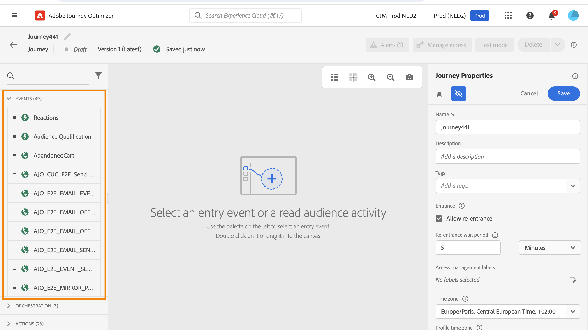
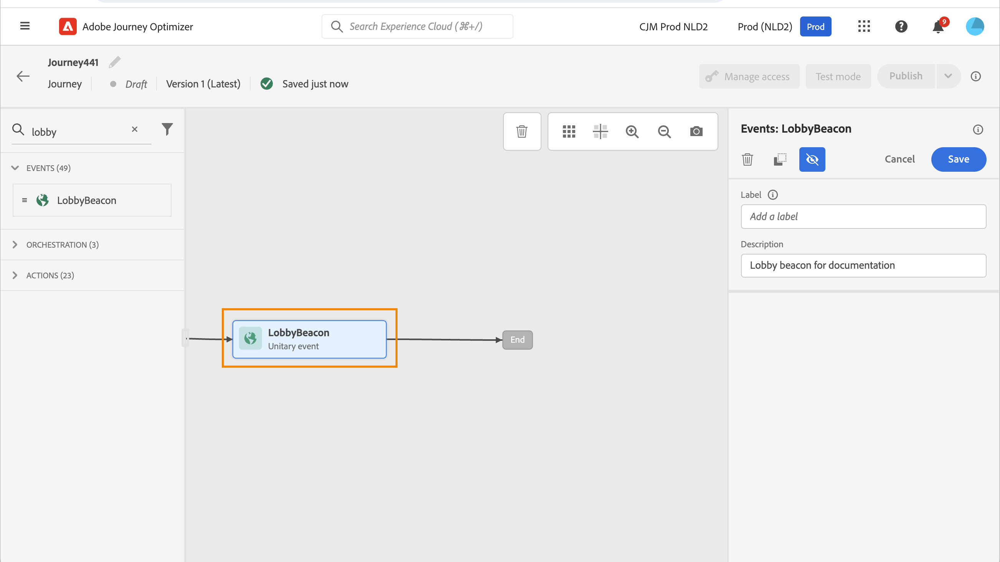
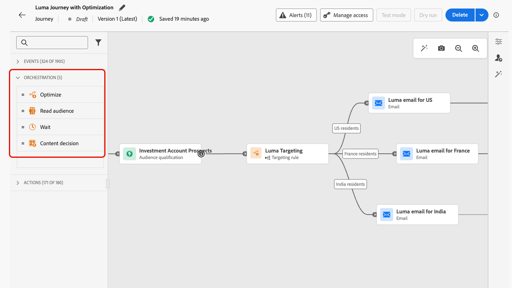
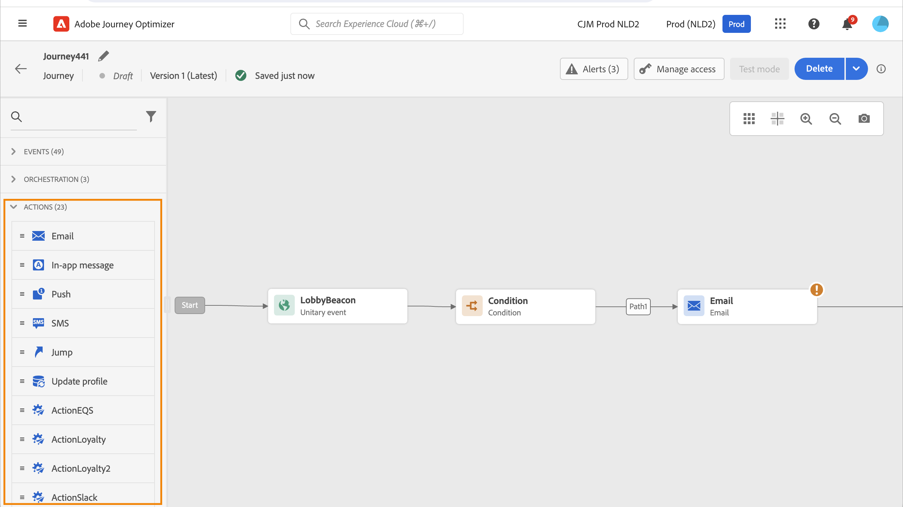
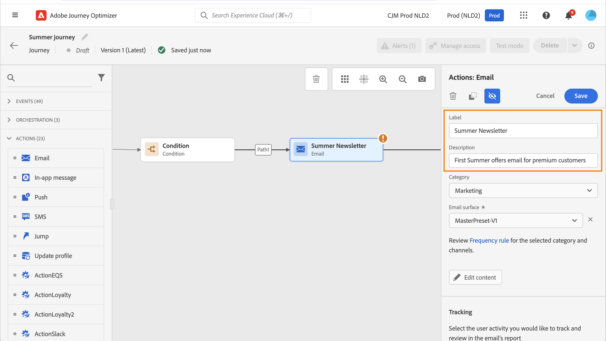
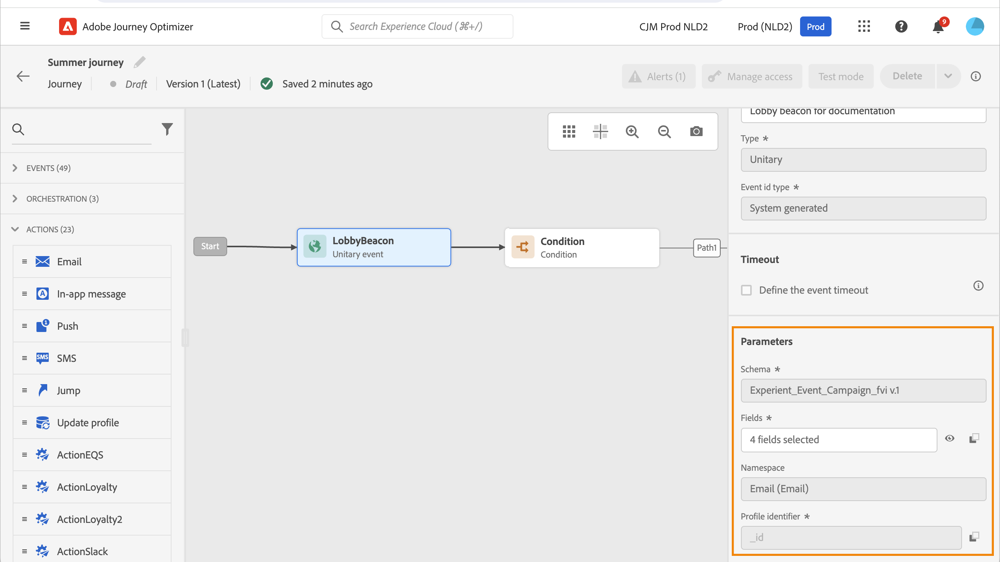
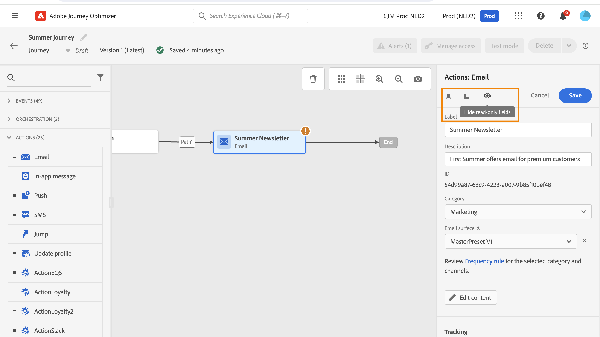
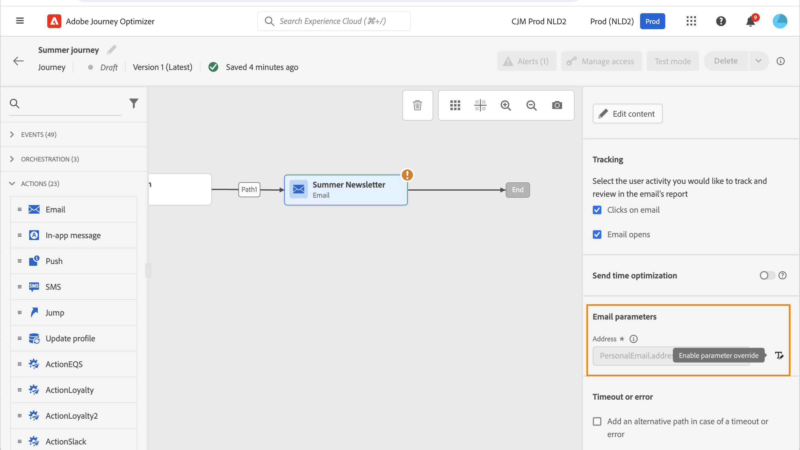
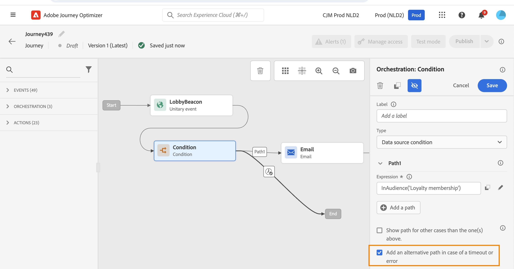

# Get started with journey activities {#about-journey-activities}

Combine the different event, orchestration and action activities to build your multi-step cross-channel scenarios.

## Event activities {#event-activities}

Personalized journeys are triggered by events, such as an online purchase. Once a profile enters a journey, they move through as an individual, and no two individuals move along at the same rate or along the same path. When you start your journey with an event, the journey triggers when the event is received. Each person in the journey then follows, individually, the next steps defined in your journey.

Events configured by the technical user (see [this page](../event/about-events.md)) are all displayed in the first category of the palette, on the left side of the screen. The following event activities are available:

* [General events](../building-journeys/general-events.md)
* [Reaction](../building-journeys/reaction-events.md)
* [Audience Qualification](../building-journeys/audience-qualification-events.md)

To start your journey, drag and drop an event activity. You can also double-click on it.

## Orchestration activities {#orchestration-activities}

Orchestration activities are different conditions that help determine the next step in the journey. These conditions can include whether the person has an open support case, the weather forecast at their current location, whether they completed a purchase, or whether they reached 10,000 loyalty points.

From the palette, on the left-hand side of the screen, the following orchestration activities are available:

<!--* [Optimize](optimize.md)-->
* [Read Audience](read-audience.md)
* [Wait](wait-activity.md)
* [Content decision](content-decision.md)

## Action activities {#action-activities}

Actions are what you want to happen as a result of some kind of trigger, like sending a message. It is the piece of the journey that the customer experiences.

From the palette, on the left-hand side of the screen, below **[!UICONTROL Events]** and **[!UICONTROL Orchestration]**, you can find the **[!UICONTROL Actions]** category. The following action activities are available:

* [Built-in channel actions](../building-journeys/journeys-message.md)
* [Custom actions](../building-journeys/using-custom-actions.md)
* [Jump](../building-journeys/jump.md)

These activities represent the different available communication channels. You can combine them to create a cross-channel scenario.

You can also set up specific actions to send messages:

* If you are using a third-party system to send messages, you can create a specific custom action. [Learn more](../action/action.md)

* If you are working with Campaign and Journey Optimizer, refer to these sections:

   * [[!DNL Journey Optimizer] and Campaign v7/v8](../action/acc-action.md)
   * [[!DNL Journey Optimizer] and Campaign Standard](../action/acs-action.md)
   * [[!DNL Journey Optimizer] and Marketo Engage](../action/marketo-engage.md)

## Best practices {#best-practices}

### Add a label

Most activities allow you to define a **[!UICONTROL Label]**. This adds a suffix to the name that appears under your activity in the canvas. This is useful if you use the same activity several times in your journey and want to identify them more easily. It also makes debugging easier in case of errors and makes reports easier to read. You can also add an optional **[!UICONTROL Description]**.

>[!NOTE]
>
>For some activities, their ID is also visible in the pane. This ID can be used in reporting as a more stable key than the label, which can change.

### Manage the advanced parameters {#advanced-parameters}

Most activities display a number of advanced and/or technical parameters that you cannot modify.

For better readability, hide these parameters using the **[!UICONTROL Hide read-only fields]** button.

In some particular contexts, you can override the values of these parameters for specific use. To force a value, click the **[!UICONTROL Enable parameter override]** icon to the right of the field. [Learn more](../configuration/primary-email-addresses.md#journey-parameters)

### Add an alternative path

When an error occurs in an action or a condition, the journey of an individual stops. The only way to make it continue is to check the box **[!UICONTROL Add an alternative path in case of a timeout or an error]**. See [this section](../building-journeys/using-the-journey-designer.md#paths).

## Troubleshooting {#troubleshooting}

Before testing and publishing your journey, verify that all the activities are properly configured. You cannot perform tests or publications if errors are still detected by the system.

Learn how to troubleshoot errors in activities and in the journey [on this page](troubleshooting.md).
