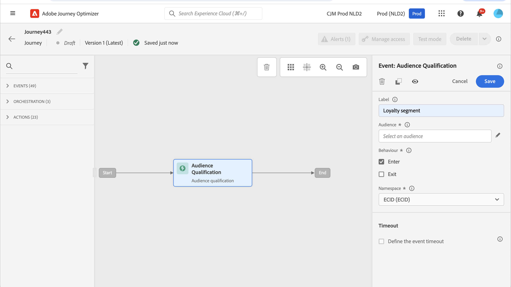
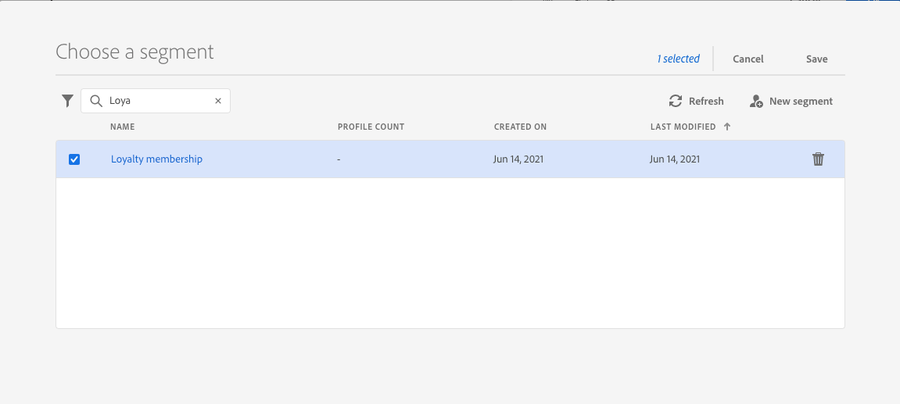
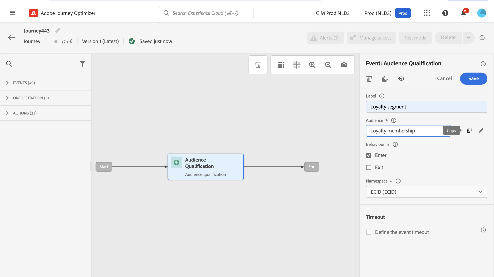
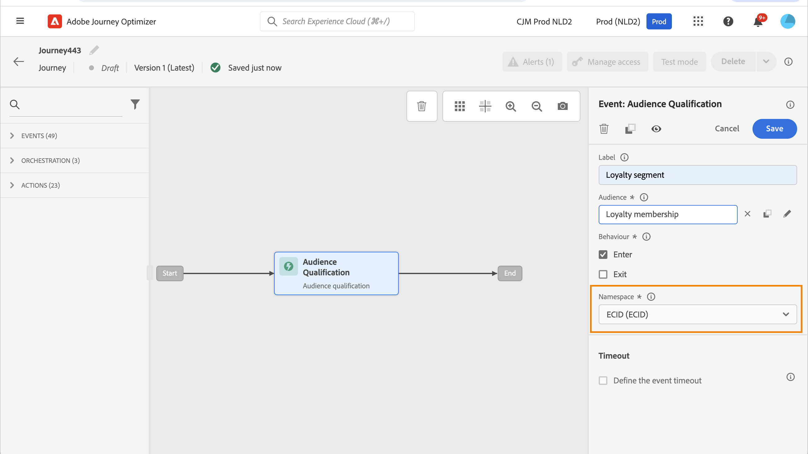
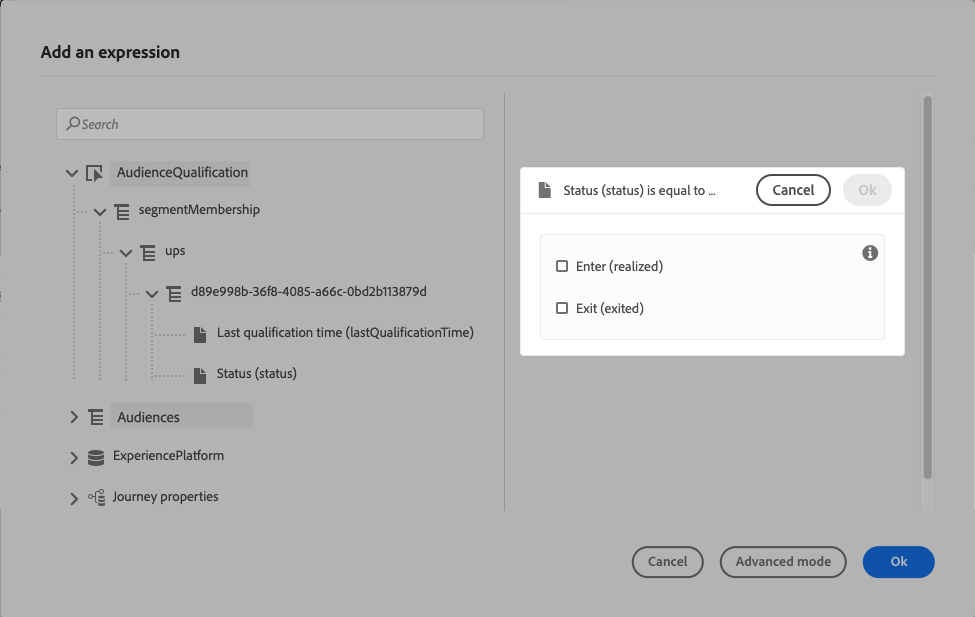
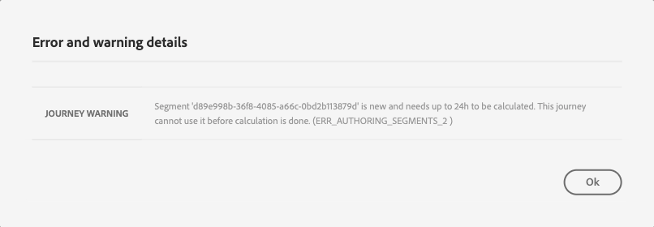
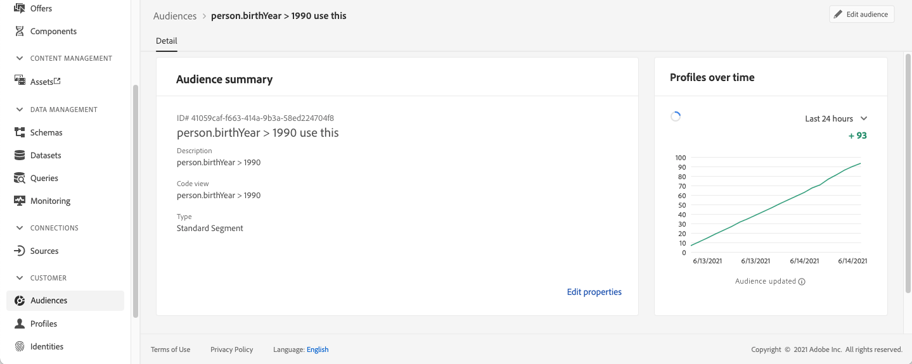

# Audience Qualification events {#segment-qualification}

>[!CONTEXTUALHELP]
>id="ajo_journey_event_segment_qualification"
>title="Audience qualification events"
>abstract="This activity allows your journey to listen to the entrances and exits of profiles in Adobe Experience Platform audiences in order to make individuals enter or move forward in a journey."

## About audience qualification events{#about-segment-qualification}

This activity allows your journey to listen to the entrances and exits of profiles in Adobe Experience Platform audiences in order to make individuals enter or move forward in a journey. For more information about audience creation, refer to this [section](../audience/about-audiences.md).

Let's say you have a "silver customer" audience. With this activity, you can make all new silver customers enter a journey and send them a series of personalized messages.

This type of event can be positioned as the first step or later in the journey.

➡️ [Discover this feature in video](#video) 

>[!CAUTION]
>
>Before starting to configure an Audience qualification, [read the Guardrails and Limitations](#audience-qualification-guardrails).

## Configure the activity {#configure-segment-qualification}

To configure the **[!UICONTROL Audience Qualification]** activity, follow these steps:

1. Unfold the **[!UICONTROL Events]** category and drop an **[!UICONTROL Audience Qualification]** activity into your canvas.

   

1. Add a **[!UICONTROL Label]** to the activity. This step is optional.

1. Click in the **[!UICONTROL Audience]** field and select the audiences you want to leverage.

   >[!NOTE]
   >
   >You can customize the columns displayed in the list and sort them.

   

   Once the audience is added, the **[!UICONTROL Copy]** button allows you to copy its name and ID:

   `{"name":"Loyalty membership","id":"8597c5dc-70e3-4b05-8fb9-7e938f5c07a3"}`

   

1. In the **[!UICONTROL Behaviour]** field, choose whether you want to listen to audience entrances, exits or both.

   >[!NOTE]
   >
   >**[!UICONTROL Enter]** and **[!UICONTROL Exit]** correspond to the **Realized** and **Exited** audience participation statuses from Adobe Experience Platform. For more on how to evaluate an audience, refer to the [Segmentation Service documentation](https://experienceleague.adobe.com/docs/experience-platform/segmentation/tutorials/evaluate-a-segment.html#interpret-segment-results){target="_blank"}. 

1. Select a namespace. This is only needed if the event is positioned as the first step of the journey. By default, the field is pre-filled with the last used namespace.

    >[!NOTE]
    >
    >You can only select a people-based identity namespace. If you have defined a namespace for a lookup table (for example: ProductID namespace for a Product lookup), it will not be available in the **Namespace** dropdown list.

   

The payload contains the following context information, which you can use in conditions and actions:

* the behavior (entrance, exit)
* the timestamp of qualification
* the audience id

When using the expression editor in a condition or action that follows an **[!UICONTROL Audience Qualification]** activity, you have access to the **[!UICONTROL AudienceQualification]** node. You can choose between the **[!UICONTROL Last qualification time]** and the **[!UICONTROL status]** (enter or exit).

See [Condition activity](../building-journeys/condition-activity.md#about_condition).

A new journey that includes an **Audience Qualification** event becomes operational ten minutes after you publish it. This time interval corresponds to the cache refresh interval of the dedicated service. Therefore, you must wait ten minutes before using this journey.

## Best practices {#best-practices-segments}

The **[!UICONTROL Audience Qualification]** activity enables the immediate entrance into journeys of individuals getting qualified or disqualified from an Adobe Experience Platform audience.

The reception speed of this information is high. Measurements show a speed of 10,000 events received per second. As a result, ensure you understand how peaks of entrance might happen, how to avoid them, and how to make your journey ready for them. Learn more about journey processing rates and throughput limits in [this section](entry-management.md#journey-processing-rate).

### Batch audiences {#batch-speed-segment-qualification}

When using Audience Qualification for a batch audience, note that a peak of entrance occurs at the time of the daily calculation. The size of the peak depends on the number of individuals entering (or exiting) the audience daily.

Moreover, if the batch audience is newly created and immediately used in a journey, the first batch of calculation might cause a very large number of individuals to enter the journey.

### Streamed audiences {#streamed-speed-segment-qualification}

When using Audience Qualification for streamed audiences, there is less risk of large peaks of entrances/exits due to the continuous evaluation of the audience. However, if the audience definition leads to a large volume of customers qualifying simultaneously, a peak might still occur.

Avoid using open and send events with streaming segmentation. Instead, use real user-activity signals like clicks, purchases, or beacon data. For frequency or suppression logic, use business rules rather than send events. [Learn more](../audience/about-audiences.md#open-and-send-event-guardrails)

For more information on streaming segmentation, refer to [Adobe Experience Platform documentation](https://experienceleague.adobe.com/en/docs/experience-platform/segmentation/methods/streaming-segmentation){target="_blank"}.

### How to avoid overloads {#overloads-speed-segment-qualification}

Here are a few best practices to avoid overloading systems leveraged in journeys (data sources, custom actions, channel action activities):

* Do not use a batch audience immediately after its creation in an **[!UICONTROL Audience Qualification]** activity. This avoids the first calculation peak. A yellow warning appears in the journey canvas if you are about to use an audience that has never been calculated.

   

* Put in place a capping rule for data sources and actions used in journeys to avoid overloading them. Learn more in [Journey Orchestration documentation](https://experienceleague.adobe.com/docs/journeys/using/working-with-apis/capping.html){target="_blank"}. Note that the capping rule has no retry. If you need to retry, use an alternative path in the journey by checking the box **[!UICONTROL Add an alternative path in case of a timeout or an error]** in conditions or actions.

* Before using the audience in a production journey, evaluate the volume of individuals qualifying for this audience daily. To do so, check the **[!UICONTROL Audience]** menu, open the audience, and look at the **[!UICONTROL Profiles over time]** graph.

   

Learn more about entry rate limits and throughput in [this section](entry-management.md#profile-entrance-rate).

## Guardrails and limitations {#audience-qualification-guardrails}

Follow the guardrails and recommendations below to build Audience Qualification journeys. See also [Audience Qualification best practices](#best-practices-segments).

* Audience Qualification journeys are primarily designed to work with streaming audiences. This combination guarantees a better real-time experience. It is strongly recommended to use **streaming audiences** in the Audience Qualification activity.

   However, if you want to use batch ingestion-based attributes in your streaming audience or a batch audience for an Audience Qualification journey, consider the time span for audience evaluation/activation. A batch audience or streaming audience using batch-ingested attributes becomes ready for use in the **Audience Qualification** activity approximately **2 hours** after the completion of your segmentation job. This job runs once a day at the time defined by your Adobe Organization administrator.

* Adobe Experience Platform audiences are calculated either once a day (**batch** audiences) or in real-time (for **streamed** audiences, using the High Frequency Audiences option of Adobe Experience Platform).

   * If the selected audience is streamed, individuals belonging to this audience potentially enter the journey in real-time.
   * If the audience is batch, people newly qualified for this audience will potentially enter the journey when the audience calculation is executed on Adobe Experience Platform.

   As a best practice, use streaming audiences in a **Audience Qualification** activity. For batch use cases, please use a **[Read audience](read-audience.md)** activity.

    >[!NOTE]
    >
    >Due to the batch nature of audiences created using composition workflows and custom uploads, these audiences cannot be targeted in an "Audience Qualification" activity. Only audiences created using segment definitions can be leveraged in this activity.

   
* Experience event field groups cannot be used in journeys starting with a **Read Audience**, an **Audience Qualification** or a **Business Event** activity.

* When using an **Audience Qualification** activity in a journey, that activity may take up to 10 minutes to be active and listen to profiles entering or exiting the audience.

>[!CAUTION]
>
>[Guardrails for Real-time Customer Profile data and segmentation](https://experienceleague.adobe.com/docs/experience-platform/profile/guardrails.html){target="_blank"} also apply to Adobe Journey Optimizer.

## How-to video {#video}

Understand the applicable use cases for Audience Qualification journeys in this video. Learn how to build a journey with Audience Qualification and which best practices to apply.

>[!VIDEO](https://video.tv.adobe.com/v/3425028?quality=12)
