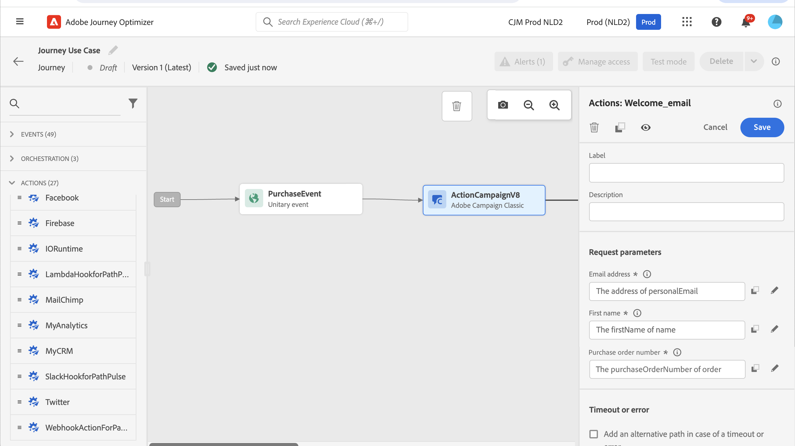

# Use case: send a message using Campaign v7/v8 {#campaign-classic-use-case}

This use case presents all the steps needed to send an email using the integration with Adobe Campaign Classic v7 and Adobe Campaign v8. 

We will first create a transactional email template in Campaign. Then, in Journey Optimizer, we'll create the event, action and design the journey.

To learn more on the Campaign integration, refer to these pages:

* [Creating a Campaign action](../action/acc-action.md)
* [Using the action in a journey](../building-journeys/using-adobe-campaign-classic.md).

**Adobe Campaign**

Your Campaign instance needs to be provisioned for this integration. The Transactional Messaging feature needs to be configured.

1. Log in to your Campaign control instance. 

1. Under **Administration** > **Platform** > **Enumerations**, select the **Event type** (eventType) enumeration. Create a new event type ("journey-event", in our example). You will have to use the internal name of the event type when writing the JSON file later. 

    

1. Disconnect and reconnect to the instance for the creation to be effective.

1. Under **Message Center** > **Transactional message templates**, create a new email template based on the event type previously created.

    

1. Design your template. In this example, we use personalization on the profile's first name and the order number. The first name is in the Adobe Experience Platform data source, and the order number is a field from our Journey Optimizer event. Make sure you use the correct field names in Campaign. 

    

1. Publish your transactional template.

    

1. Now you need to write the JSON payload corresponding the template. 

```
{
     "channel": "email",
     "eventType": "journey-event",
     "email": "Email address",
     "ctx": {
          "firstName": "First name", "purchaseOrderNumber": "Purchase order number"
     }
}
```

* For the channel, you need to type "email".
* For the eventType, use the internal name of the event type created previously.
* The email address will be a variable, so you can type any label.
* Under ctx, the personalization fields are also variables.

**Journey Optimizer**

1. First, you need to create an event. Make sure you include the "purchaseOrderNumber" field.

    

1. You then need to create, in Journey Optimizer, an action corresponding to your Campaign template. In the **Action type** drop-down, select **Adobe Campaign Classic**. 

    

1. Click the **Payload field** and paste the JSON created previously.

    

1. For the email address and the two personalization fields, change **Constant** to **Variable**.

    

1. Now create a new journey and start with the event previously created.

    

1. Add the action and map each field to the correct field in Journey Optimizer. 

    

1. Add an **End** activity and test your journey.

    

1. You can now publish your journey.
