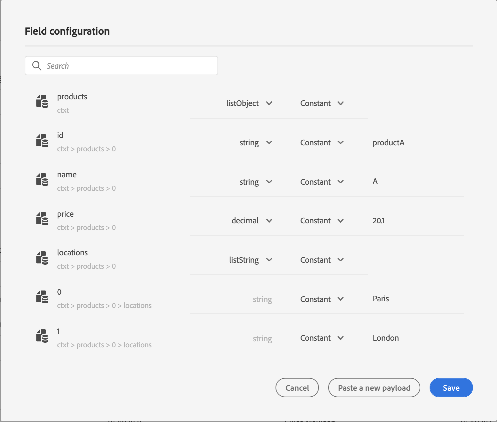
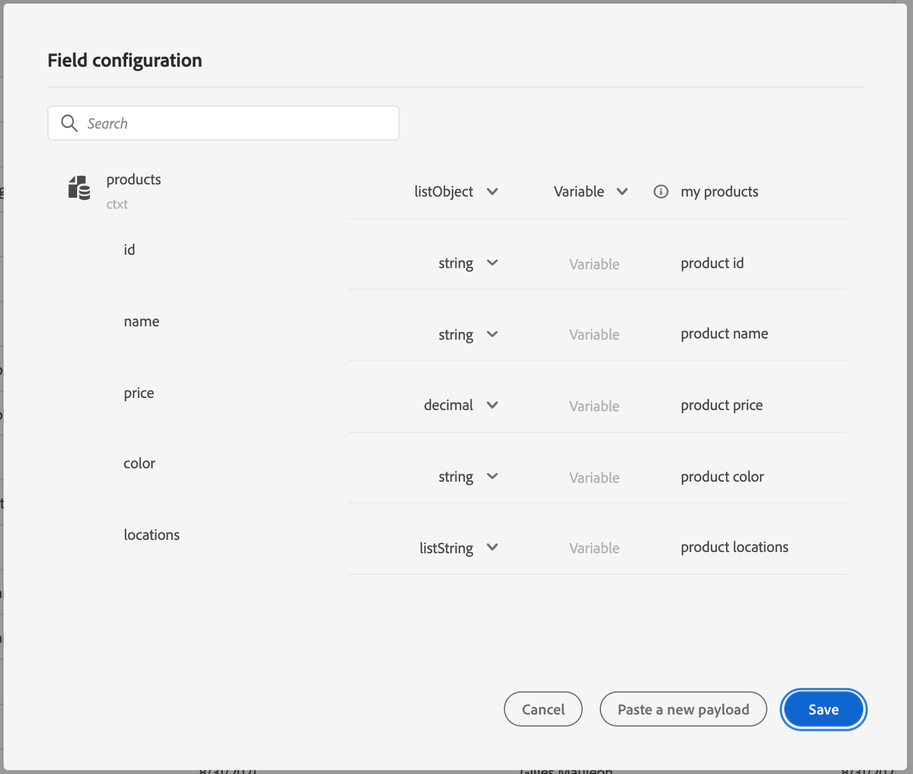
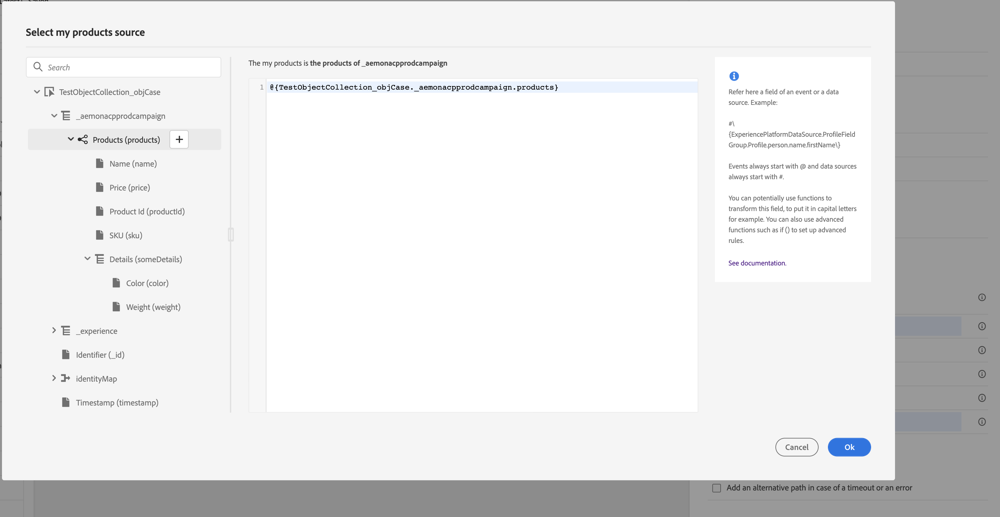
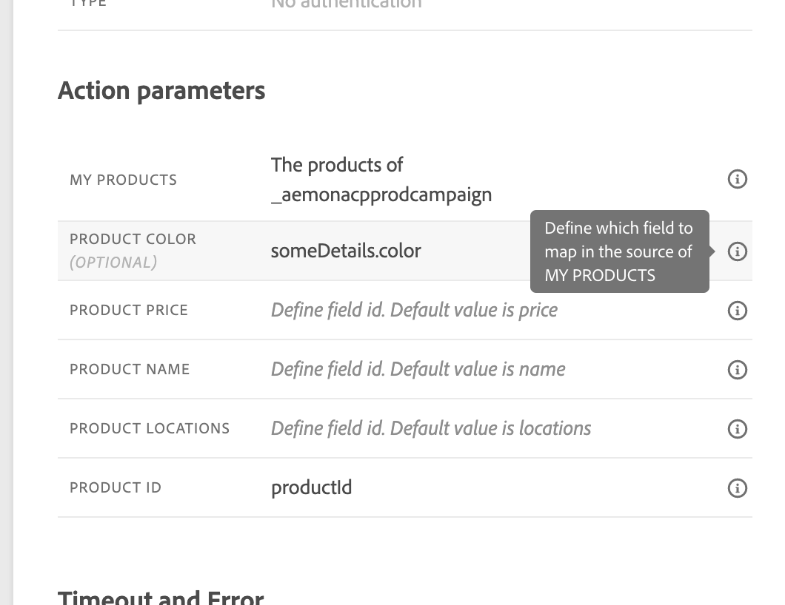
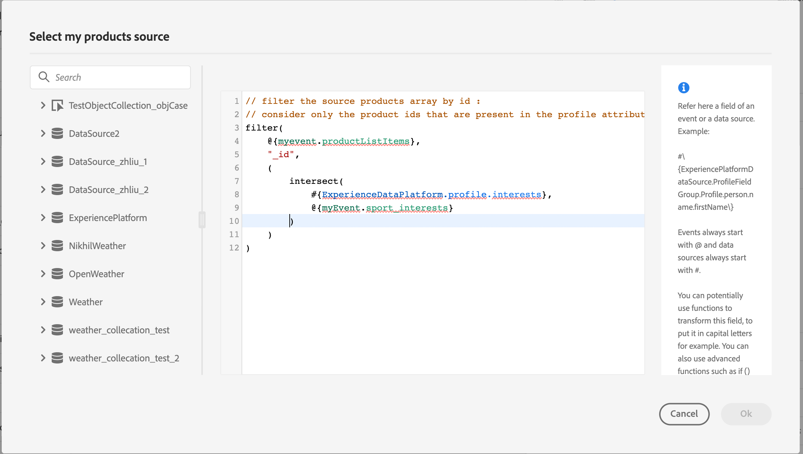
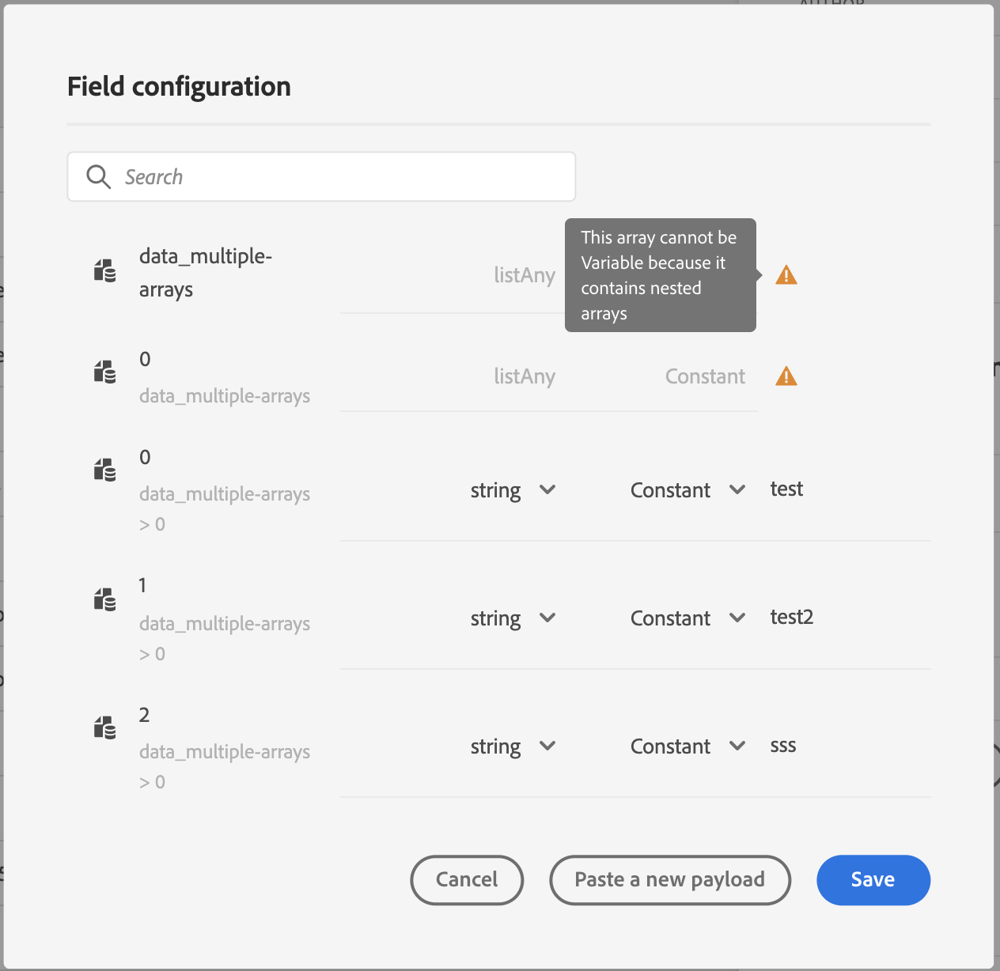

# Pass collections into custom action parameters {#passing-collection}

You can pass a collection in custom action parameters that is dynamically populated at runtime.

Two types of collections are supported:

* **Simple collections**

   Use simple collections for lists of basic values, such as strings, numbers, or booleans. These are useful when you only need to pass a list of items without additional properties.

   For example, a list of device types:

   ```json
   {
    "deviceTypes": [
        "android",
        "ios"
    ]
   }
   ```

* **Object collections**

   Use object collections when each item includes multiple fields or properties. These are typically used to pass structured data, such as product details, event records, or item attributes.

   For example:

   ```json
   {
   "products":[
      {
         "id":"productA",
         "name":"A",
         "price":20.1
      },
      {
         "id":"productB",
         "name":"B",
         "price":10.0
      },
      {
         "id":"productC",
         "name":"C",
         "price":5.99
      }
    ]
   }
   ```

>[!NOTE]
>
>Nested arrays within collections are only partially supported in custom action request payloads. For details, see [Limitations](#limitations).

## General procedure {#general-procedure} 

In this section, we use the following JSON payload example. This is an array of objects with a field that is a simple collection.

```json
{
  "ctxt": {
    "products": [
      {
        "id": "productA",
        "name": "A",
        "price": 20.1,
        "color":"blue",
        "locations": [
          "Paris",
          "London"
        ]
      },
      {
        "id": "productB",
        "name": "B",
        "price": 10.99
      }
    ]
  }
}
```

You can see that `products` is an array of two objects. You need to have at least one object.

1. Create your custom action. Learn more on [this page](../action/about-custom-action-configuration.md).

1. In the **[!UICONTROL Action parameters]** section, paste the JSON example. The displayed structure is static: when pasting the payload, all fields are defined as constants. 

   

1. If needed, adjust the field types. The following field types are supported for collections: listString, listInteger, listDecimal, listBoolean, listDateTime, listDateTimeOnly, listDateOnly, listObject

   >[!NOTE]
   >
   >The field type is automatically inferred according to the payload example.

1. If you want to pass objects dynamically, you need to set them as variables. In this example we set `products` as variable. All the object fields included in the object are set to variables automatically.

    >[!NOTE]
    >
    >The first object of the payload example is used to define the fields.

1. For each field, define the label which will be displayed in the journey canvas.

   {width="70%" align="left"}

1. Create your journey and add the custom action you created. Learn more on [this page](../building-journeys/using-custom-actions.md).

1. In the **[!UICONTROL Action parameters]** section, define the array parameter (`products` in our example) using the advanced expression editor.

   

1. For each of the following object field, type the corresponding field name from the source XDM schema. If the names are identical, this is not needed. In our example, we only need to define `product id` and "color".

   {width="50%" align="left"}

For the array field, you can also use the advanced expression editor to perform data manipulation. In the following example, we use the [filter](functions/list-functions.md#filter) and [intersect](functions/list-functions.md#intersect) functions:



## Limitations {#limitations}

While collections in custom actions provide flexibility for passing dynamic data, there are certain structural constraints to be aware of:

* **Support for Nested Arrays in Custom Actions**

   Adobe Journey Optimizer supports nested arrays of objects in custom action **response payloads**, but this support is limited in **request payloads**.

   In request payloads, nested arrays are only supported when they contain a fixed number of items, as defined in the custom action configuration. For example, if a nested array always includes exactly three items, it can be configured as a constant. When the number of items needs to be dynamic, only non-nested arrays (arrays at the bottom level) can be defined as variables.

   Example:
   
   1. The following example illustrates a **non-supported use case**.

      In this example, the products array includes a nested array (`locations`) with a dynamic number of items, which is not supported in request payloads.

      ```json
      {
      "products": [
         {
            "id": "productA",
            "name": "A",
            "price": 20,
            "locations": [
            { "name": "Paris" },
            { "name": "London" }
            ]
         }
      ]
      }
      ```
      
   2. Supported example, with fixed items defined as constants. 

      In this case, the nested locations are replaced by fixed fields (`location1`, `location2`), allowing the payload to remain valid within the supported configuration.

      ```json
      {
      "products": [
         {
            "id": "productA",
            "name": "A",
            "price": 20,
            "location1": { "name": "Paris" },
            "location2": { "name": "London" }
         }
      ]
      }
      ```


* **Testing collections**: To test collections using test mode, you must use code view mode. Note that code view mode is not supported for business events, so in that case, you can only send a collection containing a single element.


## Particular cases{#examples}

For heterogeneous types and arrays of arrays, the array is defined with the listAny type. You can only map individual items, but cannot change the array to variable.

{width="70%" align="left"}

Example of heterogenous type:

```json
{
    "data_mixed-types": [
        "test",
        "test2",
        null,
        0
    ]
}
```

Example of array of arrays:

```json
{
    "data_multiple-arrays": [
        [
            "test",
            "test1",
            "test2"
        ]
    ]
}
```

## Additional resources

Browse the sections below to learn more about configuring, using and troubleshooting your custom actions:

* [Get started with custom actions](../action/action.md) - Learn what is a custom action and how they help you connect to your third-party systems
* [Configure your custom actions](../action/about-custom-action-configuration.md) - Learn how to create and configure a custom action
* [Use custom actions](../building-journeys/using-custom-actions.md) - Learn how to use custom actions in your journeys
* [Custom action troubleshooting](../action/troubleshoot-custom-action.md) - Learn how to troubleshoot a custom action
* [Iterate over contextual data](../personalization/iterate-contextual-data.md#arrays-in-journeys) - Learn how to work with arrays in Journey expressions and iterate over custom action responses, event data, and dataset lookups in message personalization

