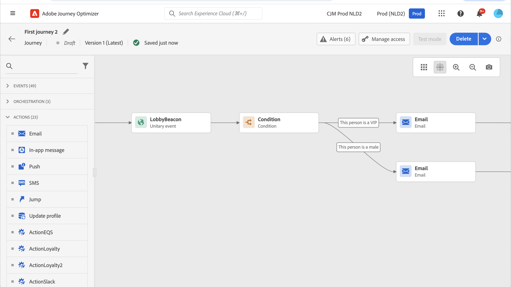
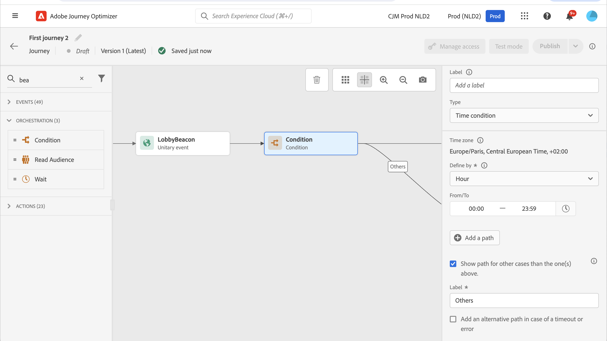
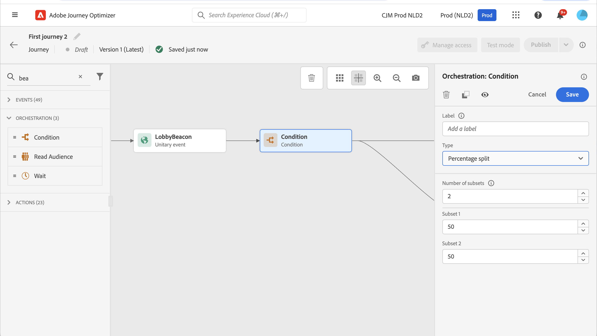
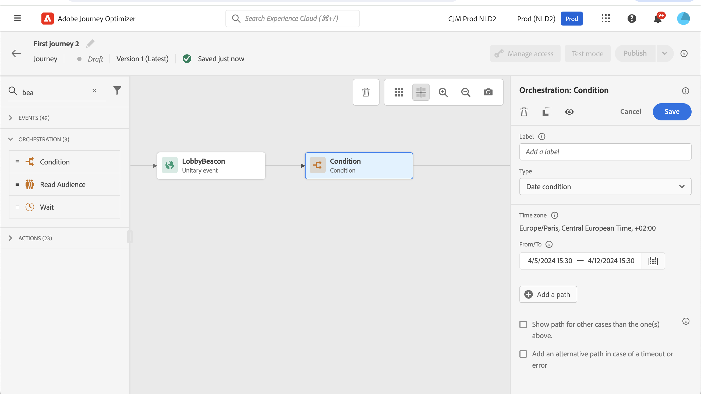
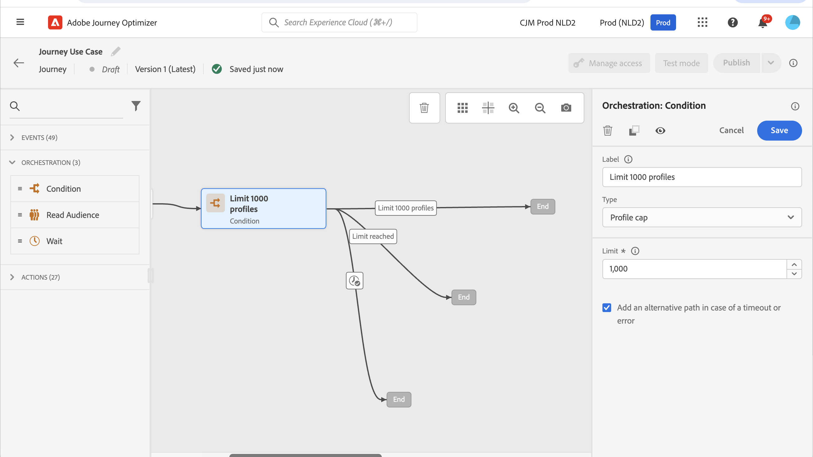
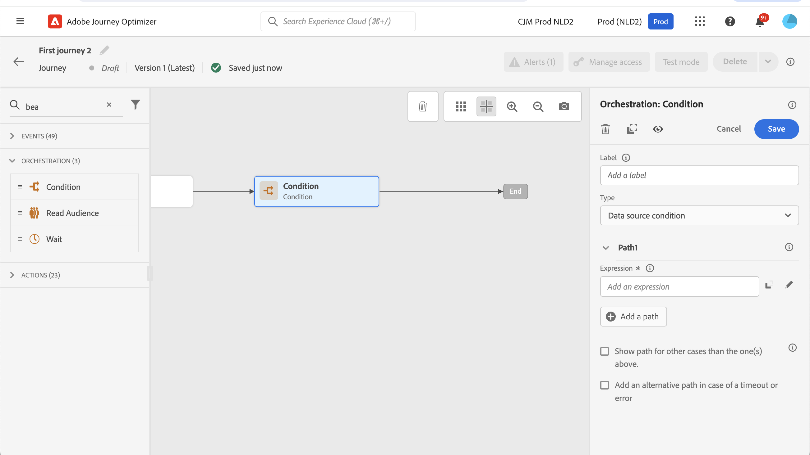
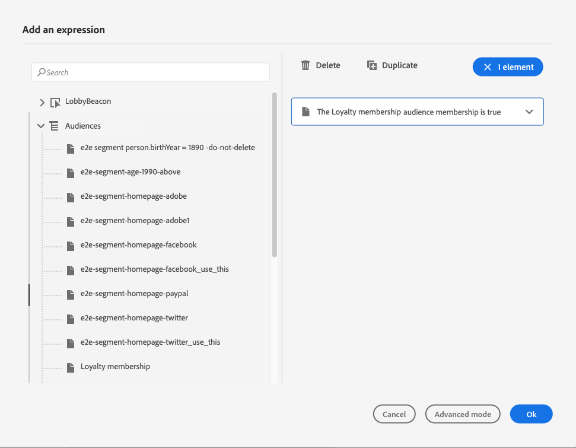

# Condition activity{#condition-activity}

>[!CONTEXTUALHELP]
>id="ajo_journey_condition"
>title="Condition activity"
>abstract="This activity allows you to define how the individual will flow in the journey. Several paths will be created based on various criterias. You can also create an alternative path in case of a timeout or an error."

These types of conditions are available:

* [Data Source condition](#data_source_condition) 
* [Time condition](#time_condition) 
* [Percentage split](#percentage_split) 
* [Date condition](#date_condition)
* [Profile cap](#profile_cap)

## About the Condition activity {#about_condition}

>[!CONTEXTUALHELP]
>id="ajo_journey_expression_simple"
>title="About the simple expression editor"
>abstract="The simple expression editor mode allows you to perform simple queries based on a combination of fields. All the available fields are displayed on the left side of the screen. Drag and drop fields into the main zone. To combine the different elements, interlock them into one another to create different groups and/or group levels. You can then select a logical operator to combine elements on the same level."

When using several conditions in a journey, you can define labels for each of them to identify them more easily.

Click **[!UICONTROL Add a path]** if you want to define several conditions. For each condition, a new path is added in the canvas after the activity.

Note that the design of journeys has functional impacts. When several paths are defined after a condition, only the first eligible path will be executed. It means that you can vary the prioritization of paths by placing them above or below one another.

For example, let's take the example of a first path's condition "The person is a VIP" and a second path's condition "The person is a male". If a person meeting both conditions (a male who is a VIP) passes this step, the first path will be chosen even if this person is also eligible to the second one, because the first path is "above". To change this priority, move your activities in another vertical order.

You can create another path for audiences that are not eligible to the defined conditions by checking **[!UICONTROL Show path for other cases than the one(s) above]**. Note that this option is not available in split conditions. See [Percentage split](#percentage_split).

The simple mode allows you to perform simple queries based on a combination of fields. All the available fields are displayed on the left side of the screen. Drag and drop fields into the main zone. To combine the different elements, interlock them into one another to create different groups and/or group levels. You can then select a logical operator to combine elements on the same level:

* AND: an intersection of two criteria. Only the elements matching all criteria are taken into account.
* OR: a union of two criteria. Elements matching at least one of the two criteria are taken into account.

If you're using the [Adobe Experience Platform Segmentation Service](https://experienceleague.adobe.com/docs/experience-platform/segmentation/home.html){target="_blank"} to create your segments, you can leverage them in your journey conditions. Refer to [Using segments in conditions](../building-journeys/condition-activity.md#using-a-segment).

>[!NOTE]
>
>You cannot perform queries on time series (for example a list of purchases, past clicks on messages) with the simple editor. For this you’ll need to use the advanced editor. See [this page](expression/expressionadvanced.md).

When an error occurs in an action or a condition, the journey of an individual stops. The only way to make it continue is to check the box **[!UICONTROL Add an alternative path in case of a timeout or an error]**. See [this section](../building-journeys/using-the-journey-designer.md#paths).

In the simple editor, you will also find the Journey Properties category, below the event and data source categories. This category contains technical fields related to the journey for a given profile. This is the information retrieved by the system from live journeys, such as the journey ID or the specific errors encountered. [Learn more](expression/journey-properties.md)

## Data Source condition {#data_source_condition}

This allows you to define a condition based on fields from the data sources or the events previously positioned in the journey. Learn how to use the expression editor in [this section](expression/expressionadvanced.md). 

Using the advanced expression editor, you can setup more advanced conditions manipulating collections or using data sources requiring the passing of parameters. [Learn more](../datasource/external-data-sources.md).

## Time condition{#time_condition}

This allows you to perform different actions according to the hour of the day and/or the day of the week. For example, you can decide to send push notifications during daytime and emails at night during weekdays.

>[!NOTE]
>
>The time zone is not specific to a condition and is defined at the journey level in the journey properties. Refer to [this page](../building-journeys/timezone-management.md).

Three time filtering options are available:

* Hour: allows you to set up a condition based on the time of the day. You then define the start and end times. Individuals will enter the path only during the defined hour range.
* Day of the week: allows you to set up a condition based on the day of the week. You then select which days you want individuals to enter the path.
* Day of the week and hour: this option combines the first two options.

## Percentage split {#percentage_split}

This option allows you to randomly split the audience to define a different action for each group. Define the number of splits and the repartition for each path. The split calculation is statistical as the system cannot anticipate how many people will flow in this activity of the journey. As a result, the split has a very low error margin. This function is based on a Java random mechanism (see this [page](https://docs.oracle.com/javase/7/docs/api/java/util/Random.html)).

In test mode, when reaching a split, the top branch is always chosen. You can reorganize the position of the split branches if you want the test to choose a different path. Refer to [this page](../building-journeys/testing-the-journey.md)

>[!NOTE]
>
>Note that there is no button to add a path in the percentage split condition. The number of paths will depend on the number of splits. In split conditions, you cannot add a path for other cases as it cannot happen. People will always go into one of the split paths.

## Date condition {#date_condition}

This allows you to define a different flow based on the date. For example, if the person enters the step during the "sales" period, you'll send them a specific message. The rest of the year, you'll send another message.

>[!NOTE]
>
>The time zone is no longer specific to a condition and is now defined at the journey level in the journey properties. See [this page](../building-journeys/timezone-management.md).

## Profile cap {#profile_cap}

Use this condition type to set a maximum number of profiles for a journey path. When this limit is reached, the entering profiles take an alternate path. This ensures that your journeys will never exceed the limit defined. 

>[!NOTE]
>
>We recommend that you define a high value profile cap. The precision and likelihood that a population will reach the exact cap number only increases as the cap increases. For small numbers (for example a cap of 50), the numbers will not always match up as the limit may not be reached before profiles take an alternate path.

You can use this condition type to ramp up the volume of your deliveries. See this [use case](ramp-up-deliveries-uc.md).

The default cap is 1000.

The counter applies only to the selected journey version. The counter is reset to zero after one month. After a reset, the entering profiles take the nominal path again until the counter limit is reached.

The nominal path always has priority over the alternate path, even if you move the alternate path above the nominal path on the journey canvas.

For live journeys, here are the thresholds to consider to ensure the limit is reached:

* For a cap greater than 10000, the number of distinct profiles to be injected must be at least 1.3 times the cap.
* For a cap below 10000, the number of distinct profiles to be injected must be 1000 plus the cap.

Profile cap is not taken into account in test mode.

## Using segments in conditions {#using-a-segment}

This section explains how to use a segment in a journey condition. For more on segments and how to build them, refer to [this section](../segment/about-segments.md).

To use a segment in a journey condition, follow these steps:

1. Open a journey, drop a **[!UICONTROL Condition]** activity and choose the **Data Source Condition**.
   

1. Click **[!UICONTROL Add a path]** for each extra path needed. For each path, click the **[!UICONTROL Expression]** field.

   

1. On the left side, unfold **[!UICONTROL Segments]** node. Drag and drop the segment you want to use for your condition. By default, the condition on the segment is true.

   

   >[!NOTE]
   >
   >Note that only the individuals with the **Realized** and **Existing** segment participation statuses will be considered as members of the segment. For more on how to evaluate a segment, refer to the [Segmentation Service documentation](https://experienceleague.adobe.com/docs/experience-platform/segmentation/tutorials/evaluate-a-segment.html#interpret-segment-results){target="_blank"}.
