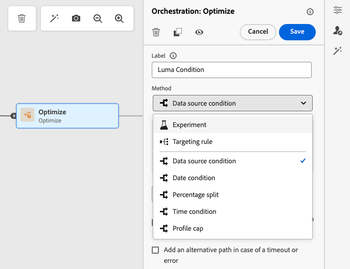
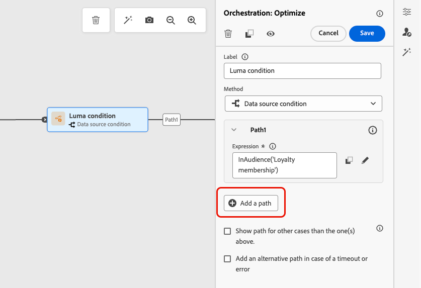
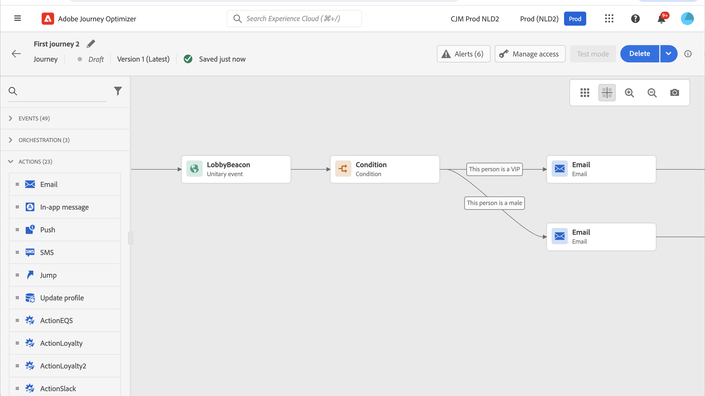
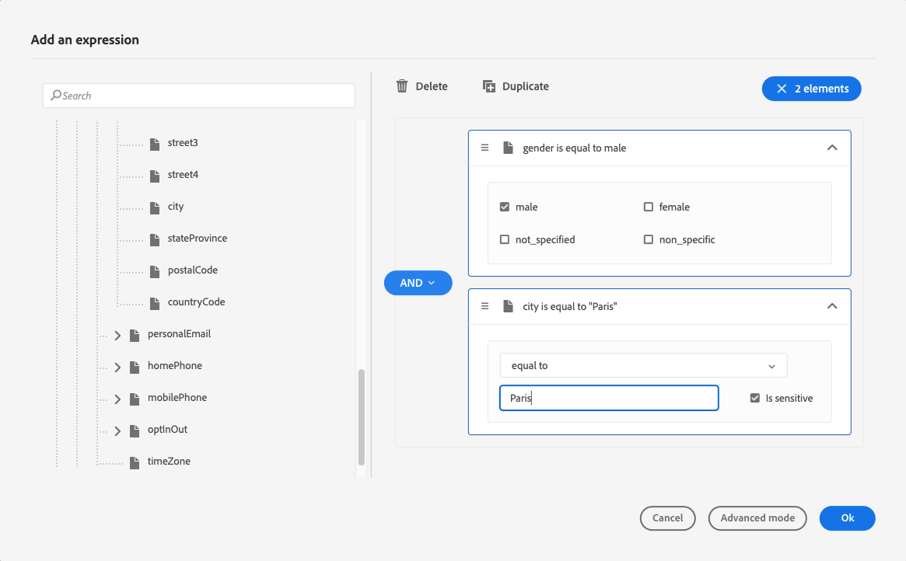
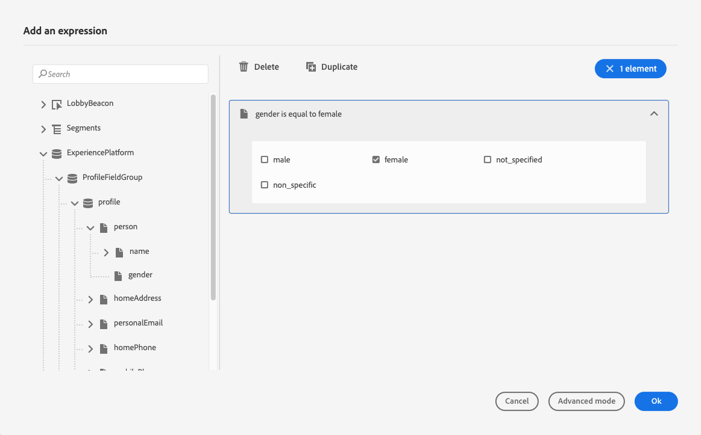
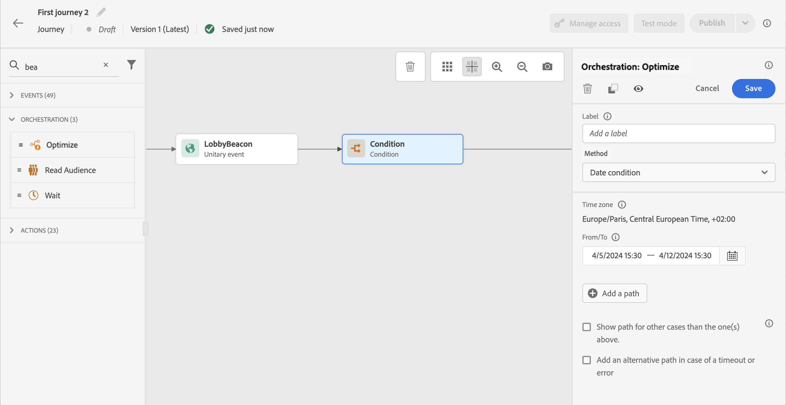
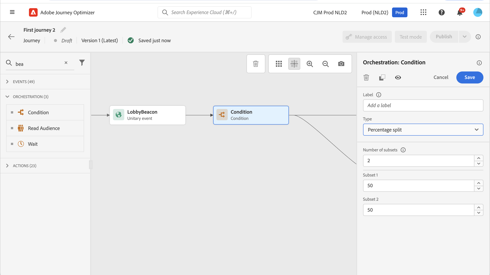
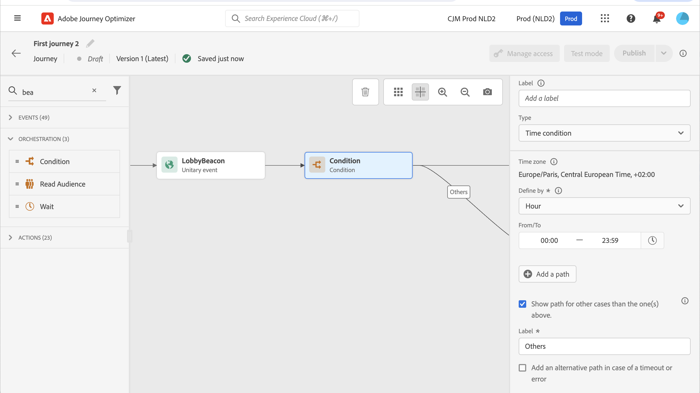
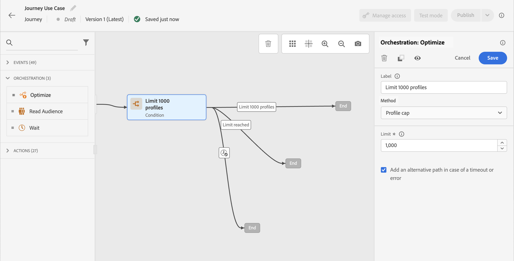
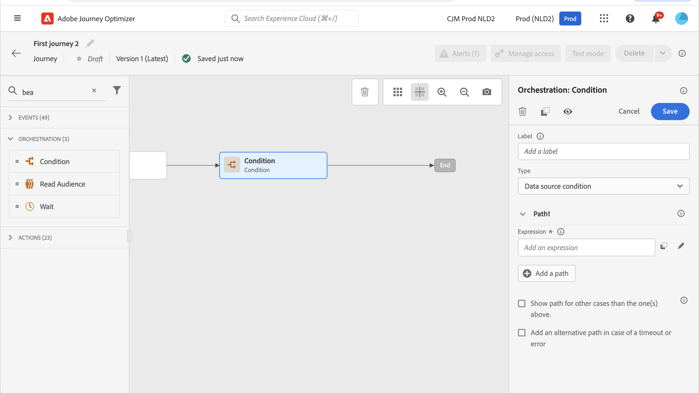

# Conditions {#conditions}

>[!CONTEXTUALHELP]
>id="ajo_journey_conditions"
>title="Conditions"
>abstract="Conditions let you define how individuals progress through your journey by creating multiple paths based on specific criteria. You can also configure an alternate path to handle timeouts or errors, ensuring a seamless experience. Note that the conditions are now configured in the Optimize activity, which replaces the former Condition activity."

With **conditions** you can define how individuals progress through your journey by creating multiple paths based on specific criteria. You can also configure an alternate path to handle timeouts or errors, ensuring a seamless experience.

>[!NOTE]
>
>The new vehicle for creating conditional paths in journeys is the [Optimize](optimize.md) activity. It replaces the former **Condition** activity, which has been removed from the UI. All conditional logic is now handled through the Optimize activity's conditions presented on this page.
>
>If you have existing journeys that used **[!UICONTROL Condition]** activities, you can continue to use them as before. They now appear with a new icon as **[!UICONTROL Optimize]** activities using the **[!UICONTROL Condition]** method, but the behavior is unchanged. Any custom label you had set on the node is preserved.

## Add a condition {#add-condition-activity}

To add a condition to your journey, follow the steps below.

1. Drop the **[!UICONTROL Optimize]** activity into the journey canvas. [Learn more](optimize.md)

1. Add an optional label to identify the activity in reporting and test mode logs.

1. Select a condition from the **[!UICONTROL Method]** drop-down list.

   {width=80%}

   The following types of conditions are available:

   * [Data source condition](#data_source_condition) 
   * [Time condition](#time_condition) 
   * [Percentage split](#percentage_split) 
   * [Date condition](#date_condition)
   * [Profile cap](#profile_cap)
   * You can also use an audience in a journey condition. [Learn more](#using-a-segment)

>[!NOTE]
>
>Condition evaluation will fail for profiles that include more than two cross-device identities in the [Profile Store](https://experienceleague.adobe.com/docs/experience-platform/profile/home.html#profile-data-store){target="_blank"}.

## Manage condition paths {#condition_paths}

>[!CONTEXTUALHELP]
>id="ajo_journey_expression_simple2"
>title="About the simple expression editor"
>abstract="The simple expression editor mode allows you to perform simple queries based on a combination of fields. All the available fields are displayed on the left side of the screen. Drag and drop fields into the main zone. To combine the different elements, interlock them into one another to create different groups and/or group levels. You can then select a logical operator to combine elements on the same level."

When using several conditions in a journey, you can define labels for each of them to identify them more easily.

Click **[!UICONTROL Add a path]** if you want to define several conditions. For each condition, a new path is added in the canvas after the activity.

{width=80%}

Note that the design of journeys has functional impacts. When several paths are defined after a condition, only the first eligible path will be executed. It means that you can vary the prioritization of paths by placing them above or below one another.

Let's take two path conditions: "The person is a VIP" and "The person is a male." If a person meets both conditions, the first path is chosen because it is above the second. To change this priority, move your activities to a different vertical order.

You can create another path for audiences that are not eligible to the defined conditions by checking **[!UICONTROL Show path for other cases than the one(s) above]**.

>[!NOTE]
>
>This option is not available in split conditions. [Learn more](#percentage_split)

The simple mode allows you to perform simple queries based on a combination of fields. All the available fields are displayed on the left side of the screen. Drag and drop fields into the main zone. To combine the different elements, interlock them into one another to create different groups and/or group levels. You can then select a logical operator to combine elements on the same level:

* **AND** - An intersection of two criteria. Only the elements matching all criteria are taken into account.
* **OR** - A union of two criteria. Elements matching at least one of the two criteria are taken into account.

{width=80%}

If you are using the [Adobe Experience Platform Segmentation Service](https://experienceleague.adobe.com/docs/experience-platform/segmentation/home.html){target="_blank"} to create your audiences, you can leverage them in your journey conditions. Refer to [Use audience in conditions](#using-a-segment).

>[!NOTE]
>
>You cannot perform queries on time series (for example a list of purchases, past clicks on messages) with the simple editor. For this you'll need to use the advanced editor. See [this page](expression/expressionadvanced.md).

When an error occurs in an action or a condition, the journey of an individual stops. The only way to make it continue is to check the box **[!UICONTROL Add an alternative path in case of a timeout or an error]**. [Learn more](../building-journeys/using-the-journey-designer.md#paths)

In the simple editor, you will also find the Journey Properties category, below the event and data source categories. This category contains technical fields related to the journey for a given profile. This is the information retrieved by the system from live journeys, such as the journey ID or the specific errors encountered. [Learn more](expression/journey-properties.md)

## Data source condition {#data_source_condition}

Use a **[!UICONTROL Data source condition]** to define a condition based on fields from the data sources or the events previously positioned in the journey. This type of condition is defined with the expression editor. [Learn how to use the expression editor](expression/expressionadvanced.md)

For example, if you are targeting an audience with enrichment attributes generated using a composition workflow or a custom upload (CSV file), you can leverage these enrichment attributes to build your condition.

>[!IMPORTANT]
>
>**Handling missing or non-ingested attributes**
>
>If a schema field is defined in your Profile schema but no data has been ingested for that field, Journey Optimizer and the underlying Real-Time Customer Profile interpret the field as `null`. As a result, conditions that check for `isEmpty()`, `isNull()`, or similar functions will evaluate to `true` even if the attribute was never ingested. This can lead to unexpected journey behavior if you are not aware that the field has no data.
>
>To avoid confusion, ensure that the attributes you use in condition expressions have been ingested with actual data before the profile enters the journey. You can verify attribute values in the [Real-Time Customer Profile](https://experienceleague.adobe.com/docs/experience-platform/profile/home.html){target="_blank"} to confirm whether data exists for the fields used in your conditions.

Using the advanced expression editor, you can setup more advanced conditions manipulating collections or using data sources requiring the passing of parameters. [Learn more](../datasource/external-data-sources.md)

{width=80%}

## Date condition {#date_condition}

This allows you to define a different flow based on the date. For example, if the person enters the step during the "sales" period, you'll send them a specific message. The rest of the year, you'll send another message.

>[!NOTE]
>
>The time zone is no longer specific to a condition and is now defined at the journey level in the journey properties. [Learn more](../building-journeys/timezone-management.md)

## Percentage split {#percentage_split}

This option allows you to randomly split the audience to define a different action for each group. Define the number of splits and the repartition for each path. The split calculation is statistical as the system cannot anticipate how many people will flow in this activity of the journey. As a result, the split has a very low error margin. This function is based on a [Java random mechanism](https://docs.oracle.com/javase/7/docs/api/java/util/Random.html){target="_blank"}.

In test mode, when reaching a split, the top branch is always chosen. You can reorganize the position of the split branches if you want the test to choose a different path. [Learn more](../building-journeys/testing-the-journey.md)

>[!NOTE]
>
>Note that there is no button to add a path in the percentage split condition. The number of paths will depend on the number of splits. In split conditions, you cannot add a path for other cases as it cannot happen. People will always go into one of the split paths.

## Time condition {#time_condition}

Use a **[!UICONTROL Time condition]** to perform different actions according to the hour of the day and/or the day of the week. For example, you can decide to send push notifications during daytime and emails at night during weekdays.

>[!NOTE]
>
>* The time zone is not specific to a condition and is defined at the journey level in the journey properties. [Learn more](../building-journeys/timezone-management.md)
>
>* By default, the **[!UICONTROL Time condition]** is set by hour, from 00:00 to 12:00.

Three time filtering options are available:

* **Hour** - Allows you to set up a condition based on the time of the day. You then define the start and end times. Individuals will enter the path only during the defined hour range.
* **Day of the week** - Allows you to set up a condition based on the day of the week. You then select which days you want individuals to enter the path.
* **Day of the week and hour** - This option combines the first two options.

## Profile cap {#profile_cap}

Use this condition type to set a maximum number of profiles for a journey path. When this limit is reached, the entering profiles take an alternate path. This ensures that your journeys will never exceed the limit defined. 

>[!NOTE]
>
>We recommend that you define a high value profile cap. The precision and likelihood that a population will reach the exact cap number only increases as the cap increases. For small numbers (for example a cap of 50), the numbers will not always match up as the limit may not be reached before profiles take an alternate path.

<!--You can use this condition type to ramp up the volume of your deliveries. See this [use case](ramp-up-deliveries-uc.md).-->

The default cap is 1,000.

The counter applies only to the selected journey version. The counter resets to zero when the journey is duplicated or when a new version is created. After a reset, the entering profiles take the nominal path again until the counter limit is reached.

When profile cap is defined on a recurring journey, the counter does not reset after each recurrence.

The nominal path always has priority over the alternate path, even if you move the alternate path above the nominal path on the journey canvas.

For live journeys, here are the thresholds to consider to ensure the limit is reached:

* For a cap greater than 10,000, the number of distinct profiles to be injected must be at least 1.3 times the cap.
* For a cap below 10,000, the number of distinct profiles to be injected must be 1000 plus the cap.

Profile cap is not taken into account in test mode.

## Use audiences in conditions {#using-a-segment}

This section explains how to use an audience in a journey condition. For more on audiences and how to build them, refer to [this section](../audience/about-audiences.md).

To use an audience in a journey condition, follow these steps:

1. Open a journey, drop an **[!UICONTROL Optimize]** activity and choose the **[!UICONTROL Data source condition]**.

   

1. Click **[!UICONTROL Add a path]** for each extra path needed. For each path, click the **[!UICONTROL Expression]** field.

1. On the left side, unfold **[!UICONTROL Audiences]** node. Drag and drop the audience you want to use for your condition. By default, the condition on the audience is true.

   ![Audiences node in expression editor for selecting [!DNL Adobe Experience Platform] audiences](assets/segment4.png){width=80%}

   >[!NOTE]
   >
   >Note that only the individuals with the **Realized** audience participation status will be considered as members of the audience. For more on how to evaluate an audience, refer to the [Segmentation Service documentation](https://experienceleague.adobe.com/docs/experience-platform/segmentation/tutorials/evaluate-a-segment.html#interpret-segment-results){target="_blank"}.
