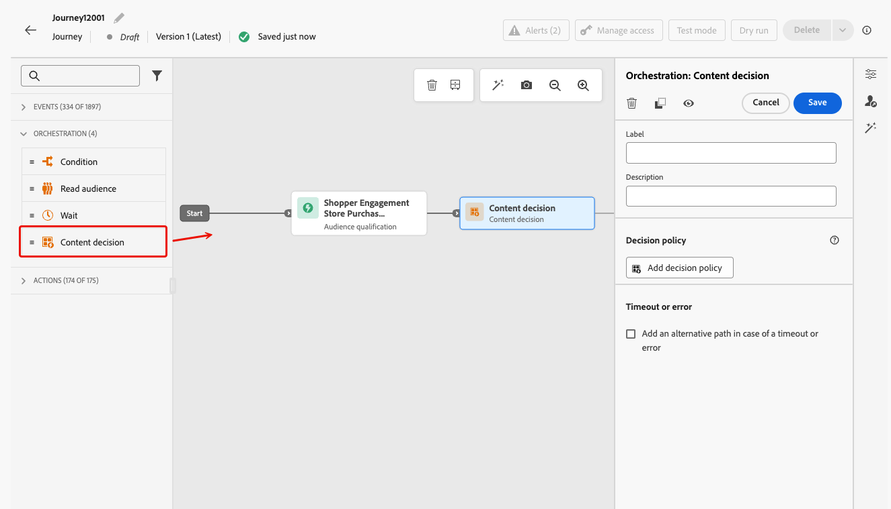
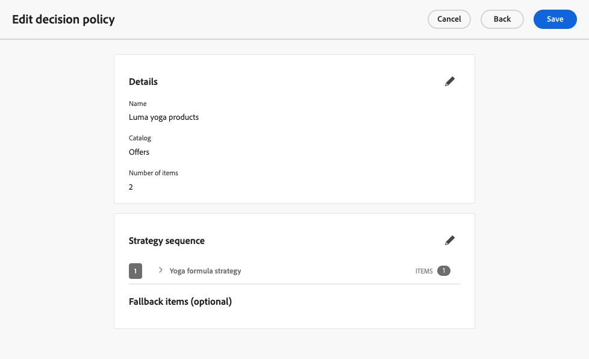
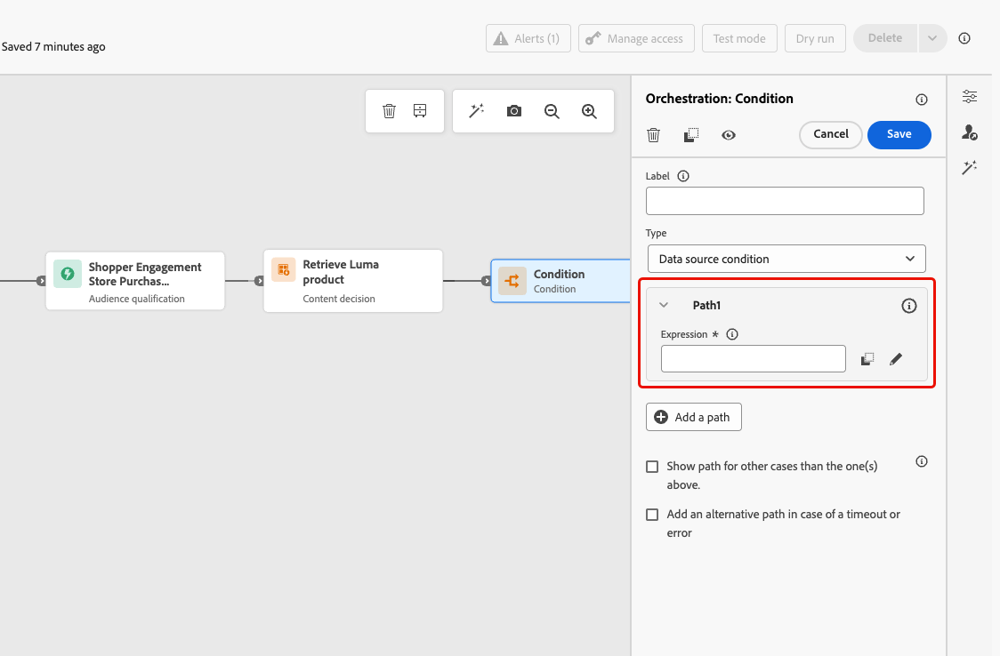
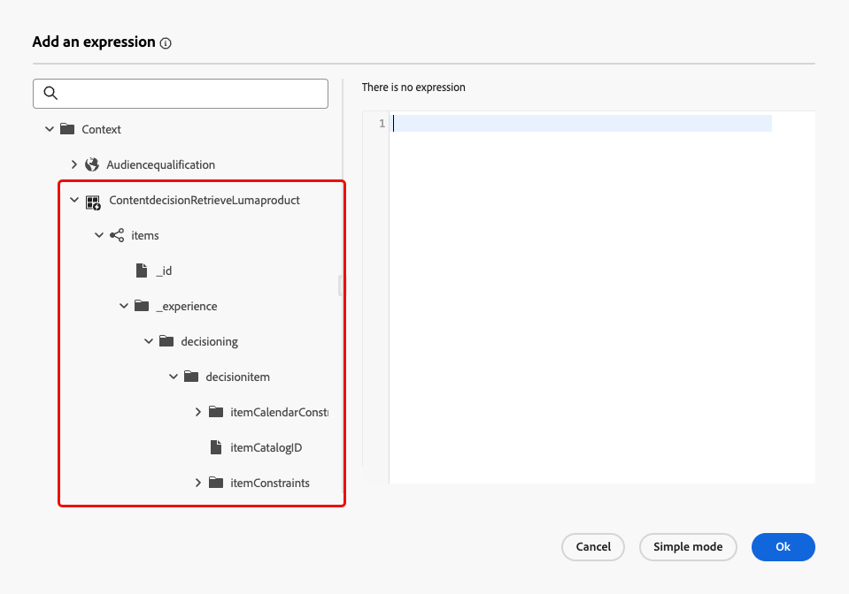
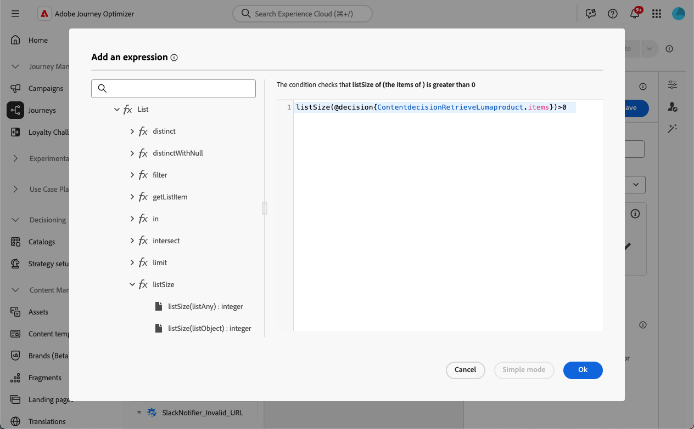
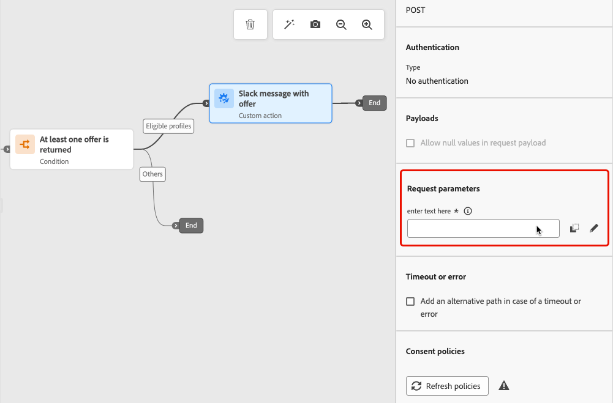
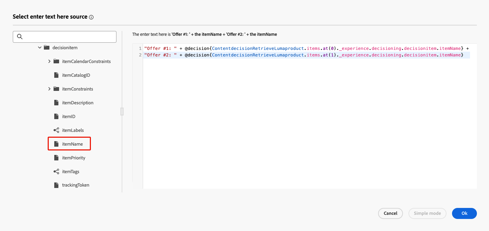
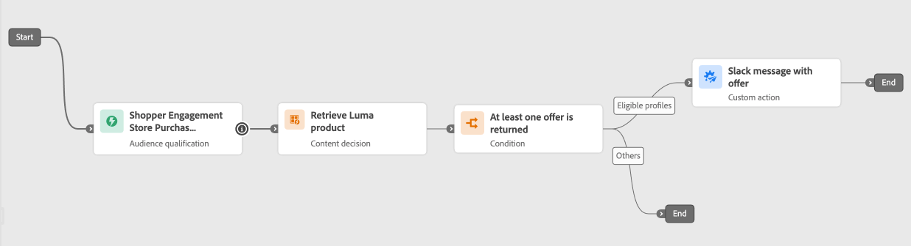

# Content decision activity {#content-decision}

>[!AVAILABILITY]
>
>This capability is only available for a set of organizations (Limited Availability), and will be rolled out globally in a future release.

[!DNL Journey Optimizer] allows you to include offers in your journeys through the dedicated **content decision** activity in the journey canvas. You can then add other activities (such as [custom actions](../action/about-custom-action-configuration.md)) to your journeys to target your audiences with these personalized offers.

>[!NOTE]
>
>The output of a content decision activity cannot be used in native channel activities.

To leverage this capability, create a journey where you add a [content decision activity](#add-content-decision-activity) to define the offers you want to present to the eligible profiles.

You can then use the output of the content decision activity in:

* a [condition activity](#add-condition-activity), to move profiles to specific paths based on the offers retrieved;

* a [custom action](#add-custom-action), where you can send those offers to external systems.

## Configure a content decision activity {#add-content-decision-activity}

Using the content decision activity, you can define a decision policy which allows you to pick the best items from [!DNL Journey Optimizer] Decisioning and deliver them to the right audience.

<!--Their goal is to select the best offers for each profile, while the campaign/journey authoring allows you to indicate how the selected decision items should be presented, including which item attributes to be included in the message.-->

To configure the **[!UICONTROL Content decision]** activity, follow the steps below.

1. Unfold the **[!UICONTROL Orchestration]** category and drop an **[!UICONTROL Content decision]** activity into your canvas.

   {width=100%}

1. Optionally, add a label and description to the activity.

1. Click **[!UICONTROL Add decision policy]**. [Learn more on decision policies](../experience-decisioning/create-decision.md)

   >[!NOTE]
   >
   >Decisioning permissions are needed to author a decision policy. [Learn more](../experience-decisioning/gs-experience-decisioning.md#steps)

1. Select the number of items you want to be returned back. For example, if you select 2, the best 2 eligible offers will be presented. Click **[!UICONTROL Next]**.

1. In the **[!UICONTROL Strategy sequence]** section, select the decision items and/or selection strategies to present with the decision policy. [Learn more](../experience-decisioning/create-decision.md#select)

1. Arrange the evaluation order as needed.

   When adding several decision items and/or strategies, they are evaluated in sequential order, indicated with numbers at the left of each object or group of objects. To change the default sequence, you can drag and drop the objects and/or the groups to reorder them as wanted. [Learn more](../experience-decisioning/create-decision.md#evaluation-order)

1. (optional) Add a fallback offer. [Learn more](../experience-decisioning/create-decision.md#fallback)

1. Review and save your decision policy.

   {width=70%}<!--reshoot or change screen-->

You are now ready to leverage the output of this content decision activity in your journey. 

## Guardrails & limitations {#guardrails}

**Consent policies** 

Updates to consent policies take up to 48 hours to take effect. If a decision policy references an attribute tied to a recently updated consent policy, the changes will not be applied immediately.

Similarly, if new profile attributes that are subject to a consent policy are added to a decision policy, they will be usable, but the consent policy associated with them will not be enforced until the delay has passed.

Consent policies are only available to organizations with the Adobe Healthcare Shield or Privacy and Security Shield add-on.

## Use the output of the content decision activity {#use-content-decision-output}

The output of a content decision can be used in multiple journey activities. For example, you can use a [condition activity](#add-condition-activity) to move profiles to specific branches of your journey, based on the number of offers retrieved for them.

You can also add a [custom action](#add-custom-action) to your journey in order to share the offers from the content decision activity to an external system.

### In a condition activity {#add-condition-activity}

To leverage the output of a content decision activity, you can add a condition to your journey, where you define expressions to move profiles to specific paths, using data from those offers. Follow the steps below.

1. From the **[!UICONTROL Orchestration]** category, drop a **[!UICONTROL Condition]** activity into your canvas. [Learn more](condition-activity.md#add-condition-activity)

1. (optional) Rename **[!UICONTROL Path1]**, which corresponds to the first expression you define, to a more relevant label.

1. For this first path, click inside the **[!UICONTROL Expression]** field or use the Edit icon to add an expression.

   {width=80%}

1. In the pop-up window that opens, switch to **[!UICONTROL Advanced mode]** to use the [advanced expression editor](expression/expressionadvanced.md).

   >[!CAUTION]
   >
   >The output of a content decision node is only available in the **[!UICONTROL Advanced mode]**.

1. Unfold the **[!UICONTROL Context]** node and navigate to your decision policy to display all the attributes available in the [offers catalog schema](../experience-decisioning/catalogs.md#access-catalog-schema).

   

   >[!NOTE]
   >
   >Any restricted label defined on an attribute, either in a journey experience event used in a decision rule (as context data), or in the [offers schema](../experience-decisioning/catalogs.md#access-catalog-schema), does result in policy violation for DULE or consent. Learn more on data governance policies in [this section](../action/action-privacy.md)

1. To check if any offer has been returned for the profiles who enter the journey, use the [listSize](functions/functionlistsize.md) function with the following syntax: `listSize(@decision{ContentdecisionName.items})>0`

   >[!NOTE]
   >
   >In this example, `Name` is the label of the content decision you added to your journey.

   

1. Click **[!UICONTROL Ok]**.

1. Add more paths to define other conditions as needed.

   You can also create another path for profiles that do not meet the first condition by checking **[!UICONTROL Show path for other cases than the one(s) above]**. <!--These profiles will then exit the journey if no other activity is added in that path.-->

1. Save the condition activity.

### In a custom action {#add-custom-action}

To leverage the output of a content decision activity, you can add a custom action to your journey, in which you will share the offers you defined to an external system. Follow the steps below.

1. Add a custom action to your journey. [Learn more](../action/about-custom-action-configuration.md)

1. Enter a label for your action.

1. In the **[!UICONTROL Request parameters]** section, select the parameter you would like to map to attributes from the offers that have been retrieved.

   Click inside the editable text field and select any parameter you would like to map to attributes from the offers that have been retrieved.

   

1. Switch to **[!UICONTROL Advanced mode]** in the pop-up window that opens. In the [advanced expression editor](expression/expressionadvanced.md), unfold the **[!UICONTROL Context]** node to display all the decision policy items.

   >[!CAUTION]
   >
   >The output of a content decision node is only available in the **[!UICONTROL Advanced mode]**.

1. Browse through the [offers catalog schema](../experience-decisioning/catalogs.md#access-catalog-schema) using the`items` array. For example, use the `itemName` of the first offer retrieved and the `itemName` of the second offer retrieved.

   

1. Click **[!UICONTROL Ok]** to save your expression.

1. **[!UICONTROL Save]** your custom action configuration.

### End-to-end example {#use-case}

Below is the full example of a journey using a content decision activity combined to a condition activity and a custom action - such as described above.

   

<!--When all activities are properly configured and saved, [publish](publishing-the-journey.md) your journey.-->

Once the journey is [activated](publishing-the-journey.md):

<!--* Profiles who enter the journey and are eligible for at least one offer are targeted by the custom action.

* If no offer is returned for a profile, they are excluded from the custom action.-->

1. Every time a profile qualifies for that audience, it enters the journey.

1. Through the content decision activity, [!DNL Journey Optimizer] retrieves the offers relevant to each profile.

1. Only profiles for which at least one offer is retrieved continue the journey (through the 'Eligible profiles' path).

1. If the condition is met, the corresponding offers are sent to an external system through the custom action.
