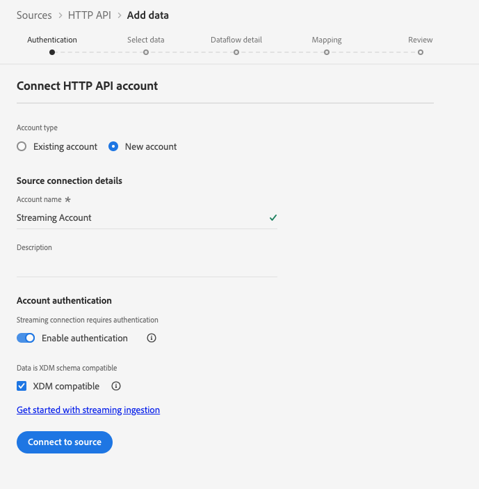

# Use case: Use Custom Actions to write Journey Events in Experience Platform{#custom-action-aep}

This use case explains how to write custom events into Adobe Experience Platform from Journeys using Custom Actions and Authenticated calls.

## Configure an IO project

1. From the Adobe Developer Console, click **Project** and open your IO project.

1. In the **Credentials** section, click **OAuth Server-to-Server**.

    

1. Click **View cURL command**.

    

1. Copy the cURL command and store the client_id, client_secret, grant_type and scope.

```
curl -X POST 'https://ims-na1.adobelogin.com/ims/token/v3' -H 'Content-Type: application/x-www-form-urlencoded' -d 'grant_type=client_credentials&client_id=1234&client_secret=5678&scope=openid,AdobeID,read_organizations,additional_info.projectedProductContext,session'
```
 
## Configure the Source using HTTP API Inlet

1. Create an endpoint in Adobe Experience Platform to write the data from journeys.

1. In Adobe Experience Platform, click **Sources**, under **Connections** in the left menu. Under **HTTP API**, click **Add data**.

    

1. Select **New account** and enable authentication. Click on **Connect to Source**.

    

1. Click on **Next** and select the Dataset where you want to write the data. Click **Next** and **Finish**.

    

1. Open the newly created dataflow. Copy the schema payload and save it in your notepad.

```
{
"header": {
"schemaRef": {
"id": "https://ns.adobe.com/<your_org>/schemas/<schema_id>",
"contentType": "application/vnd.adobe.xed-full+json;version=1.0"
},
"imsOrgId": "<org_id>",
"datasetId": "<dataset_id>",
"source": {
"name": "Custom Journey Events"
}
},
"body": {
"xdmMeta": {
"schemaRef": {
"id": "https://ns.adobe.com/<your_org>/schemas/<schema_id>",
"contentType": "application/vnd.adobe.xed-full+json;version=1.0"
}
},
"xdmEntity": {
"_id": "test1",
"<your_org>": {
"journeyVersionId": "",
"nodeId": "", "customer_Id":""
},
"eventMergeId": "",
"eventType": "",
"producedBy": "self",
"timestamp": "2018-11-12T20:20:39+00:00"
}
}
}
```

## Configure the Custom Action

1. Open Adobe Journey Optimizer, and click **Configurations**, under **Administration** in the left menu. Under **Actions**, click **Manage** and click **Create Action**.

1. Set the URL and select the Post method. 

    `https://dcs.adobedc.net/collection/<collection_id>?syncValidation=false`

1. Make sure that the Headers (Content-Type, Charset, sandbox-name) are configured.

    

### Set up the Authentication

1. Select the **Type** as **Custom** with the following Payload.

1. Paste the client_secret, client_id, scope and grant_type (from the IO project payload used before).

    ```
    {
    "type": "customAuthorization",
    "authorizationType": "Bearer",
    "endpoint": "https://ims-na1.adobelogin.com/ims/token/v3",
    "method": "POST",
    "headers": {},
    "body": {
    "bodyType": "form",
    "bodyParams": {
    "grant_type": "client_credentials",
    "client_secret": "********",
    "client_id": "<client_id>",
    "scope": "openid,AdobeID,read_organizations,additional_info.projectedProductContext,session"
    }
    },
    "tokenInResponse": "json://access_token",
    "cacheDuration": {
    "duration": 28000,
    "timeUnit": "seconds"
    }
    }
    ```

1. Use the **Click to test the authentication** button to test the connection.

    

### Set up the Payload

1. In the **Request** and **Response** fields, paste the payload from the source connection used before.

    ```
    {
    "xdmMeta": {
    "schemaRef": {
    "id": "https://ns.adobe.com/<your_org>/schemas/<schema_id>",
    "contentType": "application/vnd.adobe.xed-full+json;version=1.0"
    }
    },
    "xdmEntity": {
    "_id": "/uri-reference",
    "<your_org>": {
    "journeyVersionId": "Sample value",
    "nodeId": "Sample value",
    "customer_Id":""
    },
    "eventMergeId": "Sample value",
    "eventType": "advertising.completes,
    "producedBy": "self",
    "timestamp": "2018-11-12T20:20:39+00:00"
    }
    }
    ```

1. Change the Field Configuration from **Constant** to **Variable** for fields which will be populated dynamically. Save the Custom Action.

## Journey

1. Finally, use this custom action in a journey to write the custom journey events.

1. Populate the Journey Version Id, Node Id, Node Name and other attributes according to your use case.

    


