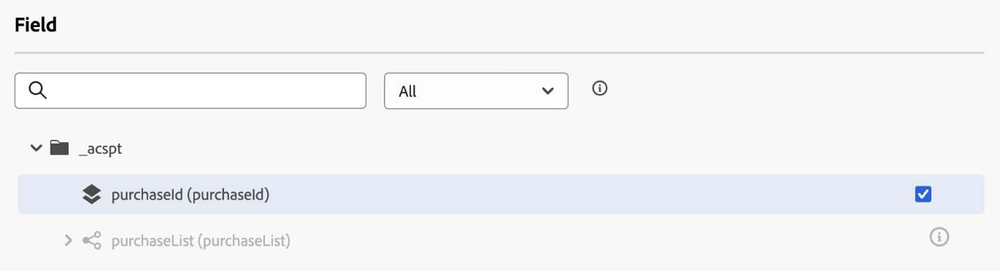
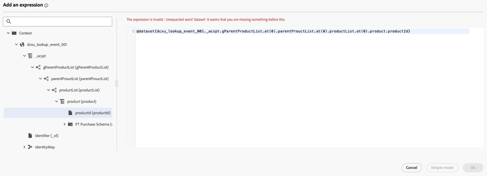

# Use [!DNL Adobe Experience Platform] data in journeys {#datalookup}

>[!CONTEXTUALHELP]
>id="ajo_journey_dataset_lookup"
>title="Dataset lookup activity"
>abstract="The **[!UICONTROL Dataset lookup]** activity allows you to to dynamically retrieve data from Adobe Experience Platform record datasets during runtime. By leveraging this capability, you can access data that may not reside in the profile or event payload, ensuring your customer interactions are both relevant and timely."

The **[!UICONTROL Dataset lookup]** activity allows you to to dynamically retrieve data from Adobe Experience Platform record datasets during runtime. By leveraging this capability, you can access data that may not reside in the profile or event payload, ensuring your customer interactions are both relevant and timely.

Key Benefits:

* **Real-Time personalization**: Tailor customer experiences using enriched data.
* **Dynamic decision-making**: Use external data to drive journey logic and actions.
* **Enhanced data Access**: Retrieve product metadata, pricing tables, or relational data tied to specific keys.

>[!AVAILABILITY]
>
>This activity is only available for a set of organizations (Limited Availability). To gain access, contact your Adobe representative.

## Must-read {#must-read}

### Dataset enablement

The dataset must be enabled for lookup in Adobe Experience Platform. Detailed information are available in this section: [Use Adobe Experience Platform data](../data/lookup-aep-data.md). 

### Limits & restrictions

* Maximum of 10 Dataset Lookup activities per journey.
* Maximum of 20 selected fields.
* Maximum of 500 keys in the lookup keys array.
* Enriched data size is limited to 10KB.

### Additional performance considerations 

The below recommendations are guidance to avoid delays in deliverability:

| Consideration | Recommended limit | Description |
| ------- | ------- | ------- |
| Attributes per Lookup | Up to 20 | Number of data fields retrieved per record in a single lookup activity.|
| Lookup Activities | Up to 5 per journey | Each journey can contain up to 5 separate lookup activities. Each lookup can target a different dataset.|

## Configure the Dataset lookup activity {#configure}

To configure the **[!UICONTROL Dataset lookup]** activity, follow these steps:

1. Unfold the **[!UICONTROL Orchestration]** category and drop a **[!UICONTROL Dataset lookup]** activity into your canvas.

   

1. Add a label and description.

1. In the **[!UICONTROL Dataset]** field, select the dataset with the attributes you need.

   >[!NOTE]
   >
   >If the dataset you are looking for does not display in the list, make sure you have enabled it for lookup. For more details, refer to the [Must read](#must-read) section.

1. Select the specific fields you want to fetch from the dataset.

   * You can only select leaf nodes (fields at the lowest level of the schema). The field must be a primitive value (string, number, boolean, date, etc.).

   * Lists (arrays) and maps (key–value objects) cannot be selected.

   +++Example
   
   
   
   +++

1. In the **[!UICONTROL Lookup key(s)]** field, choose a joining key that exists in both the decision item attributes and the dataset. This key is used by the system to search in the selected dataset.

   * Keys can be expressions derived from the journey context, such as SKUs, email IDs, or other identifiers. Example: `@profile.email` or `list(@event{purchase_event.products.sku})`.

   * Only **strings** or **lists of strings** are supported.
   
   +++Example
   
   

   +++

## Use enriched data in the journey

The data retrieved by the **[!UICONTROL Dataset lookup]** activity is stored in the Journey context as an array of objects. It is available in the journey expression editor and personalization editor, enabling conditional logic and personalized messaging based on enriched data. 

* **Journey Expression Editor**:

   Access the **[!UICONTROL Advanced mode]** editor and use the syntax: `@datasetLookup{MyDatasetLookUpActivity1.entities}`. [Learn how to work with the advanced expression editor](../building-journeys/expression/expressionadvanced.md)

* **Personalization Editor**:

   Use the syntax: `{{context.journey.datasetLookup.1482319411.entities}}`.

>[!NOTE]
>
>Enriched data is transient and available only during the runtime of the journey, and in the personalization of outbound activities (Email, Push, SMS, etc.)

## Examples of use cases

+++Product Category-Based Filtering

**Scenario**:Send a coupon to users who spend more than $40 on household products.

**Journey flow**:

1. **Purchase Event**: Capture SKUs from the user's cart.

1.  **Dataset lookup activity**:
   * Dataset: `products-dataset` (SKU as the primary key).
   * Lookup Keys: `list(@event{purchase_event.products.sku})`.
   * Fields to Return: `["SKU", "category", "price"]`.
   
1. **Condition activity**:

   * Filter SKUs where the category is "household".

      ```
      @event{purchase_event.products.all( in(currentEventField.sku, @datasetlookup{MyDatasetLookupActivity1.entities.all(currentDatasetLookupField.category == ‘household’).sku} ) )} 
      ```

   OR

   * Aggregate the total spend on household products and compare it to the $40 threshold.

      ```
      sum(@event{purchase_event.products.all( in(currentEventField.sku, @datasetlookup{MyDatasetLookUpActivity1.entities.all(currentDatasetLookupField.category == ‘household’).sku} ) )}.price}, ',', true ) > 40
      ```

1. **Personalization Editor**:

   Use the enriched data to personalize the email content:

   ```
   
   {{#each journey.datasetlookup.3709000.entities as |product|}}
   
   
   {{/each}}
   "Hi, thanks for spending " +  + " on household products. Here is your reward!"
   ```

+++

+++Personalization using external loyalty data

**Scenario**: Identify which email account for a profile has a Loyalty Status of Platinum. In this scenario, loyalty account is associated to an email ID and loyalty data is not available in the standard profile lookup store.  

**Journey flow**:

1. **Profile Event Trigger**: Capture email IDs from the profile or event context.

1. **Dataset Lookup activity**:
   * Dataset: `loyalty-member-dataset` (email as the primary key).
   * Lookup Keys: `@profile.email`.
   * Fields to Return: `["email", "loyaltyTier"]`.

1. **Condition activity**:

   Branch the journey based on the loyalty tier:

   ```
   @datasetLookup{MyDatasetLookUpActivity1.entity.loyaltyMember.loyaltyTier} == 'Platinum'
   ```

1. **Personalization Editor**:

   Use the enriched loyalty tier data to personalize outbound communication:
    
   ```
   {{context.journey.datasetLookup.1482319411.entity.loyaltyMember.loyaltyTier}}
   ```
