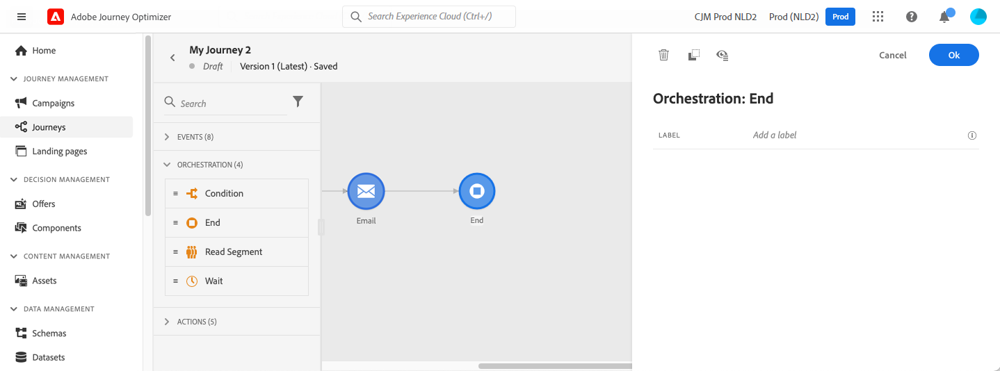

# End activity{#end-activity}

>[!BEGINSHADEBOX]

**On this page:** Learn how to use the End activity to mark the end of each journey path and add labels that make your journey reports easier to read.

>[!ENDSHADEBOX]

>[!CONTEXTUALHELP]
>id="ajo_journey_end"
>title="End activity"
>abstract="The End activity allows you to mark the end of each path of the journey. It is not mandatory but recommended for visual clarity. Indeed, if the journey has several end activities, we recommend that you add a label to each end to make reports easier to read."

The **[!UICONTROL End]** activity allows you to mark the end of each path of the journey. It is not mandatory but recommended for visual clarity. Indeed, if the journey has several end activities, we recommend that you add a label to each end to make reports easier to read. See [this page](../reports/live-report.md).

<!--

-->

+++AI Assistant — Page context

* **TL;DR:** This page explains the End activity in Journey Optimizer, a visual marker placed at the end of each journey path that is optional but recommended for report readability.

**Intents:**

* Add an End activity to mark the conclusion of a journey path
* Label End activities to improve journey report readability
* Distinguish multiple journey paths visually using labeled End nodes

**Glossary:**

* **End activity**: A journey node that visually marks the terminus of a journey path; it is not mandatory but aids clarity *(product-specific)*

**Guardrails:**

* The End activity is not mandatory; journeys function without it.
* Adding a label to each End activity is recommended when a journey has multiple paths, to make live reports easier to interpret.

**Terminology:**

* Canonical name: End activity — Acronym: n/a — variants: End node, End tag
* Do not confuse: "End activity" ≠ "End tag" — the End tag is an auto-generated node visible during journey authoring, while the End activity is a placeable component

**FAQ:**

* **Q: Is the End activity required to publish a journey?** — No, it is not mandatory but is recommended for visual clarity.
* **Q: Why should I label End activities?** — When a journey has multiple paths, labels help distinguish them in journey reports.
* **Q: Where can I see the impact of End activity labels?** — Labels appear in the journey live report, making it easier to track path-level performance.

+++
