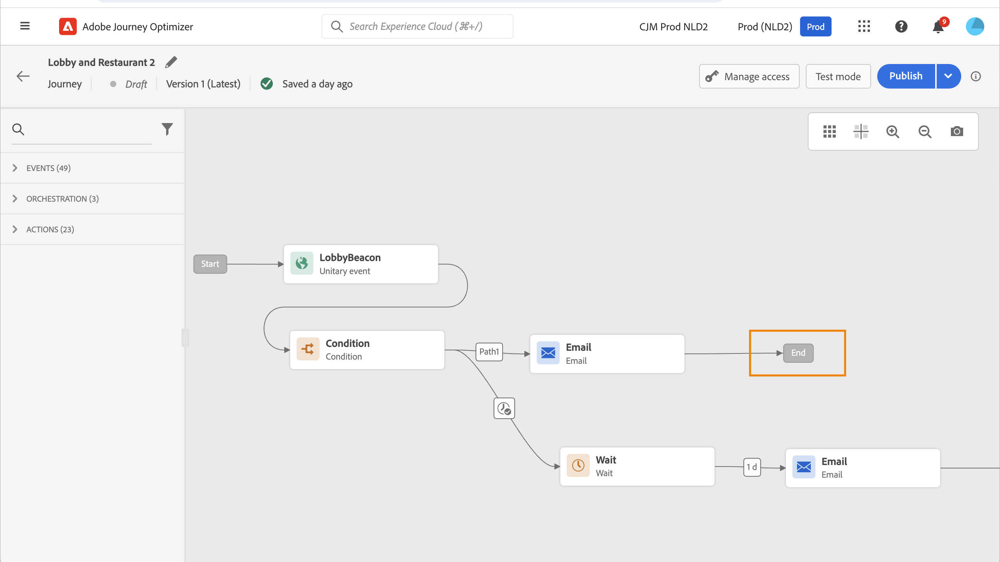
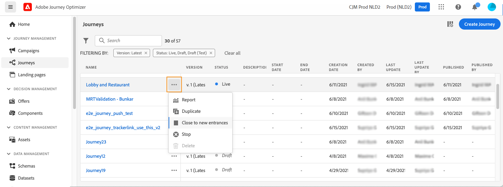
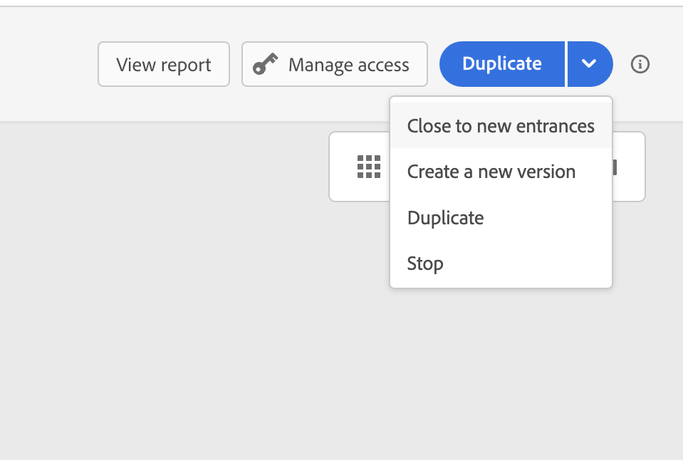
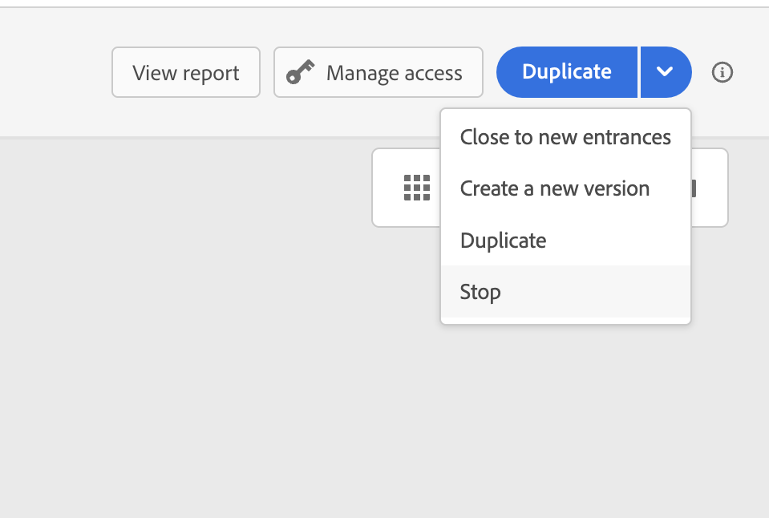

# End a journey {#journey-ending}

## How a live journey ends

Journeys are closed when the global journey timeout is reached, or after the last occurrence of a recurring audience-based journey. [Learn how journeys are closed](#close-journey).

If you need to terminate a live journey, we recommend that [you close it](#close-to-new-entrances) manually. The arrival of new customers in the journey is then blocked. Profiles who already entered in the journey are able to experience it to the end. 

You can also [stop a journey](#stop-journey), only in case of an emergency and if all journey processing must to be ended immediately. People who already entered a journey are all stopped in their progress. 

>[!IMPORTANT]
>
>* You cannot restart or delete a [closed](#close-journey) or [stopped](#stop-journey) journey. You can [create a new version](publishing-the-journey.md#journey-versions-journey-versions) of it or [duplicate it](journey-ui.md#duplicate-a-journey-duplicate-a-journey). 
>
>* Only finished journeys can be deleted. 

## How profiles end a journey 

A journey ends for an individual in two specific contexts:

* The individual reaches at the last activity of a path, then moves to the [End tag](#end-tag).
* The individual reaches at a **Condition** activity (or a **Wait** activity with a condition) and does not match any of the conditions.

The individual can then reenter the journey if reentrance is allowed. [Learn more about entrance/reentrance management](../building-journeys/journey-properties.md#entrance)

## Journey End tag {#end-tag}

While authoring a journey, an End tag is displayed at the end of each path. This node cannot be added by a user, cannot be removed and only its label can be changed. It marks the end of each path of the journey. 

If the journey has several paths, we recommend that you add a label to each end to make reports easier to read. Learn more about [journey reports](../reports/live-report.md).

## Close a journey {#close-journey}

A journey can close because of the following reasons:

* A one-shot segment based journey that has finished executing, and reached the global timeout of 91 days. 
* After the last occurrence of a recurring audience-based journey.
* The journey is closed manually via the [**[!UICONTROL Close to new entrances]**](#close-to-new-entrances) button. 

After the **91-day journey global timeout**, a Read audience journey switches to the **Finished** status. This behavior is set for 91 days only as all information about profiles who entered the journey is removed 91 days after they entered. Persons still in the journey automatically are impacted. They exit the journey after the 91-day timeout.  Learn more about [the journey global timeout](../building-journeys/journey-properties.md#global_timeout).

>[!TIP]
>
>A one-shot segment-based journey keeps the **Live** status even after running once. Profiles cannot re-enter once completed, but the journey remains in **Live** status until the default global timeout expires. You can manually close it sooner using the **Close to new entrances** option.

### Close to new entrances {#close-to-new-entrances}

Closing a journey manually ensures that customers who already entered the journey can finish their path but new users are not able to enter the journey. When a journey is closed (for any of the reasons above), it will have the status **[!UICONTROL Closed]**. The journey stops letting new individuals enter the journey. Profiles already in the journey can finish the journey normally. After the default global timeout of 91 days, the journey will switch to the **Finished** status. 

To close a journey from the list of journeys, click the **[!UICONTROL Ellipsis]** button that is located to the right of the journey name and select **[!UICONTROL Close to new entrances]**.

You can also:

1. In the **[!UICONTROL Journeys]** list, click on the journey you want to close.
1. On the top-right, click the down arrow.

    {width="50%" align="left" zoomable="yes"}

1. Click **[!UICONTROL Close to new entrances]**, and confirm in the dialog box.

## Stop a journey {#stop-journey}

In case you need to stop the progress of all individuals in the journey, you can stop it. Stopping the journey timeout all individuals in the journey. However, stopping a journey involves that people who already entered a journey are all stopped in their progress. The journey is basically switched off. If you want to end to a journey, best practice is [to close it](#close-journey). 

You can stop a journey, for example, if a marketer realizes that the journey targets the wrong audience or a custom action supposed to deliver messages is not working correctly. To stop a journey from the list of journeys, click the **[!UICONTROL Ellipsis]** button that is located to the right of the journey name and select **[!UICONTROL Stop]**.

You can also:

1. In the **[!UICONTROL Journeys]** list, click on the journey you want to stop.
1. On the top-right, click on the down arrow.

   {width="50%" align="left" zoomable="yes"}

1. Click **[!UICONTROL Stop]**, and confirm in the dialog box.

When stopped, the journey status is set to **[!UICONTROL Stopped]**. 
