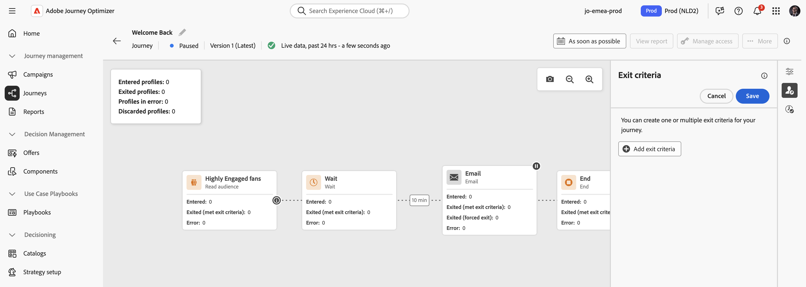
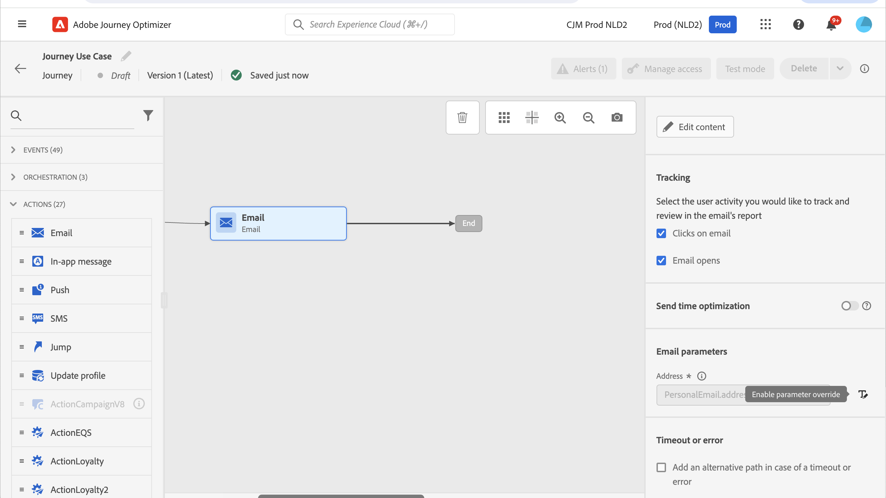
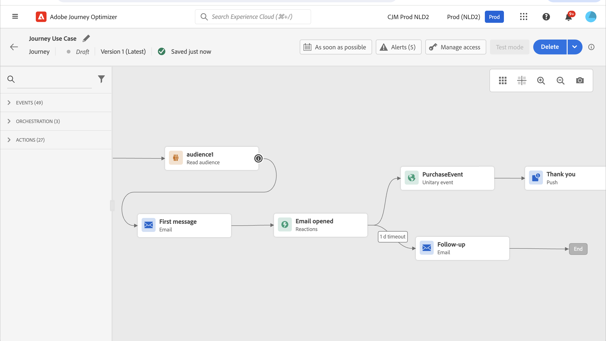
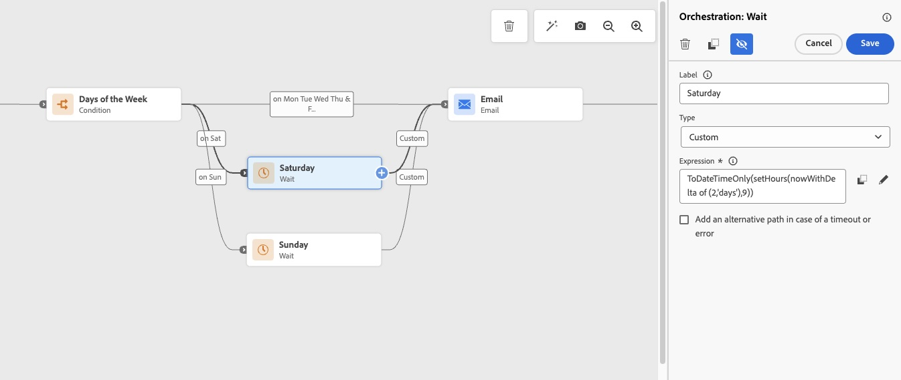
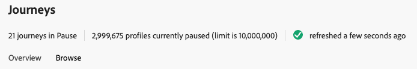
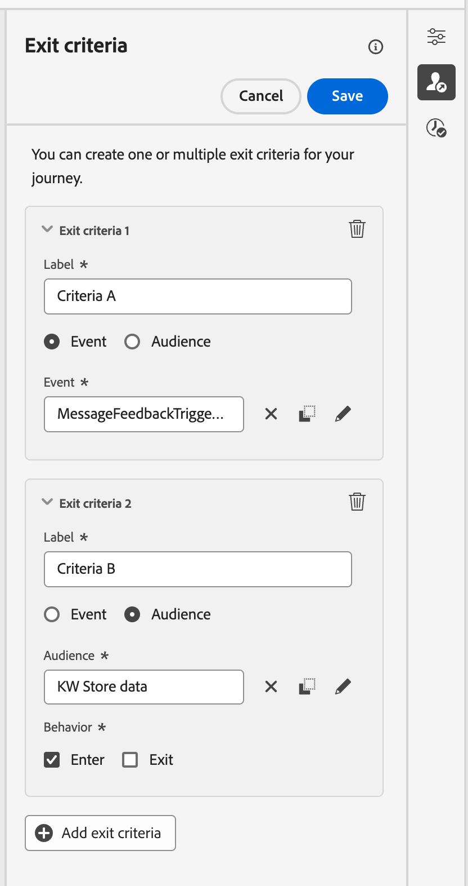

# Work with journey entry and exit criteria {#entry-exit-criteria-guide}

In customer experience orchestration, delivering the right message at the right time requires precise control over when customers enter and exit your journeys. Understanding and properly configuring entry and exit criteria can make the difference between a successful, engaging campaign and missed opportunities or message fatigue.

This guide provides practical guidance, real-world examples, and best practices for managing journey entry and exit criteria in Adobe Journey Optimizer.

## What are entry and exit criteria? {#what-are-criteria}

**Entry criteria** determine the conditions under which a [customer profile](../audience/get-started-profiles.md) qualifies to enter a specific journey. Profiles can enter based on:

* **[Customer behavior](../event/about-events.md)** - Actions taken by customers trigger journey entry in real-time, such as making a purchase, abandoning a cart, or opening your mobile app.

* **[Profile attributes](../audience/get-started-profiles.md)** - Customer characteristics determine eligibility based on data stored in their profile, like loyalty tier, location, age, or communication preferences.

* **[External events](../event/about-creating-business.md)** - Business or environmental triggers that affect multiple customers simultaneously, such as low inventory alerts, weather conditions, or price changes.

* **[Audience membership](../audience/about-audiences.md)** - Belonging to a specific audience segment enables targeted journeys for groups like high-value customers, inactive users, or new subscribers.

**Exit criteria** define when and how a profile leaves or is removed from a journey:

* **Journey completion** - Profiles automatically exit when they reach the [end of all journey paths](end-journey.md), completing the designed experience.

* **Goal achievement** - Profiles exit when they complete the [journey objective](success-metrics.md), such as making a purchase or downloading an app, eliminating unnecessary follow-up communications.

* **Condition-based** - Profiles exit when [specific conditions](condition-activity.md) are met, like inactivity over a set period or changes in profile attributes.

* **Event-based** - Profiles exit when [specific events occur](../event/about-events.md), such as subscription cancellation or product return.

* **Audience disqualification** - Profiles exit when they no longer meet the [target audience criteria](../audience/about-audiences.md), ensuring messages remain relevant.

## Why entry and exit criteria matter {#why-they-matter}

Properly defining entry and exit criteria delivers significant business value:

* **Relevance**: Only the right customers enter the journey, increasing engagement and conversion rates by targeting the most appropriate audience at the optimal time.

* **Efficiency**: Prevents customers from staying in irrelevant journeys, reducing unnecessary communications, operational costs, and customer annoyance.

* **Personalization**: Enables dynamic tailoring of experiences based on real-time data and behavior, creating more meaningful customer interactions.

* **Compliance**: Helps manage frequency capping and avoid over-communication, respecting customer preferences and regulatory requirements while maintaining brand reputation.

* **Resource optimization**: Ensures your marketing resources and system capacity are focused on the profiles most likely to engage and convert.

## Learn through documented use cases {#real-world-use-cases}

The following documented use cases demonstrate how to apply entry and exit criteria in real journey scenarios. Each includes complete implementation guidance and configuration steps.

+++Customer onboarding journey

Build a personalized welcome experience for new members (e.g., loyalty program members) that adapts based on their engagement and actions.

**Objective:** Enhance members' experience with the brand, increase loyalty and brand interaction through personalized onboarding.

{width="50%" align="left"}

**Key concepts:** Audience qualification entry * Event timeout with conditional paths * Profile attribute checking (mobile number, consent) * Channel routing (email vs. SMS) * Goal-based exit

**Typical journey flow:**

1. **Entry**: [Audience qualification event](audience-qualification-events.md) - profile enters "New Loyalty Members" audience (streaming audience)
1. **Welcome email**: Send personalized welcome message with call to action (e.g., download app)
1. **Wait for goal event**: Listen for goal completion event (e.g., "app installed and opened") with timeout
   * Event occurs → Exit journey (goal achieved)
   * Timeout after 1 day → Continue to reminder
1. **Condition**: Check profile attributes
   * Mobile number available AND SMS consent = Yes → Send SMS with download link
   * Otherwise → Send reminder email
1. **Exit**: Goal achieved or journey completion

**How to implement:**

[Watch the complete video tutorial](https://experienceleague.adobe.com/en/docs/journey-optimizer-learn/tutorials/use-cases/customer-onboarding) for a step-by-step walkthrough. The video shows how to set up [audience qualification](audience-qualification-events.md) as journey entry, create a [unitary event](../event/about-creating.md) to track goal completion (e.g., app opened), configure [event timeout](general-events.md) to create conditional paths when event doesn't occur, use [conditions](condition-activity.md) to check profile attributes (mobile number, consent), route messages to preferred channels based on available contact information, add [personalization](../personalization/personalize.md) including first name, dynamic links and QR codes, and use [AI Assistant](../content-management/gs-generative.md) to generate personalized content variations.

**Manual configuration:**

Configure [audience qualification entry](audience-qualification-events.md) for new member detection, create [custom events](../event/about-creating.md) to track goal completion, set up [exit criteria](journey-properties.md#exit-criteria) that trigger when goals are achieved, use [conditions](condition-activity.md) to check mobile consent and route to appropriate channels, and [design content](../email/get-started-email-design.md) with personalization and dynamic elements.

+++"

+++Abandoned cart recovery

Recover potentially lost sales by reminding customers about items left in their cart with timely, personalized messages in their preferred channel.

**Objective:** Increase customer engagement, conversion rates, and revenue by encouraging customers to revisit the site and complete their purchase.

{width="50%" align="left"}

**Key concepts:** Event-triggered entry (product added to cart) * Conditional checking (purchase completion) * Channel preference routing * Event-based exit criteria * Supplemental identifiers for multiple cart sessions

**Typical journey flow:**

1. **Entry event**: Customer adds product to cart
1. **Wait**: 30 minutes to 2 hours (allows time for customer to complete purchase naturally)
1. **Condition**: Check if purchase completed
   * Yes → Exit journey
   * No → Continue to reminder
1. **Channel routing**: Send reminder via customer's preferred channel (email, SMS, push)
1. **Exit criteria**: Purchase event occurs (customer checks out)

**How to implement using playbooks:**

[Watch the video tutorial](https://experienceleague.adobe.com/en/docs/journey-optimizer-learn/tutorials/use-cases/abandoned-cart) to see how to quickly create this journey using Journey Optimizer playbooks. The playbook automatically creates 1 journey, 2 schemas, 1 audience, and 3 messages (email, SMS, push) that you can customize.

**Manual configuration:**

Configure [supplemental identifiers](supplemental-identifier.md) in journey **[!UICONTROL Properties]** to enable multiple cart sessions per profile, set up [exit criteria](journey-properties.md#exit-criteria) that trigger when purchase is completed, use [conditions](condition-activity.md) to check preferred channel and purchase status, and add [personalization](../personalization/personalize.md) to show cart contents and product details.

+++"

+++Send messages to subscribers

Target specific subscription lists with personalized messages using audience-based entry.

{width="50%" align="left"}

**Key concepts:** Read audience entry * Subscription list targeting * Email personalization * Journey completion

**How to implement:**

Follow the [complete use case](message-to-subscribers-uc.md) for step-by-step guidance. Set up [audience-based entry](read-audience.md) using **[!UICONTROL Read Audience]** activity, manage [subscriber lists](../audience/about-audiences.md) from **[!UICONTROL Audiences]** menu, and use [map fields](expression/field-references.md) to access subscription data in the expression editor.

+++"

+++Send multi-channel messages

Combine email and push notifications based on customer reactions and behavior.

{width="70%" align="left"}

**Key concepts:** Read audience entry * Reaction events * Multi-path logic * Goal-based exits

**How to implement:**

Follow the [complete use case](journeys-uc.md) for full implementation guidance. Use [reaction events](reaction-events.md) to track interactions after **[!UICONTROL Email]** or **[!UICONTROL Push]** actions, configure [multi-channel actions](journeys-message.md) from the **[!UICONTROL Actions]** palette, and define [completion conditions](journey-properties.md#exit-criteria) using **[!UICONTROL Exit criteria]**.

+++"

+++Send emails only on weekdays

Schedule email delivery to occur only on business days, with automatic queuing for weekend entries.

{width="70%" align="left"}

**Key concepts:** Time-based conditions * Wait formulas * Timezone management * Scheduling logic

**How to implement:**

Follow the [complete use case](weekday-email-uc.md) for detailed implementation. Use [time conditions](condition-activity.md#time-condition) to filter by day of week, configure [wait activities](wait-activity.md) to delay until specific times, and manage [timezones](timezone-management.md) in journey **[!UICONTROL Properties]** for global audiences.

+++"

+++Re-engagement campaigns (Abandoned browse scenario)

Re-engage customers who viewed products but didn't continue to interact with your brand through personalized messaging and paid media.

**Objective:** Re-engage customers who browsed products but showed no further brand engagement, driving them back to complete their purchase through multi-channel messages and personalized ads.

{width="50%" align="left"}

**Key concepts:** Event-triggered entry (product view) * Time-based qualification (3-day wait) * Batch + streaming audiences to avoid blind spots * Channel preference routing * Profile attribute checking * Paid media activation

**Data requirements breakdown:**

* **Identification**: Known users with authenticated identities (email, mobile number) stitched across data sources (web, mobile, CRM, loyalty, in-store)
* **Qualification**: Events (product views, cart adds, purchases) + timestamps + brand engagement tracking (website visits, app launches, online/offline purchases)
* **Messaging**: Product details (SKUs, names, images), communication preferences, consent data

**Typical journey flow:**

1. **Entry event**: Customer views product on website or mobile app
1. **Wait 1 hour**: Listen for "Add to Cart" event
   * Event occurs → Exit journey (buying intention detected)
   * Timeout → Continue
1. **Wait 3 days**: Allow time for natural purchase consideration
1. **Condition**: Check audience membership for brand engagement
   * **Batch audience** (4-day lookback): Viewed product AND engaged after view
   * **Streaming audience** (24-hour lookback): Covers blind spot between batch calculations
   * Member of either → Exit journey (customer engaged)
   * Not member → Continue to messaging
1. **Condition**: Check channel preference and consent → Route to email, SMS, or push
1. **Send message**: Personalized re-engagement with product details
1. **Wait 3 days**: Monitor for engagement
1. **Condition**: Check engagement audiences again
   * Engaged → Exit journey
   * Not engaged → Send second reminder message
1. **Exit**: Journey completion

**Why two audience types (batch + streaming)?**

Batch audiences evaluate once per day, creating a potential "blind spot" between the last calculation and the condition check. The streaming audience (last 24 hours) ensures profiles who engaged during that window are properly identified and exited from the journey. The batch audience uses a 4-day lookback (instead of 3 days) to account for the 1-hour initial wait period.

**Paid media activation:**

Activate qualified profiles to advertising destinations (Google DV360, Customer Match) using the [destination framework](../start/get-started-sources.md). Audience shares qualification status but not profile attributes. Configure sync containers for unauthenticated users or use hashed email/phone for authenticated users.

**Personalization options:**

* **Contextual attributes**: Use data from the triggering Product View event (first product viewed)
* **Computed attributes**: Reference the last product viewed if customer browsed multiple products after journey entry

**How to implement:**

Watch the [video tutorial series](https://experienceleague.adobe.com/en/docs/experience-platform/rtcdp/use-cases/personalization-insights-engagement/use-cases-luma) for complete implementation. Configure [unitary events](../event/about-creating.md) for product view and add to cart, create [batch audiences](../audience/creating-a-segment-definition.md) with proper lookback periods (3-6 days for paid media, 4 days for journey), build [streaming audiences](../audience/about-audiences.md) for 24-hour engagement detection, set up [event timeout](general-events.md) (1 hour for cart add), use [conditions](condition-activity.md) to check audience membership and channel preferences, configure [destinations](../start/get-started-sources.md) for paid media activation, and add [personalization](../personalization/personalize.md) using product catalog lookups.

**Technical prerequisites:**

* **Permissions**: Manage Journeys, Publish Journeys, Manage Journey Events/Data Sources/Actions, Manage Messages, Publish Messages, Manage Segments
* **Channels**: Configure communication channels (email, SMS, push)
* **Schemas**: Set up [schemas](../data/get-started-schemas.md) for digital transactions (web/mobile events), offline transactions (in-store purchases), and customer attributes (CRM, consent, loyalty)

+++"

### Additional journey patterns {#additional-patterns}

Explore more specialized journey patterns and techniques.

+++Ramp up deliveries

Gradually increase send volume for IP warming using profile cap conditions.

{width="50%" align="left"}

Follow the [complete use case](ramp-up-deliveries-uc.md) to learn how to set **[!UICONTROL Profile cap]** limits and progressively increase delivery volumes for IP warming.

+++

+++Work with experience events

Learn patterns for using experience event data including opt-out management, frequency control, and behavioral personalization.

[Explore experience event patterns](exp-event-lookup.md) to understand how to query and use event data effectively in conditions and personalization.

+++

+++Remove profiles from live journeys

Apply exit criteria to paused journeys to remove specific profiles based on attributes or audience membership.

{width="50%" align="left"}

[Learn how to remove profiles](journey-pause.md#apply-an-exit-criteria-in-a-paused-journey) using the **[!UICONTROL Pause]** button and **[!UICONTROL Exit criteria]** configuration.

+++

>[!TIP]
>
>Browse all available use cases in the [Journey use cases library](jo-use-cases.md) for more patterns and implementations.

## Configuring entry criteria {#configure-entry}

Adobe Journey Optimizer offers multiple ways to define entry criteria. Select an option below to learn more.

+++Event-based triggers

Use events like "profile creation," "transaction completed," or custom events to kick off a journey in real-time.

**Best for:** Real-time, individual customer actions requiring immediate response (order confirmation, account creation, cart abandonment).

**Configuration steps:**

1. [Configure your event](../event/about-creating.md) in **[!UICONTROL Administration]** > **[!UICONTROL Events]**
1. Define [event schema and fields](../event/experience-event-schema.md)
1. Add event from **[!UICONTROL Events]** palette in [journey designer](using-the-journey-designer.md)
1. Set [timeout](general-events.md) and [wait conditions](wait-activity.md) as needed

Learn more: [About events](../event/about-events.md) * [Event creation](../event/about-creating.md) * [Schemas](../data/get-started-schemas.md)

+++"

+++Audience-based entry

Target journeys to profiles who belong to specific audiences, either as a one-time batch or on a recurring schedule.

**Best for:** Scheduled campaigns, batch communications, segment-based targeting (monthly newsletters, seasonal promotions).

{width="50%" align="left"}

**Configuration steps:**

1. [Create or select audience](../audience/creating-a-segment-definition.md) in **[!UICONTROL Audiences]** menu
1. Add [Read Audience activity](read-audience.md) from **[!UICONTROL Orchestration]** palette
1. [Configure schedule](journey-properties.md#schedule) in **[!UICONTROL Scheduler]** section
1. Set [recurrence rules](read-audience.md#read-audience-options) if needed

Learn more: [Read audience journeys](read-audience.md) * [Create audiences](../audience/creating-a-segment-definition.md) * [Audience composition](../audience/get-started-audience-orchestration.md)

+++"

+++Audience qualification entry

Trigger journeys when profiles qualify for or exit from specific audiences in real-time.

**Best for:** Dynamic audience changes requiring immediate response (loyalty tier changes, risk scoring, behavioral segments).

**Configuration steps:**

1. Define [streaming audience](../audience/about-audiences.md) in **[!UICONTROL Audiences]** menu
1. Add [Audience Qualification event](audience-qualification-events.md) from **[!UICONTROL Events]** palette
1. Choose trigger: **[!UICONTROL Entry]**, **[!UICONTROL Exit]**, or both
1. Set [re-entrance rules](entry-management.md#entry-unitary) in journey **[!UICONTROL Properties]**

Learn more: [Audience qualification events](audience-qualification-events.md) * [Streaming segmentation](../audience/about-audiences.md) * [Audience rules](../audience/creating-a-segment-definition.md)

+++"

+++Attribute filters and combined conditions

Refine entry criteria by combining events or audiences with profile attributes and context.

**Best for:** Precise targeting based on multiple factors (VIP customers in specific regions, high-value carts).

{width="70%" align="left"}

**Configuration steps:**

1. Start with event or audience entry
1. Add [conditions](condition-activity.md) from **[!UICONTROL Orchestration]** > **[!UICONTROL Condition]**
1. Use [AND/OR logic](conditions.md) in expression editor
1. Reference [profile attributes](../audience/get-started-profiles.md), events, or [external data](../datasource/about-data-sources.md)

Learn more: [Condition activity](condition-activity.md) * [Build conditions](conditions.md) * [Expression editor](expression/expressionadvanced.md) * [Data sources](../datasource/about-data-sources.md)

+++"

+++Time windows and scheduling

Set temporal constraints to keep journeys timely and relevant.

**Best for:** Time-bound campaigns, business hours restrictions, seasonal promotions.

**Configuration steps:**

1. Set [schedule on Read Audience activity](read-audience.md) using **[!UICONTROL Scheduler]** section
1. Use [Wait activities](wait-activity.md) from **[!UICONTROL Orchestration]** palette
1. Add [time-based conditions](conditions.md) using **[!UICONTROL Time condition]**
1. Set journey dates in **[!UICONTROL Properties]** > **[!UICONTROL Schedule]**

Learn more: [Journey scheduling](journey-properties.md#schedule) * [Wait activity](wait-activity.md) * [Timezone management](timezone-management.md) * [Weekday email use case](weekday-email-uc.md)

+++"

## Configuring exit criteria {#configure-exit}

Exit criteria ensure profiles leave journeys at the appropriate time. Select an option below to learn more.

+++Journey completion

Profiles automatically exit when they reach the end of all paths in the journey.

**Best for:** Linear journeys with clear endpoints, journeys with defined steps.

**Configuration:** Design journey paths to end at **[!UICONTROL End]** activities - no additional configuration needed.

[Learn more about journey ending](end-journey.md)

+++"

+++Goal achievement

Define business goals and automatically exit profiles when goals are met.

**Best for:** Conversion-focused journeys where continuing communication after goal achievement is unnecessary.

{width="70%" align="left"}

**Configuration steps:**

1. Click **[!UICONTROL Show exit criteria]** icon in [journey canvas](using-the-journey-designer.md)
1. Select **[!UICONTROL Add exit criteria]**
1. Choose [Event](../event/about-events.md) or [Audience](../audience/about-audiences.md) as exit trigger
1. Define the goal event (e.g., Purchase Completed)
1. Label the exit criteria clearly using [tags](tags.md)

**Example events for exit:**
* Purchase completed
* Subscription upgraded
* Form submitted
* App downloaded
* Contract signed

[Learn more about exit criteria configuration](journey-properties.md#exit-criteria)

+++"

+++Inactivity timeouts

Exit profiles if no engagement occurs within a set timeframe.

**Best for:** Nurture campaigns, feedback requests, time-sensitive offers where lack of response indicates disinterest.

**Configuration steps:**

1. Use [Exit Criteria](journey-properties.md#exit-criteria) with [audience](../audience/creating-a-segment-definition.md) that checks last engagement date via **[!UICONTROL Add exit criteria]**
1. Set [Wait activity](wait-activity.md) with defined duration
1. Use [conditions](condition-activity.md) to check for activity using **[!UICONTROL Condition]** activity
1. Route inactive profiles to **[!UICONTROL End]** activity

**Typical timeout periods:**
* Feedback requests: 7-14 days
* Welcome series: 30 days
* Re-engagement: 30-60 days
* Promotional campaigns: 3-7 days

+++"

+++Profile attribute-based exit

Remove profiles based on attribute changes, particularly useful in paused journeys.

**Best for:** Compliance requirements, location-based exclusions, preference changes in paused journeys.

**Configuration steps:**

1. [Pause the journey](journey-pause.md) using **[!UICONTROL Pause]** button
1. Click **[!UICONTROL Show exit criteria]** icon
1. Select **[!UICONTROL Profile Attribute]** as exit type
1. Define [attribute-based rule](conditions.md) (e.g., country = "France")
1. [Resume journey](journey-pause.md#journey-resume-steps) - profiles matching criteria exit at next action

Learn more: [Profile attribute exit criteria](journey-properties.md#profile-exit-criteria) * [Pause and resume journeys](journey-pause.md) * [Profile attributes](../audience/get-started-profiles.md)

+++"

+++Re-entry rules

Control whether and when profiles can re-enter journeys.

**Best for:** Balancing message persistence with avoiding fatigue, supporting different use cases per journey type.

**Configuration options:**
* **Allow re-entrance**: Enable profiles to enter multiple times after fully exiting (configured in journey **[!UICONTROL Properties]** > **[!UICONTROL Re-entrance]**)
* **Re-entrance wait period**: Set minimum time between entries (5 minutes to [91 days global timeout](journey-properties.md#global_timeout))
* **Force re-entrance on event**: Start new instance even if profile still in journey
* **Block re-entrance**: Prevent any repeat entries (one-time journeys)
* **Supplemental identifiers**: Allow re-entry for different entities (e.g., different orders)

>[!MORELIKETHIS]
>
>
>* [Re-entrance management](entry-management.md) - Configure wait periods and rules for when profiles can re-enter completed journeys.
>* [Supplemental identifiers](supplemental-identifier.md) - Enable context-specific re-entrance for transactional journeys (orders, bookings, sessions).
>* [Journey global timeout](journey-properties.md#global_timeout) - Understand the 91-day maximum duration and what happens when journeys reach timeout.

+++"

## Best practices {#best-practices}

### Planning and documentation {#planning-docs}

**Clear definition and mapping**
* Document your entry and exit logic before building in a shared document
* Create flowcharts showing entry points, journey paths, and exit conditions
* Define business rules clearly: "Profiles exit when X happens OR after Y days"
* Include timeout values and re-entrance rules in documentation

**Team alignment**
* Share journey logic with marketing, analytics, and IT teams before launch
* Ensure analytics team can track entry, exit, and conversion metrics
* Align on naming conventions for journeys, events, and criteria
* Review complex journeys in cross-functional meetings

**Clear naming conventions**
* Use descriptive labels: "Exit - Purchase Completed" not "Exit 1"
* Include trigger type in names: "Entry Event - Cart Abandon" or "Entry Audience - Gold Tier"
* [Version journey names](publish-journey.md#journey-versions) when updating: "Welcome Series v2.0"
* [Tag journeys](tags.md) consistently for reporting and filtering

### Avoiding conflicts and overlaps {#avoiding-conflicts}

**Prevent overlapping journeys**
* [Audit active journeys](journey-ui.md) before launching similar ones
* Use exit criteria to remove profiles when they enter higher-priority journeys
* Leverage [conflict management](journey-properties.md#conflict) and [priority scores](../conflict-prioritization/priority-scores.md)
* Design journeys that complement rather than compete

**Example conflict resolution:**
* Profile enters promotional journey → Automatically exit from nurture journey
* Profile in loyalty upgrade journey → Block entry to general loyalty journey
* Holiday campaign active → Pause weekly newsletter journeys

**Use journey prioritization**
* Assign [priority scores](../conflict-prioritization/priority-scores.md) in journey **[!UICONTROL Properties]** > **[!UICONTROL Priority score]** (0-100)
* Higher priority journeys take precedence at [inbound channels](../in-app/get-started-in-app.md)
* Document priority hierarchy: Transactional > Promotional > Nurture
* Review and adjust priorities quarterly

>[!MORELIKETHIS]
>
>
>* [Conflict management](journey-properties.md#conflict) - Set up rules to prevent profiles from being in multiple conflicting journeys simultaneously.
>* [Priority scores](../conflict-prioritization/priority-scores.md) - Assign priority levels (0-100) to determine which journey takes precedence for inbound channels.
>* [View conflicts](../conflict-prioritization/conflicts.md) - Identify potential overlaps between journeys before launching to avoid message fatigue.

**Coordinate with frequency capping**
* Set global frequency caps in addition to journey-level controls
* Configure exit criteria to support frequency limits
* Use capping rules to prevent over-communication across journeys
* Monitor frequency metrics in reporting

[Learn more about frequency capping](../conflict-prioritization/rule-sets.md)

### Optimization and monitoring {#optimization}

**Monitor performance metrics**
* Track entry rate, exit rate, and completion rate for each journey
* Monitor [goal achievement](success-metrics.md): percentage exiting via goal vs. timeout
* Analyze time-to-conversion for profiles in journey
* Review re-entrance patterns and frequency using [journey reports](../reports/journey-global-report.md)

**Key metrics to track:**
* Profiles entered / Eligible profiles (entry rate)
* Profiles exited via goal / Total exits (success rate)
* Average time in journey
* Exit reasons breakdown
* Re-entrance rate and frequency

**A/B test entry and exit criteria**
* Test different entry timing: Immediate vs. 24-hour delay
* Compare audience filters: Broad vs. narrow targeting
* Experiment with exit timing: When to stop nurturing
* Test re-entrance wait periods: 7 days vs. 30 days using [Optimize activity](optimize.md)

**Adjust based on data**
* If high early exits → Review relevance of entry criteria
* If low goal achievement → Analyze journey content and timing
* If high re-entrance with no conversion → Increase wait period or improve targeting
* If low engagement → Tighten entry criteria to more qualified audience

**Regular audits**
* Review all [active journeys](journey-ui.md) quarterly
* [Archive or close outdated journeys](end-journey.md)
* Update entry/exit criteria based on business changes
* [Consolidate similar journeys](copy-to-sandbox.md) to reduce complexity
* Verify [event integrations](../event/about-events.md) are working correctly

>[!MORELIKETHIS]
>
>
>* [Journey reports](../reports/journey-global-report.md) - Analyze overall journey performance including entry rates, completion rates, and goal achievement.
>* [Live reports](../reports/journey-live-report.md) - Monitor real-time journey metrics for profiles currently in flight for immediate optimization.
>* [Query journey step events](../reports/query-examples.md) - Write custom SQL queries to analyze detailed journey execution data and profile behavior.

### Testing and validation {#testing}

**Test before launching**
* Use [test mode](testing-the-journey.md) to validate entry and exit criteria - activate with the **[!UICONTROL Test]** button
* Test with [various profile scenarios](../audience/creating-test-profiles.md): qualified, unqualified, edge cases
* Verify exit criteria trigger correctly with test events
* Check re-entrance logic with [test profiles](../audience/creating-test-profiles.md)

**Validate integrations**
* Confirm [events](../event/about-events.md) fire correctly from source systems
* Test [audience membership](../audience/about-audiences.md) updates in real-time
* Verify [custom actions](using-custom-actions.md) for exit criteria
* Check [supplemental identifier](supplemental-identifier.md) handling

>[!MORELIKETHIS]
>
>
>* [Testing journeys](testing-the-journey.md) - Use test mode to validate entry, exit, and journey logic with test profiles before going live.
>* [Journey dry run](journey-dry-run.md) - Simulate journey execution to identify configuration errors and performance issues without sending messages.
>* [Create test profiles](../audience/creating-test-profiles.md) - Build test profiles representing different customer scenarios for comprehensive journey testing.
>* [Troubleshooting](troubleshooting.md) - Resolve common journey issues including entry problems, message delivery, and performance bottlenecks.

### Common pitfalls to avoid {#common-pitfalls}

❌ **No exit criteria defined**: Profiles stay in journey unnecessarily
✅ **Solution**: Always define at least one exit criteria (goal or timeout)

❌ **Entry criteria too broad**: Irrelevant profiles enter journey
✅ **Solution**: Add attribute filters to refine audience

❌ **Exit criteria too restrictive**: Very few profiles achieve goal
✅ **Solution**: Include timeout-based exits as backup

❌ **No re-entrance controls**: Profiles bombarded with same journey
✅ **Solution**: Set appropriate re-entrance wait periods or disable re-entrance

❌ **Overlapping journeys**: Profiles in multiple competing journeys
✅ **Solution**: Use exit criteria and conflict management to prevent overlap

❌ **Not testing edge cases**: Unexpected profile behaviors cause issues
✅ **Solution**: Test thoroughly including negative and edge case scenarios

❌ **Poor documentation**: Team members can't understand journey logic
✅ **Solution**: Document all entry/exit rules and business logic clearly

## Integration with other Journey Optimizer capabilities {#integration}

Entry and exit criteria work together with other Journey Optimizer features:

**Success metrics and goals**
* Define journey goals aligned with exit criteria
* Track goal achievement as exit reason
* Measure journey ROI based on goal completion
* [Learn more about success metrics](success-metrics.md)

**Frequency capping**
* Coordinate exit criteria with global capping rules
* Use exit criteria to enforce campaign-specific limits
* Balance re-entrance rules with frequency management
* [Learn more about capping](../conflict-prioritization/rule-sets.md)

**Priority and conflict management**
* Set journey priorities in properties
* Configure exit criteria to resolve conflicts
* View potential conflicts before launching
* [Learn more about conflict management](../conflict-prioritization/conflicts.md)

**Supplemental identifiers**
* Enable context-specific re-entrance (e.g., per order, per booking)
* Configure exit criteria with supplemental IDs
* Support multiple journey instances per profile
* [Learn more about supplemental identifiers](supplemental-identifier.md)

**Experiment and optimization**
* Use Optimize activity to test different entry paths
* A/B test exit criteria timing
* Measure impact of entry/exit configurations
* [Learn more about optimization](optimize.md)

## Technical considerations {#technical-considerations}

### Processing rates and throughput {#processing-rates}

Be aware of system limits when designing entry criteria:

* **Read Audience**: Up to 20,000 profiles per second (sandbox level)
* **Unitary Events**: Up to 5,000 events per second (organization level)
* **Audience Qualification**: Up to 5,000 profiles per second (organization level)
* **Business Events**: 5,000 events per second, but Read Audience after has 20,000 TPS limit

[Learn more about processing rates](entry-management.md#journey-processing-rate)

### Exit criteria evaluation timing {#exit-timing}

* **Event-based exit**: Evaluated immediately when event received
* **Audience-based exit**: Can take up to 10 minutes to take effect
* **Profile attribute exit**: Evaluated only at action steps

[Learn more about exit criteria timing](journey-properties.md#exit-criteria-guardrails)

### Namespace coherence {#namespace}

* Entry events and event-based exit criteria must use the same [namespace](../event/selecting-the-namespace.md)
* Ensure consistent [identity management](../audience/get-started-identity.md) across journey
* Test namespace configuration thoroughly

[Learn more about namespaces and identity](../audience/get-started-identity.md)

## Related resources {#related-resources}

### Technical documentation
* [Profile entrance management](entry-management.md) - Detailed technical guide
* [Journey properties and exit criteria](journey-properties.md) - Configuration reference
* [How journeys end](end-journey.md) - Journey lifecycle management
* [Supplemental identifiers](supplemental-identifier.md) - Advanced re-entrance scenarios
* [Journey designer](using-the-journey-designer.md) - Build and design journeys
* [Journey UI](journey-ui.md) - Browse and manage journeys
* [Publish journeys](publish-journey.md) - Go live with your journeys

### Tutorials and examples
* [Journey use cases](jo-use-cases.md) - Complete journey examples
* [Customer onboarding video](https://experienceleague.adobe.com/en/docs/journey-optimizer-learn/tutorials/use-cases/customer-onboarding)
* [Abandoned cart video](https://experienceleague.adobe.com/en/docs/journey-optimizer-learn/tutorials/use-cases/abandoned-cart)
* [Community blog: Entry and Exit Criteria](https://experienceleaguecommunities.adobe.com/t5/journey-optimizer-blogs/mastering-journey-entry-and-exit-criteria-in-adobe-journey/ba-p/760958)

### Related capabilities
* [Audience qualification events](audience-qualification-events.md)
* [Success metrics and goals](success-metrics.md)
* [Conflict management](../conflict-prioritization/conflicts.md)
* [Frequency capping](../conflict-prioritization/rule-sets.md)
* [Testing journeys](testing-the-journey.md)
* [Wait activity](wait-activity.md)
* [Condition activity](condition-activity.md)
* [Reaction events](reaction-events.md)
* [Custom actions](using-custom-actions.md)
* [Update profiles](update-profiles.md)

## Need help? {#need-help}

* **Ask the community**: Join the [Adobe Journey Optimizer Community](https://experienceleaguecommunities.adobe.com/t5/journey-optimizer/ct-p/journey-optimizer) to ask questions and share experiences
* **Watch tutorials**: Browse [Journey Optimizer video tutorials](https://experienceleague.adobe.com/en/docs/journey-optimizer-learn/tutorials/overview)
* **Get support**: Contact [Adobe Customer Care](https://experienceleague.adobe.com/?support-solution=Journey+Optimizer#support) for technical assistance

