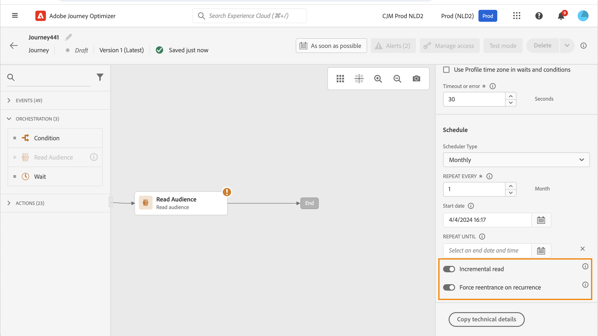

# Profile entrance management {#entry-management}

Profile entrance management depends on the type of journey. In Adobe Journey Optimizer, the following types of journeys are available:

* **Unitary event** journeys: these journeys start with a Unitary event. When the event is received, the associated profile enters the journey. [Read more](#entry-unitary)

* **Business event** journeys: these journeys start with a Business event immediately followed by a **Read audience** activity. When the event is received, profiles belonging to the targeted audience enter the journey. One instance of this journey is created for each profile. [Read more](#entry-business)

* **Read audience** journeys: these journeys start with a **Read audiece** activity. When the journey is executed, profiles belonging to the targeted audience enter the journey. One instance of this journey is created for each profile. These journeys can be recurring or "one-shot". [Read more](#entry-read-audience)

* **Audience qualification** journeys: these journeys start with an Audience qualification event. These journeys listen to the entrances and exits of profiles in audiences. When this happens, the associated profile enters the journey. [Read more](#entry-unitary)

In all journey types, a profile cannot be present multiple times in the same journey, at the same time. To check that a person is in a journey, the profile identity is used as a key. The system does not allow the same key, for example the key CRMID=3224, to be at different places in the same journey. 

## Unitary event and Audience qualification journeys{#entry-unitary}

In **Unitary event** and **Audience qualification** journeys, you can enable or disable re-entrance:

* If re-entrance is enabled, a profile can enter a journey several times, but cannot do it until he fully exited the previous instance of the journey.

* If re-entrance is disabled, a profile cannot enter multiple times the same journey, within the global journey timeout period. See this [section](../building-journeys/journey-properties.md#global_timeout).

By default, journeys allow re-entrance. When the **Allow re-entrance** option is activated, the **Re-entrance wait period** field is displayed. It allows you to define the time to wait before allowing a profile to enter the journey again. This prevents journeys from being erroneously triggered multiple times for the same event. By default the field is set to 5 minutes. The maximum duration is 91 days ([global timeout](journey-properties.md#global_timeout)).

<!--
When a journey ends, its status is **[!UICONTROL Closed]**. New individuals can no longer enter the journey. Persons already in the journey automatically exit the journey. 
-->

After the re-entrance period, profiles can re-enter the journey. To avoid this, and fully disable re-entrance for those profiles, you can add a condition to test if the profile entered already or not, using profile or audience data.

<!--
Due to the 30-day journey timeout, when journey re-entrance is not allowed, we cannot make sure the re-entrance blocking will work more than 91 days. Indeed, as we remove all information about persons who entered the journey 91 days after they enter, we cannot know the person entered previously, more than 91 days ago. -->

## Business journeys {#entry-business}

<!--
Business events follow re-entrance rules in the same way as for unitary events. If a journey allows re-entrance, the next business event will be processed.
-->

In **Business journeys**, to allow multiple business event executions, activate the corresponding option in the **[!UICONTROL Execution]** section of the journey properties.

In the case of business events, for a given journey, audience data retrieved at first execution is reused during a 1-hour time window.

A profile can be present multiple times in the same journey, at the same time, but in the context of different business events. 

For more information, refer to this [section](../event/about-creating-business.md)

## Read audience journeys {#entry-read-audience}

**Read audience** journeys can be recurring or "one-shot": 

* For non-recurring/"one-shot" journeys: the profile enters once and only once in the journey.

* For recurring journeys: by default, all the profiles belonging to the audience enter the journey on each recurrence. They must finish the journey before they can re-enter in another occurrence. 

Two options are available for recurring Read audience journeys:

* **Incremental read** option: when a journey with a recurring **Read audience** executes for the first time, all the profiles in the audience enter the journey. This option allows you to target, after the first occurrence, only the individuals who entered the audience since the last execution of the journey. 

    >[!NOTE]
    >
    >If you are targeting a [custom upload audience](../audience/about-audiences.md#segments-in-journey-optimizer) in your journey, profiles are only retrieved on the first recurrence if this option is enabled in a recurring journey, as these audiences are fixed.

* **Force re-entrance on recurrence**: this option allows you to make all profiles still present in the journey automatically exit it at the next execution. If the lifespan of your profiles in this journey may be longer than the recurrence frequency (for instance if you use wait activities), do not activate this option to make sure that profiles can finish their journey.

For more information, refer to this [section](../building-journeys/read-audience.md#configuring-segment-trigger-activity)

<!--
After 91 days, a Read audience journey switches to the **Finished** status. This behavior is set for 91 days only (i.e. journey timeout default value) as all information about profiles who entered the journey is removed 91 days after they entered. Persons still in the journey automatically are impacted. They exit the journey after the 30 day timeout. 
-->
