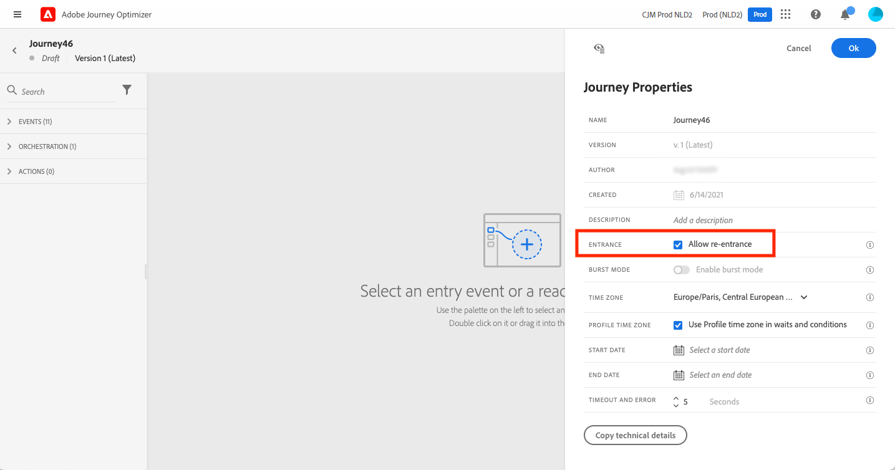
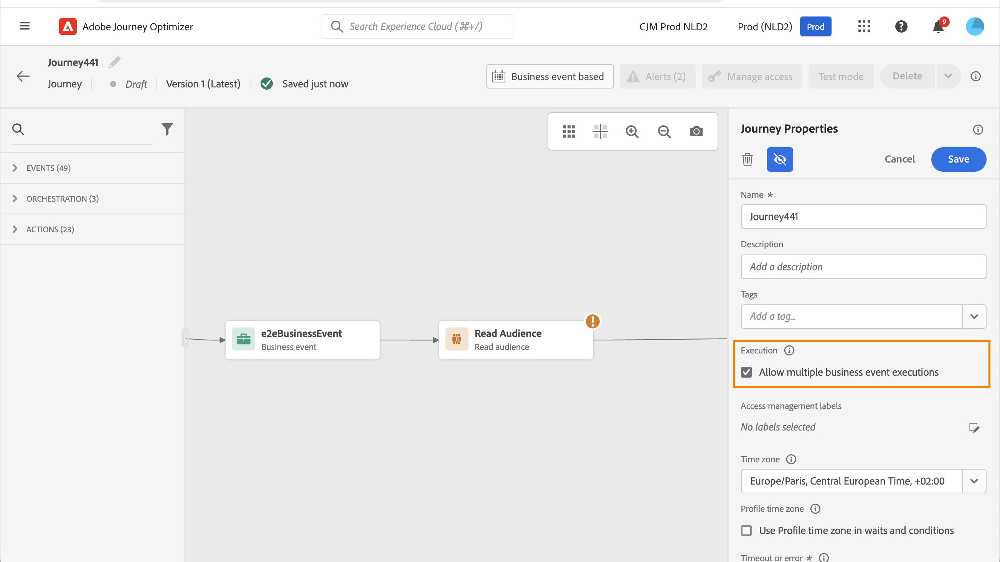

# Profile entrance management {#entry-management}

Profile entrance management depends on the type of journey. 

## Types of journeys {#types-of-journeys}

With Adobe Journey Optimizer, you can create the following types of journeys:

* **Unitary event** journeys: These journeys start with a Unitary event. When the event is received, the associated profile enters the journey. [Read more](#entry-unitary)

* **Business event** journeys: These journeys start with a Business event immediately followed by a **Read audience** activity. When the event is received, profiles belonging to the targeted audience enter the journey. One instance of this journey is created for each profile. [Read more](#entry-business)

* **Read audience** journeys: These journeys start with a **Read audiece** activity. When the journey is executed, profiles belonging to the targeted audience enter the journey. One instance of this journey is created for each profile. These journeys can be recurring or "one-shot". [Read more](#entry-read-audience)

* **Audience qualification** journeys: these journeys start with an Audience qualification event. These journeys listen to the entrances and exits of profiles in audiences. When this happens, the associated profile enters the journey. [Read more](#entry-unitary)

In all journey types, a profile cannot be present multiple times in the same journey, at the same time, for all active [versions of the journey](publishing-the-journey.md#journey-versions-journey-versions). To check that a person is in a journey, the profile identity is used as a key. The system does not allow the same key, for example the key `CRMID=3224`, to be at different places in the same journey. 

## Journey processing rate {#journey-processing-rate}

Journey processing rate is impacted by multiple factors that determine how profiles flow through a journey:

### Profile entrance rate {#profile-entrance-rate}

How profiles enter journeys and their expected rate depends on the first activity being used:

* **Read audience** journeys (batch scenario, where you target an audience of profiles and trigger a journey for that full audience): the maximum is 20,000 TPS (transactions per second), which is the quota available at a **sandbox level**. If you have multiple journeys running at the same time on that sandbox, 20,000 TPS may not be achievable. Consider this maximum as the best case scenario.

* **Audience qualification** journeys (unitary scenario, where you want to trigger a journey when a profile qualifies or disqualifies for a streaming audience): the maximum is 5,000 TPS. Note that this is a shared limit with journeys starting with events and is also shared across journeys at an **organization level**.

* **Unitary event** journeys (unitary scenario, where you want to trigger a journey when an event is emitted from a profile): same as above, both sharing the same 5,000 TPS limit. More information regarding journey event throughput is available in [this section](../event/about-events.md#event-thoughput).

* **Business event** journeys (which is essentially a unitary to batch scenario as a business event is always followed with a Read audience): business events also count towards the 5,000 TPS quota but the Read audience activity right after will have the same limit as journeys starting with a Read audience (20,000 TPS).

### Events and audience qualifications inside journeys {#events-inside-journeys}

After entrance, you can use **Unitary event** or **Audience qualification** activities inside the journey. A profile can enter in any of the 4 types of journeys described above and wait for an event to be emitted or wait for this profile to qualify for an audience. Those Unitary events and Audience qualifications will count in the quota described above. For example: if you start a journey with a Read audience (with a maximum of 20,000 TPS) and have an event right after, this event will be at maximum 5,000 TPS.

### Wait activities impact {#wait-activities-impact}

**Wait** activities in journeys can also have an impact on how many profiles are flowing through a journey at a specific time. Usually a Wait activity is based on a relative time (for example: exit 2 hours after entering the wait, so all profiles will not exit at the same time). However, if a fixed time is defined on that Wait activity, multiple profiles may exit that journey at the exact same time. This is not a recommended practice. Massive volumes could then be seen and the TPS from this point onwards can exceed 20,000 TPS.

### Action activities {#action-activities-impact}

Finally, **action** activities (native channels like Email, SMS, Push, etc., outbound or inbound, Custom actions, Jumps sending profiles to other journeys, Update profiles sending data to the Unified Profile Service, etc.) can be impacted by the profile load coming from journeys but can also impact the processing rate. For example, a custom action targeting an external endpoint with a high response time will slow the journey processing rate. 

For custom actions, the default capping is 300,000 calls per minute, which can be changed with a custom capping policy. Learn more about custom action capping in [this section](../configuration/external-systems.md#capping).

## Unitary event and Audience qualification journeys{#entry-unitary}

In **Unitary event** and **Audience qualification** journeys, you can enable or disable reentrance:

* If reentrance is enabled, a profile can enter a journey several times, but cannot do it until he fully exited the previous instance of the journey.

* If reentrance is disabled, a profile cannot enter multiple times the same journey, within the global journey timeout period. See this [section](../building-journeys/journey-properties.md#global_timeout).

By default, journeys allow reentrance. When the **Allow reentrance** option is activated, the **Reentrance wait period** field is displayed. It allows you to define the time to wait before allowing a profile to enter the journey again. This prevents journeys from being erroneously triggered multiple times for the same event. By default the field is set to 5 minutes. The maximum duration is 91 days ([global timeout](journey-properties.md#global_timeout)).

<!--
When a journey ends, its status is **[!UICONTROL Closed]**. New individuals can no longer enter the journey. Persons already in the journey automatically exit the journey. 
-->

After the reentrance period, profiles can reenter the journey. To avoid this, and fully disable reentrance for those profiles, you can add a condition to test if the profile entered already or not, using profile or audience data.

<!--
Due to the 30-day journey timeout, when journey reentrance is not allowed, we cannot make sure the reentrance blocking will work more than 91 days. Indeed, as we remove all information about persons who entered the journey 91 days after they enter, we cannot know the person entered previously, more than 91 days ago. -->

## Business journeys {#entry-business}

<!--
Business events follow reentrance rules in the same way as for unitary events. If a journey allows reentrance, the next business event will be processed.
-->

In **Business journeys**, to allow multiple business event executions, activate the corresponding option in the **[!UICONTROL Execution]** section of the journey properties.

In the case of business events, for a given journey, audience data retrieved at first execution is reused during a 1-hour time window.

A profile can be present multiple times in the same journey, at the same time, but in the context of different business events. 

For more information, refer to this [section](../event/about-creating-business.md)

## Read audience journeys {#entry-read-audience}

**Read audience** journeys can be recurring or "one-shot": 

* For non-recurring/"one-shot" journeys: the profile enters once and only once in the journey.

* For recurring journeys: by default, all the profiles belonging to the audience enter the journey on each recurrence. They must finish the journey before they can reenter in another occurrence. 

Several options are available for recurring Read audience journeys. For more information, refer to the [Use an audience in a journey](../building-journeys/read-audience.md) section.

<!--
After 91 days, a Read audience journey switches to the **Finished** status. This behavior is set for 91 days only (i.e. journey timeout default value) as all information about profiles who entered the journey is removed 91 days after they entered. Persons still in the journey automatically are impacted. They exit the journey after the 30 day timeout. 
-->
