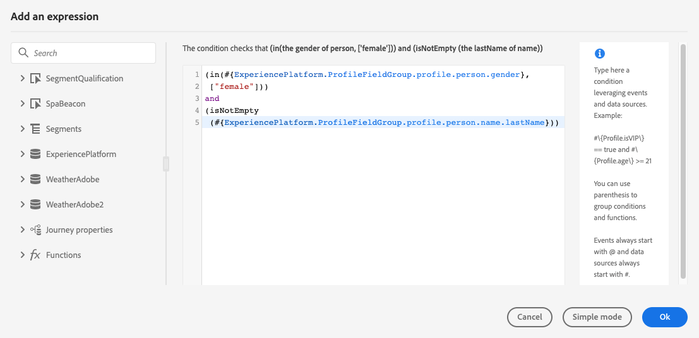
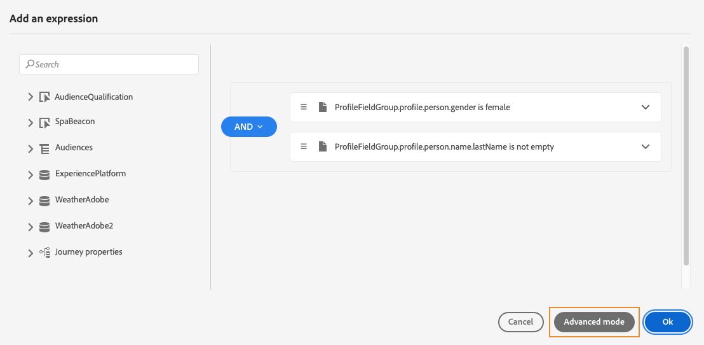
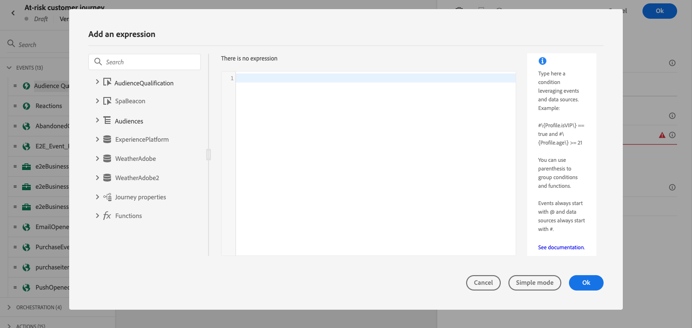
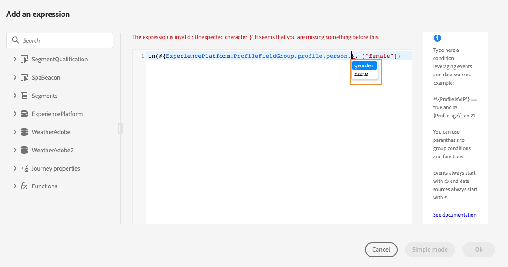
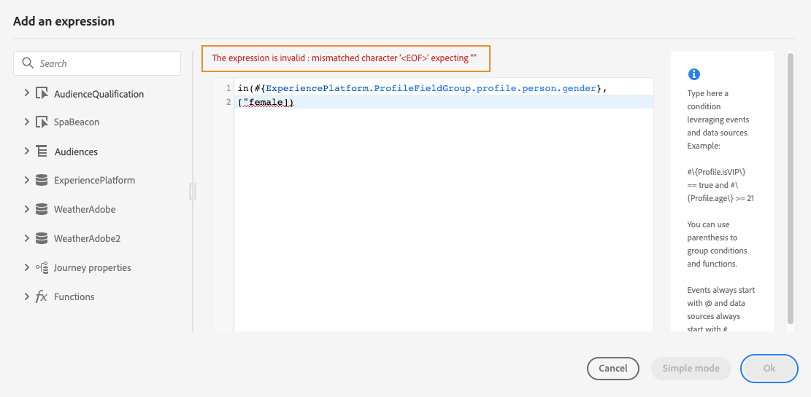
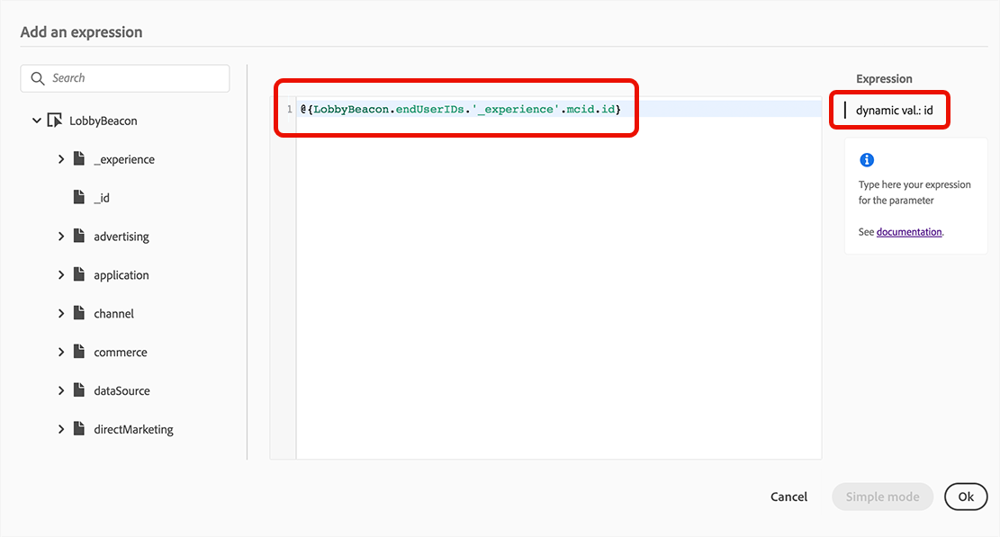

# Work with the advanced expression editor {#about-the-advanced-expression-editor}

>[!CONTEXTUALHELP]
>id="ajo_journey_expression_advanced"
>title="About the advanced expression editor"
>abstract="The advanced expression editor builds advanced expressions in various screens of the interface. For example, you can build expressions when configuring and using journeys, and when defining a data source condition."

Use the Journey advanced expression editor to build advanced expressions in various screens of the interface. For example, you can build expressions when configuring and using journeys, and when defining a data source condition.

It is also available every time you need to define action parameters that require specific data manipulations. You can leverage data coming from the events or additional information retrieved from the data source. In a journey, the displayed list of event fields is contextual and varies according to the event(s) added in the journey.

The advanced expression editor offers a set of built-in functions and operators to let you manipulate values and define an expression that fits specifically your needs. The advanced expression editor also allows you to define the values of the external data source parameter, manipulate map fields and collections.

>[!NOTE]
>
>The functions and capabilities available in the Journey advanced expression editor differ from the ones available in the [personalization editor](../../personalization/functions/functions.md).  

## Access the advanced expression editor {#accessing-the-advanced-expression-editor}

The advanced expression editor can be used to:

* create [advanced conditions](../conditions.md#data_source_condition) on data sources and event information
* define custom [wait activities](../wait-activity.md#custom)
* define action parameters mapping

When possible, you can switch between the two modes using the **[!UICONTROL Advanced mode]** / **[!UICONTROL Simple mode]** button. The simple mode is described [here](../conditions.md#about_condition).

>[!NOTE]
>
>* Conditions can be defined in the simple or advanced expression editor. They always return a boolean type.  
>
>* Actions parameters can be defined by selecting fields or via the advanced expression editor. They return a specific data type according to their expression.  

You can access the advanced expression editor in different ways:

* When you create a data source condition, you can access the advanced editor by clicking on **[!UICONTROL Advanced mode]**.

    

* When you create a custom timer, the advanced editor will be directly displayed.
* When you map action parameter, click on **[!UICONTROL Advanced mode]**.

>[!NOTE]
>
>To generate Journey expressions using natural language prompts, use the **[Expression Assistant](expression-agent.md)** (**public beta**) via the AI control inside the advanced editor.

## Discover the interface {#discovering-the-interface}

This screen allows you to manually write your expression.

On the left part of the screen are displayed available fields and functions:

* **[!UICONTROL Events]**: choose one of the fields received from the inbound event. The displayed list of event fields is contextual and varies according to the event(s) added in the journey. [Read more](../../event/about-events.md)

    >[!CAUTION]
    >
    >Creating expressions using experience events is not supported. Alternative approaches and best practices for creating expressions/logic with experience events are referenced [here](../../building-journeys/exp-event-lookup.md)    

* **[!UICONTROL Audiences]**: if you have dropped an **[!UICONTROL Audience qualification]** event, choose the audience you want to use in your expression. [Read more](../conditions.md#using-a-segment)
* **[!UICONTROL Data Sources]**: choose from the list of fields available from your data sources' field groups. [Read more](../../datasource/about-data-sources.md)
* **[!UICONTROL Journey properties]**: this section regroups the technical fields related to the journey for a given profile. [Read more](journey-properties.md)
* **[!UICONTROL Functions]**: choose from the a list of built-in functions that allow to carry out complex filtering. Functions are organized by categories. [Read more](functions.md)

An autocompletion mechanism displays contextual suggestions.

A syntax validation mechanism checks the integrity of your code. Errors are displayed on top of the editor.

>[!TIP]
>
>When creating conditions in the advanced expression editor, ensure that your expressions do not contain hidden or non-printable characters. Additionally, use single-line expressions to avoid parsing errors.

**Need for parameters when building conditions with the advanced expression editor**

If you select a field from an external data source requiring a parameter to be called (see [this page](../../datasource/external-data-sources.md)), a new tab appears on the right to let you specify this parameter. The parameter value can come from the events positioned in the journey or the Experience Platform data source (and not from other external data sources). For example, in a weather-related data source, a frequently used parameter will be "city". As a result, you must select where you want to get this city parameter. Functions can also be applied to parameters to perform format changes or concatenations.

For more complex use cases, if you want to include the parameters of the data source in the main expression, you can define their values using the "params" keyword. See [this page](../expression/field-references.md).

+++ AI Knowledge Reference

This section contains structured knowledge intended to support interpretation, retrieval, and question answering related to this topic.

For complete understanding, this information should be combined with the documentation on this page. Neither source is intended to stand alone; the page describes the feature, while this section provides additional context that helps disambiguate terminology, intent, applicability, and constraints.

* **TL;DR:** This page introduces the Journey advanced expression editor — its access points, interface panels, and capabilities for building complex conditions, custom wait timers, and action parameter mappings using events, data sources, functions, and operators.

**Intents:**

* Access the advanced expression editor from a data source condition, custom wait activity, or action parameter mapping
* Build advanced boolean conditions using event fields, data source fields, audience membership, and journey properties
* Switch between simple mode and advanced mode when configuring conditions
* Reference external data source parameters directly within the main expression using the `params` keyword
* Use the AI-powered Expression Assistant to generate expressions from natural language prompts

**Glossary:**

* **Advanced expression editor**: The Journey Optimizer code editor for writing complex expressions; distinct from the simpler point-and-click condition editor *(product-specific)*
* **Simple mode**: A point-and-click condition editor; less flexible than the advanced editor but easier for non-developers *(product-specific)*
* **Journey properties**: Technical fields about the journey instance (ID, version, errors, current node) accessible in the expression editor *(product-specific)*
* **Expression Assistant**: An AI-powered tool (public beta) inside the advanced editor that generates expressions from plain language prompts *(product-specific)*

**Guardrails:**

* Creating expressions using experience events directly is not supported — use alternative approaches such as computed attributes
* Conditions always return a boolean type regardless of editor mode
* Expressions must not contain hidden or non-printable characters, and should use single-line format to avoid parsing errors
* External data source parameter values can only come from journey events or the Experience Platform data source — not from other external data sources
* The advanced expression editor functions differ from those in the personalization editor

**Terminology:**

* Canonical name: Advanced Expression Editor — Acronym: none — variants: advanced editor, expression editor
* Synonyms: "Advanced mode" = "advanced expression editor"
* Do not confuse: advanced expression editor (journey conditions/actions) ≠ personalization editor (message content personalization)

**FAQ:**

* **Q: When must I use the advanced expression editor instead of the simple mode?** — Use the advanced editor when you need to query collections, use functions, reference journey properties, or build multi-condition logic that the simple editor cannot express.
* **Q: How do I pass a parameter to an external data source in the expression?** — Use the `params` keyword in the expression syntax, e.g. `#{DataSource.fieldGroup.field, params: {paramName: value}}`.
* **Q: What does the autocompletion mechanism do?** — It displays contextual field and function suggestions as you type, helping you build valid expressions faster.
* **Q: Where is the Expression Assistant accessed?** — Via the AI control inside the advanced expression editor; it is currently in public beta.
* **Q: Do conditions in the advanced editor return a different type than in simple mode?** — No; conditions always return a boolean in both modes.

+++
