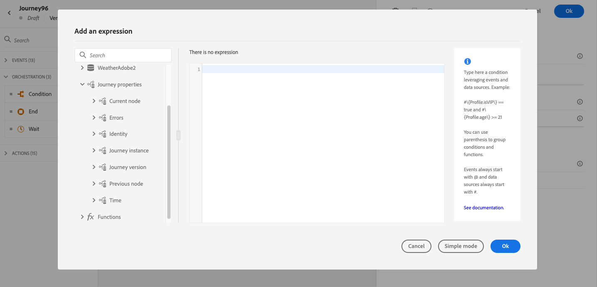

# Journey properties attributes {#journey-properties}

In the [simple expression editor](../conditions.md#about_condition), and in the [advanced expression editor](../expression/expressionadvanced.md), below the **Event** and **Data source** categories, you can access the **Journey Properties** category. This category contains technical fields related to the journey for a given profile. This is the information retrieved by the system from live journeys, such as the journey ID, or the specific errors encountered.

It contains information, for example, about:

* journey version: journey uid, journey version uid, instance uid, etc.
* errors: data fetch, action execution, etc.
* current step, last current step, etc.
* discarded profiles

    The list of fields is available [in this section](#journey-properties-fields).

You can use these fields to build expressions. During the journey execution, the values are retrieved directly from the journey. 

Below are a few examples of use cases:

* **Log discarded profiles**: you can send all profiles excluded from a message by a capping rule to a third-party system for logging purposes. For this, you set up a path in case of timeout and error and add a condition to filter on a specific error type, for example: "discard people by capping rule". You can then push the discarded profiles to a third-party system via a custom action. 

* **Send alerts in case of errors**: you can send a notification to a third-party system every time an error occurs on a message. For this, you set up a path in case of error, add a condition and a custom action. You can send a notification on a Slack channel, for example, with the description of the error encountered.

* **Refine errors in reporting** : instead of having just one path for messages in error, you can define a condition per error type. This will allow you to refine the reporting and view all error types data.

## List of fields {#journey-properties-fields}

|Category|Field name|Label|Description|
|---|---|---|------------|
|Journey Version|journeyUID|Journey Identifier| |
| |journeyVersionUID|Journey Version Identifier| |
| |journeyVersionName|Journey Version Name| |
| |journeyVersionDescription|Journey Version Description| |
| |journeyVersion|Journey Version| |
|Journey Instance|instanceUID|Journey Instance Identifier|ID of the instance|
| |externalKey|External Key|Individual identifier triggering the journey|
| |organizationId|Organization identifier|Brand's organization|
| |sandboxName|Sandbox name|Name of the sandbox|
|Identity|profileId|Profile Identity Identifier|Identifier of the profile in the journey|
| |namespace|Profile Identity Namespace|Namespace of the profile in the journey (example: ECID)|
|Current Node|currentNodeId|Current Node Identifier|Identifier of the current activity (node)|
| |currentNodeName|Current Node Name|Name of the current activity (node)|
|Previous Node|previousNodeId|Previous Node Identifier|Identifier of the previous activity (node)|
| |previousNodeName|Previous Node Name|Name of the previous activity (node)|
|Errors|lastNodeUIDInError|Last Node Identifier in Error|Identifier of the latest activity (node) in error|
| |lastNodeNameInError|Last Node Name in Error|Name of the latest activity (node) in error|
| |lastNodeTypeInError|Last Node Type in Error|Error type of the latest activity (node) in error. Possible types:<ul><li>Events: Events, Reactions, SQ (example: Audience Qualification)</li><li>Flow control: End, Condition, Wait</li><li>Actions: ACS actions, Jump, Custom Action</li></ul>|
| |lastErrorCode|Last Error Code|Error code of the latest activity (node) in error. Possible errors: <ul><li>HTTP error codes</li><li>capped</li><li>timedOut</li><li>error (example: default in case of an unexpected error. Should not/extremely rarely happen)</li></ul>|
| |lastExecutedActionErrorCode|Last Executed Action Error Code|Error code of the latest action in error |
| |lastDataFetchErrorCode|Last Data Fetch Error Code|Error code of the latest data fetch from data sources|
|Time|lastActionExecutionElapsedTime|Last action execution elapsed time|Time spent to execute the latest action|
| |lastDataFetchElapsedTime|Last data fetch elapsed time|Time spent to execute the latest data fetch from data sources|

+++AI Assistant — Page context

* **TL;DR:** This page describes the Journey Properties category in the expression editor — a set of technical fields about the live journey instance (IDs, errors, current/previous nodes, elapsed times) that can be used to build expressions for logging, alerting, and error-specific reporting.

**Intents:**

* Access Journey Properties fields in the simple or advanced expression editor to reference live journey metadata
* Build a condition that filters discarded profiles by error type to route them to a third-party logging system
* Send error alerts to an external channel (e.g. Slack) by referencing the last error code and node name in a custom action
* Refine journey error reporting by creating separate condition paths per error type using `lastNodeTypeInError` and `lastErrorCode`
* Reference journey version identifiers, instance identifiers, and sandbox name in expressions for tracking and auditing

**Glossary:**

* **Journey Properties**: A category in the expression editor containing technical metadata fields for the current journey execution instance *(product-specific)*
* **instanceUID**: The unique identifier of the journey instance for a given profile execution *(product-specific)*
* **lastErrorCode**: The error code from the most recent failed activity in the journey; possible values include HTTP codes, `capped`, `timedOut`, and `error` *(product-specific)*
* **lastNodeTypeInError**: The type of the last activity that encountered an error; can be Events, Flow control, or Actions *(product-specific)*
* **externalKey**: The individual identifier (e.g. profile ID) that triggered the journey instance *(product-specific)*

**Guardrails:**

* Journey Properties field values are retrieved directly from the live journey at execution time — they are not available for pre-execution validation
* The `lastErrorCode` field uses predefined values: HTTP error codes, `capped`, `timedOut`, and `error`
* Journey Properties are available in both the simple and advanced expression editors, under the Journey Properties category

**Terminology:**

* Canonical name: Journey Properties — Acronym: none — variants: journey technical fields, journey metadata fields
* Synonyms: "Journey Properties" = "journey technical fields"; "instanceUID" = "journey instance identifier"
* Do not confuse: journeyUID (identifies the journey definition) ≠ instanceUID (identifies a specific profile's execution of the journey)

**FAQ:**

* **Q: Where do I find Journey Properties fields in the expression editor?** — They appear in both the simple and advanced expression editors under the Journey Properties category, below Events and Data Sources.
* **Q: How can I log profiles discarded by a capping rule?** — Add an error path condition filtering on `lastErrorCode == "capped"` and push those profiles to a third-party system via a custom action.
* **Q: What is the difference between `journeyUID` and `instanceUID`?** — `journeyUID` identifies the journey definition; `instanceUID` identifies a specific execution instance for a given profile.
* **Q: What error code is returned for an unexpected system error?** — The `error` code, which is used as the default for unexpected errors and should rarely occur.
* **Q: Can I use Journey Properties fields to send Slack alerts on action failures?** — Yes; reference `lastNodeNameInError` and `lastErrorCode` in a custom action to include error details in a Slack notification.

+++
