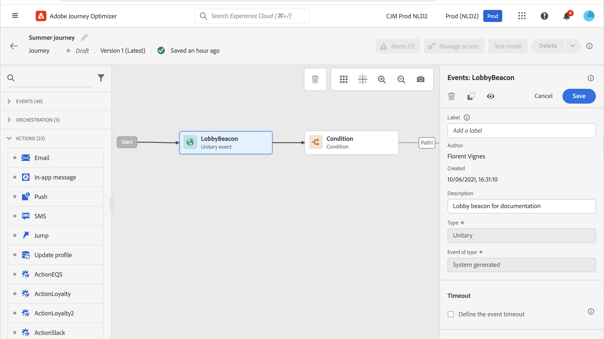
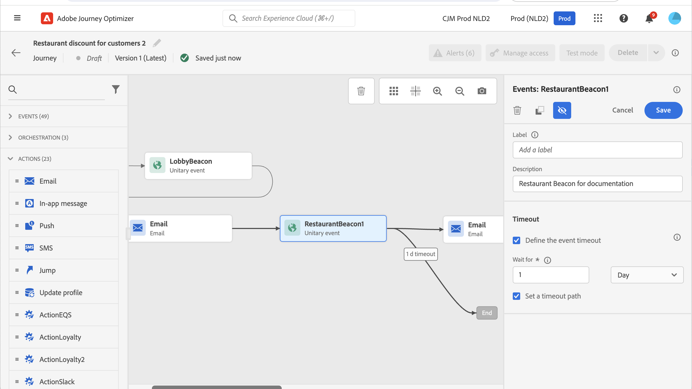
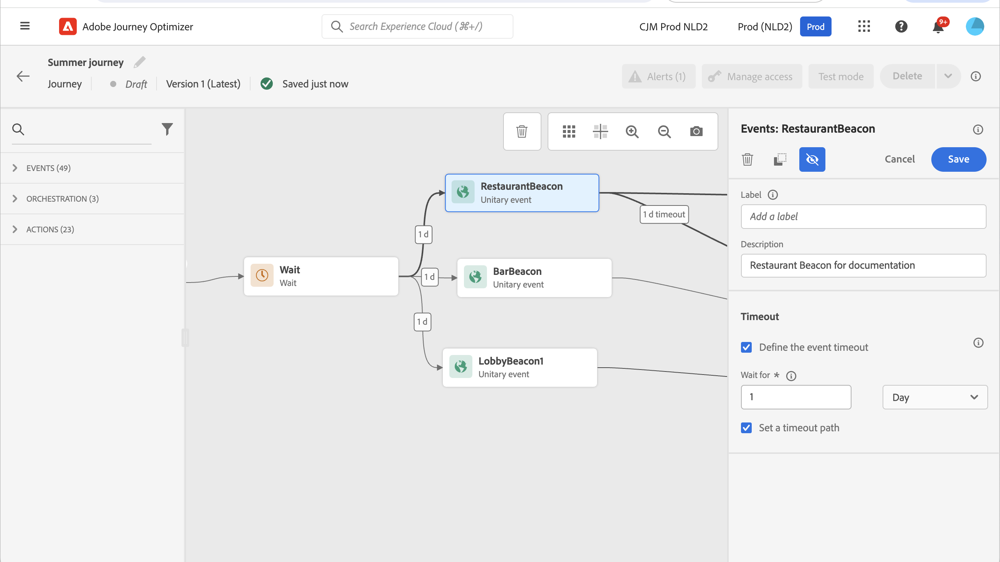

# General events {#general-events}

>[!BEGINSHADEBOX]

**On this page:** Learn how to use general events to trigger journeys unitarily in real time and configure event timeouts and timeout paths to listen for an event only during a defined period.

>[!ENDSHADEBOX]

>[!CONTEXTUALHELP]
>id="ajo_journey_event_custom"
>title="Unitary events"
>abstract="Events allow you to trigger your journeys unitarily to send messages, in real-time, to the individual flowing into the journey. For this type of event, you can only add a label and a description. The event configuration is performed by a data engineer and cannot be edited."

>[!CONTEXTUALHELP]
>id="ajo_journey_event_business_canvas"
>title="Business events"
>abstract="These events allow you to start a journey using a non-profile-related event. When that event is fired, you will be able to send messages to an audience of profiles. For this type of event, you can only add a label and a description. The event configuration is performed by a technical user and cannot be edited."

Events allow you to trigger your journeys unitarily to send messages, in real-time, to the individual flowing into the journey.

For this type of event, you can only add a label and a description. The rest of the configuration cannot be edited. It was performed by the technical user. See [this page](../event/about-events.md).

Learn more about event throughput and journey processing rates in [this section](entry-management.md#journey-processing-rate).

When you drop a business event, it automatically adds a **Read Audience** activity. For more information on business events, refer to [this section](../event/about-events.md) 

## Listening to events during a specific time {#events-specific-time}

An event activity positioned in the journey listens to events indefinitely. To listen to an event only during a certain time, you must configure a timeout for the event.

The journey will then listen to the event during the time specified in the timeout. If an event is received during that period, the person will flow in the event path. If not, the customer will either flow into the timeout path if it is defined, or will continue that journey.

If no timeout path is defined, the timeout setting will act as a wait activity, making the profile wait for a period of time, which could be stopped if an event happens before the end of that wait. If you want profiles to be excluded from that journey after timeout, you will have to set a timeout path.

To configure a timeout for an event, follow these steps:

1. Activate the **[!UICONTROL Define the event timeout]** option from the event properties.

1. Specify the amount of time the journey will wait for the event. The maximum duration is **90 days**.

1. When no event is received within the specified timeout, best practice is to send the individuals into a timeout path. For this, enable the **[!UICONTROL Set a timeout path]** option. In that case, the journey continues for the individual once the timeout is reached. We recommend that you always enable the **[!UICONTROL Set a timeout path]** option.

    

In this example, the journey sends a first welcome email to a customer after he/she enters the lobby. It then sends a meal discount email only if the customer enters the restaurant within the next day. We therefore configured the restaurant event with a 1-day timeout:

* If the restaurant event is received less than 1 day after the welcome email, the meal discount email is sent.
* If no restaurant event is received within the next day, the person flows through the timeout path.

Note that if you want to configure a timeout on multiple events positioned after a **[!UICONTROL Wait]** activity, you need to configure the timeout on one of these events only.

The defined timeout applies to all the events positioned after the **[!UICONTROL Wait]** activity:

* If one event is received within the timeout duration, the individual flows into the received event's path.
* If no event is received within the timeout duration, the individual flows into the timeout branch of the event where the timeout has been defined.

{{$include /help/_includes/do-not-localize/building-journeys/ai-augmented-general-events.md}}
