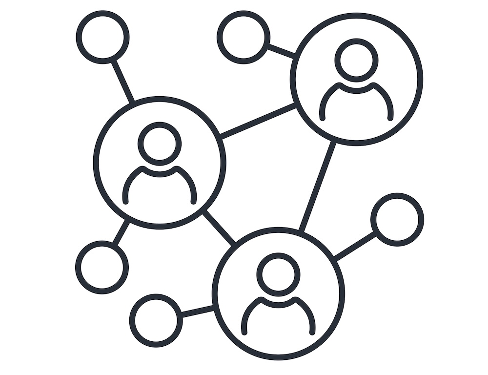

# Learn through use cases {#jo-uc-gs}

This section brings together a collection of practical use cases to help you get the most out of Adobe Journey Optimizer. Whether you are looking for tactical patterns—like suppression logic, personalization techniques, or journey exit strategies—or complete end-to-end scenarios covering marketing and technical workflows, you will find links to relevant samples below.

Use this library as a reference point when designing journeys, modeling data, or building activation logic. Each example includes recommendations you can tailor to your specific needs.

## Work with experience events

<table style="table-layout:fixed">
<tr style="border: 0;">
  <td>
    

     
     Learn common patterns and scalable approaches to help you make the most of Experience Events in Adobe Journey Optimizer. These use cases are designed to help you solve frequent challenges such as managing opt-outs, controlling message frequency, personalizing content based on user behavior, and reacting to real-time signals.
    

      

     <a href="exp-event-lookup.md">Learn more</a>

    

  </td>
</tr>
</table>

## Query journey datasets

<table style="table-layout:fixed">
<tr style="border: 0;">
  <td>
    

     
     To build your use cases, you need to query the Adobe Journey Optimizer datasets, such as system datasets for ingesting tracking experience events, the dataset for ingesting step events in a journey, the dataset for ingesting offer propositions to the users, and more.
    

      

     <a href="../data/datasets-query-examples.md">Learn more</a>

    

  </td>
</tr>
</table>

See also several commonly used [examples to query Journey Step Events](../reports/query-examples.md). 

## Business use cases

<table style="table-layout:fixed"><tr style="border: 0;">
<td>

<a href="../building-journeys/journeys-uc.md"><strong>Send multi-channel messages</strong></a>

</td>
<td>

<a href="ajo-ac.md"><strong>Send with Campaign v7/v8</strong>

</td>
<td>

<a href="message-to-subscribers-uc.md"><strong>Send to your subscribers</strong></a>

</td>
</tr></table>

## Technical use cases

<table style="table-layout:fixed"><tr style="border: 0;">
<td>

<a href="collections.md"><strong>Pass collections dynamically with custom actions</strong></a>

</td>
<td>

<a href="limit-throughput.md"><strong>Limit throughput with External Data Sources and Custom Actions</strong></a>

</td>
</tr></table>

## Blog posts

Browse the following blog posts to find more guidance and best practices when building your journeys:

<table style="table-layout:fixed"><tr style="border: 0;">
<td>

<a href="https://experienceleaguecommunities.adobe.com/t5/journey-optimizer-blogs/how-to-send-emails-only-on-weekdays-in-adobe-journey-optimizer/ba-p/760400" target="_blank">Use Case: How to Send Emails Only on Weekdays in Adobe Journey Optimizer</a>

<a href="https://experienceleaguecommunities.adobe.com/t5/journey-optimizer-blogs/advanced-approval-strategies-in-adobe-journey-optimizer/ba-p/761396" target="_blank">Use Case: Advanced Approval Strategies</a>

<a href="https://experienceleaguecommunities.adobe.com/t5/journey-optimizer-blogs/elevate-customer-experience-with-daily-frequency-capping-in-ajo/ba-p/761510" target="_blank">Use Case: Daily Frequency Capping</a>

<a href="https://experienceleaguecommunities.adobe.com/t5/journey-optimizer-blogs/mastering-read-audience-journeys-in-adobe-journey-optimizer-a/ba-p/761445" target="_blank">Best Practices: Read Audience Journeys</a>

<a href="https://experienceleaguecommunities.adobe.com/t5/journey-optimizer-blogs/from-plan-to-perfection-how-to-test-your-ajo-journeys-for-10/ba-p/761270" target="_blank">Use Case: Test your Journeys</a>

<a href="https://experienceleaguecommunities.adobe.com/t5/journey-optimizer-blogs/deliver-with-confidence-approval-workflows-across-adobe-journey/ba-p/760900" target="_blank">Use Case: Approval Workflows</a>

<a href="https://experienceleaguecommunities.adobe.com/t5/journey-optimizer-blogs/mastering-journey-entry-and-exit-criteria-in-adobe-journey/ba-p/760958" target="_blank">Use Case: Journey Entry and Exit Criteria</a>

</td>
<td>

<a href="https://experienceleaguecommunities.adobe.com/t5/journey-optimizer-blogs/mastering-step-events-in-adobe-journey-optimizer-fundamentals/ba-p/762024" target="_blank">Mastering Step Events in Adobe Journey Optimizer: Fundamentals, Schema, and Essential Queries for Data-Driven Campaigns
</a>

<a href="https://experienceleaguecommunities.adobe.com/t5/journey-optimizer-blogs/fast-external-audience-activation-with-custom-upload/ba-p/761658" target="_blank">Use Case: Fast External Audience Activation with Custom Upload</a>

</td>
<td>

<a href="https://experienceleaguecommunities.adobe.com/t5/journey-optimizer-blogs/how-to-extend-adobe-journey-optimizer-with-custom-actions/ba-p/761323" target="_blank">How to Extend Adobe Journey Optimizer with Custom Actions: Integration Use Cases
</a>

</td>
</tr></table>