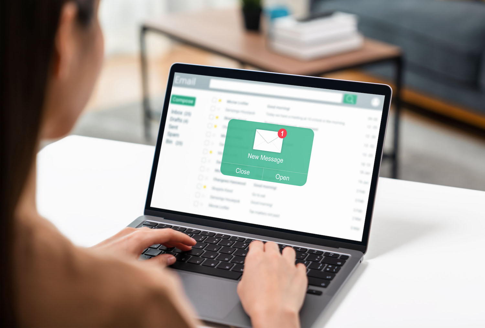
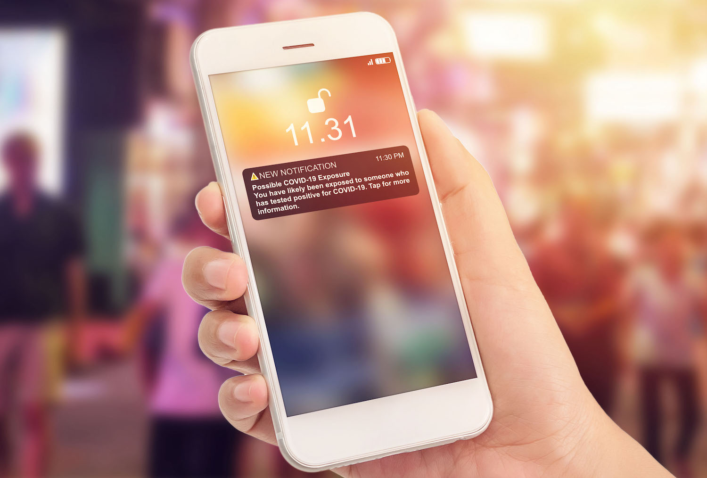
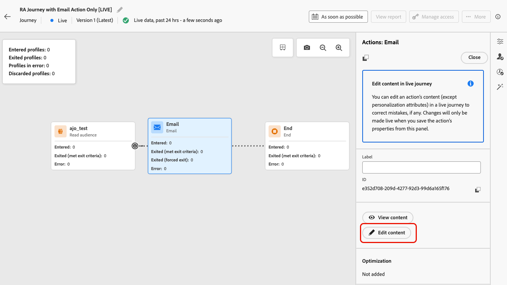

# Use the Action activity {#add-a-message-in-a-journey}

>[!CONTEXTUALHELP]
>id="ajo_action_activity"
>title="Action activity"
>abstract="The **Action** activity lets you configure a single native channel action and multiple inbound activities with the ability to add optimization to any built-in channel action."

The **Action** activity is the single entry point for all channel actions in the journey canvas. It replaces the previous individual built-in channel activities and consolidates Email, Push, SMS, In-app, Web, Code-based experience, and Content Card into one unified activity type.

Use it to:

* Configure any built-in channel action from a single, streamlined interface.
* Build multi-action inbound action groups.
* Apply optimization to any channel action.

>[!IMPORTANT]
>
>Legacy native channel activities (Email, Push, SMS, In-app, Web, Code-based experience, and Content Card) are deprecated as of the March 2026 release. Existing journeys using these activities continue to work without any changes—no migration is required.

You can also set up custom actions to send your messages in [!DNL Journey Optimizer]. [Learn more](#recommendation)

## Add a built-in channel action to a journey  {#add-action}

To add a built-in channel action to your journey using the **[!UICONTROL Action]** activity, follow the steps below.

>[!NOTE]
>
>For more information on the channels available in journeys, refer to the table in this section: [Channels in journeys & campaigns](../channels/gs-channels.md#channels).

1. Start your journey with an [Event](general-events.md) or a [Read Audience](read-audience.md) activity.

1. From the **[!UICONTROL Actions]** section of the palette, drag and drop an **[!UICONTROL Action]** activity into the canvas.

1. Select the built-in channel activity you want to leverage in your journey.

   

1. Add a label to your action and select **[!UICONTROL Configure action]**.

   {width="80%"}

1. You are directed to the **[!UICONTROL Actions]** tab of the journey action configuration screen.

   Select the configuration to use for the selected channel.

   

1. If you selected an inbound channel, you can add multiple actions. [Learn more](#multi-action)

1. Configure your activity according to the selected channel. Detailed configuration guidelines are available in the links below.
   
   * Learn the detailed steps to create your outbound action as follows:

      <table style="table-layout:fixed">
      <tr style="border: 0;">
      <td>
      
      
<a href="../email/create-email.md"><strong>Create emails</strong>
      

      

      </td>
      <td>
      
      

      <a href="../push/create-push.md"><strong>Create push notifications<strong></a>
      

      

      </td>
      <td>
      
      

      <a href="../sms/create-sms.md"><strong>Create text messages (SMS/MMS)</strong></a>
      

      

      </td>
      </tr>
      </table>

   * Learn the detailed steps to create your inbound action as follows:

      <table style="table-layout:fixed">
      <tr style="border: 0;">
      <td>
      
      
<a href="../in-app/create-in-app.md"><strong>Create In-app messages</strong>
      

      

      </td>
      <td>
      
      
<a href="../web/create-web.md"><strong>Create web experiences</strong>
      

      

      </td>
      <td>
      
      
<a href="../content-card/create-content-card.md"><strong>Create content cards</strong>
      

      

      </td>
      <td>
      
      

      <a href="../code-based/create-code-based.md"><strong>Create code-based experiences<strong></a>
      

      

      </td>
      </tr>
      </table>

   >[!NOTE]
   >
   >* Each inbound experience action comes with a 3-days **Wait** activity. [Learn more](wait-activity.md#auto-wait-node)
   >
   >* For emails and push notifications, you can enable Send-Time Optimization. [Learn more](send-time-optimization.md)

1. Depending on the activity, you can display advanced parameters specific to the selected channel, and override some default values such as the execution address. [Learn more](about-journey-activities.md#advanced-parameters)

   >[!NOTE]
   >
   >If the advanced parameters are hidden, click the **[!UICONTROL Show read-only fields]** button on top of the right pane.

1. Use the **[!UICONTROL Optimization]** section to run content experiments, leverage targeting rules, or use advanced combinations of both experimentation and targeting.

   These different options and the steps to follow are detailed in [this section](../content-management/gs-message-optimization.md).

1. Use the **[!UICONTROL Languages]** section to create content in multiple languages within your journey action. To do so, click the **[!UICONTROL Add languages]** button and select the desired **[!UICONTROL Language settings]**.

   Detailed information on how to set up and use multilingual capabilities are available in [this section](../content-management/multilingual-gs.md).

Additional settings are available depending on the selected communication channel. Expand the sections below for more information.

+++**Apply capping rules** (Email, Push, SMS)

In the **[!UICONTROL Business rules]** drop-down list, select a rule set to apply capping rules to your journey action.

Leveraging channel rule sets allows you to set frequency capping by communication type to prevent overloading customers with similar messages.

[Learn how to work with rule sets](../conflict-prioritization/rule-sets.md)

+++

+++**Track engagement** (Email, SMS).

Use the **[!UICONTROL Action tracking]** section to track how your recipients react to your email or SMS deliveries.

Tracking results are accessible from the journey report once the journey has been executed.

[Learn more about journey reports](../reports/journey-global-report-cja.md)

+++

+++**Enable Rapid delivery mode** (Push).

Rapid delivery mode is a [!DNL Journey Optimizer] add-on that allows very fast push message sending in large volumes though campaigns.

Rapid delivery is used when delay in message delivery is business-critical, when you want to send an urgent push alert on mobile phones, for example a breaking news to users who have installed your news channel app.

Learn how to enable Rapid delivery mode for Push notifications [on this page](../push/create-push.md#rapid-delivery).

For more information on performances when using Rapid delivery mode, refer to [[!DNL Adobe Journey Optimizer] product description](https://helpx.adobe.com/legal/product-descriptions/adobe-journey-optimizer.html){target="_blank"}.

+++

+++**Assign priority scores** (Web, In-app, Code-based)

In the **[!UICONTROL Conflict management]** section, you can assign a priority score to the journey action, allowing you to prioritize an inbound action when there are multiple journey actions or campaigns using the same channel configuration.

By default, the priority score for the action is inherited from the overall priority score for the journey.

[Learn how to assign priority scores to channel actions](../conflict-prioritization/priority-scores.md#priority-action)

+++

+++**Set additional delivery rules** (Content cards)

For content card journeys, you can enable additional delivery rules to choose the event(s) and criteria which trigger your message.

[Learn how to create content cards](../content-card/create-content-card.md)

+++

+++**Define triggers** (In-app)

For in-app messages, you can use the **[!UICONTROL Edit triggers]** button to choose the event(s) and criteria which trigger your message.

[Learn how to create an In-app message](../in-app/create-in-app.md)

+++

## Add multiple inbound actions {#multi-action}

>[!CONTEXTUALHELP]
>id="ajo_multi_action_journey"
>title="Add multiple inbound actions"
>abstract="You can select several inbound actions inside a single journey. This capability enables you to deliver multiple Code-based experiences, In-app messages, Content Cards or Web actions to different locations at the same time, each action containing a specific content."

To simplify your journey orchestration, you can define several inbound actions inside a single journey action.

>[!NOTE]
>
>This capacity is only available for inbound channels. Currently outbound channels such as Email are not supported.

This capacity enables you to deliver various Code-based experiences, In-app messages, Content Cards or Web actions to different locations at the same time, without the need to create multiple journey actions. It makes the deployment of your journey easier and allows for smoother reporting, with all the data consolidated into one single journey.

For example, you can send a code-based experience to multiple endpoints with slightly different contents. To do this, create multiple code-based actions within the same journey action, each with a different endpoint configuration.

To define several inbound actions in a single journey action node, follow the steps below.

1. Start your journey with an [Event](general-events.md) or a [Read Audience](read-audience.md) activity.

1. From the **[!UICONTROL Actions]** section of the palette, drag and drop an **[!UICONTROL Action]** activity into the canvas.

1. Select **[!UICONTROL Multi action]** as the action type.

   

1. Add a label if needed and select **[!UICONTROL Configure action]**.

   {width="60%"}

1. You are directed to the **[!UICONTROL Actions]** tab of the journey action configuration screen.

   {width="70%"}

1. Select an inbound action (**Code-based experience**, **In-app message**, **Content Card** or **Web**) from the **[!UICONTROL Actions]** section.

1. Select the channel configuration and define a specific content for that action.

1. Use the **[!UICONTROL Add action]** button to select another inbound action from the drop-down list.

    {width="80%"}

1. Proceed similarly to add more actions. You can add up to 10 inbound actions in a journey action group.

Once the journey is [live](publish-journey.md), all actions are activated simultaneously.

## Update a live content {#update-live-content}

You can update the content of a built-in channel action in a live journey.

Any changes made to the content are not reflected in the journey until you save the action's properties. [Learn more](about-journey-activities.md#advanced-parameters)

To do this, open your live journey, select the channel activity and click **Edit content**.

However, you cannot change the attributes used in personalization, whether they are profile attributes or contextual data (from event or journey properties).

* If you modified contextual data, the following error message will be displayed: `ERR_AUTHORING_JOURNEYVERSION_201`

* If you modified profile attributes, the following error message will be displayed: `ERR_AUTHORING_JOURNEYVERSION_202`

Note that for the In-app activity, any changes can be made to the content while the journey is live, but In-app triggers cannot be modified.

## Send with custom actions {#recommendation}

Instead of using the built-in message capabilities, you can use custom actions to configure connection of a third-party system to send messages or API calls.

* If you are using a third-party system to send your messages, you can create a custom action. [Learn more](../action/action.md)

* If you are working with Adobe Campaign, refer to these sections:

   * [[!DNL Journey Optimizer] and Campaign v7/v8](../action/acc-action.md)
   * [[!DNL Journey Optimizer] and Campaign Standard](../action/acs-action.md)
