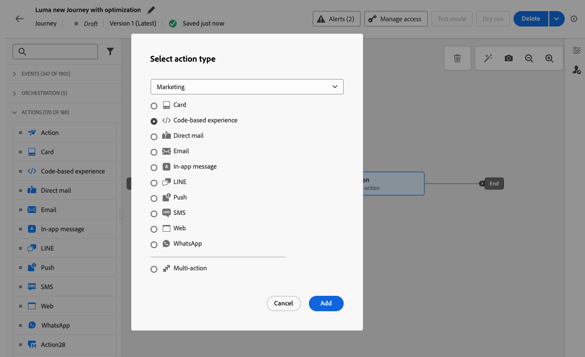
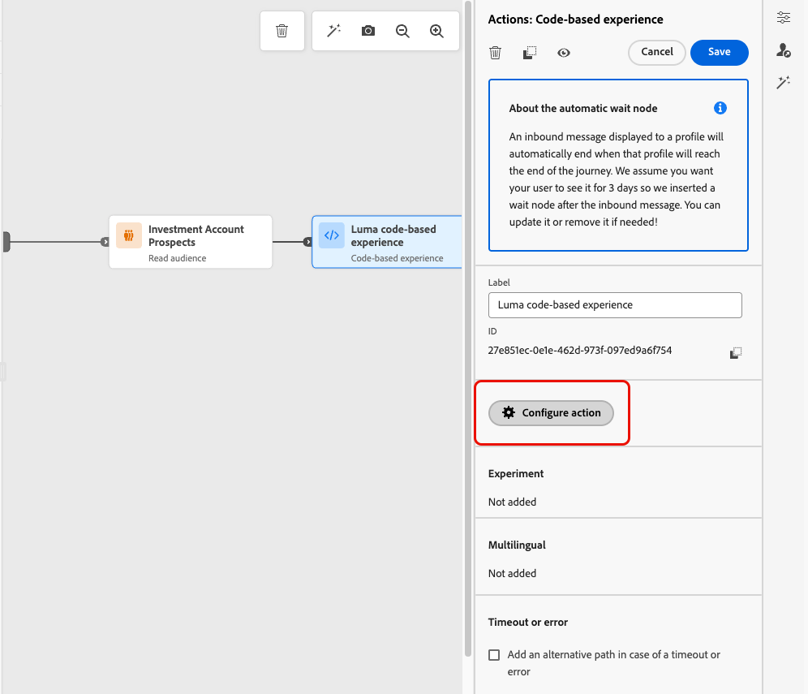
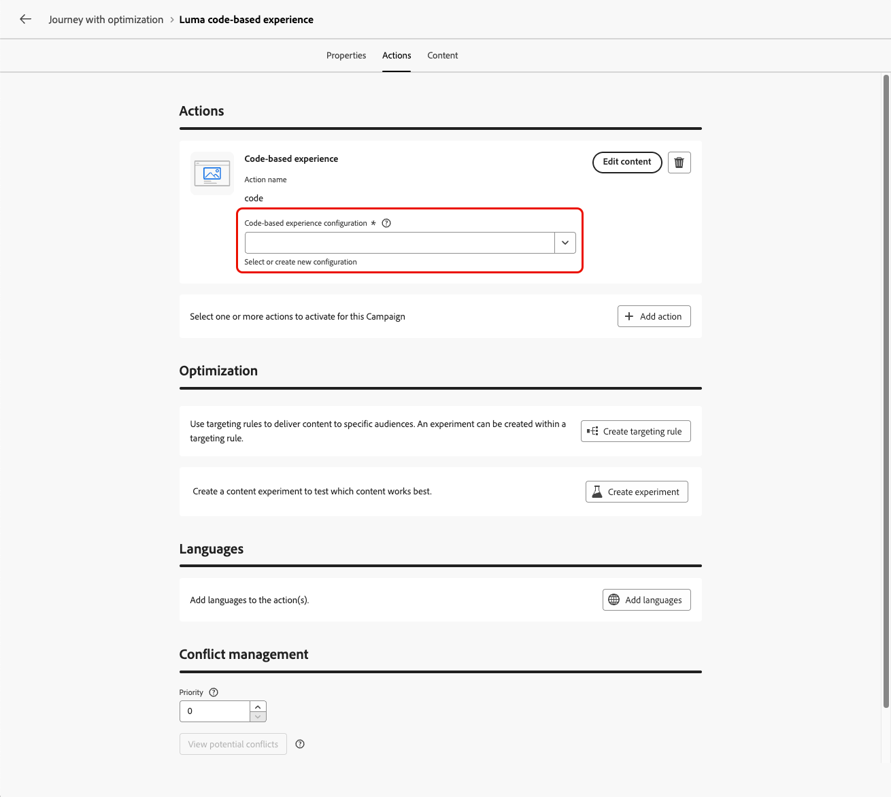
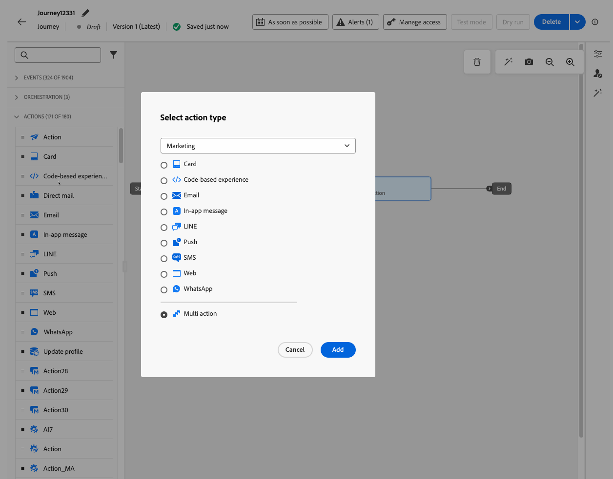
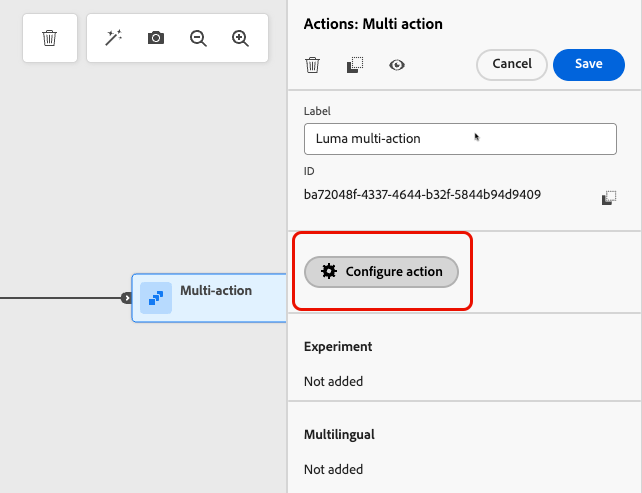
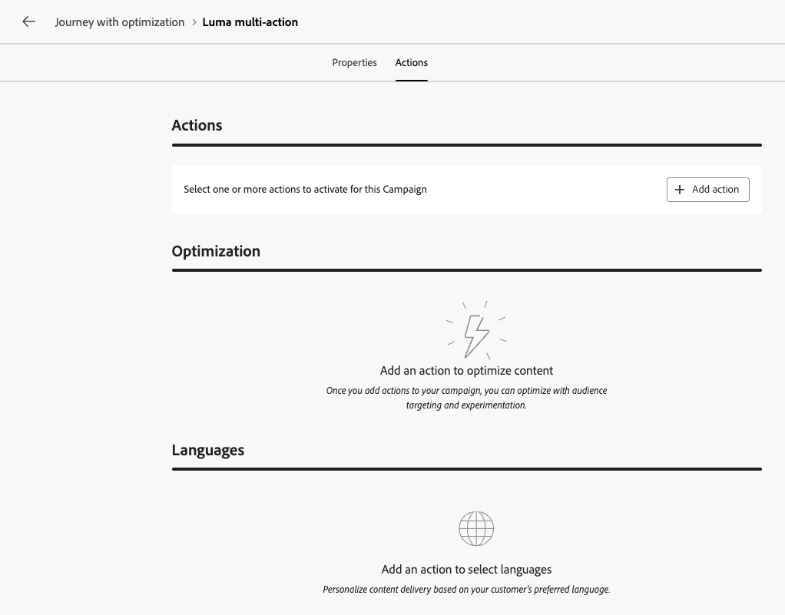
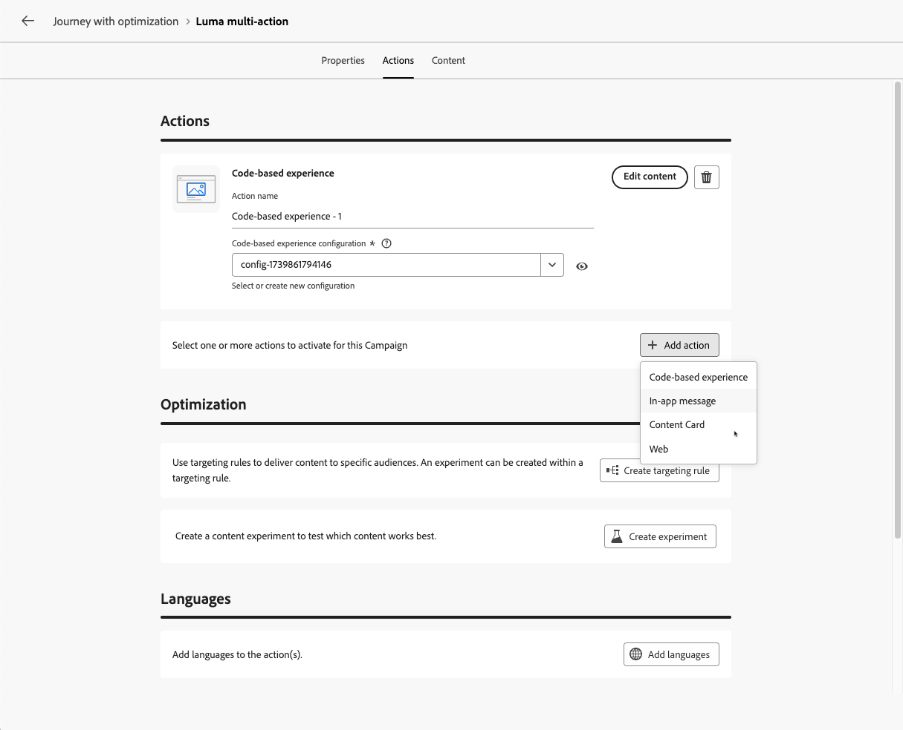

# Use the Action activity {#add-a-message-in-a-journey}

>[!CONTEXTUALHELP]
>id="ajo_action_activity"
>title="Action activity"
>abstract="The generic **Action** activity lets you configure a single native channel action and multiple inbound activities with the ability to add optimization to any built-in channel action."

>[!AVAILABILITY]
>
>This capability is available in Limited Availability. Contact your Adobe representative to gain access.

[!DNL Journey Optimizer] comes with a new generic **Action** activity that allows to configure a single built-in channel action, and also multiple inbound activities.

It allows for:

* A simplified native action configuration within the journey canvas.
* The capacity to create multi-action inbound action groups.
* The ability to add optimization to any built-in channel action.

>[!NOTE]
>
>You can also set up custom actions to send your messages in [!DNL Journey Optimizer]. [Learn more](#recommendation)

## Add an action to a journey  {#add-action}

To add a built-in channel action to a journey, follow the steps below.

1. Start your journey with an [Event](general-events.md) or a [Read Audience](read-audience.md) activity.

1. From the **[!UICONTROL Actions]** section of the palette, drag and drop an **[!UICONTROL Action]** activity into the canvas.

1. Select the built-in channel activity you want to leverage in your journey.

   

1. Add a label to your action and select **[!UICONTROL Configure action]**.

   {width="80%"}

1. You are directed to the **[!UICONTROL Actions]** tab of the journey action configuration screen.

   Select the configuration to use for the selected channel.

   

1. If you selected an inbound channel, you can add multiple actions. [Learn more](#multi-action)

1. Configure your activity according to the selected channel. Learn how to configure built-in channel actions in [this section](journeys-message.md).

1. Use the **[!UICONTROL Optimization]** section to run content experiments, leverage targeting rules, or use advanced combinations of both experimentation and targeting.

   These different options and the steps to follow are detailed in [this section](../campaigns/gs-message-optimization.md).

1. Use the **[!UICONTROL Languages]** section to create content in multiple languages within your journey action. To do so, click the **[!UICONTROL Add languages]** button and select the desired **[!UICONTROL Language settings]**.

   Detailed information on how to set up and use multilingual capabilities are available in [this section](../content-management/multilingual-gs.md).

Additional settings are available depending on the selected communication channel. Expand the sections below for more information.

+++**Apply capping rules** (Email, Direct mail, Push, SMS)

In the **[!UICONTROL Business rules]** drop-down list, select a rule set to apply capping rules to your journey action.

Leveraging channel rule sets allows you to set frequency capping by communication type to prevent overloading customers with similar messages.

[Learn how to work with rule sets](../conflict-prioritization/rule-sets.md)

+++

+++**Track engagement** (Email, SMS).

Use the **[!UICONTROL Action tracking]** section to track how your recipients react to your email or SMS deliveries.

Tracking results are accessible from the journey report once the journey has been executed.

[Learn more about journey reports](../reports/journey-global-report-cja.md)

+++

+++**Enable Rapid delivery mode** (Push).

Rapid delivery mode is a [!DNL Journey Optimizer] add-on that allows very fast push message sending in large volumes though campaigns.

Rapid delivery is used when delay in message delivery is business-critical, when you want to send an urgent push alert on mobile phones, for example a breaking news to users who have installed your news channel app.

Learn how to enable Rapid delivery mode for Push notifications [on this page](../push/create-push.md#rapid-delivery).

For more information on performances when using Rapid delivery mode, refer to [Adobe Journey Optimizer product description](https://helpx.adobe.com/legal/product-descriptions/adobe-journey-optimizer.html){target="_blank"}.

+++

+++**Assign priority scores** (Web, In-app, Code-based)

In the **[!UICONTROL Conflict management]** section, you can assign a priority score to the journey action, allowing you to prioritize an inbound action when there are multiple journey actions or campaigns using the same channel configuration.

By default, the priority score for the action is inherited from the overall priority score for the journey.

[Learn how to assign priority scores to channel actions](../conflict-prioritization/priority-scores.md#priority-action)

+++

+++**Set additional delivery rules** (Content cards)

For content card journeys, you can enable additional delivery rules to choose the event(s) and criteria which trigger your message.

[Learn how to create content cards](../content-card/create-content-card.md)

+++

+++**Define triggers** (In-app)

For in-app messages, you can use the **[!UICONTROL Edit triggers]** button to choose the event(s) and criteria which trigger your message.

[Learn how to create an In-app message](../in-app/create-in-app.md)

+++

## Add multiple inbound actions {#multi-action}

>[!CONTEXTUALHELP]
>id="ajo_multi_action_journey"
>title="Add multiple inbound actions"
>abstract="You can select several inbound actions inside a single journey. This capability enables you to deliver multiple Code-based experiences, In-app messages, Content Cards or Web actions to different locations at the same time, each action containing a specific content."

To simplify your journey orchestration, you can define several inbound actions inside a single journey action.

>[!NOTE]
>
>This capacity is only available for inbound channels. Currently outbound channels such as Email are not supported.

This capacity enables you to deliver various Code-based experiences, In-app messages, Content Cards or Web actions to different locations at the same time, without the need to create multiple journey actions. It makes the deployment of your journey easier and allows for smoother reporting, with all the data consolidated into one single journey.

For example, you can send a code-based experience to multiple endpoints with slightly different contents. To do this, create multiple code-based actions within the same journey action, each with a different endpoint configuration.

To define several inbound actions in a single journey action node, follow the steps below.

1. Start your journey with an [Event](general-events.md) or a [Read Audience](read-audience.md) activity.

1. From the **[!UICONTROL Actions]** section of the palette, drag and drop an **[!UICONTROL Action]** activity into the canvas.

1. Select **[!UICONTROL Multi action]** as the action type.

   

1. Add a label if needed and select **[!UICONTROL Configure action]**.

   {width="60%"}

1. You are directed to the **[!UICONTROL Actions]** tab of the journey action configuration screen.

   {width="70%"}

1. Select an inbound action (**Code-based experience**, **In-app message**, **Content Card** or **Web**) from the **[!UICONTROL Actions]** section.

1. Select the channel configuration and define a specific content for that action.

1. Use the **[!UICONTROL Add action]** button to select another inbound action from the drop-down list.

    {width="80%"}

1. Proceed similarly to add more actions. You can add up to 10 inbound actions in a journey action group.

Once the journey is [live](publish-journey.md), all actions are activated simultaneously.
<!--
## Next steps {#next}

Once your action is configured, you can design its content. [Learn more]-->
