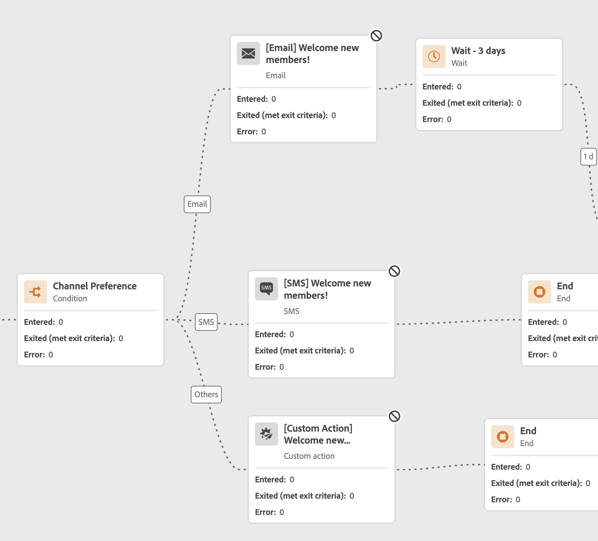
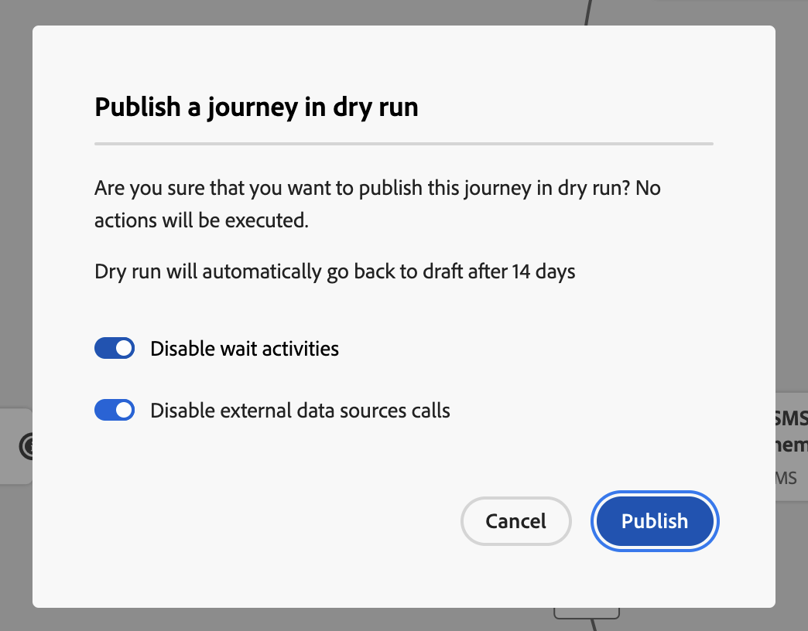
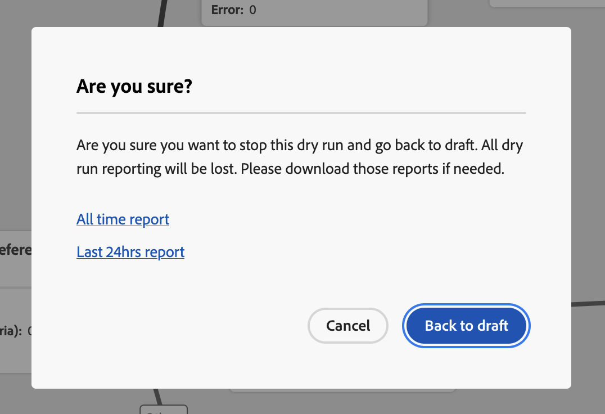
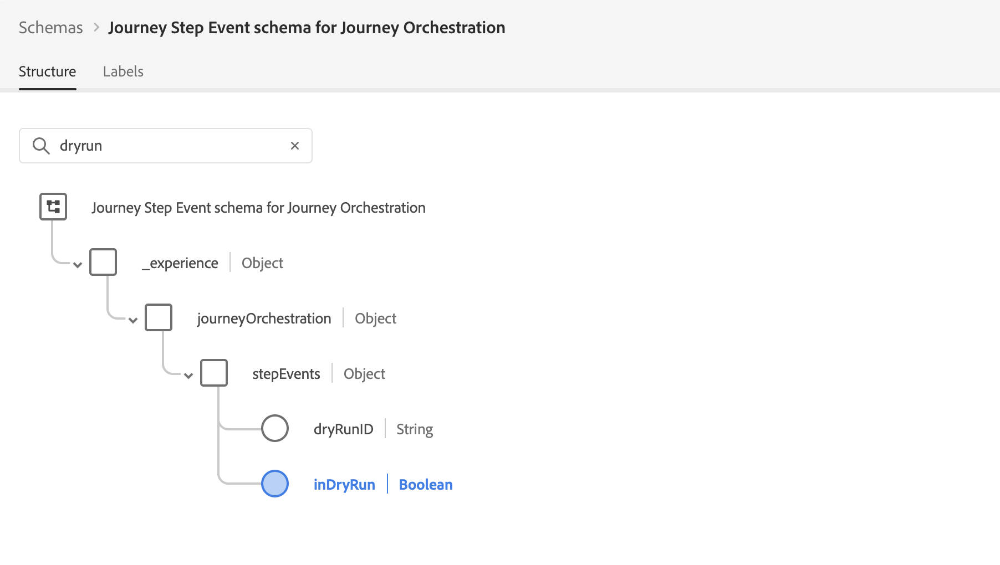

# Journey Dry run {#journey-dry-run}

>[!CONTEXTUALHELP]
>id="ajo_journey_dry_run"
>title="Dry run mode"
>abstract="This journey is in Dry run. Journey Dry run is a special journey publication mode in Adobe Journey Optimizer that allows journey practitioners to test a journey using real production data without contacting real customers or updating profile information.  This feature helps journey practitioners gain confidence in their journey design and audience targeting before publishing it live."

>[!CONTEXTUALHELP]
>id="ajo_journey_dry_run_start"
>title="Publish a journey in dry run mode"
>abstract="Journey Dry run is a special journey publication mode in Adobe Journey Optimizer that allows journey practitioners to test a journey using real production data. Once you designed your journey, execute a dry run to confirm it is functional and ensure steps are correct. This publication mode lets you smoke test a journey, without sending communication to any profile."

Journey Dry run is a special journey publication mode in Adobe Journey Optimizer that allows journey practitioners to test a journey using real production data without contacting real customers or updating profile information.  This feature helps journey practitioners gain confidence in their journey design and audience targeting before publishing it live. 

➡️ [Learn more about journey dry run in this video](#dry-run-video)

## Key benefits {#journey-dry-run-benefits}

Journey Dry run boosts practitioner confidence and journey success by enabling safe, data-driven testing of customer journeys using real production data—without the risk of contacting customers or altering profile information. This feature empowers journey practitioners to validate audience reach and branch logic before going live, ensuring that journeys align with their intended business goals.

With Journey Dry run, you gain the ability to identify issues early, optimize targeting strategies, and improve journey design based on actual data—not assumptions. Integrated directly into the journey canvas, Dry run delivers intuitive reporting and visibility into key performance indicators, allowing teams to iterate confidently and streamline approval workflows. This enhances operational efficiency, reduces launch risk, and drives better customer engagement outcomes.

Ultimately, this feature improves time-to-value and reduces journey failures.

Journey Dry run brings:

1. **Safe testing environment**: Profiles in Dry run mode are not contacted, ensuring no risk of sending communications or impacting live data. 
1. **Audience insights**: Journey practitioners can predict audience reachability at various journey nodes, including opt-outs & exclusions based on Journey conditions.
1. **Real-Time feedback**: Metrics are displayed directly in the journey canvas, similar to live reporting, enabling journey practitioners to refine their journey design. 

## Dry run execution logic {#journey-dry-run-exec}

During the Dry Run, the journey runs in simulation mode, applying the following specific behaviors to each journey activity without triggering real actions:

* **Channel action** nodes including Email, SMS or Push notifications are not executed. 
* **Custom actions** are disabled during Dry run, and their responses are set to null.

    To enhance readability, custom actions and channel activities appear greyed out during the execution of a Dry run.

    {width="80%" align="left"}

* **Data sources**, including external data sources, and **Wait** activities are disabled by default during Dry run. However you can change this behaviour [when activating the Dry run mode](#journey-dry-run-start).

* **Reaction** nodes are not executed: all profiles entering it will exit with success. However, the following priority rules apply:
    * If a **Reaction** node is used with one or multiple **unitary event** nodes in parallel, profiles will always go through the reaction event.
    * If a **Reaction** node is used with one or multiple **reaction event** nodes in parallel, profiles will always go though the first one in the canvas (the one at the top).

>[!CAUTION]
>
>* Permissions to start a Dry run are restricted to users with the **[!DNL Publish journeys]** high-level permission. Permissions to stop a Dry run are restricted to users with the **[!DNL Manage journeys]** high-level permission. Learn more about managing [!DNL Journey Optimizer] users' access rights in [this section](../administration/permissions-overview.md).
>
>* Before starting using the Dry run capability, [read out the Guardrails and Limitations](#journey-dry-run-limitations).

## Start a Dry run {#journey-dry-run-start}

You can use the Dry run capability in any Draft journey with no error.

To activate Dry run, follow these steps:

1. Open the journey you want to test. 
1. Select the **[!UICONTROL Dry run]** button.

    

1. Select the if you want to enable or disable **Wait** activities and **External data sources** calls, and confirm the Dry run publication.

    {width="50%" align="left"}

    A status message, **[!UICONTROL Activating Dry run]**, appears while the transition is happening.

1. Once activated, the journey enters **[!UICONTROL Dry run]** mode. 

## Monitor a Dry run {#journey-dry-monitor}

Once the Dry mode publication is launched, you can visualize the journey execution and how profiles progress through journey branches and nodes.

Metrics are displayed directly in the journey canvas. Learn more about journey live reporting and metrics, in [Live report in the journey canvas](report-journey.md). 

You can also access the **Last 24-hours reports** and **All-time reports** for the Dry run. To access these reports, click the **View report** button  on the upper-right corner of the journey canvas. 

>[!CAUTION]
>
> Reporting data is available only when the Dry run is **active**.  Once stopped, reporting data will no longer be accessible. Use the **Export** button above the reports to download them if needed.

## Stop a Dry run {#journey-dry-run-stop}

After 14 days, Dry run journeys automatically transition to the **[!UICONTROL Draft]** status.

Dry run journeys can also be stopped manually. To deactivate the Dry run mode, follow these steps:

1. Open the Dry run journey you want to stop. 
1. Select the **[!UICONTROL Close]** button to end the test.
    Links to last 24h and all time reports are available in the confirmation screen.

    {width="50%" align="left"}

1. Click **[!UICONTROL Back to Draft]** to confirm.

## Guardrails and limitations {#journey-dry-run-limitations}

* Profiles in Dry run mode are counted towards engageable profiles 
* Journeys in Dry run mode are counted towards live journey quota
* Dry run journeys do not impact business rules
<!--* When creating a new journey version, if a previous journey version is **Live**, then the Dry run activation is not allowed on the new version.-->
* **Jump** actions are not enabled in Dry run. 
    When a source journey triggers a **Jump** event to a destination one, that jump event would not be applicable to a Dry run journey version. For instance, if the latest version of a journey is in Dry run and the previous one is **Live**, then the jump event would ignore the Dry run version and only be applicable for the **Live** one.

## Journey Step Events and Dry run {#journey-step-events}

Journey Dry run generates **stepEvents**. These stepEvents have a specific flag and Dry run ID: `inDryRun` and `dryRunID`.

* `_experience.journeyOrchestration.stepEvents.inDryRun` returns `true` if the Dry run is activated, and `false` otherwise 
* `_experience.journeyOrchestration.stepEvents.dryRunID` returns the ID of a dry run instance

If you export stepEvent data to **external systems**, you can filter Dry run executions using the `inDryRun` flag.

When analyzing **journey reporting metrics** using Adobe Experience Platform Query service, Dry Run-generated step events must be excluded. To perform this, set the `inDryRun` flag to `false`.

## How-to video {#dry-run-video}

Learn how to dry run your journeys in this video.

>[!VIDEO](https://video.tv.adobe.com/v/3464681/?learn=on&enablevpops)
